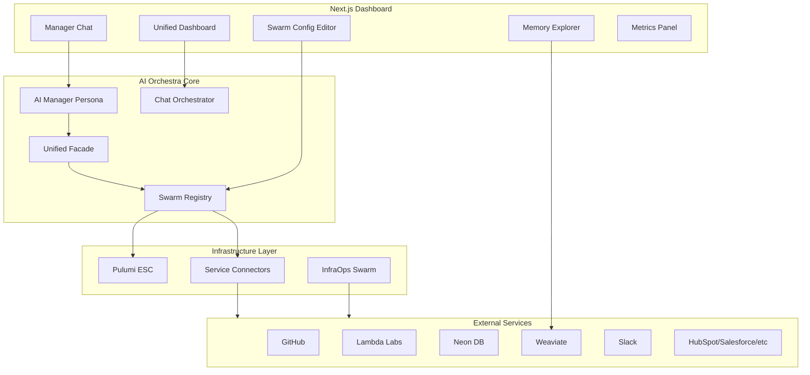

# AI Orchestra - Unified Agent Ecosystem Master Plan

## Executive Summary

Transform the current fragmented agent ecosystem into a unified, swarm-focused platform with natural language control, comprehensive UI, and enterprise service integrations.

## Current State Analysis

### ✅ What's Working Well

- **Backend Infrastructure**: Strong foundation with `unified_enhanced_orchestrator.py`, memory systems, consciousness tracking
- **Legacy Cleanup**: HTML prototypes already removed (good decision!)
- **Infrastructure**: `agno_infraops_swarm.py` exists but needs exposure
- **Memory Systems**: Enhanced memory integration exists but lacks UI
- **Next.js Foundation**: Modern React app ready for expansion

### ⚠️ Areas Needing Work

- **No Unified Chat Orchestrator**: Missing backend to bridge NL commands and swarms
- **No AI Manager Persona**: Need central orchestration personality
- **Teams API Limited**: Lacks configuration endpoints for LLM models, personas, instructions
- **MCP Bridge Clutter**: Roo/Cline adapters add complexity without clear value
- **Disconnected Services**: External integrations not unified

## Architecture Vision



## Implementation Plan

### Phase 1: Clean Up Roo/Cline Dependencies

**Goal**: Remove technical debt and focus on swarm architecture

### Phase 2: Build Core Chat Orchestrator

**Goal**: Create unified backend for natural language control

### Phase 3: Implement AI Manager Persona

**Goal**: Establish central orchestration personality

### Phase 4: Enhance Teams API

**Goal**: Enable dynamic swarm configuration

### Phase 5: Build Unified Dashboard

**Goal**: Create comprehensive UI for all operations

### Phase 6: Integrate External Services

**Goal**: Connect to business and code services

### Phase 7: Implement Secret Management

**Goal**: Secure credential handling via Pulumi ESC

## Detailed UI Specification

```json
{
  "dashboard": {
    "layout": {
      "header": {
        "logo": "🌀 AI Orchestra",
        "menu": [
          { "label": "Dashboard", "link": "/dashboard" },
          { "label": "Memory", "link": "/memory" },
          { "label": "InfraOps", "link": "/infra" },
          { "label": "Connectors", "link": "/connectors" }
        ],
        "userAvatar": { "initials": "AO", "status": "online" }
      },
      "panels": {
        "leftSidebar": {
          "width": "280px",
          "sections": [
            {
              "title": "Active Swarms",
              "component": "SwarmList",
              "features": [
                "Real-time status",
                "Resource usage",
                "Quick actions (pause/resume/terminate)"
              ]
            },
            {
              "title": "InfraOps Queue",
              "component": "InfraQueue",
              "features": [
                "Pending deployments",
                "Security scans",
                "Resource provisioning"
              ]
            }
          ]
        },
        "main": {
          "tabs": [
            {
              "id": "chat",
              "label": "Manager Chat",
              "component": "ManagerChat",
              "features": [
                "Natural language commands",
                "Token streaming",
                "Command history",
                "Suggested actions"
              ]
            },
            {
              "id": "metrics",
              "label": "Metrics",
              "component": "MetricsPanel",
              "features": [
                "Swarm performance",
                "Resource usage",
                "Cost tracking",
                "Success rates"
              ]
            },
            {
              "id": "consciousness",
              "label": "Consciousness",
              "component": "ConsciousnessPanel",
              "features": [
                "Decision logs",
                "Learning patterns",
                "Interaction history"
              ]
            }
          ]
        },
        "rightSidebar": {
          "width": "320px",
          "sections": [
            {
              "title": "Swarm Configuration",
              "component": "SwarmConfigEditor",
              "features": [
                "LLM model selection",
                "Persona editing",
                "Instructions",
                "Capabilities",
                "Resource limits"
              ]
            },
            {
              "title": "Memory Explorer",
              "component": "MemoryExplorer",
              "features": ["Vector search", "Entry management", "Visualization"]
            }
          ]
        }
      },
      "theme": {
        "mode": "dark",
        "primaryColor": "#00e0ff",
        "secondaryColor": "#ff00c3",
        "backgroundGradient": "linear-gradient(135deg, #050505 0%, #1b1f22 100%)",
        "fonts": {
          "heading": "Orbitron, sans-serif",
          "body": "Inter, sans-serif",
          "mono": "JetBrains Mono, monospace"
        },
        "effects": {
          "glass": {
            "backdropFilter": "blur(12px)",
            "background": "rgba(255,255,255,0.05)",
            "border": "1px solid rgba(255,255,255,0.1)"
          },
          "neon": {
            "textShadow": "0 0 8px var(--primary)",
            "boxShadow": "0 0 12px var(--secondary)",
            "animation": "pulse 2s infinite"
          },
          "holographic": {
            "background": "linear-gradient(45deg, transparent 30%, rgba(0,224,255,0.1) 50%, transparent 70%)",
            "animation": "shimmer 3s infinite"
          }
        }
      }
    }
  }
}
```

## Natural Language Commands

### Swarm Management

- "Deploy development swarm with GPT-4"
- "Enable memory sharing for analysis swarm"
- "Pause all swarms except infrastructure"
- "Switch coding swarm to Claude-3"

### Configuration

- "Give GitHub write access to deployment swarm"
- "Rotate API keys for production swarms"
- "Set resource limit to 4 CPUs for data swarm"
- "Enable debug logging for all swarms"

### Operations

- "Deploy new version to staging"
- "Run security scan on production"
- "Backup all memory to S3"
- "Migrate database schema"

## Service Connectors

### Code Services

- **GitHub**: Repository management, PR creation, issue tracking
- **Lambda Labs**: GPU compute for training/inference
- **Pulumi**: Infrastructure as code, deployment automation

### Data Services

- **Neon**: PostgreSQL database operations
- **Redis**: Caching and pub/sub messaging
- **Weaviate**: Vector search and storage
- **Milvus**: Alternative vector database
- **Airbyte**: Data pipeline management

### Business Services

- **Slack**: Team notifications and commands
- **Gong**: Sales call analysis
- **HubSpot**: CRM operations
- **Salesforce**: Enterprise CRM
- **Looker**: Business intelligence

## Secret Management Strategy

### Development (.env files)

```bash
# swarms/dev/.env
GITHUB_TOKEN=ghp_xxx
OPENAI_API_KEY=sk-xxx
NEON_DB_URL=postgresql://xxx

# swarms/infra/.env
AWS_ACCESS_KEY_ID=xxx
PULUMI_ACCESS_TOKEN=xxx
```

### Production (Pulumi ESC)

```yaml
# pulumi/environments/production.yaml
values:
  swarms:
    development:
      github_token: ${secrets.github_token}
      openai_api_key: ${secrets.openai_api_key}
    infrastructure:
      aws_access_key: ${secrets.aws_access_key}
      pulumi_token: ${secrets.pulumi_token}
```

## Success Metrics

### Technical

- Response time < 200ms for API calls
- WebSocket latency < 50ms
- 99.9% uptime for orchestrator
- Zero credential leaks

### Business

- 80% of operations via natural language
- 50% reduction in manual configuration
- 90% developer satisfaction score
- 60% faster deployment cycles

## Risk Mitigation

### Security

- All credentials in Pulumi ESC
- Least-privilege access per swarm
- Audit logging for all operations
- Regular security scans

### Reliability

- Graceful degradation
- Circuit breakers for external services
- Automatic retry with backoff
- Health checks and monitoring

### Scalability

- Horizontal scaling for swarms
- Queue-based task distribution
- Resource pooling
- Cost monitoring and alerts
