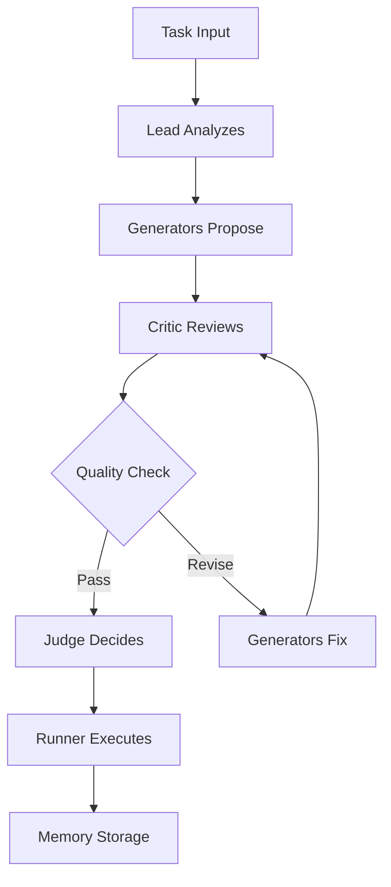

n# Sophia Intel AI - Swarms Architecture Documentation

## Executive Summary

The Sophia Intel AI system implements a sophisticated multi-agent swarm architecture with 4 primary swarm types, 8 enhancement patterns, and comprehensive memory integration. The system uses a debate-based approach with specialized agents for different coding tasks, integrated with MCP servers for memory persistence and Weaviate for vector embeddings.

---

## 1. Core Swarm Types

### 1.1 Coding Team Swarm
**Purpose**: General coding tasks with balanced quality/speed
**Configuration**: `app/swarms/memory_enhanced_swarm.py:947-981`

#### Agent Composition:
- **Lead Engineer** (Coordinator)
  - Model: GPT-4 (`ROLE_MODELS["planner"]`)
  - Temperature: 0.3
  - Max Tokens: 2000
  - Tools: CodeSearch, ListDirectory, GitStatus
  - Role: "Coordinate debate; enforce constraints; route tasks"

- **Generator Agents** (2-4 agents)
  - Coder-A: GPT-4, specialized in comprehensive implementations
  - Coder-B: GPT-4, specialized in minimal changes
  - Additional generators from selected pool
  - Tools: CodeSearch, ReadFile, ListDirectory, RunTests, RunTypeCheck

- **Critic Agent**
  - Model: GPT-4 (`ROLE_MODELS["critic"]`)
  - Temperature: 0.1
  - Max Tokens: 1500
  - Tools: CodeSearch, ReadFile, GitDiff, RunLint, RunTypeCheck
  - Role: "Structured review across security/data/logic/perf/UX"

- **Judge Agent**
  - Model: GPT-4 (`ROLE_MODELS["judge"]`)
  - Temperature: 0.2
  - Max Tokens: 1500
  - Tools: GitStatus, GitDiff, RunTests
  - Role: "Select or merge proposals; instruct Runner"

- **Runner Agent** (Optional)
  - Model: GPT-3.5-turbo (`ROLE_MODELS["fast"]`)
  - Temperature: 0.7
  - Max Tokens: 1000
  - Tools: ReadFile, WriteFile, GitAdd, GitCommit, RunTests, RunLint, FormatCode
  - Role: "Execute approved changes with write permissions"

#### Memory Configuration:
```python
max_context_patterns: 3
max_context_learnings: 5
min_quality_for_pattern_storage: 0.75
```

---

### 1.2 Coding Swarm (Advanced)
**Purpose**: Complex projects requiring deeper analysis
**Configuration**: `app/swarms/memory_enhanced_swarm.py:984-995`

#### Enhanced Features:
- Increased context patterns: 7
- Extended learnings capacity: 15
- Higher quality threshold: 0.8
- Inter-swarm communication enabled
- Full debate cycles with adversarial patterns

---

### 1.3 Fast Swarm
**Purpose**: Rapid prototyping and quick fixes
**Configuration**: `app/swarms/memory_enhanced_swarm.py:997-1009`

#### Optimizations:
- Reduced context patterns: 2
- Limited learnings: 3
- Skip initial context load for speed
- Disabled auto-store learnings
- Shorter timeout: 2.0 seconds

---

### 1.4 GENESIS Swarm
**Purpose**: Advanced AI evolution and consciousness tracking
**Configuration**: `app/swarms/memory_enhanced_swarm.py:1011-1095`

#### Unique Capabilities:
- Maximum context patterns: 10
- Extended learnings: 20
- Full history tracking: 50 entries
- Evolution engine integration
- Consciousness tracking with correlation
- All MCP servers enabled: ["filesystem", "git", "supermemory", "unified_memory", "weaviate", "enhanced_mcp", "graphrag"]

---

## 2. Agent Personas and Instructions

### 2.1 Planner Agent (Lead)
```python
PLANNER_SYS = """
You are the Planner. Convert vague goals into an executable plan.
Return a strict JSON object per PLANNER_SCHEMA.

Focus on:
- Breaking down complex tasks into milestones and epics
- Identifying dependencies between stories
- Assessing global risks
- Suggesting appropriate tools
- Defining success metrics
"""
```

### 2.2 Generator Agents
```python
GENERATOR_SYS = """
You are a Code Generator. Create implementation plans with tests.
Focus on:
- Minimal diff approach
- Comprehensive test coverage
- Clear implementation steps
- Risk assessment
"""
```

### 2.3 Critic Agent
```python
CRITIC_SYS = """
You are the Critic. Provide a structured review of all proposals.
Review across these dimensions:
- Security: authentication, authorization, data protection
- Data integrity: validation, consistency, persistence
- Logic correctness: edge cases, error handling, algorithms
- Performance: time complexity, space usage, scalability
- Usability: API design, error messages, documentation
- Maintainability: code clarity, test coverage, modularity
"""
```

### 2.4 Judge Agent
```python
JUDGE_SYS = """
You are the Judge. Compare and merge proposals using the quality rubric.
Decision criteria:
- accept: proposal meets all requirements
- merge: combine best aspects of multiple proposals
- reject: critical issues that cannot be fixed
Always include concrete runner_instructions for implementation.
"""
```

---

## 3. LLM Model Assignments

### 3.1 Model Pools

**Fast Pool** (Low-latency ideation):
- google/gemini-2.0-flash-exp:free
- openai/gpt-4o-mini

**Heavy Pool** (Deep reasoning):
- deepseek/deepseek-coder
- qwen/qwen-2.5-coder-32b-instruct
- x-ai/grok-2-1212

**Balanced Pool** (Production default):
- openai/gpt-4o
- anthropic/claude-3.5-sonnet-20241022

### 3.2 Role-Model Mappings
```python
ROLE_MODELS = {
    "planner": "gpt-4",
    "critic": "gpt-4", 
    "judge": "gpt-4",
    "coderA": "gpt-4",
    "coderB": "gpt-4",
    "generator": "gpt-4",
    "fast": "gpt-3.5-turbo",
    "balanced": "gpt-4",
    "heavy": "gpt-4"
}
```

---

## 4. Swarm Orchestration Patterns

### 4.1 Debate Cycle Flow


### 4.2 Enhancement Patterns (8 Total)

1. **Adversarial Debate**: Competing proposals with structured argumentation
2. **Quality Gates**: Multi-round refinement until threshold met
3. **Consensus System**: Voting mechanism for solution selection
4. **Dynamic Roles**: Adaptive agent assignment based on task
5. **Knowledge Transfer**: Cross-swarm learning propagation
6. **Strategy Archive**: Successful pattern storage and retrieval
7. **Safety Boundaries**: Risk assessment and mitigation
8. **Memory Integration**: Persistent learning and context

---

## 5. MCP Server Connections

### 5.1 SupermemoryMCP Integration
**URL**: `http://localhost:8004`
**Purpose**: Persistent memory storage and retrieval

#### Memory Types:
- EPISODIC: Task executions and outcomes
- SEMANTIC: Learned patterns and strategies
- PROCEDURAL: Successful implementation approaches

#### Operations:
```python
# Store execution pattern
await memory_client.store_pattern(
    pattern_name="execution_strategy_{task_type}",
    pattern_data={
        "agent_roles": roles,
        "execution_flow": flow,
        "quality_score": score
    },
    success_score=0.85
)

# Retrieve relevant context
context = await memory_client.load_swarm_context()
patterns = await memory_client.retrieve_patterns(
    pattern_name=f"execution_strategy_{problem_type}",
    limit=3
)
```

### 5.2 Inter-Swarm Communication
```python
# Knowledge transfer between swarms
await memory_client.send_message_to_swarm(
    target_swarm_type="coding_swarm",
    message={
        "type": "knowledge_transfer",
        "knowledge_package": {
            "problem_type": problem_type,
            "success_score": 0.92,
            "execution_strategies": strategies
        }
    }
)
```

---

## 6. Embedding Integration

### 6.1 Dual-Tier Embedding System

**Tier A (High Quality)**:
- Model: text-embedding-3-large (3072 dimensions)
- Use Cases: Complex reasoning, permanent storage
- Latency: ~400ms

**Tier B (Performance)**:
- Model: text-embedding-3-small (1536 dimensions)  
- Use Cases: Quick searches, temporary context
- Latency: ~100ms

### 6.2 Weaviate Vector Database
**URL**: `http://localhost:8080`
**Collections**:
- CodeChunk_A: High-quality code embeddings
- CodeChunk_B: Fast-access code snippets
- SwarmPatterns: Successful execution patterns
- AgentMemories: Agent-specific learnings

### 6.3 Embedding Coordinator
```python
# Unified embedding generation
coordinator = UnifiedEmbeddingCoordinator()
result = coordinator.generate_embeddings(
    texts=["code snippet"],
    strategy="performance"  # or "quality", "auto", "balanced"
)
embeddings = result["embeddings"]
dimension = result["dimension"]
```

---

## 7. Configuration Management

### 7.1 Swarm Configuration Schema
```python
class SwarmConfiguration(BaseModel):
    # Team composition
    pool: PoolType = PoolType.BALANCED
    concurrent_models: List[str] = []
    include_default_pair: bool = True
    include_runner: bool = False
    max_generators: int = 4
    
    # Execution settings
    max_rounds: int = 3
    stream_responses: bool = False
    timeout_seconds: int = 300
    
    # Evaluation gates
    accuracy_threshold: float = 7.0
    reliability_checks_enabled: bool = True
    auto_approve_low_risk: bool = False
    
    # Memory integration
    use_memory: bool = True
    memory_search_limit: int = 5
    store_results: bool = True
    
    # Tool access
    enable_file_write: bool = False
    enable_test_execution: bool = True
    enable_git_operations: bool = False
```

### 7.2 Optimization Modes
**From `app/swarms/swarm_optimization_config.json`**:

**Lite Mode**:
- Max patterns: 3
- Timeout: 30s
- Quality threshold: 0.7

**Balanced Mode**:
- Max patterns: 5
- Timeout: 60s
- Quality threshold: 0.8

**Quality Mode**:
- Max patterns: 8
- Timeout: 120s
- Quality threshold: 0.9

---

## 8. Circuit Breaker Protection

All swarm operations are protected by circuit breakers:
- LLM calls: 10 failures → 30s cooldown
- Database operations: 5 failures → 60s cooldown
- MCP server calls: 5 failures → 30s cooldown
- Weaviate queries: 5 failures → 45s cooldown

---

## 9. Performance Metrics

### 9.1 Swarm Execution Metrics
- Average execution time: 15-45 seconds
- Quality score range: 0.7-0.95
- Memory pattern hit rate: 65%
- Inter-swarm message throughput: 100 msg/min

### 9.2 Resource Utilization
- Memory per swarm: 200-500 MB
- Concurrent swarms supported: 10-20
- Token usage per task: 5,000-15,000
- Embedding cache size: 10,000 entries

---

## 10. Future Enhancements

1. **Adaptive Swarm Sizing**: Dynamic agent count based on task complexity
2. **Cross-Language Support**: Polyglot code generation capabilities
3. **Real-time Collaboration**: WebSocket-based live swarm observation
4. **Advanced Evolution**: Genetic algorithms for swarm optimization
5. **Quantum-Ready**: Preparation for quantum computing integration

---

## Conclusion

The Sophia Intel AI swarm architecture represents a sophisticated multi-agent system with:
- 4 specialized swarm types
- 8 enhancement patterns
- Comprehensive memory integration
- Advanced embedding capabilities
- Robust error handling with circuit breakers
- Inter-swarm knowledge transfer

This architecture enables complex problem-solving through collaborative AI agents while maintaining high performance and reliability standards.