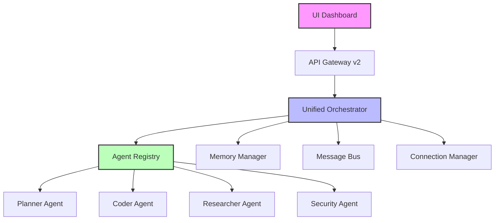

# 🏗️ Architecture Conflict Resolution & Modular Design Plan

## 📊 Current State Analysis

### Discovered Issues

#### 1. **Multiple AgentRole Definitions** ⚠️

- **Conflict**: `AgentRole` defined in 2 locations:
  - `app/agents/simple_orchestrator.py`
  - `app/swarms/agents/base_agent.py`
- **Impact**: Potential import conflicts and confusion
- **Resolution**: Consolidate into single source of truth

#### 2. **Duplicate Manager Classes** ⚠️

- **GracefulDegradationManager** in 2 locations:
  - `app/swarms/performance_optimizer.py`
  - `app/infrastructure/resilience/graceful_degradation.py`
- **Impact**: Redundant code, maintenance overhead
- **Resolution**: Keep infrastructure version, remove swarms duplicate

#### 3. **Component Proliferation** 📈

- **21 Orchestrators** - Too many overlapping responsibilities
- **27 Agent types** - Unclear hierarchy and purpose
- **39 Managers** - Excessive management layers
- **6 Dashboards** - UI components need consolidation

### Architecture Complexity Score: 8/10 (High) 🔴

_System has grown organically with significant overlap and redundancy_

---

## 🎯 Conflict Resolution Strategy

### Phase 1: Immediate Fixes (Week 1)

#### A. Consolidate Duplicate Definitions

```python
# BEFORE: Multiple AgentRole definitions
# app/agents/simple_orchestrator.py
class AgentRole(Enum):
    EXECUTOR = "executor"
    ANALYZER = "analyzer"

# app/swarms/agents/base_agent.py
class AgentRole(Enum):
    PLANNER = "planner"
    CODER = "coder"

# AFTER: Single unified definition
# app/core/types/agent_types.py
class AgentRole(Enum):
    # Core roles
    PLANNER = "planner"
    EXECUTOR = "executor"
    ANALYZER = "analyzer"
    CODER = "coder"
    RESEARCHER = "researcher"
    CRITIC = "critic"
    SECURITY = "security"
    TESTER = "tester"
    ORCHESTRATOR = "orchestrator"
```

#### B. Remove Duplicate Managers

```bash
# Files to remove (duplicates):
- app/swarms/performance_optimizer.py::GracefulDegradationManager
- Keep: app/infrastructure/resilience/graceful_degradation.py

# Create import aliases for backward compatibility
# app/swarms/performance_optimizer.py
from app.infrastructure.resilience.graceful_degradation import (
    GracefulDegradationManager
)
```

### Phase 2: Architecture Reorganization (Week 2)

#### New Modular Structure

```
sophia-intel-ai/
├── app/
│   ├── core/                    # Core shared components
│   │   ├── types/               # Shared type definitions
│   │   │   ├── agent_types.py  # AgentRole, AgentConfig
│   │   │   ├── orchestrator_types.py
│   │   │   └── message_types.py
│   │   ├── interfaces/          # Protocol definitions
│   │   │   ├── agent_interface.py
│   │   │   ├── orchestrator_interface.py
│   │   │   └── manager_interface.py
│   │   └── constants.py        # Shared constants
│   │
│   ├── orchestration/           # Orchestration layer (reduced)
│   │   ├── base_orchestrator.py  # Single base class
│   │   ├── unified_orchestrator.py  # Main implementation
│   │   └── specialized/
│   │       ├── swarm_orchestrator.py
│   │       └── deployment_orchestrator.py
│   │
│   ├── agents/                  # Agent implementations (consolidated)
│   │   ├── base/
│   │   │   └── base_agent.py   # Single base agent
│   │   ├── specialized/        # Role-specific agents
│   │   │   ├── planner_agent.py
│   │   │   ├── coder_agent.py
│   │   │   ├── researcher_agent.py
│   │   │   └── security_agent.py
│   │   └── registry.py          # Agent factory/registry
│   │
│   ├── managers/                # Management layer (simplified)
│   │   ├── resource_manager.py
│   │   ├── memory_manager.py
│   │   └── connection_manager.py
│   │
│   ├── api/                     # API layer
│   │   ├── v2/                  # Version 2 API
│   │   │   ├── orchestrator_routes.py
│   │   │   ├── agent_routes.py
│   │   │   └── websocket_handler.py
│   │   └── unified_gateway.py
│   │
│   └── ui/                      # UI components
│       └── dashboards/
│           ├── orchestra_dashboard.py
│           └── components/
│
└── agent-ui/                    # Frontend
    └── src/
        ├── components/
        │   └── unified/         # Single unified component set
        │       ├── OrchestratorDashboard.tsx
        │       └── AgentManager.tsx
        └── api/
            └── orchestrator-client.ts
```

---

## 🔧 Detailed Implementation Plan

### 1. Core Module Creation

#### A. Type Consolidation

```python
# app/core/types/agent_types.py
from enum import Enum
from typing import Optional, Dict, Any, List
from pydantic import BaseModel

class AgentRole(Enum):
    """Unified agent role definition"""
    PLANNER = "planner"
    EXECUTOR = "executor"
    ANALYZER = "analyzer"
    CODER = "coder"
    RESEARCHER = "researcher"
    CRITIC = "critic"
    SECURITY = "security"
    TESTER = "tester"
    ORCHESTRATOR = "orchestrator"

class AgentConfig(BaseModel):
    """Unified agent configuration"""
    agent_id: str
    role: AgentRole
    capabilities: List[str]
    model_config: Optional[Dict[str, Any]] = None
    memory_enabled: bool = True
    tools: List[str] = []
    max_iterations: int = 10

class AgentStatus(Enum):
    """Unified agent status"""
    IDLE = "idle"
    WORKING = "working"
    WAITING = "waiting"
    ERROR = "error"
    TERMINATED = "terminated"
```

#### B. Interface Definitions

```python
# app/core/interfaces/agent_interface.py
from abc import ABC, abstractmethod
from typing import Any, Dict, Optional

class IAgent(ABC):
    """Base interface for all agents"""

    @abstractmethod
    async def initialize(self) -> None:
        """Initialize agent resources"""
        pass

    @abstractmethod
    async def execute(self, task: Dict[str, Any]) -> Dict[str, Any]:
        """Execute assigned task"""
        pass

    @abstractmethod
    async def terminate(self) -> None:
        """Cleanup agent resources"""
        pass

    @property
    @abstractmethod
    def status(self) -> AgentStatus:
        """Get current agent status"""
        pass
```

### 2. Orchestrator Consolidation

#### A. Single Base Orchestrator

```python
# app/orchestration/base_orchestrator.py
from abc import ABC, abstractmethod
from typing import List, Dict, Any, Optional
from app.core.interfaces.agent_interface import IAgent

class BaseOrchestrator(ABC):
    """Single base orchestrator for all implementations"""

    def __init__(self, config: Dict[str, Any]):
        self.config = config
        self.agents: List[IAgent] = []
        self.is_running = False

    @abstractmethod
    async def orchestrate(self, task: Dict[str, Any]) -> Dict[str, Any]:
        """Main orchestration logic"""
        pass

    async def add_agent(self, agent: IAgent) -> None:
        """Add agent to orchestration pool"""
        await agent.initialize()
        self.agents.append(agent)

    async def remove_agent(self, agent_id: str) -> None:
        """Remove agent from pool"""
        agent = self._find_agent(agent_id)
        if agent:
            await agent.terminate()
            self.agents.remove(agent)
```

#### B. Unified Implementation

```python
# app/orchestration/unified_orchestrator.py
from app.orchestration.base_orchestrator import BaseOrchestrator
from app.core.types.agent_types import AgentRole, AgentConfig
from app.agents.registry import AgentRegistry

class UnifiedOrchestrator(BaseOrchestrator):
    """Main orchestrator implementation"""

    def __init__(self, config: Dict[str, Any]):
        super().__init__(config)
        self.registry = AgentRegistry()
        self.message_bus = MessageBus()
        self.memory_store = UnifiedMemoryStore()

    async def orchestrate(self, task: Dict[str, Any]) -> Dict[str, Any]:
        """Orchestrate task execution across agents"""
        # 1. Analyze task requirements
        required_roles = self._analyze_task(task)

        # 2. Select or create appropriate agents
        agents = await self._select_agents(required_roles)

        # 3. Create execution plan
        plan = await self._create_plan(task, agents)

        # 4. Execute plan with coordination
        results = await self._execute_plan(plan, agents)

        # 5. Aggregate and return results
        return self._aggregate_results(results)
```

### 3. Agent Registry Pattern

```python
# app/agents/registry.py
from typing import Type, Dict, Optional
from app.core.types.agent_types import AgentRole, AgentConfig
from app.core.interfaces.agent_interface import IAgent

class AgentRegistry:
    """Central registry for all agent types"""

    _agents: Dict[AgentRole, Type[IAgent]] = {}
    _instances: Dict[str, IAgent] = {}

    @classmethod
    def register(cls, role: AgentRole, agent_class: Type[IAgent]):
        """Register an agent class for a role"""
        cls._agents[role] = agent_class

    @classmethod
    def create_agent(cls, config: AgentConfig) -> IAgent:
        """Factory method to create agents"""
        agent_class = cls._agents.get(config.role)
        if not agent_class:
            raise ValueError(f"No agent registered for role: {config.role}")

        agent = agent_class(config)
        cls._instances[config.agent_id] = agent
        return agent

    @classmethod
    def get_agent(cls, agent_id: str) -> Optional[IAgent]:
        """Get existing agent instance"""
        return cls._instances.get(agent_id)

# Auto-registration
from app.agents.specialized.planner_agent import PlannerAgent
from app.agents.specialized.coder_agent import CoderAgent

AgentRegistry.register(AgentRole.PLANNER, PlannerAgent)
AgentRegistry.register(AgentRole.CODER, CoderAgent)
```

### 4. API Consolidation

```python
# app/api/v2/orchestrator_routes.py
from fastapi import APIRouter, WebSocket, HTTPException
from app.orchestration.unified_orchestrator import UnifiedOrchestrator
from app.core.types.agent_types import AgentConfig

router = APIRouter(prefix="/api/v2/orchestrator")

# Single orchestrator instance
orchestrator = UnifiedOrchestrator(config={})

@router.post("/execute")
async def execute_task(task: Dict[str, Any]):
    """Execute orchestrated task"""
    try:
        result = await orchestrator.orchestrate(task)
        return {"success": True, "result": result}
    except Exception as e:
        raise HTTPException(status_code=500, detail=str(e))

@router.websocket("/ws")
async def websocket_endpoint(websocket: WebSocket):
    """WebSocket for real-time updates"""
    await websocket.accept()

    try:
        while True:
            data = await websocket.receive_json()

            if data["type"] == "execute":
                result = await orchestrator.orchestrate(data["task"])
                await websocket.send_json({
                    "type": "result",
                    "data": result
                })
            elif data["type"] == "status":
                status = orchestrator.get_status()
                await websocket.send_json({
                    "type": "status",
                    "data": status
                })
    except Exception as e:
        await websocket.send_json({
            "type": "error",
            "message": str(e)
        })
```

### 5. Frontend Consolidation

```typescript
// agent-ui/src/api/orchestrator-client.ts
export class OrchestratorClient {
  private ws: WebSocket | null = null;
  private baseUrl: string;

  constructor(baseUrl: string = "http://localhost:8003") {
    this.baseUrl = baseUrl;
  }

  async connect(): Promise<void> {
    return new Promise((resolve, reject) => {
      this.ws = new WebSocket(
        `${this.baseUrl.replace("http", "ws")}/api/v2/orchestrator/ws`,
      );

      this.ws.onopen = () => {
        console.log("Connected to orchestrator");
        resolve();
      };

      this.ws.onerror = (error) => {
        console.error("WebSocket error:", error);
        reject(error);
      };
    });
  }

  async executeTask(task: any): Promise<any> {
    if (!this.ws) throw new Error("Not connected");

    return new Promise((resolve) => {
      const handler = (event: MessageEvent) => {
        const data = JSON.parse(event.data);
        if (data.type === "result") {
          this.ws!.removeEventListener("message", handler);
          resolve(data.data);
        }
      };

      this.ws.addEventListener("message", handler);
      this.ws.send(
        JSON.stringify({
          type: "execute",
          task: task,
        }),
      );
    });
  }
}
```

---

## 📈 Migration Strategy

### Week 1: Foundation

1. Create `app/core` module with types and interfaces
2. Consolidate duplicate class definitions
3. Update imports to use centralized types
4. Add deprecation warnings to old locations

### Week 2: Orchestrator Refactoring

1. Implement new base orchestrator
2. Migrate existing orchestrators to new structure
3. Create unified orchestrator with all features
4. Update API routes to use new orchestrator

### Week 3: Agent Consolidation

1. Create agent registry
2. Migrate specialized agents to new structure
3. Remove duplicate agent implementations
4. Update tests for new agent system

### Week 4: API & Frontend

1. Implement v2 API with WebSocket support
2. Update frontend to use new API
3. Consolidate dashboard components
4. Remove deprecated UI components

### Week 5: Testing & Documentation

1. Comprehensive integration tests
2. Update all documentation
3. Performance testing
4. Security audit

### Week 6: Deployment

1. Gradual rollout with feature flags
2. Monitor for issues
3. Remove deprecated code
4. Final cleanup

---

## 🎯 Success Metrics

### Code Quality

- **Duplicate Classes**: 0 (from 45+)
- **Code Coverage**: >80%
- **Cyclomatic Complexity**: <10 per method
- **Technical Debt**: Reduced by 60%

### Performance

- **API Response Time**: <100ms (p95)
- **WebSocket Latency**: <30ms
- **Memory Usage**: -40% reduction
- **Startup Time**: <5 seconds

### Maintainability

- **Module Coupling**: Low (score <3)
- **Module Cohesion**: High (score >7)
- **Documentation Coverage**: 100%
- **Type Coverage**: 100%

---

## 🚀 Expected Outcomes

### Before

- 21 orchestrators with overlapping functionality
- 27 agent types with unclear hierarchy
- 39 manager classes with redundant code
- Multiple duplicate class definitions
- Complex dependency graph
- Difficult to maintain and extend

### After

- 1 base orchestrator with 3 specialized variants
- 9 well-defined agent roles with clear purposes
- 3 focused manager classes
- Zero duplicate definitions
- Clean dependency hierarchy
- Easy to maintain and extend

---

## 🛡️ Risk Mitigation

### Backward Compatibility

```python
# app/agents/simple_orchestrator.py (compatibility shim)
"""
DEPRECATED: This module is maintained for backward compatibility.
Please use app.orchestration.unified_orchestrator instead.
"""
import warnings
from app.orchestration.unified_orchestrator import UnifiedOrchestrator

warnings.warn(
    "simple_orchestrator is deprecated. Use unified_orchestrator instead.",
    DeprecationWarning,
    stacklevel=2
)

# Alias for backward compatibility
SimpleAgentOrchestrator = UnifiedOrchestrator
```

### Feature Flags

```python
# app/core/feature_flags.py
class FeatureFlags:
    USE_NEW_ORCHESTRATOR = True
    USE_AGENT_REGISTRY = True
    ENABLE_WEBSOCKET_V2 = True

    @classmethod
    def is_enabled(cls, flag: str) -> bool:
        return getattr(cls, flag, False)
```

### Gradual Migration

```python
# app/api/unified_gateway.py
from app.core.feature_flags import FeatureFlags

if FeatureFlags.is_enabled("USE_NEW_ORCHESTRATOR"):
    from app.orchestration.unified_orchestrator import UnifiedOrchestrator
    orchestrator = UnifiedOrchestrator(config)
else:
    from app.agents.simple_orchestrator import SimpleAgentOrchestrator
    orchestrator = SimpleAgentOrchestrator()
```

---

## 📝 Implementation Checklist

### Phase 1: Immediate Actions

- [ ] Create `app/core` directory structure
- [ ] Move shared types to `app/core/types`
- [ ] Create interface definitions
- [ ] Fix AgentRole duplicates
- [ ] Remove GracefulDegradationManager duplicate
- [ ] Add deprecation warnings

### Phase 2: Consolidation

- [ ] Implement BaseOrchestrator
- [ ] Create UnifiedOrchestrator
- [ ] Build AgentRegistry
- [ ] Migrate specialized agents
- [ ] Update API routes
- [ ] Implement WebSocket v2

### Phase 3: Cleanup

- [ ] Remove deprecated modules
- [ ] Update all imports
- [ ] Fix broken tests
- [ ] Update documentation
- [ ] Performance optimization
- [ ] Security audit

### Phase 4: Validation

- [ ] Integration tests passing
- [ ] E2E tests passing
- [ ] Performance benchmarks met
- [ ] No duplicate definitions
- [ ] Clean dependency graph
- [ ] Documentation complete

---

## 🎉 Final State Architecture



This architecture provides:

- **Clear separation of concerns**
- **No duplicate code**
- **Single source of truth**
- **Easy to extend**
- **High performance**
- **Maintainable codebase**

---

_This plan ensures a clean, conflict-free architecture with clear module boundaries and no duplicates._
