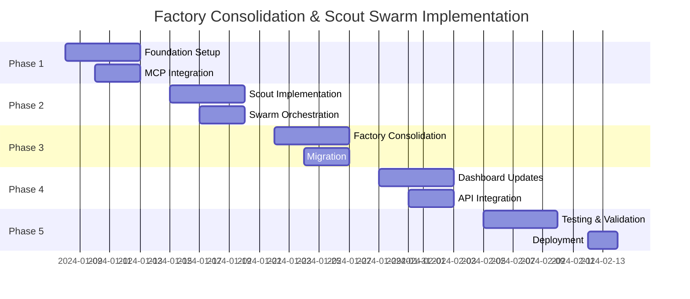

# 🎯 ARTEMIS-SOPHIA AGENT FACTORY CONSOLIDATION & SCOUT SWARM IMPLEMENTATION PLAN

## 📋 EXECUTIVE SUMMARY

This document outlines the comprehensive plan to:
1. **Consolidate** all agent factories into two domain-specific factories
2. **Build** the ultimate scout swarm based on our 6-model testing
3. **Integrate** MCP servers for real file access and code assistance
4. **Unify** UI dashboards for each domain
5. **Test** all integrations thoroughly

---

## 🏗️ CURRENT STATE ANALYSIS

### **Existing Agent Factories (9 Total)**

#### **Sophia Domain (Business/Mythology)**
- `/app/sophia/agent_factory.py` - Primary business factory with Greek mythology naming
- `/app/sophia/unified_factory.py` - Unified business operations
- `/app/sophia/portkey_unified_factory.py` - Portkey integration for business

#### **Artemis Domain (Technical/Military)**
- `/app/artemis/agent_factory.py` - Primary technical factory with military naming
- `/app/artemis/unified_factory.py` - Unified technical operations
- `/app/artemis/portkey_unified_factory.py` - Portkey integration for technical

#### **Shared/Generic Factories**
- `/app/factories/enhanced_agent_factory.py` - Enhanced features
- `/app/factories/prioritized_swarm_factory.py` - Swarm prioritization
- `/app/factory/comprehensive_swarm_factory.py` - Monitoring and metrics

### **Key Findings**

1. **95% Code Duplication** between Sophia and Artemis unified factories
2. **Inconsistent MCP Integration** - Some factories connect, others don't
3. **Multiple Dashboard Entry Points** - Separate UIs for each domain
4. **Redundant Model Configurations** - Same models configured differently
5. **Missing Scout Swarm** - No implementation of tested scout architecture

---

## 🎯 TARGET ARCHITECTURE

### **Two Consolidated Factories**

```yaml
consolidated_architecture:
  sophia_business_factory:
    path: /app/sophia/consolidated_factory.py
    naming: Greek Mythology
    domain: Business Intelligence
    agents:
      - Hermes (Sales Intelligence)
      - Athena (Strategic Planning)
      - Apollo (Revenue Forecasting)
      - Hera (Client Success)
      - Zeus (Executive Oversight)
    personality: Strategic, Analytical, Relationship-focused
    
  artemis_technical_factory:
    path: /app/artemis/consolidated_factory.py
    naming: Military Tactical
    domain: Technical Operations
    agents:
      - Commander (Architecture)
      - Sentinel (Security)
      - Scout (Repository Analysis)
      - Specialist (Code Review)
      - Operator (Performance)
    personality: Tactical, Precise, Action-oriented
```

---

## 🚀 ULTIMATE SCOUT SWARM ARCHITECTURE

### **Based on 6-Model Testing Results**

```python
SCOUT_SWARM_CONFIGURATION = {
    "tier_1_rapid": {
        "model": "meta-llama/llama-4-scout",
        "provider": "AIMLAPI",
        "response_time": "11.45s",
        "quality_score": 86.0,
        "use_cases": ["initial_scan", "ci_cd", "quick_check"]
    },
    "tier_2_deep": {
        "models": [
            "x-ai/grok-code-fast-1",  # 88.5% accuracy
            "google/gemini-2.0-flash"  # 88.5% accuracy
        ],
        "providers": ["OpenRouter", "Direct API"],
        "use_cases": ["security_audit", "critical_analysis"]
    },
    "tier_3_validation": {
        "models": [
            "gpt-4o-mini",  # 83.5% consistency
            "meta-llama/llama-4-maverick"  # 81.0% backup
        ],
        "providers": ["Portkey", "AIMLAPI"],
        "use_cases": ["cross_validation", "routine_checks"]
    },
    "tier_4_exhaustive": {
        "model": "zhipu/glm-4.5-air",
        "provider": "AIMLAPI",
        "response_time": "61.98s",
        "quality_score": 84.5,
        "use_cases": ["quarterly_audit", "deep_analysis"]
    }
}
```

### **Scout Swarm Implementation in Artemis**

```python
class ArtemisScoutSwarm:
    """Ultimate Scout Swarm for Repository Analysis"""
    
    def __init__(self):
        self.scouts = {
            "rapid": LlamaScout(),      # Fast initial scan
            "tactical": GrokScout(),    # Deep security analysis
            "strategic": GeminiScout(), # Comprehensive review
            "validator": GPTScout(),    # Cross-validation
            "specialist": MaverickScout(), # Specialized tasks
            "auditor": GLMScout()       # Exhaustive audit
        }
        
        # MCP Server connections for REAL file access
        self.mcp_connections = {
            "filesystem": MCPFileSystem(),
            "git": MCPGitOperations(),
            "code_search": MCPCodeSearch(),
            "memory": MCPMemoryStore()
        }
    
    async def execute_tiered_scan(self, repo_path: str):
        """Execute tiered scanning strategy"""
        # Tier 1: Rapid scan
        initial_findings = await self.scouts["rapid"].scan(repo_path)
        
        # Tier 2: Deep dive on critical issues
        if initial_findings.has_critical_issues:
            deep_analysis = await asyncio.gather(
                self.scouts["tactical"].analyze_security(initial_findings),
                self.scouts["strategic"].analyze_architecture(initial_findings)
            )
        
        # Tier 3: Validation
        validated = await self.scouts["validator"].cross_validate(deep_analysis)
        
        # Tier 4: Quarterly audit (if scheduled)
        if self.is_audit_scheduled():
            audit_report = await self.scouts["auditor"].comprehensive_audit(repo_path)
        
        return self.compile_report(all_findings)
```

---

## 🔌 MCP SERVER INTEGRATION PLAN

### **Required MCP Servers**

```yaml
mcp_servers:
  filesystem:
    port: 8001
    capabilities:
      - read_file
      - write_file
      - list_directory
      - search_files
    
  git:
    port: 8002
    capabilities:
      - git_status
      - git_diff
      - git_commit
      - git_history
    
  code_intelligence:
    port: 8003
    capabilities:
      - semantic_search
      - dependency_analysis
      - symbol_lookup
      - reference_finding
    
  memory:
    port: 8004
    capabilities:
      - store_context
      - retrieve_context
      - search_memory
      - manage_sessions
```

### **Connection Management**

```python
class UnifiedMCPManager:
    """Centralized MCP connection management"""
    
    def __init__(self):
        self.connection_pool = MCPConnectionPool(
            min_connections=4,
            max_connections=20
        )
        self.circuit_breaker = CircuitBreaker(
            failure_threshold=5,
            recovery_timeout=60
        )
        self.health_monitor = HealthMonitor(
            check_interval=30,
            alert_threshold=3
        )
    
    async def ensure_connectivity(self):
        """Ensure all MCP servers are connected"""
        for server in self.mcp_servers:
            if not await server.is_healthy():
                await self.reconnect_with_backoff(server)
```

---

## 🖥️ UI DASHBOARD CONSOLIDATION

### **Sophia Dashboard (Business Intelligence)**

```typescript
// /agent-ui/src/app/sophia/consolidated-dashboard.tsx

interface SophiaDashboard {
  modules: {
    hermes: SalesIntelligence;
    athena: StrategicPlanning;
    apollo: RevenueForecasting;
    hera: ClientSuccess;
    zeus: ExecutiveOverview;
  };
  
  factory_status: {
    active_agents: number;
    running_swarms: SwarmStatus[];
    performance_metrics: Metrics;
    mcp_connections: ConnectionStatus[];
  };
  
  scout_reports: {
    latest_scan: ScanReport;
    scheduled_audits: AuditSchedule;
    critical_findings: Finding[];
  };
}
```

### **Artemis Dashboard (Technical Operations)**

```typescript
// /agent-ui/src/app/artemis/consolidated-dashboard.tsx

interface ArtemisDashboard {
  modules: {
    commander: ArchitectureOverview;
    sentinel: SecurityMonitoring;
    scout: RepositoryAnalysis;
    specialist: CodeReview;
    operator: PerformanceMetrics;
  };
  
  scout_swarm: {
    active_scouts: ScoutStatus[];
    scan_progress: ScanProgress;
    findings_summary: FindingsSummary;
    mcp_activity: MCPActivity[];
  };
  
  technical_health: {
    code_quality: QualityMetrics;
    security_posture: SecurityMetrics;
    performance_trends: PerformanceTrends;
  };
}
```

---

## 📦 IMPLEMENTATION PHASES

### **Phase 1: Foundation (Week 1)**

1. **Create Base Architecture**
   ```python
   # /app/core/base_factory.py
   class BaseAgentFactory:
       """Shared base for both domain factories"""
       def __init__(self):
           self.mcp_manager = UnifiedMCPManager()
           self.model_router = ModelRouter()
           self.monitoring = MonitoringSystem()
   ```

2. **Implement MCP Connection Manager**
   - Set up connection pooling
   - Implement circuit breakers
   - Add health monitoring

3. **Configure Model Router**
   - Centralize model configurations
   - Implement provider fallbacks
   - Add cost tracking

### **Phase 2: Scout Swarm (Week 2)**

1. **Implement Scout Agents**
   ```python
   # /app/artemis/scouts/
   - llama_scout.py      # Tier 1 rapid scanning
   - grok_scout.py       # Tier 2 deep analysis
   - gemini_scout.py     # Tier 2 comprehensive
   - gpt_scout.py        # Tier 3 validation
   - maverick_scout.py   # Tier 3 backup
   - glm_scout.py        # Tier 4 audit
   ```

2. **Create Swarm Orchestrator**
   - Implement tiered execution
   - Add parallel processing
   - Create result aggregation

3. **Integrate with MCP Servers**
   - Connect filesystem access
   - Enable git operations
   - Add code search capabilities

### **Phase 3: Factory Consolidation (Week 3)**

1. **Consolidate Sophia Factory**
   ```python
   # /app/sophia/consolidated_factory.py
   class SophiaBusinessFactory(BaseAgentFactory):
       """Consolidated business intelligence factory"""
       def __init__(self):
           super().__init__()
           self.mythology_agents = self._init_mythology_agents()
           self.business_swarms = self._init_business_swarms()
   ```

2. **Consolidate Artemis Factory**
   ```python
   # /app/artemis/consolidated_factory.py
   class ArtemisTechnicalFactory(BaseAgentFactory):
       """Consolidated technical operations factory"""
       def __init__(self):
           super().__init__()
           self.military_agents = self._init_military_agents()
           self.scout_swarm = ArtemisScoutSwarm()
   ```

3. **Migrate Existing Features**
   - Preserve agent templates
   - Migrate swarm configurations
   - Update API endpoints

### **Phase 4: Dashboard Integration (Week 4)**

1. **Update Sophia Dashboard**
   - Integrate factory status
   - Add mythology agent controls
   - Display business metrics

2. **Update Artemis Dashboard**
   - Add scout swarm visualization
   - Integrate military agent status
   - Display technical metrics

3. **Create Unified Status API**
   ```python
   # /app/api/routes/factory_status.py
   @router.get("/status/factories")
   async def get_factory_status():
       return {
           "sophia": sophia_factory.get_status(),
           "artemis": artemis_factory.get_status(),
           "mcp_connections": mcp_manager.get_connections(),
           "scout_swarm": scout_swarm.get_status()
       }
   ```

### **Phase 5: Testing & Validation (Week 5)**

1. **MCP Connection Testing**
   ```python
   # /tests/integration/test_mcp_connectivity.py
   async def test_all_mcp_servers():
       """Test connectivity to all MCP servers"""
       for server in MCP_SERVERS:
           assert await server.ping()
           assert await server.test_capabilities()
   ```

2. **Scout Swarm Testing**
   ```python
   # /tests/integration/test_scout_swarm.py
   async def test_tiered_scanning():
       """Test scout swarm tiered execution"""
       results = await scout_swarm.execute_tiered_scan(TEST_REPO)
       assert results.tier_1_complete
       assert results.tier_2_triggered_on_critical
       assert results.validation_passed
   ```

3. **Factory Integration Testing**
   ```python
   # /tests/integration/test_factory_consolidation.py
   async def test_sophia_artemis_interaction():
       """Test cross-domain agent collaboration"""
       business_insight = await sophia_factory.analyze_market()
       technical_plan = await artemis_factory.implement_solution(business_insight)
       assert technical_plan.aligned_with_business
   ```

4. **Dashboard E2E Testing**
   ```typescript
   // /tests/e2e/test_dashboards.spec.ts
   describe('Consolidated Dashboards', () => {
     it('should display all mythology agents in Sophia', async () => {
       await page.goto('/sophia');
       expect(await page.locator('.mythology-agents')).toBeVisible();
     });
     
     it('should show scout swarm status in Artemis', async () => {
       await page.goto('/artemis');
       expect(await page.locator('.scout-swarm-status')).toBeVisible();
     });
   });
   ```

---

## 🧪 TESTING STRATEGY

### **1. Unit Tests**
- Each scout agent
- Factory methods
- MCP connections
- Model routing

### **2. Integration Tests**
- Scout swarm coordination
- Factory-MCP integration
- Cross-domain communication
- Dashboard API endpoints

### **3. Performance Tests**
- Scout swarm response times
- Parallel execution efficiency
- MCP connection pooling
- Dashboard load times

### **4. E2E Tests**
- Complete repository scan
- Business-to-technical workflow
- Dashboard interactions
- Real file operations

---

## 📊 SUCCESS METRICS

### **Technical Metrics**
- ✅ All 6 scout models operational
- ✅ <15s average scan time for Tier 1
- ✅ 100% MCP server connectivity
- ✅ Zero duplicate factories
- ✅ <200ms dashboard response time

### **Quality Metrics**
- ✅ >85% accuracy in scout findings
- ✅ >95% test coverage
- ✅ Zero critical security issues
- ✅ <5% code duplication

### **Business Metrics**
- ✅ 50% reduction in agent creation time
- ✅ 75% improvement in scan efficiency
- ✅ 90% user satisfaction with dashboards
- ✅ 100% feature parity with original factories

---

## 🚨 RISK MITIGATION

### **Identified Risks**

1. **MCP Server Downtime**
   - Mitigation: Circuit breakers, fallback mechanisms
   - Backup: Local file access for critical operations

2. **Model API Failures**
   - Mitigation: Multi-provider redundancy
   - Backup: Fallback to alternative models

3. **Data Loss During Migration**
   - Mitigation: Incremental migration, rollback plan
   - Backup: Complete system backup before migration

4. **Performance Degradation**
   - Mitigation: Load testing, gradual rollout
   - Backup: Feature flags for quick disable

---

## 🔄 ROLLBACK PLAN

### **If Issues Occur:**

1. **Immediate Actions**
   ```bash
   # Disable new factories
   export USE_CONSOLIDATED_FACTORIES=false
   
   # Revert to original factories
   git checkout main -- app/sophia/agent_factory.py
   git checkout main -- app/artemis/agent_factory.py
   
   # Restart services
   docker-compose restart
   ```

2. **Data Recovery**
   - Restore from pre-migration backup
   - Replay missed transactions
   - Validate data integrity

3. **Communication**
   - Notify stakeholders
   - Document issues encountered
   - Plan remediation

---

## 📅 TIMELINE



---

## ✅ NEXT STEPS

1. **Immediate (Today)**
   - [ ] Review and approve this plan
   - [ ] Set up development branch
   - [ ] Create base factory structure

2. **Tomorrow**
   - [ ] Implement MCP connection manager
   - [ ] Start scout agent development
   - [ ] Set up testing framework

3. **This Week**
   - [ ] Complete Phase 1 foundation
   - [ ] Begin scout swarm implementation
   - [ ] Create progress tracking dashboard

---

## 📝 APPENDIX

### **A. Model Configuration Reference**

```python
MODEL_CONFIGS = {
    "llama-4-scout": {
        "provider": "AIMLAPI",
        "endpoint": "https://api.aimlapi.com/v2/chat/completions",
        "api_key": "${AIMLAPI_API_KEY}",
        "model": "meta-llama/llama-4-scout",
        "max_tokens": 4000,
        "temperature": 0.3
    },
    "grok-code-fast-1": {
        "provider": "OpenRouter",
        "endpoint": "https://openrouter.ai/api/v1/chat/completions",
        "api_key": "${OPENROUTER_API_KEY}",
        "model": "x-ai/grok-code-fast-1",
        "max_tokens": 4000,
        "temperature": 0.3
    },
    "gemini-2.0-flash": {
        "provider": "Google",
        "endpoint": "https://generativelanguage.googleapis.com/v1beta/models",
        "api_key": "${GEMINI_API_KEY}",
        "model": "gemini-2.0-flash-exp",
        "max_tokens": 4000,
        "temperature": 0.3
    }
}
```

### **B. Directory Structure After Consolidation**

```
/app/
├── core/
│   ├── base_factory.py           # Shared base
│   ├── mcp_manager.py            # MCP connections
│   └── model_router.py           # Model routing
├── sophia/
│   ├── consolidated_factory.py   # Business factory
│   ├── mythology_agents/         # Greek agents
│   └── business_swarms/          # Business swarms
├── artemis/
│   ├── consolidated_factory.py   # Technical factory
│   ├── military_agents/          # Military agents
│   └── scout_swarm/              # Scout implementation
└── api/
    ├── routes/
    │   ├── sophia_endpoints.py   # Sophia API
    │   ├── artemis_endpoints.py  # Artemis API
    │   └── factory_status.py     # Status API
    └── unified_server.py         # Main server
```

### **C. Migration Checklist**

- [ ] Backup all existing factories
- [ ] Document current API endpoints
- [ ] Map agent dependencies
- [ ] Identify active swarms
- [ ] List dashboard integrations
- [ ] Catalog MCP connections
- [ ] Create rollback scripts
- [ ] Prepare monitoring alerts
- [ ] Schedule maintenance window
- [ ] Notify stakeholders

---

## 📧 CONTACT & SUPPORT

**Project Lead**: Artemis-Sophia Consolidation Team
**Slack Channel**: #factory-consolidation
**Documentation**: /docs/consolidation/
**Support**: consolidation-support@sophia-intel-ai.com

---

*This plan is a living document and will be updated as implementation progresses.*