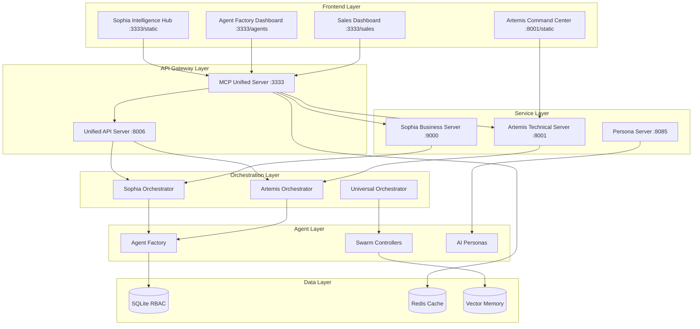

# 🎯 Comprehensive Local Deployment Strategy

## Sophia & Artemis Intelligence Platform

### Version 3.0.0 - Unified Architecture

**Last Updated:** December 2024

---

## 🏗️ Architecture Overview

The Sophia-Artemis Intelligence Platform consists of multiple interconnected services that work together to provide comprehensive AI capabilities for both business and technical operations.

### Core Components



---

## 📊 Service Architecture Matrix

| Service                      | Port | Purpose                         | Dependencies      | Status   |
| ---------------------------- | ---- | ------------------------------- | ----------------- | -------- |
| **MCP Unified Server**       | 3333 | Main API Gateway & Static Files | All services      | Primary  |
| **Unified API Server**       | 8006 | Core Business Logic             | Database, Agents  | Active   |
| **Sophia Business Server**   | 9000 | Business Intelligence           | AGNO Orchestrator | Active   |
| **Artemis Technical Server** | 8001 | Technical Operations            | AGNO Orchestrator | Active   |
| **Persona Server**           | 8085 | AI Personas (Apollo/Athena)     | Agent Factory     | Active   |
| **Redis Cache**              | 6379 | Caching & Rate Limiting         | -                 | Optional |
| **Vector DB**                | 8100 | Memory & Embeddings             | -                 | Optional |

---

## 🚀 Optimal Deployment Strategy

### Phase 1: Environment Preparation

#### 1.1 Create Master Configuration File

```bash
# Create .env.local with all required variables
cat > .env.local << 'EOF'
# API Keys
OPENROUTER_API_KEY=sk-or-v1-your-key
PORTKEY_API_KEY=your-portkey-key
TOGETHER_API_KEY=your-together-key
OPENAI_API_KEY=sk-your-openai-key
ANTHROPIC_API_KEY=sk-ant-your-key

# Server Configuration
LOCAL_DEV_MODE=true
ENVIRONMENT=development
DEBUG=false

# Port Assignments
MCP_PORT=3333
API_PORT=8006
SOPHIA_PORT=9000
ARTEMIS_PORT=8001
PERSONA_PORT=8085

# Database
RBAC_ENABLED=true
DB_TYPE=sqlite
DB_PATH=sophia_rbac.db

# Redis (Optional)
REDIS_URL=redis://localhost:6379

# Security
JWT_SECRET_KEY=$(openssl rand -hex 32)
JWT_EXPIRATION_MINUTES=30

# Logging
LOG_LEVEL=INFO
LOG_FORMAT=json

# Performance
CACHE_TTL=300
MAX_CONCURRENT_REQUESTS=100
REQUEST_TIMEOUT=30
EOF
```

#### 1.2 Install Dependencies

```bash
# Python dependencies
pip install -r requirements.txt

# Initialize database
python3 migrations/001_rbac_foundation.py up

# Optional: Install Redis for caching
# brew install redis (macOS)
# sudo apt-get install redis-server (Ubuntu)
```

### Phase 2: Service Startup Sequence

The correct startup order is critical for proper service initialization:

#### 2.1 Start Core Infrastructure

```bash
# 1. Start Redis (optional but recommended)
redis-server --daemonize yes

# 2. Initialize Database
python3 migrations/001_rbac_foundation.py up
```

#### 2.2 Start Primary Services

```bash
#!/bin/bash
# save as: start_core_services.sh

source .env.local

# Start MCP Unified Server (Primary Gateway)
echo "Starting MCP Unified Server on port $MCP_PORT..."
AGENT_API_PORT=$MCP_PORT \
python3 -m uvicorn dev_mcp_unified.core.mcp_server:app \
    --host 127.0.0.1 \
    --port $MCP_PORT \
    --reload &
MCP_PID=$!

sleep 3

# Start Unified API Server (Business Logic)
echo "Starting Unified API Server on port $API_PORT..."
AGENT_API_PORT=$API_PORT \
python3 -m app.api.unified_server &
API_PID=$!

sleep 3

echo "Core services started:"
echo "  MCP Server: http://localhost:$MCP_PORT (PID: $MCP_PID)"
echo "  API Server: http://localhost:$API_PORT (PID: $API_PID)"
```

#### 2.3 Start Application Services

```bash
#!/bin/bash
# save as: start_app_services.sh

source .env.local

# Start Sophia Business Intelligence Server
echo "Starting Sophia Business Server on port $SOPHIA_PORT..."
SOPHIA_PORT=$SOPHIA_PORT \
python3 sophia_server_standalone.py &
SOPHIA_PID=$!

sleep 2

# Start Artemis Technical Operations Server
echo "Starting Artemis Technical Server on port $ARTEMIS_PORT..."
ARTEMIS_PORT=$ARTEMIS_PORT \
python3 artemis_server_standalone.py &
ARTEMIS_PID=$!

sleep 2

# Start Persona Server
echo "Starting Persona Server on port $PERSONA_PORT..."
AGENT_API_PORT=$PERSONA_PORT \
python3 persona_server_standalone.py &
PERSONA_PID=$!

echo "Application services started:"
echo "  Sophia: http://localhost:$SOPHIA_PORT (PID: $SOPHIA_PID)"
echo "  Artemis: http://localhost:$ARTEMIS_PORT (PID: $ARTEMIS_PID)"
echo "  Personas: http://localhost:$PERSONA_PORT (PID: $PERSONA_PID)"
```

### Phase 3: Unified Deployment Script

#### 3.1 Complete Deployment Script

```bash
#!/bin/bash
# save as: deploy_all.sh

set -e  # Exit on error

echo "🚀 Starting Sophia-Artemis Intelligence Platform..."

# Load environment
source .env.local

# Function to check if port is in use
check_port() {
    if lsof -Pi :$1 -sTCP:LISTEN -t >/dev/null ; then
        echo "⚠️  Port $1 is already in use"
        return 1
    fi
    return 0
}

# Function to wait for service
wait_for_service() {
    local port=$1
    local name=$2
    local max_attempts=30
    local attempt=0

    echo "Waiting for $name on port $port..."
    while [ $attempt -lt $max_attempts ]; do
        if curl -s "http://localhost:$port/health" > /dev/null 2>&1; then
            echo "✅ $name is ready"
            return 0
        fi
        attempt=$((attempt + 1))
        sleep 1
    done
    echo "❌ $name failed to start"
    return 1
}

# Check all ports
echo "Checking port availability..."
for port in $MCP_PORT $API_PORT $SOPHIA_PORT $ARTEMIS_PORT $PERSONA_PORT; do
    if ! check_port $port; then
        echo "Please run: ./stop_all.sh"
        exit 1
    fi
done

# Start Redis if configured
if [ ! -z "$REDIS_URL" ]; then
    echo "Starting Redis..."
    redis-server --daemonize yes
fi

# Initialize database
echo "Initializing database..."
python3 migrations/001_rbac_foundation.py up

# Start core services
echo "Starting core services..."

# MCP Server
AGENT_API_PORT=$MCP_PORT \
python3 -m uvicorn dev_mcp_unified.core.mcp_server:app \
    --host 127.0.0.1 --port $MCP_PORT --reload \
    > logs/mcp_server.log 2>&1 &
MCP_PID=$!

wait_for_service $MCP_PORT "MCP Server"

# API Server
AGENT_API_PORT=$API_PORT \
python3 -m app.api.unified_server \
    > logs/api_server.log 2>&1 &
API_PID=$!

wait_for_service $API_PORT "API Server"

# Start application services
echo "Starting application services..."

# Sophia
SOPHIA_PORT=$SOPHIA_PORT \
python3 sophia_server_standalone.py \
    > logs/sophia_server.log 2>&1 &
SOPHIA_PID=$!

wait_for_service $SOPHIA_PORT "Sophia Server"

# Artemis
ARTEMIS_PORT=$ARTEMIS_PORT \
python3 artemis_server_standalone.py \
    > logs/artemis_server.log 2>&1 &
ARTEMIS_PID=$!

wait_for_service $ARTEMIS_PORT "Artemis Server"

# Personas
AGENT_API_PORT=$PERSONA_PORT \
python3 persona_server_standalone.py \
    > logs/persona_server.log 2>&1 &
PERSONA_PID=$!

wait_for_service $PERSONA_PORT "Persona Server"

# Save PIDs for shutdown
cat > .pids << EOF
MCP_PID=$MCP_PID
API_PID=$API_PID
SOPHIA_PID=$SOPHIA_PID
ARTEMIS_PID=$ARTEMIS_PID
PERSONA_PID=$PERSONA_PID
EOF

echo "
✅ All services started successfully!

🌐 Available Services:
━━━━━━━━━━━━━━━━━━━━━━━━━━━━━━━━━━━━━━━━━━━━━━━━
📍 Sophia Intelligence Hub:     http://localhost:$MCP_PORT/static/sophia-intelligence-hub.html
📍 Artemis Command Center:      http://localhost:$ARTEMIS_PORT/static/command-center.html
📍 Agent Factory Dashboard:     http://localhost:$MCP_PORT/agents/factory-dashboard.html
📍 Sales Intelligence:          http://localhost:$MCP_PORT/sales/dashboard
📍 API Documentation:           http://localhost:$API_PORT/docs
━━━━━━━━━━━━━━━━━━━━━━━━━━━━━━━━━━━━━━━━━━━━━━━━

💡 Quick Commands:
• Health check:     ./health_check.sh
• View logs:        tail -f logs/*.log
• Stop all:         ./stop_all.sh
• Restart:          ./restart_all.sh
"
```

#### 3.2 Shutdown Script

```bash
#!/bin/bash
# save as: stop_all.sh

echo "🛑 Stopping all services..."

# Load PIDs if available
if [ -f .pids ]; then
    source .pids

    for pid_var in MCP_PID API_PID SOPHIA_PID ARTEMIS_PID PERSONA_PID; do
        pid=${!pid_var}
        if [ ! -z "$pid" ] && kill -0 $pid 2>/dev/null; then
            echo "Stopping process $pid_var (PID: $pid)..."
            kill $pid
        fi
    done

    rm .pids
else
    # Fallback: kill by name
    pkill -f "mcp_server"
    pkill -f "unified_server"
    pkill -f "sophia_server"
    pkill -f "artemis_server"
    pkill -f "persona_server"
fi

# Stop Redis if running
if pgrep redis-server > /dev/null; then
    echo "Stopping Redis..."
    redis-cli shutdown
fi

echo "✅ All services stopped"
```

#### 3.3 Health Check Script

```bash
#!/bin/bash
# save as: health_check.sh

source .env.local

echo "🔍 Running health checks..."
echo "━━━━━━━━━━━━━━━━━━━━━━━━━━━━━"

# Function to check service
check_service() {
    local port=$1
    local name=$2
    local endpoint=${3:-/health}

    printf "%-25s" "$name:"

    if curl -s "http://localhost:$port$endpoint" > /dev/null 2>&1; then
        echo "✅ Online"
        return 0
    else
        echo "❌ Offline"
        return 1
    fi
}

# Check all services
check_service $MCP_PORT "MCP Server"
check_service $API_PORT "API Server"
check_service $SOPHIA_PORT "Sophia Server"
check_service $ARTEMIS_PORT "Artemis Server"
check_service $PERSONA_PORT "Persona Server"
check_service 6379 "Redis" "" || echo "  (Optional)"

echo "━━━━━━━━━━━━━━━━━━━━━━━━━━━━━"

# Test specific endpoints
echo ""
echo "📡 Testing Key Endpoints..."
echo "━━━━━━━━━━━━━━━━━━━━━━━━━━━━━"

# Test persona chat
echo -n "Apollo Persona: "
response=$(curl -s -X POST "http://localhost:$PERSONA_PORT/api/personas/chat/apollo" \
    -H "Content-Type: application/json" \
    -d '{"message": "Hello"}' 2>/dev/null)

if [ ! -z "$response" ]; then
    echo "✅ Responding"
else
    echo "❌ Not responding"
fi

echo -n "Athena Persona: "
response=$(curl -s -X POST "http://localhost:$PERSONA_PORT/api/personas/chat/athena" \
    -H "Content-Type: application/json" \
    -d '{"message": "Hello"}' 2>/dev/null)

if [ ! -z "$response" ]; then
    echo "✅ Responding"
else
    echo "❌ Not responding"
fi

echo "━━━━━━━━━━━━━━━━━━━━━━━━━━━━━"
```

---

## 🔧 Configuration Management

### Environment-Specific Configurations

#### Development (.env.development)

```bash
LOCAL_DEV_MODE=true
DEBUG=true
LOG_LEVEL=DEBUG
RELOAD=true
CORS_ORIGINS=["*"]
```

#### Staging (.env.staging)

```bash
LOCAL_DEV_MODE=false
DEBUG=false
LOG_LEVEL=INFO
RELOAD=false
CORS_ORIGINS=["https://staging.sophia-ai.com"]
```

#### Production (.env.production)

```bash
LOCAL_DEV_MODE=false
DEBUG=false
LOG_LEVEL=WARNING
RELOAD=false
CORS_ORIGINS=["https://sophia-ai.com"]
RATE_LIMIT_ENABLED=true
```

### Dynamic Configuration Loading

```python
# config_loader.py
import os
from pathlib import Path
from dotenv import load_dotenv

def load_environment():
    """Load environment-specific configuration"""
    env = os.getenv("ENVIRONMENT", "development")
    env_file = Path(f".env.{env}")

    if env_file.exists():
        load_dotenv(env_file)
    else:
        load_dotenv(".env.local")

    return env
```

---

## 🔍 Monitoring & Observability

### Log Aggregation

```bash
# Create log directory structure
mkdir -p logs/{mcp,api,sophia,artemis,persona}

# Aggregate logs
tail -f logs/*/*.log | tee logs/aggregate.log
```

### Metrics Collection

```python
# metrics_collector.py
from prometheus_client import Counter, Histogram, start_http_server

request_count = Counter('app_requests_total', 'Total requests', ['service', 'endpoint'])
request_duration = Histogram('app_request_duration_seconds', 'Request duration', ['service'])

# Start metrics server on port 9090
start_http_server(9090)
```

### Health Dashboard

```html
<!-- health_dashboard.html -->
<!doctype html>
<html>
  <head>
    <title>Service Health Dashboard</title>
    <script>
      async function checkHealth() {
        const services = [
          { name: "MCP Server", port: 3333 },
          { name: "API Server", port: 8006 },
          { name: "Sophia", port: 9000 },
          { name: "Artemis", port: 8001 },
          { name: "Personas", port: 8085 },
        ];

        for (const service of services) {
          try {
            const response = await fetch(
              `http://localhost:${service.port}/health`,
            );
            updateStatus(service.name, response.ok ? "online" : "offline");
          } catch (error) {
            updateStatus(service.name, "offline");
          }
        }
      }

      setInterval(checkHealth, 5000);
    </script>
  </head>
  <body onload="checkHealth()">
    <h1>Service Health Dashboard</h1>
    <div id="status"></div>
  </body>
</html>
```

---

## 🚨 Troubleshooting Guide

### Common Issues & Solutions

| Issue                | Symptoms                 | Solution                                                       |
| -------------------- | ------------------------ | -------------------------------------------------------------- |
| **Port Conflicts**   | "Address already in use" | Run `./stop_all.sh` then retry                                 |
| **Import Errors**    | "Module not found"       | Check `PYTHONPATH` and reinstall deps                          |
| **API Key Errors**   | 401/403 responses        | Verify `.env.local` has valid keys                             |
| **Database Errors**  | "Table not found"        | Run migrations: `python3 migrations/001_rbac_foundation.py up` |
| **Redis Connection** | "Connection refused"     | Start Redis: `redis-server --daemonize yes`                    |
| **Memory Issues**    | High RAM usage           | Restart services, check for memory leaks                       |
| **Circular Imports** | Import errors on startup | Check recent code changes in imports                           |

### Debug Commands

```bash
# Check running processes
ps aux | grep -E "(sophia|artemis|mcp|persona)"

# Check port usage
lsof -i :3333,8006,9000,8001,8085

# View recent logs
tail -n 100 logs/*.log | grep ERROR

# Test specific service
curl -v http://localhost:3333/health

# Check Python path
python3 -c "import sys; print('\n'.join(sys.path))"
```

---

## 🎯 Optimization Tips

### Performance Tuning

1. **Enable Redis caching** for improved response times
2. **Use connection pooling** for database connections
3. **Enable HTTP/2** in production deployments
4. **Implement request batching** for multiple AI calls
5. **Use async/await** properly to prevent blocking

### Resource Management

```bash
# Limit memory usage
ulimit -v 4194304  # 4GB limit

# Monitor resource usage
htop -p $(pgrep -d, "sophia|artemis|mcp")
```

### Scaling Strategy

- **Horizontal**: Run multiple instances behind a load balancer
- **Vertical**: Increase resources for compute-intensive operations
- **Caching**: Implement multi-level caching (Redis + in-memory)
- **Queue**: Use task queues for long-running operations

---

## 📚 Additional Resources

- [API Documentation](http://localhost:8006/docs)
- [Sophia Intelligence Hub](http://localhost:3333/static/sophia-intelligence-hub.html)
- [Artemis Command Center](http://localhost:8001/static/command-center.html)
- [Agent Factory Dashboard](http://localhost:3333/agents/factory-dashboard.html)

---

## 🔄 Quick Reference

### Essential Commands

```bash
# Full deployment
./deploy_all.sh

# Stop everything
./stop_all.sh

# Health check
./health_check.sh

# View logs
tail -f logs/*.log

# Restart specific service
./restart_service.sh sophia

# Clear cache
redis-cli FLUSHALL

# Reset database
rm sophia_rbac.db && python3 migrations/001_rbac_foundation.py up
```

### Service URLs

- **Main Hub**: <http://localhost:3333/static/sophia-intelligence-hub.html>
- **API Docs**: <http://localhost:8006/docs>
- **Sophia**: <http://localhost:9000>
- **Artemis**: <http://localhost:8001>
- **Personas**: <http://localhost:8085>

---

_This deployment strategy ensures reliable, scalable, and maintainable local development environment for the Sophia-Artemis Intelligence Platform._
