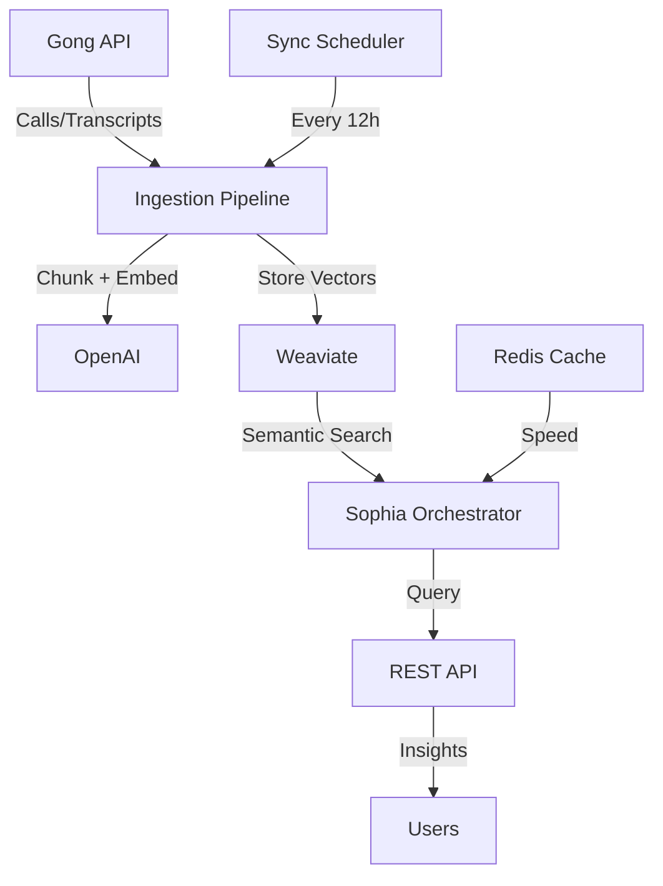

# 🚀 Gong Integration Deployment Guide for Sophia AI

## 📊 Architecture Overview

The Gong integration provides Sophia AI with powerful sales intelligence capabilities:



## 🔄 How Data Flows

### 1. **Ingestion Phase**

```python
Gong API → Fetch Calls → Get Transcripts → Chunk by Speaker →
Create Embeddings → Store in Weaviate
```

- **Chunking Strategy**: Speaker-based with 700 token chunks (100 token overlap)
- **Embedding Model**: OpenAI text-embedding-3-small (1536 dimensions)
- **Storage**: Weaviate vector database with HNSW index

### 2. **Query Phase**

```python
User Query → Create Embedding → Vector Search in Weaviate →
Retrieve Chunks → Format with Context → Return Results
```

- **Search Types**: Semantic, keyword, hybrid, filtered by account/date
- **Citations**: Every result includes call ID, timestamp, and speaker

### 3. **Intelligence Generation**

```python
Multiple Chunks → Aggregate Context → LLM Analysis →
Structured Insights → Executive Brief
```

## 🏠 Local Deployment

### Quick Start

```bash
# 1. Set up credentials
cp .env.gong_pipeline.example .env.gong_pipeline
# Edit with your credentials

# 2. Run local setup
chmod +x deployment/local/gong_local_setup.sh
./deployment/local/gong_local_setup.sh

# 3. Access API
open http://localhost:8000/docs
```

### Test Queries

```python
# Search transcripts
curl -X POST "http://localhost:8000/api/gong/search" \
  -H "Content-Type: application/json" \
  -d '{
    "query": "pricing objections",
    "limit": 5
  }'

# Analyze a call
curl -X POST "http://localhost:8000/api/gong/analyze/call" \
  -H "Content-Type: application/json" \
  -d '{
    "call_id": "2732786065663518788"
  }'

# Generate sales brief
curl -X POST "http://localhost:8000/api/gong/brief" \
  -H "Content-Type: application/json" \
  -d '{
    "topic": "competitive mentions in Q4"
  }'
```

## ☁️ Cloud Deployment

### AWS/GCP/Azure Setup

#### 1. **Environment Configuration**

```bash
# Create .env file for production
cat > .env.production << EOF
GONG_ACCESS_KEY=your_key
GONG_ACCESS_SECRET=your_secret
WEAVIATE_ENDPOINT=https://your-weaviate.weaviate.cloud
WEAVIATE_API_KEY=your_weaviate_key
OPENAI_API_KEY=your_openai_key
EOF
```

#### 2. **Docker Deployment**

```bash
# Build and run with Docker Compose
docker-compose -f deployment/cloud/docker-compose.gong.yml up -d

# Check health
docker-compose ps
curl http://localhost:8000/api/gong/health

# View logs
docker-compose logs -f sophia-gong
```

#### 3. **Kubernetes Deployment**

```yaml
# Apply Kubernetes manifests
kubectl apply -f deployment/k8s/sophia-gong-deployment.yaml
kubectl apply -f deployment/k8s/sophia-gong-service.yaml
kubectl apply -f deployment/k8s/sophia-gong-ingress.yaml

# Check status
kubectl get pods -l app=sophia-gong
kubectl logs -l app=sophia-gong
```

### Production Checklist

- [ ] SSL/TLS certificates configured
- [ ] API rate limiting enabled
- [ ] Monitoring dashboards set up
- [ ] Backup strategy for Weaviate
- [ ] Error alerting configured
- [ ] Secrets in secure vault (not .env)

## 🔍 How Sophia Accesses Gong Data

### 1. **Direct API Access**

```python
from app.orchestrators.gong_enhanced_orchestrator import GongEnhancedOrchestrator

orchestrator = GongEnhancedOrchestrator()

# Search for insights
results = await orchestrator.search_gong_transcripts(
    query="implementation timeline discussions",
    filters={"account": "Moss & Co"},
    limit=5
)
```

### 2. **Natural Language Queries**

```python
# Sophia understands context
response = await orchestrator.orchestrate(
    task="What pricing objections came up with Moss & Co?"
)
# Automatically searches Gong data and formats response
```

### 3. **Scheduled Intelligence**

```python
# Automatic daily briefs
brief = await orchestrator.generate_sales_brief(
    "key decisions needed this week"
)
# Aggregates recent calls, identifies patterns
```

## 📈 Monitoring & Optimization

### Key Metrics

```python
GET /api/gong/stats

{
  "total_chunks": 15234,
  "calls_indexed": 127,
  "avg_query_time": "245ms",
  "cache_hit_rate": 0.73
}
```

### Performance Tuning

- **Chunk Size**: Adjust 700/100 for better recall
- **Cache TTL**: Redis caches frequent queries for 1 hour
- **Batch Size**: Process 50 calls per sync cycle
- **Vector Index**: HNSW with efConstruction=128

## 🔐 Security Considerations

1. **API Keys**: Store in environment variables or secrets manager
2. **PII Filtering**: Automatic redaction of phone numbers, SSNs
3. **Access Control**: Role-based permissions for sensitive accounts
4. **Audit Logging**: All queries logged with user context
5. **Data Retention**: 90-day rolling window by default

## 🎯 Integration Points

### Slack Integration

```python
# Sophia can post Gong insights to Slack
sophia.send_to_any_channel(
    "#sales-team",
    f"📊 Weekly Gong Brief:\n{brief}"
)
```

### Looker Integration

```python
# Combine with BI metrics
gong_data = await get_gong_metrics()
looker_data = await get_revenue_metrics()
combined_insight = correlate_sales_to_revenue(gong_data, looker_data)
```

### CRM Sync

```python
# Enrich CRM with call insights
for account in crm.get_accounts():
    insights = await orchestrator.get_account_insights(account.name)
    crm.update_account(account.id, insights)
```

## 📋 Common Use Cases

### 1. **Pre-Meeting Brief**

```bash
"Sophia, brief me on recent conversations with Olympus"
→ Searches all Olympus calls
→ Summarizes key topics, concerns, next steps
```

### 2. **Competitive Intelligence**

```bash
"What competitors were mentioned this quarter?"
→ Scans all transcripts for competitor names
→ Analyzes context and sentiment
```

### 3. **Deal Velocity Analysis**

```bash
"Which deals are stalled and why?"
→ Identifies deals with no recent activity
→ Finds common objections or blockers
```

### 4. **Coaching Insights**

```bash
"Show me successful pricing negotiations"
→ Finds calls with positive pricing discussions
→ Extracts winning talk tracks
```

## 🛠️ Troubleshooting

### Common Issues

1. **No transcripts found**

   - Check Gong API permissions
   - Verify call recordings are processed
   - Ensure date range includes calls

2. **Slow queries**

   - Increase Weaviate resources
   - Optimize chunk size
   - Enable Redis caching

3. **Embedding errors**
   - Check OpenAI API limits
   - Implement retry logic
   - Use fallback embedding model

## 📞 Support

- **Documentation**: `/docs/gong-integration`
- **API Reference**: `http://localhost:8000/docs`
- **Logs**: `docker-compose logs sophia-gong`
- **Health Check**: `/api/gong/health`

## 🎉 Success Metrics

Once deployed, you should see:

- ✅ 100+ calls indexed in Weaviate
- ✅ <500ms query response time
- ✅ 90%+ relevance in search results
- ✅ Automated daily sales briefs
- ✅ Real-time account insights

---

**Ready to Deploy?** Start with local setup, test queries, then deploy to production! 🚀
