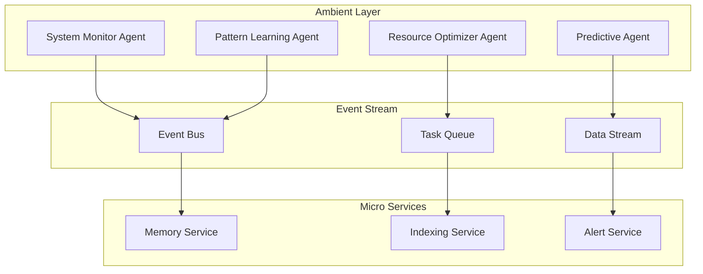

# Micro-Agents & Background Services Innovation Plan

## Executive Vision

Transform the AI Orchestra into a living ecosystem of specialized micro-agents that work autonomously in the background, creating emergent intelligence through coordinated micro-services.

## Core Concepts

### 1. Background Agent Architecture

#### **Ambient Intelligence Layer**

Background agents that continuously monitor and learn without explicit commands:



#### **Types of Background Agents**

1. **Watchers** - Passive observation agents

   - Log Watcher: Monitors system logs for anomalies
   - Cost Watcher: Tracks API usage and spending
   - Performance Watcher: Monitors latency and throughput
   - Security Watcher: Scans for vulnerabilities

2. **Learners** - Pattern recognition agents

   - Usage Pattern Learner: Identifies common workflows
   - Error Pattern Learner: Recognizes recurring issues
   - Optimization Learner: Discovers efficiency improvements
   - User Preference Learner: Adapts to user behavior

3. **Maintainers** - System health agents

   - Memory Garbage Collector: Cleans outdated memories
   - Index Rebuilder: Optimizes vector databases
   - Cache Warmer: Pre-loads frequently used data
   - Connection Pool Manager: Maintains service connections

4. **Predictors** - Anticipatory agents
   - Task Predictor: Anticipates next user actions
   - Resource Predictor: Forecasts compute needs
   - Failure Predictor: Identifies potential issues
   - Trend Predictor: Spots emerging patterns

### 2. Micro-Agent Design Patterns

#### **Single Responsibility Micro-Agents**

Each agent does ONE thing exceptionally well:

```python
# Example: Micro-agent for sentiment analysis
class SentimentMicroAgent:
    """Ultra-focused agent for sentiment analysis only"""

    def __init__(self):
        self.model = "sentiment-bert-micro"
        self.max_tokens = 512

    async def analyze(self, text: str) -> float:
        """Returns sentiment score -1.0 to 1.0"""
        return await self._compute_sentiment(text)
```

#### **Composable Agent Chains**

Micro-agents that can be dynamically chained:

```python
# Chain: TextInput -> Sentiment -> Translation -> Summary -> Output
chain = AgentChain()
    .add(SentimentMicroAgent())
    .add(TranslationMicroAgent(target="es"))
    .add(SummaryMicroAgent(max_words=50))
    .execute(input_text)
```

#### **Agent Mesh Network**

Agents discover and communicate peer-to-peer:

```yaml
agent_mesh:
  discovery:
    method: "gossip"
    broadcast_interval: 5s
    ttl: 60s

  communication:
    protocol: "grpc"
    encryption: "tls"
    max_hops: 3

  capabilities:
    - name: "code_review"
      agents: ["linter", "security_scanner", "complexity_analyzer"]
    - name: "data_pipeline"
      agents: ["extractor", "transformer", "loader", "validator"]
```

### 3. Microservice Architecture for AI

#### **Service Decomposition**

```mermaid
graph LR
    subgraph Core Services
        Auth[Auth Service]
        Gateway[API Gateway]
        Registry[Service Registry]
    end

    subgraph AI Services
        Embed[Embedding Service]
        Infer[Inference Service]
        Train[Training Service]
        Eval[Evaluation Service]
    end

    subgraph Data Services
        Vector[Vector Store]
        Graph[Graph Store]
        Time[Time Series]
        Cache[Redis Cache]
    end

    subgraph Business Services
        Task[Task Manager]
        Workflow[Workflow Engine]
        Report[Report Generator]
        Notify[Notification Service]
    end

    Gateway --> Auth
    Gateway --> Registry
    Registry --> AI Services
    Registry --> Data Services
    Registry --> Business Services
```

#### **Event-Driven Microservices**

```python
# Event-driven architecture for micro-agents
class EventDrivenMicroAgent:
    def __init__(self, event_bus):
        self.event_bus = event_bus
        self.subscribe_to_events()

    def subscribe_to_events(self):
        self.event_bus.subscribe("code.pushed", self.on_code_push)
        self.event_bus.subscribe("error.detected", self.on_error)
        self.event_bus.subscribe("user.command", self.on_command)

    async def on_code_push(self, event):
        # Trigger code review micro-agents
        await self.dispatch_micro_agents([
            "syntax_checker",
            "style_validator",
            "security_scanner",
            "test_runner"
        ])

    async def on_error(self, event):
        # Trigger debugging micro-agents
        await self.dispatch_micro_agents([
            "log_analyzer",
            "stack_tracer",
            "fix_suggester",
            "rollback_agent"
        ])
```

### 4. Advanced Background Agent Capabilities

#### **Autonomous Decision Making**

Agents that can make decisions without human intervention:

```python
class AutonomousOptimizer:
    """Self-governing optimization agent"""

    def __init__(self):
        self.decision_threshold = 0.85
        self.risk_tolerance = 0.2

    async def optimize_system(self):
        while True:
            metrics = await self.collect_metrics()
            opportunities = await self.identify_opportunities(metrics)

            for opportunity in opportunities:
                if opportunity.confidence > self.decision_threshold:
                    if opportunity.risk < self.risk_tolerance:
                        await self.execute_optimization(opportunity)
                        await self.log_decision(opportunity)
                    else:
                        await self.request_approval(opportunity)

            await asyncio.sleep(300)  # Run every 5 minutes
```

#### **Swarm Intelligence**

Multiple micro-agents working together:

```python
class SwarmCoordinator:
    """Coordinates swarm of micro-agents"""

    async def solve_complex_problem(self, problem):
        # Decompose problem into micro-tasks
        micro_tasks = await self.decompose(problem)

        # Spawn micro-agents for each task
        agents = []
        for task in micro_tasks:
            agent = await self.spawn_micro_agent(task.type)
            agents.append(agent.process(task))

        # Gather results
        results = await asyncio.gather(*agents)

        # Consensus mechanism
        solution = await self.reach_consensus(results)

        return solution
```

#### **Self-Healing Agents**

Agents that detect and fix their own issues:

```python
class SelfHealingAgent:
    """Agent with self-repair capabilities"""

    async def health_check(self):
        issues = []

        # Check memory usage
        if self.memory_usage > 0.8:
            await self.garbage_collect()
            issues.append("memory_cleaned")

        # Check response time
        if self.avg_response_time > 1000:
            await self.optimize_queries()
            issues.append("queries_optimized")

        # Check error rate
        if self.error_rate > 0.05:
            await self.reload_models()
            issues.append("models_reloaded")

        return issues
```

### 5. UI Integration Concepts

#### **Live Agent Dashboard**

Real-time visualization of all micro-agents:

```json
{
  "agent_dashboard": {
    "sections": {
      "active_agents": {
        "display": "grid",
        "update_interval": "1s",
        "metrics": ["status", "cpu", "memory", "tasks_processed"]
      },
      "agent_mesh": {
        "display": "force_graph",
        "show_connections": true,
        "animate_messages": true
      },
      "background_tasks": {
        "display": "timeline",
        "categories": ["watchers", "learners", "maintainers", "predictors"]
      },
      "swarm_activity": {
        "display": "heatmap",
        "resolution": "5min",
        "color_scale": "activity_level"
      }
    }
  }
}
```

#### **Natural Language Agent Control**

Commands the AI Manager understands:

```yaml
agent_commands:
  spawn:
    - "Spawn 5 web scraper agents to monitor competitor sites"
    - "Create a code review swarm for the new PR"
    - "Deploy sentiment analysis agents to Slack channels"

  configure:
    - "Set all background agents to low-power mode"
    - "Increase error monitoring sensitivity to critical"
    - "Enable predictive scaling for peak hours"

  orchestrate:
    - "Chain translation -> summary -> sentiment for all emails"
    - "Create pipeline: extract -> validate -> transform -> load"
    - "Set up cascade: if error then debug then fix then test"

  monitor:
    - "Show me what the background agents discovered today"
    - "Which micro-agents are consuming the most resources?"
    - "What patterns have the learner agents identified?"
```

### 6. AI Manager Persona Enhancements

#### **Personality Traits for Agent Management**

```python
class EnhancedOrchestraManager:
    """AI Manager with sophisticated agent coordination"""

    personality = {
        "proactive": 0.8,      # Suggests optimizations before asked
        "cautious": 0.6,       # Validates risky operations
        "curious": 0.9,        # Explores new patterns
        "efficient": 0.85,     # Optimizes resource usage
        "collaborative": 0.9   # Works well with human operators
    }

    async def manage_micro_agents(self, command):
        # Interpret natural language
        intent = await self.understand_intent(command)

        # Suggest improvements
        if self.personality["proactive"] > random():
            suggestions = await self.generate_suggestions(intent)
            await self.present_suggestions(suggestions)

        # Execute with appropriate caution
        if intent.risk_level > self.personality["cautious"]:
            approval = await self.request_confirmation(intent)
            if not approval:
                return

        # Spawn and coordinate agents
        result = await self.coordinate_agents(intent)

        # Learn from interaction
        if self.personality["curious"] > random():
            await self.analyze_interaction(command, result)

        return result
```

#### **Conversational Agent Management**

```python
class ConversationalAgentManager:
    """Natural conversation about agent operations"""

    async def chat(self, message):
        if "how are the agents" in message.lower():
            return await self.agent_status_report()

        elif "what did they find" in message.lower():
            return await self.agent_discoveries_summary()

        elif "optimize" in message.lower():
            return await self.suggest_optimizations()

        elif "spawn" in message.lower():
            return await self.guided_agent_creation(message)

        elif "problem with" in message.lower():
            return await self.diagnose_issue(message)
```

### 7. Implementation Architecture

#### **Technology Stack**

```yaml
micro_agents:
  runtime: "Python 3.11 + AsyncIO"
  communication: "gRPC + Protocol Buffers"
  orchestration: "Temporal.io"
  service_mesh: "Istio"
  monitoring: "Prometheus + Grafana"
  tracing: "Jaeger"

background_services:
  scheduler: "Celery Beat"
  queue: "RabbitMQ"
  stream: "Apache Kafka"
  cache: "Redis"

deployment:
  container: "Docker"
  orchestration: "Kubernetes"
  scaling: "KEDA (event-driven autoscaling)"
  ci_cd: "GitHub Actions + ArgoCD"
```

#### **Performance Targets**

```yaml
metrics:
  micro_agent_spawn_time: "< 100ms"
  inter_agent_latency: "< 10ms"
  background_agent_overhead: "< 5% CPU"
  swarm_coordination_time: "< 500ms"
  ui_update_latency: "< 50ms"

scale:
  max_concurrent_agents: 10000
  max_background_tasks: 1000
  max_events_per_second: 100000
  max_swarm_size: 100
```

### 8. Innovative Features

#### **Agent Evolution**

Agents that improve over time:

```python
class EvolvingAgent:
    """Agent with genetic algorithm optimization"""

    async def evolve(self):
        # Create agent population
        population = await self.create_variants(size=20)

        for generation in range(100):
            # Evaluate fitness
            fitness_scores = await self.evaluate_population(population)

            # Select best performers
            parents = self.select_top(population, fitness_scores, top_n=5)

            # Create next generation
            population = await self.crossover_and_mutate(parents)

            # Deploy best variant
            if max(fitness_scores) > self.current_fitness:
                await self.deploy_variant(population[0])
```

#### **Quantum-Inspired Agent Coordination**

Superposition of agent states:

```python
class QuantumInspiredCoordinator:
    """Explores multiple solution paths simultaneously"""

    async def quantum_solve(self, problem):
        # Create superposition of approaches
        approaches = await self.generate_approaches(problem, n=10)

        # Run all approaches in parallel universes (containers)
        universes = []
        for approach in approaches:
            universe = await self.spawn_universe(approach)
            universes.append(universe.execute())

        # Collapse to best solution
        results = await asyncio.gather(*universes)
        best_solution = self.collapse_wavefunction(results)

        return best_solution
```

#### **Emotional Intelligence for Agents**

Agents that understand and respond to emotional context:

```python
class EmotionallyAwareAgent:
    """Agent with emotional intelligence"""

    emotions = {
        "user_frustration": 0.0,
        "urgency": 0.0,
        "satisfaction": 0.5,
        "confusion": 0.0
    }

    async def respond_with_empathy(self, user_input):
        # Detect emotional state
        self.emotions = await self.detect_emotions(user_input)

        # Adjust behavior
        if self.emotions["user_frustration"] > 0.7:
            await self.simplify_explanation()
            await self.offer_alternatives()

        if self.emotions["urgency"] > 0.8:
            await self.prioritize_speed()
            await self.spawn_additional_agents()

        if self.emotions["confusion"] > 0.6:
            await self.provide_clarification()
            await self.show_step_by_step()
```

### 9. Security & Governance

#### **Agent Permissions System**

```yaml
agent_permissions:
  levels:
    - read_only: ["watcher", "monitor", "analyzer"]
    - read_write: ["optimizer", "indexer", "cacher"]
    - execute: ["deployer", "migrator", "scaler"]
    - critical: ["security_patcher", "data_deleter", "system_admin"]

  policies:
    - name: "production_protection"
      rule: "no execute permissions in production without approval"
    - name: "data_privacy"
      rule: "PII access requires encryption and audit logging"
    - name: "resource_limits"
      rule: "single agent cannot exceed 1GB RAM or 2 CPU cores"
```

#### **Agent Audit Trail**

```python
class AuditableAgent:
    """Agent with complete audit logging"""

    async def execute_action(self, action):
        audit_entry = {
            "agent_id": self.id,
            "action": action.name,
            "timestamp": datetime.utcnow(),
            "user": self.current_user,
            "permissions": self.permissions,
            "input": action.sanitized_input(),
            "output": None,
            "duration": None,
            "status": "started"
        }

        start_time = time.time()
        try:
            result = await action.execute()
            audit_entry["output"] = result.sanitized_output()
            audit_entry["status"] = "success"
        except Exception as e:
            audit_entry["error"] = str(e)
            audit_entry["status"] = "failed"
            raise
        finally:
            audit_entry["duration"] = time.time() - start_time
            await self.audit_log.write(audit_entry)

        return result
```

### 10. Future Innovations

#### **Neural Architecture Search for Agents**

Automatically discover optimal agent architectures:

```python
class NeuralArchitectureSearchAgent:
    """Self-designing agents"""

    async def design_optimal_agent(self, task_type):
        search_space = {
            "layers": [1, 2, 3, 4],
            "hidden_size": [64, 128, 256, 512],
            "activation": ["relu", "gelu", "swish"],
            "optimizer": ["adam", "sgd", "rmsprop"]
        }

        best_architecture = await self.search(
            search_space,
            task_type,
            trials=100
        )

        return await self.build_agent(best_architecture)
```

#### **Federated Learning Agents**

Agents that learn from distributed data without centralizing it:

```python
class FederatedLearningAgent:
    """Privacy-preserving distributed learning"""

    async def federated_train(self):
        # Each edge agent trains locally
        local_models = await self.gather_local_models()

        # Aggregate without seeing raw data
        global_model = await self.secure_aggregate(local_models)

        # Distribute updated model
        await self.broadcast_model(global_model)
```

## Summary

This innovation plan transforms your AI Orchestra into a living, breathing ecosystem where:

1. **Background agents** work 24/7 to monitor, learn, and optimize
2. **Micro-agents** provide focused, composable functionality
3. **Microservices** ensure scalability and reliability
4. **The UI** becomes a real-time command center
5. **The AI Manager** orchestrates everything with personality and intelligence

The system becomes self-improving, self-healing, and increasingly autonomous while maintaining human oversight and control through natural language interaction.
