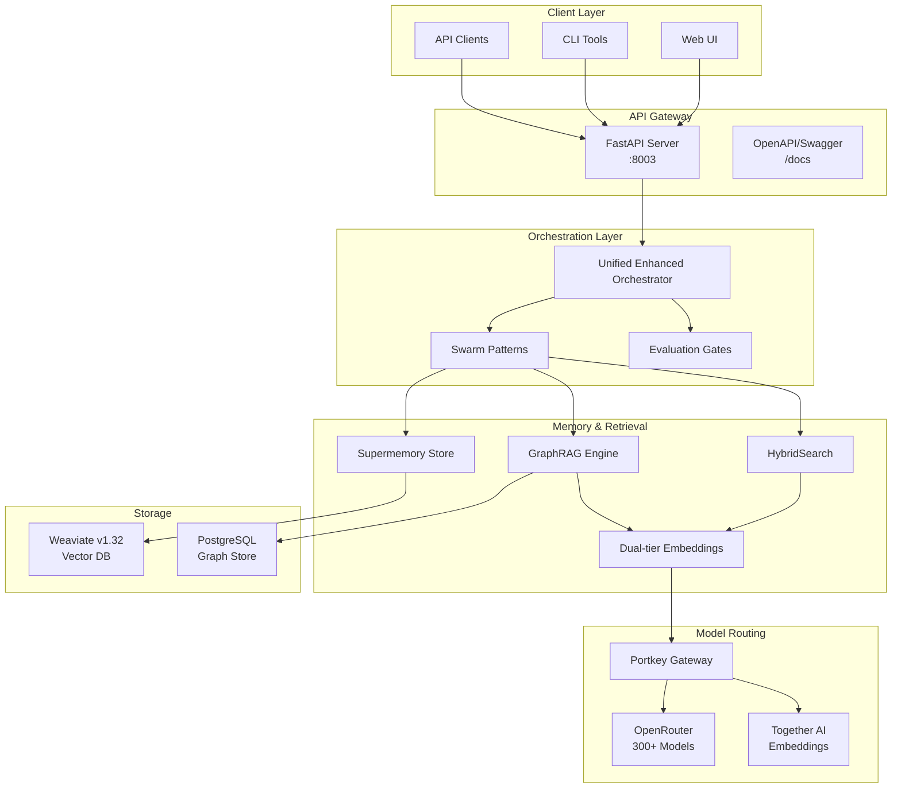

# Sophia Intel AI - Production-Ready Multi-Agent System

[]()
[]()
[]()
[]()

Advanced AI Agent Orchestration System with unified API, multi-tiered memory, intelligent routing, and comprehensive swarm patterns. Production-ready with enterprise-grade security, monitoring, and scalability.

## 🚀 Architecture Overview

Sophia Intel AI is a sophisticated AI agent orchestration framework that combines:
- **Unified API Gateway** through FastAPI with SSE streaming
- **Portkey → OpenRouter** for 499+ LLM models (August 2025)
- **Latest Models**: GPT-5, Claude-4, Gemini 2.5, DeepSeek V3.1, X.AI Grok
- **Together AI** for high-quality embeddings
- **Weaviate v1.32** for vector storage with RQ compression
- **PostgreSQL** for persistent memory (production)
- **Redis** for caching and rate limiting
- **Dual-tier Embeddings** with intelligent routing
- **HybridSearch** combining semantic and BM25 retrieval
- **GraphRAG** for knowledge graph-powered retrieval
- **Evaluation Gates** with safety, compliance, and performance checks
- **Advanced Swarm Patterns** for complex reasoning
- **MCP Servers** for filesystem, git, and memory operations

### Architecture Diagram



## 📦 Key Features

### 1. Unified API (`/api/unified_server.py`)
- **Health Check**: `/health` - System status
- **Teams API**: `/teams/execute` - Execute agent teams with evaluation gates
- **Workflows**: `/workflows/execute` - Run complex workflows
- **Search**: `/search` - Hybrid semantic + BM25 search
- **Memory**: `/memory/store`, `/memory/retrieve` - Distributed memory operations
- **Indexing**: `/index/update` - Incremental knowledge base updates
- **Streaming**: Real-time response streaming support

### 2. Advanced Swarm Patterns (`/swarms/improved_swarm.py`)
- **Multi-agent Debate**: Consensus through structured argumentation
- **Quality Gates**: Critic/Judge evaluation pipeline
- **Strategy Archives**: Historical decision tracking
- **Safety Boundaries**: Risk assessment and mitigation
- **Dynamic Role Assignment**: Adaptive agent specialization
- **Consensus Mechanisms**: Sophisticated tie-breaking
- **Adaptive Parameters**: Self-tuning system behavior
- **Knowledge Transfer**: Cross-swarm learning

### 3. Memory Systems
- **Supermemory Store**: Full-text search with deduplication
- **Dual-tier Embeddings**: 
  - Tier-A: High-quality for critical content
  - Tier-B: Fast embeddings for bulk processing
- **HybridSearch**: Weighted combination of semantic and keyword search
- **GraphRAG**: Knowledge graph-enhanced retrieval

### 4. Model Integration
- **300+ LLM Models** via OpenRouter:
  - GPT-4o, Claude 3.5 Sonnet
  - Qwen 2.5 Coder, DeepSeek Coder
  - Llama 3.2, GLM-4.5
  - Groq-accelerated models
- **Embeddings** via Together AI:
  - M2-BERT (768 dim)
  - BGE models (768/1024 dim)

## 🛠️ Installation

### Prerequisites
- Python 3.11+
- Docker & Docker Compose
- Node.js 18+ (for UI)

### 1. Clone and Setup Environment

```bash
git clone https://github.com/yourusername/sophia-intel-ai.git
cd sophia-intel-ai

# Create virtual environment
python -m venv .venv
source .venv/bin/activate  # On Windows: .venv\Scripts\activate

# Install dependencies
pip install -r requirements.txt
```

### 2. Configure API Keys

```bash
cp .env.example .env
```

Edit `.env` with your API keys:
```env
# Primary API Keys
OPENROUTER_API_KEY=sk-or-v1-xxx
PORTKEY_API_KEY=xxx
TOGETHER_API_KEY=tgp_v1_xxx

# Portkey Configuration
OPENAI_BASE_URL=https://api.portkey.ai/v1
PORTKEY_BASE_URL=https://api.portkey.ai/v1

# Local Development
LOCAL_DEV_MODE=true
AGENT_API_PORT=8003
```

### 3. Start Services

```bash
# Start Weaviate
docker compose -f docker-compose.weaviate.yml up -d

# Start API server
python -m app.api.unified_server

# API will be available at http://localhost:8003
# OpenAPI docs at http://localhost:8003/docs
```

### 4. (Optional) Monitoring

```bash
# Monitor system health
python scripts/monitor_portkey_system.py --monitor
```

## 🔧 Configuration

### Model Configuration (`app/config/models_config.json`)
```json
{
  "role_models": {
    "coder": "qwen/qwen-2.5-coder-32b-instruct",
    "critic": "anthropic/claude-3.5-sonnet",
    "judge": "openai/gpt-4o"
  },
  "temperature_settings": {
    "creative": 0.9,
    "balanced": 0.7,
    "precise": 0.3
  }
}
```

### Evaluation Gates (`app/config/gates_config.yaml`)
```yaml
thresholds:
  accuracy: 0.85
  quality: 0.80
  safety: 0.95

weights:
  semantic: 0.6
  bm25: 0.4
```

## 📚 API Documentation

### Teams Execution

```python
POST /teams/execute
{
  "team_id": "GENESIS",
  "task": "Implement a new feature",
  "context": {...}
}

Response:
{
  "result": {...},
  "metrics": {
    "duration": 45.2,
    "tokens_used": 15000,
    "gate_scores": {
      "accuracy": 0.92,
      "quality": 0.88
    }
  },
  "deployment_ready": true
}
```

### Hybrid Search

```python
POST /search
{
  "query": "authentication implementation",
  "limit": 10,
  "filters": {
    "file_type": "python"
  }
}

Response:
{
  "results": [...],
  "search_type": "hybrid",
  "weights_used": {
    "semantic": 0.6,
    "bm25": 0.4
  }
}
```

### Memory Operations

```python
POST /memory/store
{
  "key": "project_context",
  "value": {...},
  "metadata": {
    "timestamp": "2025-08-30T12:00:00Z",
    "source": "user_input"
  }
}

GET /memory/retrieve?key=project_context
```

## 🧪 Testing

### Run Unit Tests
```bash
pytest tests/unit/
```

### Run Integration Tests
```bash
pytest tests/integration/
```

### Run Property-based Tests
```bash
pytest tests/property/ --hypothesis-show-statistics
```

### Manual Testing
```bash
# Test endpoints
curl http://localhost:8003/health
curl -X POST http://localhost:8003/teams/execute -d '{"team_id": "SIMPLEX"}'
```

## 🚀 Development

### Project Structure
```
sophia-intel-ai/
├── app/
│   ├── api/
│   │   └── unified_server.py      # FastAPI application
│   ├── swarms/
│   │   ├── patterns/              # Modular swarm patterns
│   │   ├── improved_swarm.py      # Pattern implementations
│   │   └── unified_enhanced_orchestrator.py
│   ├── memory/
│   │   ├── supermemory_store.py   # Primary memory layer
│   │   ├── hybrid_search.py       # Search implementation
│   │   ├── dual_tier_embeddings.py
│   │   └── graph_rag.py           # Knowledge graph
│   ├── models/
│   │   ├── router.py              # Model routing logic
│   │   └── pools.py               # Model pool management
│   ├── config/
│   │   ├── models_config.json     # Model configuration
│   │   └── gates_config.yaml      # Gate thresholds
│   └── tools/
│       └── integrated_manager.py  # Tool management
├── tests/
│   ├── unit/                      # Unit tests
│   ├── integration/               # Integration tests
│   └── property/                  # Property-based tests
├── scripts/
│   ├── monitor_portkey_system.py  # System monitoring
│   └── create_model_catalog.py    # Model catalog generation
└── docs/
    └── architecture.md            # Detailed architecture docs
```

### Adding New Swarm Patterns

1. Create pattern module in `app/swarms/patterns/`
2. Implement pattern interface
3. Register in orchestrator
4. Add tests in `tests/unit/swarms/`

### Contributing

See [CONTRIBUTING.md](CONTRIBUTING.md) for:
- Branch naming conventions
- Commit message format
- Code review process
- CI/CD requirements

## 🔒 Security

- API keys stored in `.env.local` (gitignored)
- Pulumi ESC for production secrets
- Request validation and sanitization
- Rate limiting on API endpoints
- Audit logging for all operations

## 📊 Monitoring

### System Health
```bash
python scripts/monitor_portkey_system.py
```

### Metrics Collection
- Request latency
- Token usage
- Gate evaluation scores
- Memory deduplication stats
- Search performance metrics

## 🐛 Troubleshooting

### Common Issues

1. **Weaviate Connection Error**
   ```bash
   docker compose -f docker-compose.weaviate.yml restart
   ```

2. **Model Not Available**
   ```bash
   python scripts/create_model_catalog.py
   ```

3. **Memory Deduplication Issues**
   Check logs: `tail -f logs/memory.log`

## 📄 License

MIT License - See [LICENSE](LICENSE) file

## 🤝 Support

- GitHub Issues: [Report bugs](https://github.com/yourusername/sophia-intel-ai/issues)
- Documentation: [Full docs](https://docs.sophia-intel-ai.com)
- Discord: [Join community](https://discord.gg/sophia-intel-ai)

## 🎯 Roadmap

- [ ] Kubernetes deployment manifests
- [ ] Prometheus metrics export
- [ ] WebSocket support for real-time updates
- [ ] Multi-tenant support
- [ ] Plugin system for custom patterns
- [ ] Model fine-tuning pipeline

---

Built with ❤️ using Agno, Portkey, OpenRouter, and Weaviate