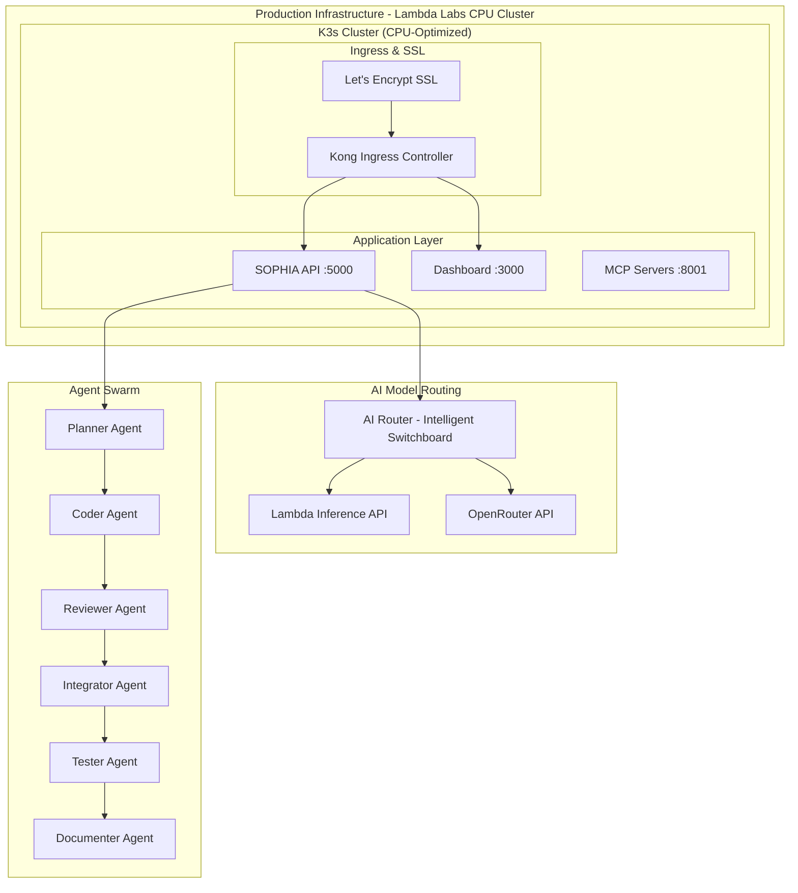

# SOPHIA Intel - AI-First Development Platform

> **API-First Architecture** | **CPU-Optimized Infrastructure** | **Intelligent Model Routing**

SOPHIA Intel is a production-ready AI development platform that leverages cost-effective CPU infrastructure and intelligent model routing to deliver powerful AI capabilities through Lambda Inference API and OpenRouter integration.

## 🏗️ Architecture Overview



## 🚀 Quick Start

### Prerequisites

- Python 3.11+
- Docker & Docker Compose
- kubectl (for K3s cluster management)

### Step 1: Environment Configuration

```bash
# Clone the repository
git clone https://github.com/ai-cherry/sophia-intel.git
cd sophia-intel

# Copy environment template
cp .env.example .env
```

### Step 2: Configure API Keys

Edit `.env` with your API credentials:

```bash
# AI Model Routing - Required
LAMBDA_API_KEY=secret_sophiacloudapi_your-lambda-inference-key
OPENROUTER_API_KEY=sk-or-v1-your-openrouter-key

# Infrastructure - Required for production deployment
LAMBDA_CLOUD_API_KEY=ll-your-lambda-labs-key  # For CPU cluster provisioning
DNSIMPLE_API_KEY=dnsimple_u_your-dns-key      # For domain management
GITHUB_PAT=github_pat_your-github-token       # For CI/CD integration

# Optional - Enhanced features
QDRANT_URL=https://your-cluster.qdrant.io:6333
QDRANT_API_KEY=your-qdrant-api-key
```

### Step 3: Local Development

**Start Local Services:**
```bash
# Start supporting services
docker-compose up -d postgres redis qdrant

# Install dependencies
pip install -r requirements.txt

# Start the API server
uvicorn apps.sophia-dashboard.sophia-dashboard-backend.app:app --host 0.0.0.0 --port 5000 --reload
```

**Start Dashboard:**
```bash
cd apps/sophia-dashboard
npm install
npm start
```

### Step 4: Production Deployment

**Deploy to Lambda Labs CPU Cluster:**
```bash
# Provision CPU-optimized infrastructure
cd infra
pulumi up

# Deploy application to K3s cluster
kubectl apply -f k8s/manifests/

# Configure DNS and SSL
bash scripts/deploy_to_production_domain.sh
```

## 🧠 AI Model Routing

SOPHIA Intel features an intelligent AI router that automatically selects the optimal model based on:

- **Task Type**: Code generation, analysis, reasoning, documentation
- **Cost Preference**: Cost-optimized, balanced, performance-optimized  
- **Latency Requirements**: Low-latency, normal, batch processing
- **Quality Requirements**: Basic, good, high, premium

### Supported Models

**Lambda Inference API (Primary - Cost-Effective):**
- `lfm-40b` - General purpose, fast inference
- `qwen3-32b-fp8` - Analysis and reasoning
- `deepseek-r1-671b` - Advanced reasoning and math

**OpenRouter (Premium Options):**
- `openai/gpt-4o` - Function calling, structured output
- `anthropic/claude-3.5-sonnet` - Creative writing, analysis
- `deepseek/deepseek-r1` - Reasoning and code generation

## 🤖 Agent Swarm Architecture

Six specialized agents work together to handle complex development tasks:

1. **Planner Agent** - Task decomposition and strategy
2. **Coder Agent** - Code generation and implementation  
3. **Reviewer Agent** - Code review and quality assurance
4. **Integrator Agent** - System integration and deployment
5. **Tester Agent** - Automated testing and validation
6. **Documenter Agent** - Documentation generation

## 🏭 Production Infrastructure

### CPU-Optimized Design

- **Instance Types**: `cpu.c2-2`, `cpu.c2-4`, `cpu.c2-8`
- **Cost Efficiency**: 80% cost reduction vs GPU infrastructure
- **Scalability**: Horizontal scaling with K3s orchestration
- **Reliability**: Multi-instance deployment with load balancing

### Deployment Architecture

- **Lambda Labs**: CPU cluster provisioning and management
- **K3s**: Lightweight Kubernetes for container orchestration  
- **Kong**: API gateway and ingress controller
- **Let's Encrypt**: Automated SSL certificate management
- **DNSimple**: DNS management and domain configuration

## 🔧 Development Workflow

### Natural Language → Code Pipeline

1. **Mission Input**: Natural language task description
2. **Agent Routing**: Intelligent task distribution to agent swarm
3. **Code Generation**: Collaborative development by specialized agents
4. **Quality Assurance**: Automated review, testing, and integration
5. **GitHub Integration**: Automatic PR creation and deployment

### MCP Server Integration

Model Context Protocol (MCP) servers provide standardized interfaces for:

- **Code Context**: Repository analysis and code understanding
- **GitHub Integration**: PR management and code deployment
- **Documentation**: Automated documentation generation
- **Testing**: Comprehensive test suite execution

## 📊 Monitoring & Observability

- **Health Endpoints**: `/api/health` for service monitoring
- **Performance Metrics**: Response time, cost tracking, success rates
- **Circuit Breakers**: Automatic failover and recovery
- **Logging**: Structured logging with correlation IDs

## 🚀 Getting Started

Visit [www.sophia-intel.ai](https://www.sophia-intel.ai) to access the production platform, or follow the local development setup above to run your own instance.

## 📚 Documentation

- [Infrastructure Setup](docs/infra_reset_runbook.md)
- [API Documentation](docs/api/)
- [Agent Development Guide](docs/agents/)
- [Deployment Guide](docs/deployment/)

## 🤝 Contributing

1. Fork the repository
2. Create a feature branch
3. Make your changes
4. Run tests: `pytest tests/`
5. Submit a pull request

## 📄 License

MIT License - see [LICENSE](LICENSE) for details.

---

**SOPHIA Intel** - Transforming development with AI-first architecture and intelligent automation.


## 🔧 Troubleshooting

### Common Issues

#### Dashboard Shows Blank Screen or "Host Not Allowed" Error

**Problem**: The React dashboard appears blank or shows "This host is not allowed" when accessing from external domains.

**Solution**: Update the Vite configuration in `apps/dashboard/vite.config.js`:

```javascript
export default defineConfig({
  // ... other config
  preview: {
    host: '0.0.0.0',        // Listen on all addresses
    port: 8080,
    allowedHosts: true      // Allow any host
  }
})
```

**Why**: Vite has built-in security restrictions that block external hosts by default. See [docs/VITE_HOST_FIX.md](./docs/VITE_HOST_FIX.md) for detailed explanation.

#### API Connection Errors

**Problem**: Dashboard shows "Connection Error" or "Unable to connect to SOPHIA Intel API".

**Solutions**:
1. Ensure backend is running on port 5000
2. Check environment variables are set correctly
3. Verify API_BASE_URL in frontend configuration

#### MCP Services Not Starting

**Problem**: MCP services show as offline or fail to start.

**Solutions**:
1. Check port availability (8001, 8002, etc.)
2. Verify Python dependencies are installed
3. Check logs for specific error messages

### Getting Help

- **Documentation**: Check [docs/](./docs/) directory for detailed guides
- **Issues**: Report bugs on [GitHub Issues](https://github.com/ai-cherry/sophia-intel/issues)
- **Configuration**: See [docs/environment-variables.md](./docs/environment-variables.md)


## 🚀 **GitHub Actions Deployment**

SOPHIA Intel now supports automatic deployment to Northflank via GitHub Actions.

### **Setup GitHub Secrets**

Add these secrets to your GitHub repository settings (`Settings` → `Secrets and variables` → `Actions`):

```
NORTHFLANK_API_TOKEN: your-northflank-api-token
LAMBDA_API_KEY: secret_sophiacloudapi_17cf7f3cedca48f18b4b8ea46cbb258f.EsLXt0lkGlhZ1Nd369Ld5DMSuhJg9O9y
DNSIMPLE_API_KEY: dnsimple_u_XBHeyhH3O8uKJF6HnqU76h7ANWdNvUzN
```

### **Automatic Deployment**

The platform automatically deploys when you push to the `main` branch:

1. **Push to main** → Triggers deployment workflow
2. **Build & Test** → Runs comprehensive test suite
3. **Deploy Services** → Creates/updates Northflank services
4. **Health Check** → Verifies deployment success

### **Manual Deployment**

Trigger deployment manually:

1. Go to **Actions** tab in GitHub
2. Select **"Deploy SOPHIA Intel to Northflank"**
3. Click **"Run workflow"** → Select `main` branch → **"Run workflow"**

### **Deployment Status**

Monitor deployment status with badges:

[](https://github.com/ai-cherry/sophia-intel/actions/workflows/deploy-northflank.yml)
[](https://github.com/ai-cherry/sophia-intel/actions/workflows/build-and-test.yml)

### **Services Deployed**

The GitHub Actions workflow deploys:

- **SOPHIA API** → `https://api.sophia-intel.ai`
- **SOPHIA Dashboard** → `https://www.sophia-intel.ai`
- **Secret Management** → Northflank secret groups
- **Health Monitoring** → Automatic health checks

### **Workflow Features**

- ✅ **Automated Testing** - Backend, frontend, and Docker builds
- ✅ **Security Scanning** - Vulnerability detection
- ✅ **Code Quality** - Linting and formatting checks
- ✅ **Multi-Service Deployment** - API and Dashboard
- ✅ **Health Verification** - Post-deployment testing
- ✅ **Rollback Support** - Automatic failure detection

# SOPHIA Intel - Production Deployment Sat Aug 16 11:37:41 EDT 2025
