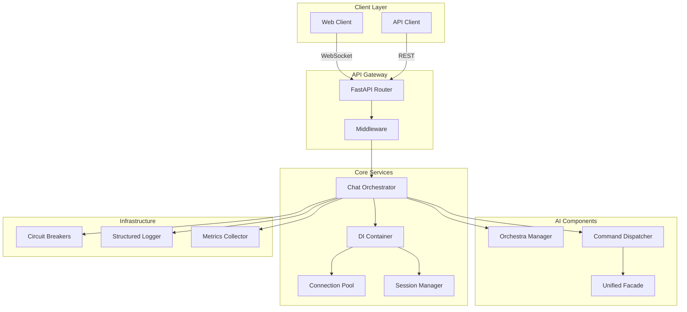
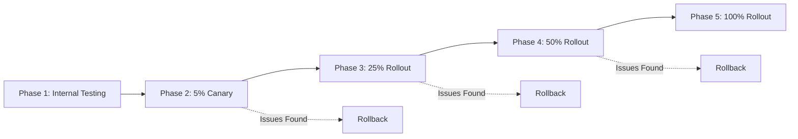

# Remaining Phases Implementation Plan

## Overview

This document outlines the detailed implementation plan for the remaining non-critical phases of the AI Orchestra remediation strategy.

## Phase 4: Logging and Observability

### 4.1 Structured Logging Implementation

**Priority**: High | **Effort**: 2-3 days

#### Components to Create

```python
# app/infrastructure/logging/structured_logger.py
- StructuredLogger class with JSON output
- Correlation ID injection via contextvars
- Log levels: DEBUG, INFO, WARNING, ERROR, CRITICAL
- Field standardization (timestamp, service, component, correlation_id)
```

#### Integration Points

- Middleware for automatic correlation ID injection
- Request/response logging with sanitization
- Performance metrics logging
- Error tracking with stack traces

### 4.2 Distributed Tracing

**Priority**: Medium | **Effort**: 3-4 days

#### Technology Stack

- OpenTelemetry SDK for instrumentation
- Jaeger/Zipkin for trace collection
- Grafana Tempo for trace storage

#### Implementation

```python
# app/infrastructure/tracing/tracer.py
- Tracer initialization and configuration
- Span creation for key operations
- Context propagation across services
- Custom attributes and events
```

### 4.3 Metrics Collection

**Priority**: High | **Effort**: 2-3 days

#### Metrics to Track

```yaml
Application Metrics:
  - request_count
  - request_duration_seconds
  - websocket_connections_active
  - circuit_breaker_state
  - error_rate
  - token_generation_rate

Business Metrics:
  - chat_sessions_active
  - swarm_executions
  - manager_intent_accuracy
  - api_version_usage
```

#### Implementation

```python
# app/infrastructure/metrics/collector.py
- Prometheus client integration
- Custom metric collectors
- Metric exporters
- Dashboard configuration (Grafana)
```

### 4.4 Logging Aggregation Pipeline

**Priority**: Low | **Effort**: 1-2 days

#### Components

- Log shipping (Filebeat/Fluentd)
- Log aggregation (ELK Stack or Loki)
- Log retention policies
- Alert rules configuration

## Phase 5: Testing Infrastructure

### 5.1 Unit Tests Structure

**Priority**: High | **Effort**: 3-4 days

#### Test Coverage Areas

```
app/
├── tests/
│   ├── unit/
│   │   ├── test_chat_orchestrator.py
│   │   │   - test_handle_chat_success
│   │   │   - test_handle_chat_error
│   │   │   - test_circuit_breaker_activation
│   │   │   - test_connection_timeout
│   │   │   - test_error_boundary
│   │   ├── test_orchestra_manager.py
│   │   │   - test_intent_interpretation
│   │   │   - test_response_generation
│   │   │   - test_mood_updates
│   │   │   - test_learning_memory
│   │   ├── test_dependency_injection.py
│   │   │   - test_service_registration
│   │   │   - test_singleton_lifecycle
│   │   │   - test_scoped_services
│   │   │   - test_container_disposal
│   │   └── test_api_contracts.py
│   │       - test_version_detection
│   │       - test_backward_compatibility
│   │       - test_validation_middleware
```

### 5.2 Integration Tests

**Priority**: High | **Effort**: 3-4 days

#### Test Scenarios

```python
# tests/integration/test_websocket_flows.py
class TestWebSocketIntegration:
    - test_full_chat_session_flow
    - test_connection_limit_enforcement
    - test_idle_timeout_cleanup
    - test_error_recovery
    - test_streaming_tokens
    - test_manager_interaction

# tests/integration/test_api_versioning.py
class TestAPIVersioning:
    - test_v1_client_compatibility
    - test_v2_client_features
    - test_version_auto_detection
    - test_mixed_version_clients
```

### 5.3 Test Fixtures and Mocks

**Priority**: Medium | **Effort**: 2 days

#### Fixtures to Create

```python
# tests/fixtures.py
@pytest.fixture
def mock_orchestrator():
    """Mock ChatOrchestrator with test configuration"""

@pytest.fixture
def mock_websocket():
    """Mock WebSocket connection"""

@pytest.fixture
def test_di_container():
    """Test DI container with mock services"""

@pytest.fixture
async def test_client():
    """FastAPI test client with lifespan"""
```

### 5.4 Performance Tests

**Priority**: Low | **Effort**: 2 days

#### Test Scenarios

- Concurrent WebSocket connections (target: 1000)
- Message throughput (target: 100 msg/sec)
- Token streaming latency (target: <50ms)
- Circuit breaker recovery time
- Memory usage under load

### 5.5 Code Coverage Setup

**Priority**: Medium | **Effort**: 1 day

#### Configuration

```ini
# pytest.ini
[tool.coverage]
source = ["app"]
omit = ["*/tests/*", "*/migrations/*"]
minimum_coverage = 80

# CI/CD integration
- GitHub Actions workflow
- Coverage badge generation
- PR coverage checks
```

## Phase 7: Documentation

### 7.1 Architecture Decision Records (ADRs)

**Priority**: High | **Effort**: 2 days

#### ADRs to Document

```markdown
docs/adr/
├── ADR-001-dependency-injection.md
├── ADR-002-api-versioning-strategy.md
├── ADR-003-websocket-connection-management.md
├── ADR-004-circuit-breaker-pattern.md
├── ADR-005-session-state-management.md
└── ADR-006-gradual-rollout-approach.md
```

### 7.2 Component Interaction Diagrams

**Priority**: Medium | **Effort**: 2 days

#### Diagrams to Create



### 7.3 API Documentation

**Priority**: High | **Effort**: 2-3 days

#### Documentation Structure

```yaml
OpenAPI Documentation:
  - Endpoint descriptions
  - Request/response schemas
  - Authentication details
  - Rate limiting info
  - Error codes catalog

Postman Collection:
  - Example requests for all endpoints
  - Environment variables
  - Test scripts
  - Documentation links

SDK Documentation:
  - Python client library
  - JavaScript/TypeScript client
  - Usage examples
  - Migration guides
```

### 7.4 Deployment and Operations Guide

**Priority**: High | **Effort**: 2 days

#### Guide Contents

```markdown
# Deployment Guide

## Prerequisites

- Python 3.11+
- Redis 7.0+
- Docker/Kubernetes

## Configuration

- Environment variables
- Service configs
- Feature flags

## Deployment Steps

1. Pre-deployment checks
2. Database migrations
3. Service deployment
4. Health verification
5. Traffic routing

## Monitoring

- Key metrics to watch
- Alert thresholds
- Runbook links

## Rollback Procedures

- Automated rollback triggers
- Manual rollback steps
- Data recovery procedures
```

## Phase 8: Rollout and Migration

### 8.1 Feature Flags Implementation

**Priority**: High | **Effort**: 2 days

#### Feature Flag System

```python
# app/infrastructure/feature_flags.py
class FeatureFlags:
    flags = {
        "use_new_orchestrator": {"enabled": False, "rollout_percentage": 0},
        "enable_v2_api": {"enabled": True, "rollout_percentage": 100},
        "use_circuit_breakers": {"enabled": True, "rollout_percentage": 100},
        "enable_structured_logging": {"enabled": False, "rollout_percentage": 0},
        "use_connection_pool": {"enabled": True, "rollout_percentage": 100}
    }

    def is_enabled_for_session(flag: str, session_id: str) -> bool:
        """Check if feature is enabled for specific session"""
```

### 8.2 Staging Environment Setup

**Priority**: High | **Effort**: 3 days

#### Environment Configuration

```yaml
Staging Environment:
  Infrastructure:
    - Kubernetes cluster (staging namespace)
    - Redis instance
    - Monitoring stack (Prometheus, Grafana, Jaeger)

  Configuration:
    - Staging-specific env vars
    - Reduced resource limits
    - Test data seeding

  Access Control:
    - VPN/Bastion access
    - Read-only production data access
    - Staging-only API keys
```

### 8.3 Load Testing Plan

**Priority**: Medium | **Effort**: 2 days

#### Load Test Scenarios

```yaml
Test Scenarios:
  1. Baseline Performance:
    - 100 concurrent users
    - 10 requests/second
    - 5 minute duration

  2. Peak Load:
    - 1000 concurrent users
    - 100 requests/second
    - 15 minute duration

  3. Sustained Load:
    - 500 concurrent users
    - 50 requests/second
    - 60 minute duration

  4. Spike Test:
    - 0 to 2000 users in 30 seconds
    - Hold for 5 minutes
    - Drop to 0

Tools:
  - Locust for HTTP/WebSocket testing
  - Grafana K6 for scenario testing
  - Custom scripts for specific flows
```

### 8.4 Production Rollout Plan

**Priority**: Critical | **Effort**: 5 days

#### Rollout Phases



#### Detailed Timeline

```
Week 1:
  Day 1-2: Internal testing with team
  Day 3-5: 5% canary deployment

Week 2:
  Day 1-2: Monitor metrics, gather feedback
  Day 3-5: 25% rollout if metrics good

Week 3:
  Day 1-2: Continued monitoring
  Day 3-5: 50% rollout

Week 4:
  Day 1-2: Final validation
  Day 3: 100% rollout
  Day 4-5: Post-deployment monitoring
```

### 8.5 Monitoring and Success Criteria

**Priority**: High | **Effort**: 1 day

#### Key Metrics

```yaml
Success Criteria:
  Performance:
    - P95 latency < 200ms
    - P99 latency < 500ms
    - Error rate < 0.1%

  Reliability:
    - Uptime > 99.9%
    - No circuit breaker triggers
    - WebSocket stability > 99%

  Business:
    - User satisfaction unchanged/improved
    - No increase in support tickets
    - API adoption rate > 80%

Monitoring Dashboard:
  - Real-time metrics
  - Alert notifications
  - Rollback triggers
  - Comparison with baseline
```

## Implementation Priority Matrix

| Phase                   | Priority | Effort   | Business Value | Risk Mitigation |
| ----------------------- | -------- | -------- | -------------- | --------------- |
| 5.1 Unit Tests          | High     | 3-4 days | High           | High            |
| 8.1 Feature Flags       | High     | 2 days   | High           | Critical        |
| 4.1 Structured Logging  | High     | 2-3 days | Medium         | High            |
| 7.3 API Documentation   | High     | 2-3 days | High           | Medium          |
| 8.2 Staging Environment | High     | 3 days   | High           | Critical        |
| 5.2 Integration Tests   | High     | 3-4 days | High           | High            |
| 4.3 Metrics Collection  | High     | 2-3 days | High           | High            |
| 7.1 ADRs                | Medium   | 2 days   | Medium         | Low             |
| 4.2 Distributed Tracing | Medium   | 3-4 days | Medium         | Medium          |
| 8.3 Load Testing        | Medium   | 2 days   | Medium         | High            |
| 7.2 Component Diagrams  | Low      | 2 days   | Low            | Low             |
| 5.4 Performance Tests   | Low      | 2 days   | Medium         | Medium          |

## Total Effort Estimate

- **Phase 4 (Logging/Observability)**: 8-12 days
- **Phase 5 (Testing)**: 11-15 days
- **Phase 7 (Documentation)**: 8-10 days
- **Phase 8 (Rollout)**: 13-15 days

**Total**: 40-52 days (8-10 weeks with one developer)

## Recommended Execution Order

1. **Week 1-2**: Feature flags + Staging environment (enables safe testing)
2. **Week 3-4**: Unit tests + Integration tests (ensures code quality)
3. **Week 5**: Structured logging + Metrics (enables monitoring)
4. **Week 6**: API documentation + ADRs (enables team collaboration)
5. **Week 7**: Load testing + Performance tests (validates scalability)
6. **Week 8-10**: Production rollout with monitoring

This phased approach ensures each capability builds on the previous one, minimizing risk while maximizing value delivery.
