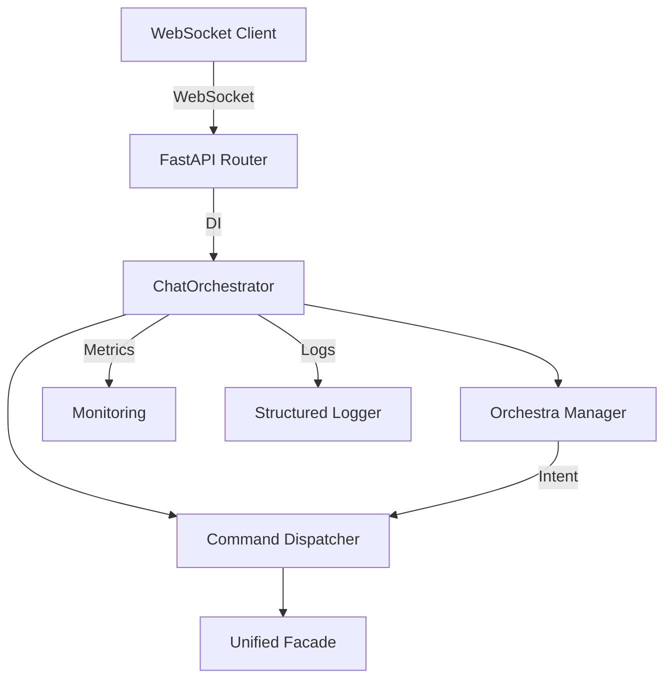

# Comprehensive Remediation Strategy for Chat Orchestrator

## Executive Summary

This document outlines a systematic approach to address all identified issues in the Chat Orchestrator implementation while ensuring zero downtime and maintaining backward compatibility.

## Phase 1: Critical Bug Fixes and Safety Measures (Week 1)

### 1.1 Fix Infinite Recursion Bug

**Issue**: `_get_system_state()` calls `get_metrics()` creating potential circular dependency

**Solution**:

```python
# Create a lightweight system state method without metrics dependency
async def _get_system_state(self, include_metrics: bool = False) -> Dict[str, Any]:
    base_state = {
        "health": self._calculate_health(),
        "active_connections": len(self.active_connections),
        "avg_response_time": self.metrics["avg_response_time"],
        "components": self._get_component_status()
    }

    if include_metrics:
        base_state["detailed_metrics"] = await self.get_metrics()

    return base_state

def _calculate_health(self) -> float:
    total = max(1, self.metrics.get("total_messages", 1))
    errors = self.metrics.get("errors", 0)
    return 1.0 - (errors / total)
```

### 1.2 Error Boundaries Implementation

```python
class WebSocketErrorBoundary:
    def __init__(self, fallback_response):
        self.fallback_response = fallback_response

    async def __aenter__(self):
        return self

    async def __aexit__(self, exc_type, exc_val, exc_tb):
        if exc_type:
            logger.error(f"WebSocket error caught: {exc_val}")
            await self.send_fallback()
            return True  # Suppress exception
```

### 1.3 Circuit Breaker Pattern

```python
from typing import Callable
import asyncio

class CircuitBreaker:
    def __init__(self, failure_threshold: int = 5, timeout: int = 60):
        self.failure_threshold = failure_threshold
        self.timeout = timeout
        self.failures = 0
        self.last_failure_time = None
        self.state = "CLOSED"  # CLOSED, OPEN, HALF_OPEN

    async def call(self, func: Callable, *args, **kwargs):
        if self.state == "OPEN":
            if self._should_attempt_reset():
                self.state = "HALF_OPEN"
            else:
                raise Exception("Circuit breaker is OPEN")

        try:
            result = await func(*args, **kwargs)
            self._on_success()
            return result
        except Exception as e:
            self._on_failure()
            raise
```

## Phase 2: Dependency Injection and State Management (Week 2)

### 2.1 Dependency Injection Container

```python
from typing import TypeVar, Type, Dict, Any
from dataclasses import dataclass

T = TypeVar('T')

@dataclass
class ServiceConfig:
    ollama_url: str = "http://localhost:11434"
    redis_url: str = "redis://localhost:6379"
    mcp_server_url: str = "http://localhost:8004"
    n8n_url: str = "http://localhost:5678"

class DIContainer:
    def __init__(self):
        self._services: Dict[Type, Any] = {}
        self._factories: Dict[Type, Callable] = {}

    def register(self, service_type: Type[T], factory: Callable[[], T]):
        self._factories[service_type] = factory

    def resolve(self, service_type: Type[T]) -> T:
        if service_type not in self._services:
            if service_type in self._factories:
                self._services[service_type] = self._factories[service_type]()
            else:
                raise ValueError(f"Service {service_type} not registered")
        return self._services[service_type]

# Usage
container = DIContainer()
container.register(ChatOrchestrator, lambda: ChatOrchestrator(config))
container.register(OrchestraManager, lambda: OrchestraManager("Maestro"))
```

### 2.2 Connection Pool Manager

```python
class WebSocketConnectionPool:
    def __init__(self, max_connections: int = 1000):
        self.connections: Dict[str, ConnectionState] = {}
        self.max_connections = max_connections
        self._lock = asyncio.Lock()

    async def add_connection(self, key: str, connection: ConnectionState):
        async with self._lock:
            if len(self.connections) >= self.max_connections:
                await self._evict_oldest()
            self.connections[key] = connection

    async def remove_connection(self, key: str):
        async with self._lock:
            if key in self.connections:
                del self.connections[key]
```

## Phase 3: API Contracts and Interfaces (Week 3)

### 3.1 Formal API Contracts

```python
from abc import ABC, abstractmethod
from typing import Protocol

class ChatOrchestratorInterface(Protocol):
    async def handle_chat(self, request: ChatRequest) -> ChatResponse: ...
    async def stream_tokens(self, message: str, session_id: str) -> AsyncGenerator[StreamToken, None]: ...
    async def get_metrics(self) -> Dict[str, Any]: ...

class ManagerInterface(Protocol):
    def interpret_intent(self, message: str, context: ManagerContext) -> Tuple[str, Dict, float]: ...
    def generate_response(self, intent: str, parameters: Dict, context: ManagerContext) -> str: ...

# Versioned API models
class ChatRequestV1(BaseModel):
    api_version: str = "v1"
    message: str
    session_id: str

class ChatRequestV2(ChatRequestV1):
    api_version: str = "v2"
    optimization_hints: Optional[Dict[str, Any]] = None
```

## Phase 4: Logging and Observability (Week 4)

### 4.1 Structured Logging with Correlation IDs

```python
import uuid
from contextvars import ContextVar

correlation_id: ContextVar[str] = ContextVar('correlation_id', default='')

class StructuredLogger:
    def __init__(self, logger_name: str):
        self.logger = logging.getLogger(logger_name)

    def log(self, level: str, message: str, **kwargs):
        log_data = {
            "timestamp": datetime.utcnow().isoformat(),
            "correlation_id": correlation_id.get() or str(uuid.uuid4()),
            "message": message,
            **kwargs
        }
        self.logger.log(level, json.dumps(log_data))

# Middleware to inject correlation ID
@app.middleware("http")
async def add_correlation_id(request: Request, call_next):
    request_id = request.headers.get("X-Correlation-ID", str(uuid.uuid4()))
    correlation_id.set(request_id)
    response = await call_next(request)
    response.headers["X-Correlation-ID"] = request_id
    return response
```

### 4.2 Distributed Tracing

```python
from opentelemetry import trace
from opentelemetry.exporter.jaeger import JaegerExporter
from opentelemetry.sdk.trace import TracerProvider
from opentelemetry.sdk.trace.export import BatchSpanProcessor

trace.set_tracer_provider(TracerProvider())
tracer = trace.get_tracer(__name__)

jaeger_exporter = JaegerExporter(
    agent_host_name="localhost",
    agent_port=6831,
)

span_processor = BatchSpanProcessor(jaeger_exporter)
trace.get_tracer_provider().add_span_processor(span_processor)

# Usage
async def handle_chat_with_tracing(self, request: ChatRequest):
    with tracer.start_as_current_span("handle_chat") as span:
        span.set_attribute("session_id", request.session_id)
        span.set_attribute("message_length", len(request.message))

        # Process request
        result = await self._process_chat(request)

        span.set_attribute("success", result.success)
        return result
```

## Phase 5: Testing Infrastructure (Week 5)

### 5.1 Unit Test Structure

```python
import pytest
from unittest.mock import Mock, AsyncMock, patch
import asyncio

class TestChatOrchestrator:
    @pytest.fixture
    async def orchestrator(self):
        config = ServiceConfig()
        orch = ChatOrchestrator(config)
        await orch.initialize()
        yield orch
        await orch.shutdown()

    @pytest.mark.asyncio
    async def test_handle_chat_success(self, orchestrator):
        request = ChatRequest(
            message="Test message",
            session_id="test-123"
        )

        with patch.object(orchestrator.command_dispatcher, 'process_command') as mock_process:
            mock_process.return_value = Mock(
                success=True,
                response="Test response",
                execution_mode=ExecutionMode.BALANCED,
                quality_score=0.9
            )

            response = await orchestrator.handle_chat(request)

            assert response.success
            assert response.session_id == "test-123"
            mock_process.assert_called_once()

    @pytest.mark.asyncio
    async def test_websocket_connection(self, orchestrator):
        mock_websocket = AsyncMock()

        await orchestrator.websocket_endpoint(
            mock_websocket,
            "client-1",
            "session-1"
        )

        mock_websocket.accept.assert_called_once()
```

### 5.2 Integration Tests

```python
class TestWebSocketIntegration:
    @pytest.fixture
    async def client(self):
        from fastapi.testclient import TestClient
        return TestClient(app)

    @pytest.mark.asyncio
    async def test_websocket_chat_flow(self, client):
        with client.websocket_connect("/chat/ws/test-client/test-session") as websocket:
            # Send chat message
            websocket.send_json({
                "type": "chat",
                "data": {"message": "Hello"}
            })

            # Receive manager response
            data = websocket.receive_json()
            assert data["type"] == "stream_token"
            assert data["data"]["type"] == "manager"

            # Receive processing status
            data = websocket.receive_json()
            assert data["type"] == "status"
            assert data["status"] == "processing"
```

## Phase 6: Health Checks and Resilience (Week 6)

### 6.1 Health Check Endpoints

```python
from enum import Enum

class HealthStatus(str, Enum):
    HEALTHY = "healthy"
    DEGRADED = "degraded"
    UNHEALTHY = "unhealthy"

@router.get("/health")
async def health_check(orchestrator: ChatOrchestrator = Depends(get_orchestrator)):
    checks = {
        "orchestrator": await check_orchestrator_health(orchestrator),
        "dispatcher": await check_dispatcher_health(orchestrator.command_dispatcher),
        "manager": check_manager_health(orchestrator.orchestra_manager),
        "websocket_connections": check_connection_health(orchestrator)
    }

    overall_status = HealthStatus.HEALTHY
    if any(c["status"] == HealthStatus.UNHEALTHY for c in checks.values()):
        overall_status = HealthStatus.UNHEALTHY
    elif any(c["status"] == HealthStatus.DEGRADED for c in checks.values()):
        overall_status = HealthStatus.DEGRADED

    return {
        "status": overall_status,
        "timestamp": datetime.utcnow().isoformat(),
        "checks": checks
    }

@router.get("/ready")
async def readiness_probe(orchestrator: ChatOrchestrator = Depends(get_orchestrator)):
    if not orchestrator.initialized:
        raise HTTPException(status_code=503, detail="Service not ready")
    return {"ready": True}
```

### 6.2 Graceful Degradation

```python
class DegradationStrategy:
    def __init__(self):
        self.degraded_components = set()

    async def execute_with_fallback(self, primary_func, fallback_func, component_name: str):
        if component_name in self.degraded_components:
            return await fallback_func()

        try:
            return await primary_func()
        except Exception as e:
            logger.warning(f"Component {component_name} degraded: {e}")
            self.degraded_components.add(component_name)
            return await fallback_func()
```

## Phase 7: Documentation Structure

### 7.1 Architecture Decision Records (ADRs)

```markdown
# ADR-001: Dependency Injection for Orchestrator

## Status

Accepted

## Context

Global singleton pattern creates tight coupling and testing difficulties.

## Decision

Implement dependency injection container for all major components.

## Consequences

- Improved testability
- Looser coupling
- Slightly more complex initialization
```

### 7.2 Component Interaction Diagram



## Phase 8: Rollout Plan

### 8.1 Feature Flags

```python
class FeatureFlags:
    def __init__(self):
        self.flags = {
            "use_new_orchestrator": False,
            "enable_circuit_breakers": False,
            "structured_logging": False,
            "health_checks": True
        }

    def is_enabled(self, feature: str) -> bool:
        return self.flags.get(feature, False)

    def enable_percentage(self, feature: str, percentage: int):
        # Gradual rollout based on session_id hash
        pass
```

### 8.2 Backward Compatibility Layer

```python
class BackwardCompatibilityAdapter:
    def __init__(self, new_orchestrator, old_orchestrator=None):
        self.new_orchestrator = new_orchestrator
        self.old_orchestrator = old_orchestrator

    async def handle_request(self, request, api_version: str):
        if api_version == "v1" and self.old_orchestrator:
            return await self.old_orchestrator.handle(request)
        return await self.new_orchestrator.handle_chat(request)
```

### 8.3 Rollout Timeline

1. **Week 1-2**: Deploy Phase 1-2 fixes to staging
2. **Week 3**: 10% canary deployment with monitoring
3. **Week 4**: 50% rollout if metrics are stable
4. **Week 5**: 100% rollout with rollback ready
5. **Week 6**: Remove old code paths

## Monitoring and Success Criteria

### Key Metrics to Track

- Error rate < 0.1%
- P95 latency < 200ms
- WebSocket connection stability > 99.9%
- Memory usage stable over 24 hours
- No infinite recursion errors

### Rollback Triggers

- Error rate > 1%
- P95 latency > 500ms
- Memory leak detected
- Circuit breakers opening frequently

## Risk Mitigation

### Identified Risks

1. **WebSocket compatibility issues**: Test with all client versions
2. **Performance regression**: Load test each phase
3. **Data loss during migration**: Implement session backup
4. **Dependency conflicts**: Use virtual environments and lock files

### Mitigation Strategies

- Comprehensive testing at each phase
- Gradual rollout with monitoring
- Rollback procedures at each step
- Clear communication with stakeholders
