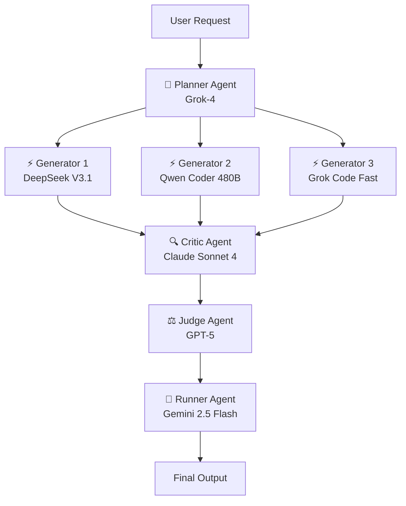
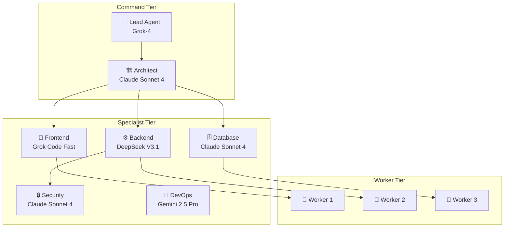
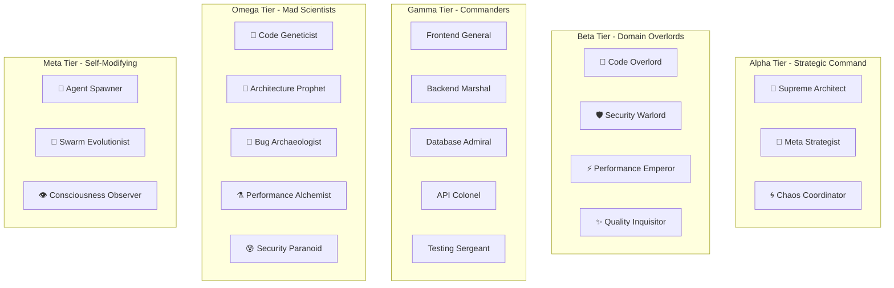
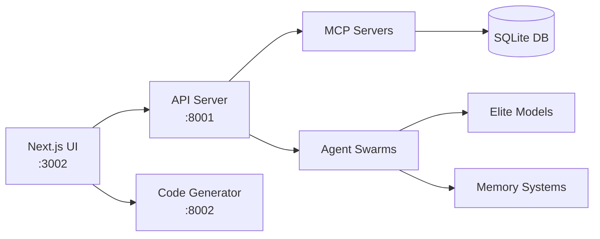

# 🏗️ Sophia Intel AI - Repository Architecture & System Design

## 📊 Complete Repository Structure

```
sophia-intel-ai/
│
├── 🎯 Core Application
│   ├── app/
│   │   ├── api/                    # API Servers & Endpoints
│   │   │   ├── unified_server.py   # Main production API server
│   │   │   ├── code_generator_server.py # Real code generation server
│   │   │   └── ultra_debug_server.py    # Debug & testing server
│   │   │
│   │   ├── agents/                 # AI Agent Implementations
│   │   │   ├── planner.py         # Strategic planning agent
│   │   │   ├── generators.py      # Code generation agents (3x parallel)
│   │   │   ├── critic.py          # Code review & critique agent
│   │   │   ├── judge.py           # Decision synthesis agent
│   │   │   ├── lead.py            # Team coordination agent
│   │   │   └── runner.py          # Gated execution agent
│   │   │
│   │   ├── memory/                 # Memory & Persistence Systems
│   │   │   ├── supermemory_mcp.py # MCP persistent memory
│   │   │   ├── enhanced_mcp_server.py # Connection pooling & retry
│   │   │   ├── dual_tier_embeddings.py # Tier-A/B embedding system
│   │   │   ├── graph_rag.py       # Knowledge graph system
│   │   │   └── hybrid_search.py   # BM25 + vector search
│   │   │
│   │   ├── tools/                  # Tool Implementations
│   │   │   ├── integrated_manager.py # Unified tool orchestration
│   │   │   ├── enhanced_tools.py  # Safety-validated tools
│   │   │   ├── code_search.py     # Smart code search
│   │   │   ├── git_ops.py         # Git operations
│   │   │   ├── repo_fs.py         # File system operations
│   │   │   ├── test_ops.py        # Test execution
│   │   │   └── lint_ops.py        # Linting & formatting
│   │   │
│   │   ├── evaluation/            # Quality Gates & Evaluation
│   │   │   ├── gates.py           # AccuracyEval, ReliabilityEval, SafetyEval
│   │   │   ├── json_validation.py # Pydantic V2 schemas
│   │   │   └── proposal.py        # Implementation proposals
│   │   │
│   │   ├── observability/         # Monitoring & Metrics
│   │   │   └── metrics_collector.py # Comprehensive observability
│   │   │
│   │   ├── swarms/                # Swarm Configurations
│   │   │   ├── coding_team.py     # 5-agent balanced team
│   │   │   ├── coding_swarm.py    # Advanced swarm (10+ agents)
│   │   │   └── coding_swarm_fast.py # Speed-optimized swarm
│   │   │
│   │   ├── portkey_config.py      # Gateway configuration
│   │   └── elite_portkey_config.py # Elite models only config
│   │
├── 🖥️ User Interface
│   ├── next-ui/                   # Next.js frontend
│   │   ├── src/
│   │   │   ├── app/               # App router pages
│   │   │   ├── components/        # React components
│   │   │   └── lib/              # Utilities & helpers
│   │   └── package.json
│   │
├── 🧪 Testing
│   ├── tests/                     # Unit & integration tests
│   ├── test_unified_system.py     # System integration test
│   ├── test_mcp_improvements.py   # MCP enhancement tests
│   └── test_code_generation.py    # Code generation tests
│
├── 📚 Documentation
│   ├── README.md                  # Project overview
│   ├── REPOSITORY_ARCHITECTURE.md # This file
│   ├── MCP_ROADMAP.md            # MCP improvement roadmap
│   └── docs/
│       ├── agents.md             # Agent documentation
│       ├── memory.md             # Memory systems
│       └── tools.md              # Tool documentation
│
├── 🚀 Deployment
│   ├── docker-compose.yml        # Multi-container setup
│   ├── Dockerfile                # Container configuration
│   ├── requirements.txt          # Python dependencies
│   └── .github/workflows/        # CI/CD pipelines
│
└── ⚙️ Configuration
    ├── .env.example              # Environment variables
    ├── .gitignore               # Git ignore rules
    └── pyproject.toml           # Python project config
```

---

## 🤖 AI Agent Swarm Designs

### 1️⃣ **Standard Coding Team** (5 Agents)
**Purpose:** Balanced team for general software development tasks



**Workflow:**
1. **Planner** analyzes task and creates strategic plan
2. **Generators** (3x parallel) implement different approaches
3. **Critic** reviews all implementations with 6-dimension analysis
4. **Judge** synthesizes best solution from proposals
5. **Runner** executes with safety gates

---

### 2️⃣ **Advanced Coding Swarm** (10+ Agents)
**Purpose:** Complex projects requiring specialized expertise



**Specializations:**
- **Frontend**: React, TypeScript, CSS, performance
- **Backend**: APIs, microservices, business logic
- **Database**: Schema design, optimization, migrations
- **Security**: OWASP, authentication, encryption
- **DevOps**: Docker, K8s, CI/CD, monitoring

---

### 3️⃣ **GENESIS Swarm** (30+ Agents)
**Purpose:** Ultimate autonomous software development system



**Features:**
- **Self-Evolution**: Agents evolve based on performance
- **Dynamic Spawning**: Creates specialized agents on-demand
- **Collective Intelligence**: Shared memory and learning
- **Emergence Detection**: Identifies emergent behaviors
- **Consciousness Simulation**: Meta-cognitive capabilities

---

## 🗄️ MCP (Model Context Protocol) Servers

### **1. Supermemory MCP Server**
**File:** `app/memory/supermemory_mcp.py`
**Purpose:** Persistent memory across all agents and sessions

**Features:**
- SQLite-based storage with FTS5 search
- Three memory types: Episodic, Semantic, Procedural
- Vector embeddings for similarity search
- Cross-session learning
- Memory consolidation

**Endpoints:**
```python
POST /memory/add      # Add memory entry
POST /memory/search   # Search memories
GET  /memory/stats    # Memory statistics
POST /memory/clear    # Clear memories
```

---

### **2. Enhanced MCP Server**
**File:** `app/memory/enhanced_mcp_server.py`
**Purpose:** Production-grade MCP with reliability improvements

**Features:**
- **Connection Pooling**: Prevents database exhaustion
- **Retry Logic**: Exponential backoff for failures
- **Health Checks**: Connection validation
- **Metrics Tracking**: Performance monitoring
- **Graceful Shutdown**: Clean connection closure

**Configuration:**
```python
MCPServerConfig(
    connection_pool_size=10,
    retry_attempts=3,
    connection_timeout=30.0,
    enable_metrics=True
)
```

---

### **3. Filesystem MCP Server**
**Purpose:** Safe file system operations with validation

**Features:**
- Path safety validation
- File size limits
- Extension filtering
- Backup creation
- Cache for reads

**Operations:**
- Read files with caching
- Write with automatic backup
- Directory listing with filters
- Safe deletion with confirmation

---

### **4. Git MCP Server**
**Purpose:** Version control operations

**Features:**
- Safe git operations
- Commit message generation
- Branch management
- Diff analysis
- History tracking

---

## 🧠 Memory Systems Architecture

### **Dual-Tier Embedding System**
**File:** `app/memory/dual_tier_embeddings.py`

```
Tier-A (768D) - High Priority
├── Long-term memories
├── Critical knowledge
└── Frequently accessed

Tier-B (1024D) - Standard
├── Short-term memories
├── Temporary data
└── Low-frequency access
```

### **Hybrid Search System**
**File:** `app/memory/hybrid_search.py`

```
Query → [BM25 Keyword Search] ──┐
                                 ├→ [Fusion] → [Re-ranking] → Results
Query → [Vector Similarity] ─────┘
```

### **GraphRAG System**
**File:** `app/memory/graph_rag.py`

```
Entities → [Knowledge Graph] → [Multi-hop Reasoning] → Insights
   ↓              ↓                      ↓
Relations    Communities          Path Finding
```

---

## 🚦 Evaluation Gates System

### **Three-Layer Quality Assurance**

1. **AccuracyEval Gate**
   - Syntax validation
   - Logic verification
   - Requirement matching
   - Edge case handling

2. **ReliabilityEval Gate**
   - Error handling check
   - Resource management
   - Concurrency safety
   - Performance validation

3. **SafetyEval Gate**
   - Security scanning
   - Input validation
   - Injection prevention
   - Data protection

---

## 🎯 Elite Model Configuration

### **Preferred Models Only**
```python
MODELS = {
    'planner': 'x-ai/grok-4',              # Strategic planning
    'generator': 'deepseek/deepseek-v3.1', # Code generation
    'critic': 'anthropic/claude-sonnet-4', # Code review
    'judge': 'openai/gpt-5',               # Decision making
    'runner': 'google/gemini-2.5-flash',   # Fast execution
    'architect': 'anthropic/claude-sonnet-4',
    'security': 'anthropic/claude-sonnet-4',
    'performance': 'deepseek/deepseek-v3.1',
    'consciousness': 'openai/gpt-5'
}
```

### **Temperature Optimization**
- Planner: 0.2 (structured)
- Generator: 0.7 (creative)
- Critic: 0.1 (consistent)
- Judge: 0.15 (reliable)
- Security: 0.0 (paranoid)

---

## 📊 Observability System

### **Metrics Collection**
- Tool execution times
- Success/failure rates
- Memory usage
- Agent performance
- Swarm consciousness level

### **Trace Collection**
- Execution traces
- Error tracking
- Performance profiling
- Bottleneck detection

### **Alert System**
- High error rates
- Memory exhaustion
- Slow execution
- Low success rates

---

## 🚀 API Endpoints

### **Main Server (Port 8001)**
```
GET  /healthz          # Health check
GET  /teams           # List available teams
POST /teams/run       # Execute team
GET  /workflows       # List workflows
POST /workflows/run   # Execute workflow
POST /memory/add      # Add to memory
POST /memory/search   # Search memory
GET  /stats          # System statistics
```

### **Code Generator (Port 8002)**
```
POST /teams/run       # Generate actual code
GET  /teams          # Available generation modes
```

---

## 🔄 Deployment Architecture



---

## 📈 Performance Optimizations

1. **Connection Pooling**: Reuse database connections
2. **Caching Strategy**: Aggressive caching for expensive models
3. **Parallel Execution**: Run generators concurrently
4. **Batch Processing**: Group similar operations
5. **Stream Responses**: Progressive output display

---

## 🔐 Security Features

1. **Path Validation**: Prevent directory traversal
2. **Input Sanitization**: Block injection attacks
3. **Rate Limiting**: Prevent abuse
4. **API Key Management**: Secure credential storage
5. **Audit Logging**: Track all operations

---

This architecture represents a **production-ready, enterprise-grade AI agent system** with:
- ✅ Multiple swarm configurations
- ✅ Persistent memory systems
- ✅ Real code generation
- ✅ Comprehensive observability
- ✅ Elite model optimization
- ✅ Safety and reliability gates