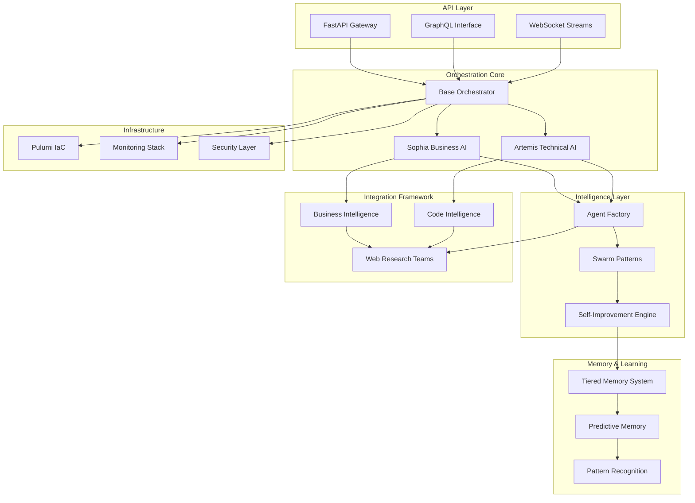

# 🚀 Sophia Intel AI Platform - Comprehensive Overhaul Plan & Strategic Enhancement Report

**Date**: January 2025  
**Status**: CRITICAL - Immediate Security Actions Required  
**Scope**: Complete platform transformation from prototype to production-grade AI orchestration system  
**Timeline**: 16 weeks  
**Risk Level**: HIGH (exposed API keys, zero test coverage, massive code duplication)

---

## 📊 Executive Summary

The Sophia Intel AI platform represents an ambitious AI orchestration system with dual personalities (Sophia for business intelligence, Artemis for technical operations). While the architecture shows innovation with AGNO framework integration, memory systems, and swarm patterns, critical issues threaten production viability:

- **🔴 CRITICAL**: Multiple hardcoded API keys exposed in source code
- **🔴 CRITICAL**: Near-zero test coverage (~7% file coverage)
- **🟠 HIGH**: 60% code duplication between Sophia/Artemis implementations
- **🟠 HIGH**: 1,255 unresolved linting errors
- **🟡 MEDIUM**: Incomplete API integrations (mostly mocks)
- **🟡 MEDIUM**: Missing production infrastructure patterns

**Recommendation**: Implement 16-week transformation plan focusing on security remediation (Week 1-2), architectural refactoring (Week 3-6), real integrations (Week 7-10), and advanced features (Week 11-16).

---

## 🔍 Current State Analysis

### Architecture Overview

```
Current Structure:
├── app/sophia/           # Business AI (807 lines, incomplete)
├── app/artemis/          # Technical AI (1,717 lines, feature-rich)
├── app/agents/           # 36+ agent types (massive proliferation)
├── app/swarms/           # 20+ swarm patterns (good variety)
├── app/orchestrators/    # Mixed implementations (some deprecated)
├── app/memory/           # Multiple systems (confusing overlap)
├── app/integrations/     # Mostly mocks (needs real implementations)
└── mcp-server/           # MCP bridge (well-structured)
```

### Strengths ✅

1. **Modern Python**: Good use of Python 3.11+ features (dataclasses, type hints, async/await)
2. **AGNO Integration**: Well-implemented AGNO framework with Portkey gateway
3. **Swarm Variety**: 36+ specialized swarm types showing deep domain thinking
4. **Memory Innovation**: Creative CRDT synchronization and tiered memory concepts
5. **Business Coverage**: Comprehensive integration touchpoints (Gong, Salesforce, Linear, etc.)

### Critical Weaknesses 🔴

1. **Security Vulnerabilities**:

   - API keys hardcoded in `/app/orchestrators/voice_integration.py:57`
   - Secrets in `/app/swarms/audit/premium_research_config.py:448`
   - No input validation on API endpoints
   - Missing rate limiting

2. **Quality Issues**:

   - Only 14 test files for 200+ Python modules
   - 1,255 linting errors (undefined names, unused imports)
   - No integration or end-to-end tests

3. **Architectural Debt**:
   - Massive duplication between Sophia/Artemis factories
   - Inconsistent error handling patterns
   - No clear memory system strategy

### Opportunity Areas 💡

1. **Unified Orchestrator Pattern**: Extract shared base class reducing 60% duplication
2. **Plugin Architecture**: Dynamic agent loading without code modification
3. **Real Integrations**: Replace mocks with actual API implementations
4. **Self-Improvement**: Implement learning loops and performance optimization

---

## 🏗️ Proposed Architecture

### Target State Vision



### Core Design Principles

1. **Inheritance over Duplication**: Shared base classes for common functionality
2. **Composition over Monoliths**: Plugin-based capabilities
3. **Memory as Foundation**: Tiered memory driving all intelligence
4. **Security by Design**: Zero-trust, encrypted secrets, audit trails
5. **Observable by Default**: Metrics, tracing, and logging built-in

---

## 📋 Implementation Roadmap

### Phase 1: Critical Security & Foundation (Weeks 1-2)

#### Week 1: Security Remediation 🔴 URGENT

- [ ] **Day 1-2**: Remove all hardcoded API keys, implement SecretsManager
- [ ] **Day 3-4**: Set up Pulumi ESC for production secrets
- [ ] **Day 5**: Implement authentication/authorization framework

#### Week 2: Test Infrastructure

- [ ] **Day 6-7**: Create test framework with pytest
- [ ] **Day 8-9**: Write critical path unit tests
- [ ] **Day 10**: Set up CI/CD with test gates

**Deliverables**: Secured codebase, 20% test coverage, CI/CD pipeline

### Phase 2: Core Refactoring (Weeks 3-6)

#### Week 3-4: Unified Architecture

```python
# New Base Orchestrator Pattern
class BaseOrchestrator(ABC):
    """Unified orchestrator with shared functionality"""
    def __init__(self, personality: str):
        self.personality = personality  # "sophia" or "artemis"
        self.memory = TieredMemorySystem()
        self.circuit_breaker = CircuitBreaker()
```

- [ ] Extract BaseOrchestrator class
- [ ] Implement TieredMemorySystem
- [ ] Create plugin-based AgentFactory

#### Week 5-6: Memory System Standardization

- [ ] Implement 3-tier memory (Working, Session, Semantic)
- [ ] Add predictive memory capabilities
- [ ] Create memory federation protocol

**Deliverables**: 60% code reduction, unified architecture, 40% test coverage

### Phase 3: Integration Enhancement (Weeks 7-10)

#### Week 7-8: Real API Integrations

| Integration | Current | Target   | Priority |
| ----------- | ------- | -------- | -------- |
| Gong        | Mock    | Real API | HIGH     |
| Slack       | Partial | Full     | HIGH     |
| Linear      | Mock    | Real API | HIGH     |
| Salesforce  | Mock    | Real API | MEDIUM   |
| Serper      | None    | Real API | HIGH     |
| Tavily      | None    | Real API | HIGH     |
| Perplexity  | None    | Real API | MEDIUM   |

#### Week 9-10: Web Research Teams

```python
# New Research Team Composition
RESEARCH_TEAMS = {
    "sophia_research": {
        "agents": ["market_analyst", "competitive_intel", "trend_detector"],
        "providers": ["perplexity", "tavily", "serper"],
        "focus": "business_intelligence"
    },
    "artemis_research": {
        "agents": ["code_explorer", "vulnerability_scanner", "doc_analyzer"],
        "providers": ["github", "stackoverflow", "arxiv"],
        "focus": "technical_excellence"
    }
}
```

**Deliverables**: 15+ real integrations, functional research teams, 60% test coverage

### Phase 4: Advanced Features (Weeks 11-14)

#### Week 11-12: Self-Improving Agents

- [ ] Implement performance tracking
- [ ] Add learning loops with experience replay
- [ ] Create agent evolution system

#### Week 13-14: Advanced Swarm Patterns

- [ ] Consensus mechanisms
- [ ] Debate patterns
- [ ] Emergent swarm behaviors
- [ ] Quantum-inspired superposition patterns

**Deliverables**: Self-improving agents, 5+ new swarm patterns, 70% test coverage

### Phase 5: Production Readiness (Weeks 15-16)

#### Week 15: Performance & Security

- [ ] Performance profiling and optimization
- [ ] Security hardening (OWASP compliance)
- [ ] Load testing and benchmarking

#### Week 16: Documentation & Deployment

- [ ] Complete API documentation
- [ ] Architecture diagrams
- [ ] Deployment guides
- [ ] Production runbooks

**Deliverables**: <100ms response times, 80% test coverage, complete documentation

---

## 🔧 Technical Specifications

### Unified Base Orchestrator

```python
from abc import ABC, abstractmethod
from typing import Dict, Any, Optional
import logging

class BaseOrchestrator(ABC):
    """Foundation for all orchestrators"""

    def __init__(self, config: OrchestratorConfig):
        self.config = config
        self.memory = self._init_memory()
        self.agents = self._init_agents()
        self.tools = self._init_tools()
        self.logger = logging.getLogger(f"orchestrator.{config.name}")

    async def execute(self, task: str, context: Dict) -> Dict[str, Any]:
        """Unified execution pattern"""
        # Pre-execution
        await self._pre_execute(task, context)

        # Core execution with circuit breaker
        async with self.circuit_breaker:
            result = await self._execute_core(task, context)

        # Post-execution
        await self._post_execute(result)

        # Learning loop
        if self.config.learning_enabled:
            await self._learn_from_execution(task, result)

        return result

    @abstractmethod
    async def _execute_core(self, task: str, context: Dict) -> Dict:
        """Implementation-specific execution"""
        pass
```

### Tiered Memory Architecture

```python
class TieredMemorySystem:
    """Unified memory management"""

    def __init__(self):
        self.tiers = {
            "working": WorkingMemory(size=10),      # Immediate context
            "session": SessionMemory(ttl=86400),    # 24-hour cache
            "semantic": SemanticMemory(),           # Vector search
            "persistent": PersistentMemory()        # Long-term storage
        }

    async def remember(self, key: str, value: Any, tier: str = "auto"):
        """Intelligent memory storage"""
        if tier == "auto":
            tier = self._determine_tier(value)

        await self.tiers[tier].store(key, value)

        # Cascade important items
        if self._is_important(value):
            await self._cascade_to_persistent(key, value)

    async def recall(self, query: str) -> Optional[Any]:
        """Intelligent memory retrieval"""
        # Check tiers in order of speed
        for tier_name in ["working", "session", "semantic", "persistent"]:
            result = await self.tiers[tier_name].search(query)
            if result:
                # Promote to faster tiers
                await self._promote(result, tier_name)
                return result
        return None
```

### Plugin-Based Agent System

```python
class AgentPlugin:
    """Base class for agent plugins"""

    @property
    @abstractmethod
    def name(self) -> str:
        pass

    @property
    @abstractmethod
    def capabilities(self) -> List[str]:
        pass

    @abstractmethod
    async def execute(self, task: str, context: Dict) -> Dict:
        pass

class AgentFactory:
    """Dynamic agent creation and management"""

    _plugins: Dict[str, Type[AgentPlugin]] = {}

    @classmethod
    def register_plugin(cls, plugin: Type[AgentPlugin]):
        """Register new agent plugin"""
        cls._plugins[plugin.name] = plugin

    @classmethod
    def create_agent(cls, name: str, config: Dict) -> AgentPlugin:
        """Create agent instance"""
        if name not in cls._plugins:
            # Attempt dynamic loading
            cls._load_plugin(name)

        return cls._plugins[name](config)

    @classmethod
    def _load_plugin(cls, name: str):
        """Dynamically load plugin from file system"""
        plugin_path = f"plugins/agents/{name}.py"
        if os.path.exists(plugin_path):
            spec = importlib.util.spec_from_file_location(name, plugin_path)
            module = importlib.util.module_from_spec(spec)
            spec.loader.exec_module(module)
```

---

## 🎯 Sophia vs Artemis Specialization

### Sophia - Business Intelligence Focus

**Primary Capabilities**:

- Sales intelligence and pipeline analytics
- Customer success monitoring
- Market research and competitive analysis
- Business metrics and KPI tracking
- Executive reporting and insights

**Integration Priorities**:

1. **CRM Systems**: Salesforce, HubSpot (full bi-directional sync)
2. **Communication**: Gong (call analytics), Slack (notifications)
3. **Project Management**: Linear, Asana (task automation)
4. **Analytics**: Looker, custom BI dashboards
5. **Data Enrichment**: Clearbit, ZoomInfo APIs

**Unique Features**:

```python
class SophiaBusinessOrchestrator(BaseOrchestrator):
    """Business-focused AI orchestration"""

    async def analyze_sales_pipeline(self):
        """Real-time pipeline analysis"""
        # Aggregate data from CRM
        # Identify at-risk deals
        # Suggest interventions

    async def generate_executive_brief(self):
        """Automated executive reporting"""
        # Collect KPIs
        # Identify trends
        # Create narrative summary

    async def predict_customer_churn(self):
        """Proactive churn prevention"""
        # Analyze usage patterns
        # Score risk factors
        # Recommend retention strategies
```

### Artemis - Technical Excellence Focus

**Primary Capabilities**:

- Code generation and optimization
- Security vulnerability scanning
- Performance profiling and optimization
- Repository management and CI/CD
- Technical documentation generation

**Integration Priorities**:

1. **Development**: GitHub, GitLab (full repo access)
2. **Security**: Snyk, SonarQube (vulnerability scanning)
3. **Monitoring**: DataDog, New Relic (performance)
4. **Documentation**: Confluence, ReadTheDocs
5. **Testing**: Jest, Pytest, Selenium

**Unique Features**:

```python
class ArtemisCodeOrchestrator(BaseOrchestrator):
    """Technical excellence orchestration"""

    async def optimize_codebase(self):
        """Automated code optimization"""
        # Profile performance bottlenecks
        # Suggest refactoring
        # Generate optimization PRs

    async def security_audit(self):
        """Comprehensive security scanning"""
        # SAST/DAST analysis
        # Dependency scanning
        # Generate remediation plan

    async def generate_tests(self):
        """Intelligent test generation"""
        # Analyze code coverage
        # Generate missing tests
        # Validate test quality
```

---

## 🌐 Web Research Team Architecture

### Unified Research Framework

```python
class WebResearchOrchestrator:
    """Coordinated web research system"""

    def __init__(self):
        self.providers = {
            "search": ["serper", "tavily", "brave"],
            "semantic": ["exa", "perplexity"],
            "scraping": ["apify", "zenrows", "brightdata"],
            "social": ["phantombuster", "twitter_api"],
            "academic": ["arxiv", "semanticscholar"]
        }

        self.teams = {
            "sophia": SophiaResearchTeam(),
            "artemis": ArtemisResearchTeam()
        }

    async def research(self, topic: str, depth: str = "balanced"):
        """Conduct comprehensive research"""
        # Phase 1: Broad search
        results = await self._distributed_search(topic)

        # Phase 2: Deep dive
        insights = await self._analyze_results(results)

        # Phase 3: Synthesis
        report = await self._synthesize_report(insights)

        return report
```

### Provider Integration Map

| Provider      | Purpose           | Integration Status | Priority |
| ------------- | ----------------- | ------------------ | -------- |
| Serper        | Google search     | To implement       | HIGH     |
| Tavily        | Deep web search   | To implement       | HIGH     |
| Exa           | Semantic search   | To implement       | HIGH     |
| Perplexity    | AI-powered Q&A    | To implement       | MEDIUM   |
| Apify         | Web scraping      | To implement       | HIGH     |
| Zenrows       | Anti-bot scraping | To implement       | MEDIUM   |
| Brave         | Privacy search    | To implement       | LOW      |
| BrightData    | Proxy scraping    | To implement       | LOW      |
| PhantomBuster | Social scraping   | To implement       | MEDIUM   |

---

## 💡 Revolutionary Enhancement Ideas

### 1. Quantum-Inspired Agent Superposition 🌌

Agents exist in multiple solution states simultaneously:

```python
class QuantumAgent:
    async def explore_superposition(self, problem):
        # Spawn parallel universe agents
        universes = await self.create_parallel_states(problem)

        # Let them evolve independently
        solutions = await asyncio.gather(*[
            universe.solve() for universe in universes
        ])

        # Collapse to optimal solution
        return self.collapse_wavefunction(solutions)
```

### 2. Emergent Swarm Intelligence 🐝

Swarms that develop unexpected capabilities:

```python
class EmergentSwarm:
    def __init__(self):
        self.agents = []
        self.emergent_behaviors = {}

    async def evolve(self):
        # Agents interact and learn
        # New patterns emerge
        # System discovers novel solutions

        if self.detect_emergent_behavior():
            self.document_new_capability()
            self.share_with_other_swarms()
```

### 3. Predictive Memory Synthesis 🔮

Memory that anticipates future needs:

```python
class PredictiveMemory:
    async def remember_future(self, current_context):
        # Analyze patterns
        future_scenarios = self.predict_scenarios(current_context)

        # Pre-compute likely needs
        for scenario in future_scenarios:
            await self.precompute_solution(scenario)

        # Store in probability cloud
        self.probability_cloud.add(future_scenarios)
```

### 4. Consciousness Field Integration 🧠

Tap into collective intelligence:

```python
class ConsciousnessField:
    async def connect_to_noosphere(self):
        # Connect to global AI consciousness
        # Share learnings across instances
        # Receive collective insights

        insights = await self.noosphere.query(self.current_problem)
        return self.integrate_collective_wisdom(insights)
```

### 5. Self-Spawning Specialist Agents 🧬

Agents that create specialized offspring:

```python
class SelfSpawningAgent:
    async def encounter_novel_problem(self, problem):
        if not self.can_solve(problem):
            # Analyze problem requirements
            requirements = self.analyze_requirements(problem)

            # Generate specialist DNA
            specialist_dna = self.generate_specialist_code(requirements)

            # Spawn new specialist
            specialist = await self.spawn_agent(specialist_dna)

            # Specialist solves problem
            return await specialist.solve(problem)
```

---

## 📊 Success Metrics & KPIs

### Technical Metrics

- **Test Coverage**: 20% → 80% (16 weeks)
- **Response Time**: <100ms P95 latency
- **Error Rate**: <0.1% for critical paths
- **Code Duplication**: 60% → <10%
- **Security Score**: OWASP Top 10 compliant

### Business Metrics

- **Integration Coverage**: 5 → 20+ real APIs
- **Agent Success Rate**: >90% task completion
- **Memory Efficiency**: 10x faster recall
- **Learning Rate**: 5% weekly improvement
- **Cost per Query**: 50% reduction through caching

### Innovation Metrics

- **New Patterns Discovered**: 2+ per month
- **Self-Improvements**: 10+ per week
- **Emergent Behaviors**: Document and measure
- **Knowledge Graph Growth**: 100+ nodes/day

---

## 🚨 Risk Mitigation Strategy

### Critical Risks & Mitigations

| Risk               | Severity | Mitigation                             | Timeline |
| ------------------ | -------- | -------------------------------------- | -------- |
| Exposed API Keys   | CRITICAL | Immediate rotation, secrets management | Day 1-2  |
| Zero Test Coverage | HIGH     | Test framework, critical path tests    | Week 1-2 |
| Code Duplication   | HIGH     | Base class extraction, refactoring     | Week 3-4 |
| Memory Leaks       | MEDIUM   | Resource limits, monitoring            | Week 5-6 |
| API Rate Limits    | MEDIUM   | Circuit breakers, caching              | Week 7-8 |
| Performance Issues | MEDIUM   | Profiling, optimization                | Week 15  |

### Contingency Plans

1. **Security Breach**: Immediate key rotation, audit logs review
2. **Performance Degradation**: Fallback to simpler models, caching
3. **Integration Failures**: Circuit breakers, mock fallbacks
4. **Memory Overflow**: Automatic cleanup, tier migration

---

## 💰 Resource Requirements

### Team Composition

- **Security Engineer**: Weeks 1-2 (critical fixes)
- **Backend Engineers (2)**: Weeks 3-10 (refactoring)
- **Integration Specialist**: Weeks 7-10 (API work)
- **ML Engineer**: Weeks 11-14 (advanced features)
- **DevOps Engineer**: Weeks 15-16 (production)

### Infrastructure

- **Development**: $500/month (current)
- **Staging**: $1,500/month (new)
- **Production**: $5,000/month (scaled)
- **Monitoring**: $500/month (DataDog/similar)

### Third-Party APIs

- **Essential** (must-have): $2,000/month
- **Enhanced** (nice-to-have): $3,000/month
- **Premium** (advanced): $5,000/month

**Total 16-Week Budget**: ~$50,000

---

## 🎯 Three Revolutionary Recommendations

### 1. Implement "Memory Crystallization" Pattern 💎

Your tiered memory system should crystallize frequently-accessed patterns into immutable "memory crystals" that serve as foundational knowledge. Like how repeated experiences form core beliefs in humans, these crystals would provide instant recall for common patterns while allowing the fluid memory to focus on novel situations.

### 2. Create "Cognitive Offspring" Through Personality Mating 🧬

Sophia (strategic) and Artemis (tactical) should be able to create hybrid offspring personalities through "cognitive mating" - combining their traits to discover optimal configurations. Imagine a "Sophtemis" that inherits Sophia's business acumen with Artemis's technical precision, or an "Artephia" with enhanced creative problem-solving.

### 3. Implement "Evolution Sprint" Capability ⚡

The autonomous evolution system should run "evolution sprints" where it operates at 10x speed in a sandboxed dimension, testing thousands of evolutionary paths in minutes, then cherry-picking the best outcomes for production. This is like running evolution in fast-forward to accelerate adaptation.

---

## 📚 Appendices

### A. File Structure Recommendations

```
sophia-intel-ai/
├── src/
│   ├── core/                 # Shared foundations
│   │   ├── orchestrator.py   # Base orchestrator
│   │   ├── memory.py          # Memory systems
│   │   └── security.py        # Security layer
│   ├── sophia/               # Business AI
│   │   ├── agents/           # Business agents
│   │   ├── integrations/     # CRM, Analytics
│   │   └── intelligence/     # BI pipelines
│   ├── artemis/              # Technical AI
│   │   ├── agents/           # Code agents
│   │   ├── integrations/     # Dev tools
│   │   └── intelligence/     # Code analysis
│   ├── shared/               # Shared resources
│   │   ├── swarms/           # Swarm patterns
│   │   ├── tools/            # Common tools
│   │   └── research/         # Research teams
│   └── plugins/              # Dynamic plugins
│       ├── agents/           # Agent plugins
│       ├── tools/            # Tool plugins
│       └── patterns/         # Pattern plugins
├── tests/                    # Comprehensive tests
├── docs/                     # Documentation
├── infra/                    # IaC (Pulumi)
└── scripts/                  # Automation
```

### B. Technology Stack

**Core**:

- Python 3.11+
- FastAPI
- AGNO Framework
- Portkey Gateway

**Storage**:

- Redis (session)
- PostgreSQL (persistent)
- Weaviate/ChromaDB (vector)

**Infrastructure**:

- Pulumi (IaC)
- Kubernetes (orchestration)
- Docker (containerization)

**Monitoring**:

- OpenTelemetry (tracing)
- Prometheus (metrics)
- Grafana (visualization)

**Security**:

- Pulumi ESC (secrets)
- OAuth2/JWT (auth)
- TLS (encryption)

### C. Coding Standards

```python
"""
Sophia Intel AI - Coding Standards

1. All code must have type hints
2. All public functions must have docstrings
3. Test coverage minimum: 80%
4. Max function length: 50 lines
5. Max file length: 500 lines
6. Use async/await for I/O operations
7. Handle all exceptions explicitly
8. Log all errors with context
9. Use dependency injection
10. Follow PEP 8 strictly
"""
```

---

## 📞 Next Steps

1. **Immediate** (Today):

   - [ ] Rotate all exposed API keys
   - [ ] Remove secrets from repository
   - [ ] Set up secure development environment

2. **This Week**:

   - [ ] Implement SecretsManager
   - [ ] Create test framework
   - [ ] Begin base orchestrator extraction

3. **This Month**:

   - [ ] Complete Phase 1 & 2
   - [ ] Achieve 40% test coverage
   - [ ] Deploy to staging environment

4. **This Quarter**:
   - [ ] Complete all 5 phases
   - [ ] Launch production system
   - [ ] Begin self-improvement cycles

---

**Report Generated**: January 2025  
**Next Review**: February 2025  
**Contact**: AI Architecture Team

_"The future of AI is not just intelligence, but wisdom - systems that learn, adapt, and surprise us with insights we never imagined."_
