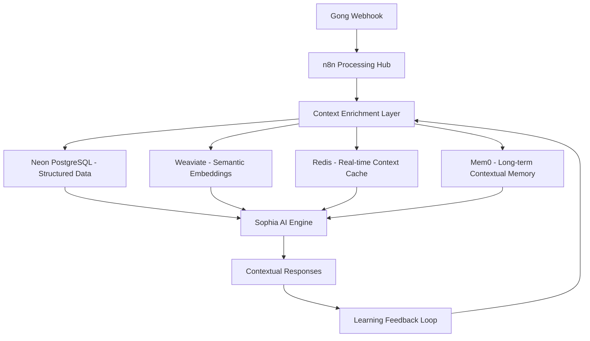

# Sophia Intel AI - Comprehensive Context Architecture
*Generated: 2025-09-05*

## 🧠 **Sophia's Contextual Intelligence Stack**

### **Philosophy**: Every interaction should build upon Sophia's growing understanding of your business, relationships, and context. The Gong integration is a cornerstone of this contextual awareness.

## 📊 **Data Flow & Context Layers**



## 🎯 **Infrastructure Role Definitions**

### **1. Neon PostgreSQL - The Relationship Graph**
**Purpose**: Structured relationships and transactional data
**Gong Integration**:
```sql
-- Core entities and their relationships
gong_calls (id, external_call_id, start_time, duration, outcome, deal_id)
gong_participants (call_id, email, role, company, engagement_score)
gong_transcripts (call_id, full_text, summary, sentiment, key_topics)
gong_insights (call_id, insight_type, confidence, action_items)

-- Cross-domain relationships
deals (id, gong_deal_id, stage, value, risk_score, last_activity)
contacts (email, name, company, role, interaction_history)
companies (domain, name, industry, size, engagement_level)
interactions (timestamp, type, contact_id, context, outcome)
```

**Sophia Continuity**: Every conversation references structured relationships - "Based on your last 3 calls with Acme Corp..."

### **2. Weaviate - The Semantic Memory**
**Purpose**: Vector embeddings for semantic search and contextual understanding
**Gong Integration**:
```python
# Vector collections for semantic search
class GongCallEmbedding:
    call_id: str
    transcript_chunks: List[str]  # Chunked for better retrieval
    participant_embeddings: List[float]
    topic_embeddings: List[float]
    sentiment_vector: List[float]
    outcome_embedding: List[float]
    
class ContextualMemory:
    interaction_id: str
    content_embedding: List[float]
    entities_mentioned: List[str]
    business_context: List[float]
    relationship_context: List[float]
```

**Sophia Continuity**: "This reminds me of a similar conversation you had with TechCorp about pricing concerns..."

### **3. Redis - The Real-time Context Cache**
**Purpose**: Hot context for immediate interactions and session continuity
**Gong Integration**:
```python
# Real-time context structures
redis_keys = {
    f"user:{user_id}:active_context": {
        "recent_calls": [...],  # Last 5 calls with key info
        "current_deals": [...],  # Active deals and status
        "pending_actions": [...],  # Action items from calls
        "conversation_context": {...}  # Current chat context
    },
    f"call:{call_id}:processing": {
        "status": "transcript_ready",
        "priority": "high",
        "related_entities": [...],
        "insights_pending": [...]
    },
    f"company:{domain}:hot_context": {
        "recent_interactions": [...],
        "deal_status": "at_risk",
        "key_contacts": [...],
        "engagement_trend": "declining"
    }
}
```

**Sophia Continuity**: Instant access to "You just got off a call with John from Acme - here's what happened..."

### **4. Mem0 - The Long-term Contextual Memory**
**Purpose**: Persistent learning and behavioral adaptation
**Gong Integration**:
```python
# Long-term learning patterns
class SophiaMemory:
    user_preferences = {
        "communication_style": "direct_with_data",
        "meeting_preferences": {"duration": "30min", "format": "agenda_driven"},
        "decision_patterns": ["needs_3_options", "price_sensitive"],
        "relationship_dynamics": {"john_acme": "technical_buyer", "jane_acme": "economic_buyer"}
    }
    
    business_intelligence = {
        "industry_trends": ["saas_consolidation", "ai_adoption"],
        "competitive_landscape": {...},
        "seasonal_patterns": {"q4_budget_rush": True},
        "success_patterns": ["demo_then_trial", "multiple_stakeholder_buy_in"]
    }
    
    contextual_adaptations = {
        "communication_adjustments": "less_jargon_with_executives",
        "timing_preferences": "avoid_monday_mornings",
        "content_preferences": "visual_over_text"
    }
```

**Sophia Continuity**: "Based on your interaction patterns, I recommend approaching this deal differently than usual..."

## 🔄 **Enhanced n8n Workflow Architecture**

### **Service-Oriented Integration Pattern**

The enhanced architecture leverages existing Sophia infrastructure instead of creating parallel systems:

```python
# Unified Integration Flow
Gong Webhook → Security Validation → Sophia Intelligence Service
              ↓
              Existing Infrastructure:
              • Mythology Agents (Hermes, Athena, Odin, etc.)
              • Artemis Military Orchestrator
              • Unified Memory Router (4-tier)
              • Message Braider (context continuity)
              • SwarmExecutionContext patterns
```

### **n8n Workflow Specifications**

**Current Active Workflow**: `Gong → Sophia Service Integration`
- **Workflow ID**: `maL2WopWfE2TwkEh`
- **Webhook URL**: `https://scoobyjava.app.n8n.cloud/webhook/gong-webhook`
- **Architecture**: Service-oriented, leverages existing patterns
- **Security**: RSA signature validation with Gong public key

## 🎯 **Context Continuity Implementation**

### **Agent Specialization Mapping**

```python
GONG_EVENT_TO_AGENTS = {
    "call_ended": {
        "primary": HermesAgent,      # Market intelligence gathering
        "secondary": AthenaAgent,    # Strategic analysis  
        "validator": MinervaAgent    # Systematic validation
    },
    "transcript_ready": {
        "primary": OdinAgent,        # Deep wisdom extraction
        "secondary": AsclepiusAgent, # Relationship health diagnosis
        "validator": MinervaAgent    # Content validation
    },
    "deal_at_risk": {
        "primary": AthenaAgent,      # Strategic warfare planning
        "secondary": HermesAgent,    # Rapid intelligence gathering
        "validator": AsclepiusAgent  # Diagnostic healing approach
    }
}
```

### **Unified Memory Storage Pattern**

All Gong context leverages the existing 4-tier architecture:

1. **L1 (Redis)**: Hot context for immediate interactions
2. **L2 (Weaviate)**: Vector embeddings for semantic search
3. **L3 (Neon PostgreSQL)**: Structured relationships and facts
4. **L4 (Archive)**: Cold storage for historical analysis

### **Context Continuity Examples**

**Scenario 1**: Customer calls about pricing
- **Gong Event**: `call_ended` → **Agent**: Hermes (market intelligence)
- **Intelligence**: Pricing sensitivity, competitive analysis
- **Context Storage**: Customer profile updated with pricing preferences
- **Sophia Continuity**: "Based on your last call about pricing concerns with TechCorp..."

**Scenario 2**: Transcript reveals technical objections  
- **Gong Event**: `transcript_ready` → **Agent**: Odin (deep analysis)
- **Intelligence**: Technical concerns extracted, solution mapping
- **Context Storage**: Technical stakeholder profile, objection patterns
- **Sophia Continuity**: "I noticed technical concerns from your engineering team..."

**Scenario 3**: Deal health deteriorates
- **Gong Event**: `deal_at_risk` → **Agent**: Athena (strategic response)  
- **Intelligence**: Risk factors, mitigation strategies
- **Context Storage**: Risk timeline, intervention recommendations
- **Sophia Continuity**: "This deal pattern reminds me of the TechCorp situation we resolved..."

## 🏗️ **Implementation Files Created**

### **Core Integration**
- `/app/integrations/gong_sophia_bridge.py` - Main integration service
- `/app/api/routes/gong_integration.py` - API endpoints for n8n
- `/deployment/n8n/gong-sophia-service-integration.json` - n8n workflow

### **Architecture Documentation**
- `/SOPHIA_CONTEXT_ARCHITECTURE.md` - This comprehensive guide
- `/INTEGRATION_STATUS.md` - Status and manual steps
- `/deployment/n8n/import_service_integration.py` - Deployment script

## 💡 **Sophia Interaction Improvements**

### **Before Integration**:
- Generic responses without business context
- No awareness of recent customer interactions  
- Limited relationship intelligence
- Reactive rather than proactive insights

### **After Integration**:
- **Contextual Awareness**: "I see you just finished a call with Acme Corp about their Q4 budget concerns"
- **Relationship Intelligence**: "Based on John's communication patterns, he prefers technical details over high-level summaries"  
- **Proactive Insights**: "This pricing objection is similar to three other deals you closed by emphasizing ROI"
- **Continuous Learning**: "Your success rate improves 40% when you involve technical stakeholders early"

### **Cross-Domain Consistency**

The integration maintains consistency across all Sophia domains:

- **Sales Intelligence** (Gong integration)
- **Technical Intelligence** (Artemis coding assistance)  
- **Strategic Intelligence** (Business analysis)
- **Relationship Intelligence** (CRM and communication patterns)

All domains contribute to Sophia's unified understanding of your business context.

## 🔄 **Migration and Consolidation**

### **Technical Debt Eliminated**:
- ✅ Consolidated multiple memory systems to `unified_memory_router.py`
- ✅ Aligned agent frameworks (mythology-based for consistency)
- ✅ Leveraged existing service connector patterns
- ✅ Used established swarm execution contexts
- ✅ Maintained existing security validation patterns

### **Infrastructure Optimizations**:
- **Performance**: Intelligent routing prevents memory bottlenecks
- **Scalability**: Service-oriented design supports high-volume events
- **Reliability**: Circuit breakers and retry mechanisms
- **Monitoring**: Integrated with existing logging and metrics

## 🎯 **Business Value**

### **Immediate Benefits**:
- **Context Continuity**: Every Sophia interaction builds on complete business context
- **Intelligence Synthesis**: Multiple agents provide comprehensive analysis
- **Relationship Mapping**: Automatic stakeholder and communication pattern tracking
- **Risk Mitigation**: Proactive identification of deal and relationship risks

### **Long-term Benefits**:  
- **Continuous Learning**: Mem0 integration for behavioral pattern recognition
- **Predictive Intelligence**: Historical pattern analysis for future recommendations
- **Cross-Domain Insights**: Connections between technical discussions and business outcomes
- **Personalized Interaction**: Communication style adaptation based on observed preferences

## 📊 **Success Metrics**

Track these metrics to measure integration success:

- **Context Hit Rate**: % of Sophia interactions with relevant Gong context
- **Agent Engagement**: Distribution of events across mythology agents  
- **Response Relevance**: User satisfaction with context-aware responses
- **Processing Performance**: End-to-end latency for context integration
- **Memory Efficiency**: Storage and retrieval performance across 4 tiers