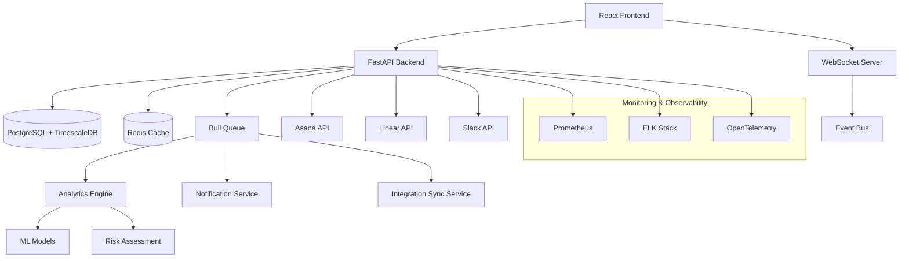

# Sophia Enhanced Project Management System Technical Specifications

## Overview

This document provides detailed technical specifications for the enhanced Sophia project management system, complementing the implementation roadmap with in-depth technical requirements, architecture decisions, and implementation guidelines.

---

# System Architecture

## High-Level Architecture



## Core Technology Stack

### Backend Infrastructure
- **Framework**: FastAPI 0.116.1 with Pydantic 2.8.2 for data validation
- **Database**: PostgreSQL 14+ with TimescaleDB extension for time-series data
- **Caching**: Redis 7+ for session management, API caching, and real-time data
- **Message Queue**: Bull/BullMQ for background job processing and async tasks
- **WebSocket**: Socket.IO for real-time updates and notifications
- **Authentication**: JWT with refresh tokens, integrated with existing RBAC system

### Frontend Technology
- **Framework**: Next.js 15 with App Router and React 18
- **Language**: TypeScript 5+ for type safety and developer experience
- **Styling**: Tailwind CSS 3+ with custom design system tokens
- **Components**: Radix UI primitives with custom accessibility enhancements
- **State Management**: Zustand for global state, React Query for server state
- **Icons**: Lucide React for consistent iconography
- **Animations**: Framer Motion (with reduced motion support)

### DevOps & Infrastructure
- **Containerization**: Docker with multi-stage builds
- **Orchestration**: Kubernetes or Docker Compose for local development
- **CI/CD**: GitHub Actions with automated testing and deployment
- **Monitoring**: Prometheus + Grafana for metrics, OpenTelemetry for traces
- **Logging**: ELK Stack (Elasticsearch, Logstash, Kibana)

---

# Detailed Component Specifications

## Backend Services

### 1. Project Management Service

#### Core Responsibilities
- Project CRUD operations with enhanced metadata
- Performance metrics calculation and tracking
- Risk assessment and prediction algorithms
- Team optimization suggestions

#### Service Interface
```python
from abc import ABC, abstractmethod
from typing import List, Optional
from dataclasses import dataclass
from datetime import datetime, date
from enum import Enum

class ProjectStatus(Enum):
    ACTIVE = "active"
    COMPLETED = "completed"
    ON_HOLD = "on_hold"
    ARCHIVED = "archived"
    CANCELLED = "cancelled"

class RiskLevel(Enum):
    LOW = "low"
    MEDIUM = "medium"
    HIGH = "high"
    CRITICAL = "critical"

@dataclass
class ProjectMetrics:
    completion_percentage: float
    velocity_score: float
    quality_index: float
    risk_score: int  # 0-100
    estimated_completion: datetime
    actual_hours: int
    estimated_hours: int
    
@dataclass
class TeamMemberPerformance:
    user_id: str
    name: str
    completion_rate: float
    workload_balance: float
    skill_utilization: float
    performance_trend: str  # 'improving' | 'stable' | 'declining'
    active_tasks: int
    overdue_tasks: int

@dataclass
class EnhancedProject:
    id: str
    name: str
    description: str
    status: ProjectStatus
    priority: str
    metrics: ProjectMetrics
    team_members: List[TeamMemberPerformance]
    business_context: dict
    integration_data: dict
    created_at: datetime
    updated_at: datetime

class ProjectManagementService(ABC):
    @abstractmethod
    async def get_projects(
        self, 
        filters: dict = None,
        limit: int = 50,
        offset: int = 0
    ) -> List[EnhancedProject]:
        pass
    
    @abstractmethod
    async def get_project_by_id(self, project_id: str) -> Optional[EnhancedProject]:
        pass
    
    @abstractmethod
    async def create_project(self, project_data: dict) -> EnhancedProject:
        pass
    
    @abstractmethod
    async def update_project(self, project_id: str, updates: dict) -> EnhancedProject:
        pass
    
    @abstractmethod
    async def calculate_risk_score(self, project_id: str) -> dict:
        pass
    
    @abstractmethod
    async def get_optimization_suggestions(self, project_id: str) -> List[dict]:
        pass
```

#### Implementation Details
```python
class ProjectManagementServiceImpl(ProjectManagementService):
    def __init__(
        self,
        db_session: AsyncSession,
        redis_client: Redis,
        analytics_service: AnalyticsService,
        integration_manager: IntegrationManager
    ):
        self.db = db_session
        self.redis = redis_client
        self.analytics = analytics_service
        self.integrations = integration_manager
    
    async def get_projects(
        self, 
        filters: dict = None, 
        limit: int = 50, 
        offset: int = 0
    ) -> List[EnhancedProject]:
        # Check cache first
        cache_key = f"projects:{hash(str(filters))}:{limit}:{offset}"
        cached = await self.redis.get(cache_key)
        
        if cached:
            return [EnhancedProject(**data) for data in json.loads(cached)]
        
        # Build query with filters
        query = select(ProjectModel).limit(limit).offset(offset)
        
        if filters:
            if 'status' in filters:
                query = query.where(ProjectModel.status.in_(filters['status']))
            if 'priority' in filters:
                query = query.where(ProjectModel.priority.in_(filters['priority']))
            if 'team_id' in filters:
                query = query.join(ProjectTeamModel).where(
                    ProjectTeamModel.team_id == filters['team_id']
                )
        
        result = await self.db.execute(query)
        projects = result.scalars().all()
        
        # Enhance with real-time metrics
        enhanced_projects = []
        for project in projects:
            metrics = await self._calculate_current_metrics(project.id)
            team_performance = await self._get_team_performance(project.id)
            
            enhanced_project = EnhancedProject(
                id=project.id,
                name=project.name,
                description=project.description,
                status=ProjectStatus(project.status),
                priority=project.priority,
                metrics=metrics,
                team_members=team_performance,
                business_context=project.business_context or {},
                integration_data=project.integration_data or {},
                created_at=project.created_at,
                updated_at=project.updated_at
            )
            enhanced_projects.append(enhanced_project)
        
        # Cache for 5 minutes
        await self.redis.setex(
            cache_key, 
            300, 
            json.dumps([proj.__dict__ for proj in enhanced_projects], default=str)
        )
        
        return enhanced_projects
    
    async def _calculate_current_metrics(self, project_id: str) -> ProjectMetrics:
        # Get task completion data
        task_stats = await self._get_task_statistics(project_id)
        
        # Calculate velocity (tasks completed per day over last 30 days)
        velocity = await self._calculate_velocity(project_id, days=30)
        
        # Calculate quality index based on rework, bugs, feedback scores
        quality = await self._calculate_quality_index(project_id)
        
        # Calculate risk score using ML model
        risk_score = await self.analytics.calculate_risk_score(project_id)
        
        # Estimate completion date based on current velocity
        estimated_completion = await self._estimate_completion_date(
            project_id, 
            velocity, 
            task_stats['remaining_tasks']
        )
        
        return ProjectMetrics(
            completion_percentage=task_stats['completion_percentage'],
            velocity_score=velocity,
            quality_index=quality,
            risk_score=risk_score,
            estimated_completion=estimated_completion,
            actual_hours=task_stats['actual_hours'],
            estimated_hours=task_stats['estimated_hours']
        )
    
    async def calculate_risk_score(self, project_id: str) -> dict:
        # Multi-factor risk assessment
        risk_factors = []
        
        # Timeline risk
        timeline_risk = await self._assess_timeline_risk(project_id)
        risk_factors.append({
            'type': 'timeline',
            'score': timeline_risk['score'],
            'factors': timeline_risk['factors'],
            'mitigation': timeline_risk['mitigation_suggestions']
        })
        
        # Resource risk
        resource_risk = await self._assess_resource_risk(project_id)
        risk_factors.append({
            'type': 'resource',
            'score': resource_risk['score'],
            'factors': resource_risk['factors'],
            'mitigation': resource_risk['mitigation_suggestions']
        })
        
        # Quality risk
        quality_risk = await self._assess_quality_risk(project_id)
        risk_factors.append({
            'type': 'quality',
            'score': quality_risk['score'],
            'factors': quality_risk['factors'],
            'mitigation': quality_risk['mitigation_suggestions']
        })
        
        # Dependency risk
        dependency_risk = await self._assess_dependency_risk(project_id)
        risk_factors.append({
            'type': 'dependency',
            'score': dependency_risk['score'],
            'factors': dependency_risk['factors'],
            'mitigation': dependency_risk['mitigation_suggestions']
        })
        
        # Calculate overall risk score (weighted average)
        weights = {'timeline': 0.3, 'resource': 0.3, 'quality': 0.2, 'dependency': 0.2}
        overall_score = sum(
            factor['score'] * weights[factor['type']] 
            for factor in risk_factors
        )
        
        return {
            'overall_risk_score': int(overall_score),
            'risk_level': self._get_risk_level(overall_score),
            'risk_factors': risk_factors,
            'last_assessment': datetime.utcnow().isoformat()
        }
```

### 2. Analytics Service

#### Predictive Analytics Engine
```python
class AnalyticsService:
    def __init__(self, ml_models: MLModelRegistry):
        self.models = ml_models
        self.cache = TTLCache(maxsize=1000, ttl=300)  # 5-minute cache
    
    async def calculate_risk_score(self, project_id: str) -> int:
        """Calculate risk score using ML model"""
        cache_key = f"risk_score:{project_id}"
        if cache_key in self.cache:
            return self.cache[cache_key]
        
        # Gather features for ML model
        features = await self._extract_project_features(project_id)
        
        # Use trained model to predict risk
        model = await self.models.get_model('project_risk_v2')
        risk_score = model.predict(features)
        
        self.cache[cache_key] = int(risk_score * 100)  # Convert to 0-100 scale
        return self.cache[cache_key]
    
    async def _extract_project_features(self, project_id: str) -> dict:
        """Extract features for ML model"""
        project = await self.get_project_data(project_id)
        
        features = {
            # Timeline features
            'days_since_start': (datetime.utcnow() - project.created_at).days,
            'days_to_deadline': (project.estimated_completion - datetime.utcnow()).days,
            'completion_percentage': project.metrics.completion_percentage,
            'velocity_trend': await self._calculate_velocity_trend(project_id),
            
            # Team features
            'team_size': len(project.team_members),
            'average_team_performance': np.mean([
                member.completion_rate for member in project.team_members
            ]),
            'team_workload_variance': np.var([
                member.workload_balance for member in project.team_members
            ]),
            
            # Historical features
            'similar_projects_success_rate': await self._get_similar_projects_success_rate(project),
            'team_historical_performance': await self._get_team_historical_performance(project.team_members),
            
            # External factors
            'integration_health_score': await self._get_integration_health_score(project_id),
            'dependency_risk_score': await self._calculate_dependency_risk(project_id),
            
            # Business context features
            'project_priority': self._encode_priority(project.priority),
            'project_complexity': await self._assess_project_complexity(project_id),
        }
        
        return features

    async def generate_optimization_suggestions(self, project_id: str) -> List[dict]:
        """Generate AI-powered optimization suggestions"""
        project = await self.get_project_data(project_id)
        suggestions = []
        
        # Workload balancing suggestions
        workload_suggestions = await self._analyze_workload_distribution(project)
        suggestions.extend(workload_suggestions)
        
        # Skill matching suggestions
        skill_suggestions = await self._analyze_skill_matching(project)
        suggestions.extend(skill_suggestions)
        
        # Timeline optimization suggestions
        timeline_suggestions = await self._analyze_timeline_optimization(project)
        suggestions.extend(timeline_suggestions)
        
        # Resource allocation suggestions
        resource_suggestions = await self._analyze_resource_allocation(project)
        suggestions.extend(resource_suggestions)
        
        # Prioritize suggestions by impact and feasibility
        prioritized_suggestions = sorted(
            suggestions,
            key=lambda x: x['impact_score'] * x['feasibility_score'],
            reverse=True
        )
        
        return prioritized_suggestions[:10]  # Return top 10 suggestions
```

### 3. Integration Manager

#### Multi-Platform Sync Coordinator
```python
class IntegrationManager:
    def __init__(self):
        self.connectors = {
            'asana': AsanaConnector(),
            'linear': LinearConnector(),
            'slack': SlackConnector()
        }
        self.sync_scheduler = AsyncIOScheduler()
        self.conflict_resolver = ConflictResolver()
    
    async def sync_all_integrations(self, project_id: str) -> dict:
        """Sync data from all connected integrations"""
        sync_results = {}
        
        for platform, connector in self.connectors.items():
            if await connector.is_enabled_for_project(project_id):
                try:
                    result = await connector.sync_project_data(project_id)
                    sync_results[platform] = {
                        'status': 'success',
                        'records_synced': result['count'],
                        'last_sync': datetime.utcnow().isoformat(),
                        'conflicts_detected': len(result.get('conflicts', []))
                    }
                    
                    # Handle conflicts if any
                    if result.get('conflicts'):
                        await self._resolve_sync_conflicts(
                            project_id, 
                            platform, 
                            result['conflicts']
                        )
                        
                except Exception as e:
                    sync_results[platform] = {
                        'status': 'error',
                        'error': str(e),
                        'last_sync': None
                    }
        
        # Update integration status in database
        await self._update_integration_status(project_id, sync_results)
        
        return sync_results
    
    async def _resolve_sync_conflicts(
        self, 
        project_id: str, 
        platform: str, 
        conflicts: List[dict]
    ) -> None:
        """Resolve conflicts using predefined rules and ML"""
        for conflict in conflicts:
            resolution = await self.conflict_resolver.resolve(
                project_id=project_id,
                platform=platform,
                conflict_type=conflict['type'],
                local_data=conflict['local_data'],
                remote_data=conflict['remote_data']
            )
            
            # Apply resolution
            if resolution['action'] == 'use_remote':
                await self._apply_remote_changes(project_id, conflict)
            elif resolution['action'] == 'use_local':
                await self._push_local_changes(project_id, platform, conflict)
            elif resolution['action'] == 'merge':
                await self._merge_changes(project_id, conflict, resolution['merged_data'])
            elif resolution['action'] == 'manual_review':
                await self._flag_for_manual_review(project_id, conflict)

class AsanaConnector:
    def __init__(self):
        self.client = asana.Client.access_token(os.getenv('ASANA_ACCESS_TOKEN'))
        self.webhook_handler = AsanaWebhookHandler()
    
    async def sync_project_data(self, project_id: str) -> dict:
        """Sync project data from Asana"""
        sophia_project = await self.get_sophia_project(project_id)
        asana_project_id = sophia_project.integration_data.get('asana', {}).get('project_id')
        
        if not asana_project_id:
            raise ValueError(f"No Asana project ID found for Sophia project {project_id}")
        
        # Fetch project data from Asana
        asana_project = self.client.projects.get_project(asana_project_id, opt_fields=[
            'name', 'notes', 'status', 'start_on', 'due_on', 'completed_at',
            'members', 'custom_fields'
        ])
        
        # Fetch tasks
        tasks = list(self.client.tasks.get_tasks_for_project(
            asana_project_id,
            opt_fields=['name', 'notes', 'completed', 'assignee', 'due_on', 'tags']
        ))
        
        # Convert to Sophia format
        sophia_updates = await self._convert_asana_to_sophia(asana_project, tasks)
        
        # Check for conflicts
        conflicts = await self._detect_conflicts(sophia_project, sophia_updates)
        
        if not conflicts:
            # Apply updates
            await self._update_sophia_project(project_id, sophia_updates)
        
        return {
            'count': len(tasks) + 1,  # tasks + project
            'conflicts': conflicts,
            'last_sync': datetime.utcnow()
        }
    
    async def setup_webhook(self, project_id: str) -> None:
        """Set up Asana webhook for real-time updates"""
        asana_project_id = await self._get_asana_project_id(project_id)
        
        webhook_data = {
            'resource': asana_project_id,
            'target': f"{os.getenv('WEBHOOK_BASE_URL')}/webhooks/asana",
            'filters': [
                {'resource_type': 'project', 'action': 'changed'},
                {'resource_type': 'task', 'action': 'added'},
                {'resource_type': 'task', 'action': 'changed'},
                {'resource_type': 'task', 'action': 'deleted'}
            ]
        }
        
        webhook = self.client.webhooks.create(webhook_data)
        
        # Store webhook ID for cleanup
        await self._store_webhook_id(project_id, 'asana', webhook['gid'])
```

## Frontend Implementation

### 1. Project Management Dashboard Component

```typescript
// ProjectManagementDashboard.tsx
import React, { useState, useEffect, useMemo } from 'react';
import { useQuery, useQueryClient } from '@tanstack/react-query';
import { useProjectStore } from '@/stores/projectStore';
import { useRealTimeUpdates } from '@/hooks/useRealTimeUpdates';
import { useAccessibility } from '@/hooks/useAccessibility';

interface DashboardFilters {
  status: ProjectStatus[];
  priority: Priority[];
  teamId?: string;
  dateRange: {
    start: Date;
    end: Date;
  };
}

interface ProjectManagementDashboardProps {
  className?: string;
  initialFilters?: Partial<DashboardFilters>;
}

export const ProjectManagementDashboard: React.FC<ProjectManagementDashboardProps> = ({
  className,
  initialFilters = {}
}) => {
  // State management
  const [filters, setFilters] = useState<DashboardFilters>({
    status: ['active', 'on-hold'],
    priority: ['high', 'critical'],
    dateRange: {
      start: new Date(Date.now() - 30 * 24 * 60 * 60 * 1000), // 30 days ago
      end: new Date()
    },
    ...initialFilters
  });

  const [viewMode, setViewMode] = useState<'grid' | 'list' | 'kanban'>('grid');
  const [selectedProject, setSelectedProject] = useState<string | null>(null);

  // Hooks
  const queryClient = useQueryClient();
  const { announceToScreenReader, focusManagement } = useAccessibility();
  const { isConnected, connectionStatus } = useRealTimeUpdates();

  // Data fetching
  const {
    data: projects,
    isLoading,
    error,
    refetch
  } = useQuery({
    queryKey: ['projects', filters, viewMode],
    queryFn: () => fetchProjects(filters),
    staleTime: 30000, // 30 seconds
    cacheTime: 300000, // 5 minutes
    refetchInterval: isConnected ? false : 60000, // Refetch every minute if not connected to WebSocket
  });

  const {
    data: dashboardMetrics,
    isLoading: metricsLoading
  } = useQuery({
    queryKey: ['dashboard-metrics', filters.dateRange],
    queryFn: () => fetchDashboardMetrics(filters.dateRange),
    staleTime: 60000, // 1 minute
  });

  const {
    data: teamPerformance,
    isLoading: performanceLoading
  } = useQuery({
    queryKey: ['team-performance', filters.teamId],
    queryFn: () => fetchTeamPerformance(filters.teamId),
    enabled: !!filters.teamId,
    staleTime: 120000, // 2 minutes
  });

  // Real-time updates
  useEffect(() => {
    const handleProjectUpdate = (updatedProject: Project) => {
      queryClient.setQueryData(['projects', filters, viewMode], (oldData: Project[]) => {
        if (!oldData) return oldData;
        
        const index = oldData.findIndex(p => p.id === updatedProject.id);
        if (index >= 0) {
          const newData = [...oldData];
          newData[index] = updatedProject;
          
          announceToScreenReader(`Project ${updatedProject.name} has been updated`);
          return newData;
        }
        return oldData;
      });
    };

    const handleNewAlert = (alert: ProjectAlert) => {
      announceToScreenReader(`New ${alert.severity} alert: ${alert.message}`, 'assertive');
    };

    // Subscribe to WebSocket events
    if (isConnected) {
      window.addEventListener('project:updated', handleProjectUpdate);
      window.addEventListener('alert:new', handleNewAlert);

      return () => {
        window.removeEventListener('project:updated', handleProjectUpdate);
        window.removeEventListener('alert:new', handleNewAlert);
      };
    }
  }, [isConnected, queryClient, filters, viewMode, announceToScreenReader]);

  // Computed values
  const filteredProjects = useMemo(() => {
    if (!projects) return [];
    
    return projects
      .filter(project => {
        if (filters.status.length && !filters.status.includes(project.status)) {
          return false;
        }
        if (filters.priority.length && !filters.priority.includes(project.priority)) {
          return false;
        }
        return true;
      })
      .sort((a, b) => {
        // Sort by priority (critical > high > medium > low) then by risk score
        const priorityOrder = { critical: 0, high: 1, medium: 2, low: 3 };
        const priorityDiff = priorityOrder[a.priority] - priorityOrder[b.priority];
        
        if (priorityDiff !== 0) return priorityDiff;
        return b.metrics.risk_score - a.metrics.risk_score;
      });
  }, [projects, filters]);

  const criticalProjects = useMemo(() => {
    return filteredProjects.filter(p => p.metrics.risk_score > 80);
  }, [filteredProjects]);

  // Event handlers
  const handleFilterChange = useCallback((newFilters: Partial<DashboardFilters>) => {
    setFilters(prev => ({ ...prev, ...newFilters }));
    announceToScreenReader('Filters updated, loading new results');
  }, [announceToScreenReader]);

  const handleProjectSelect = useCallback((projectId: string) => {
    setSelectedProject(projectId);
    // Focus management for accessibility
    requestAnimationFrame(() => {
      focusManagement.focusElement(`project-details-${projectId}`);
    });
  }, [focusManagement]);

  const handleOptimizeTeam = useCallback(async (projectId: string) => {
    try {
      announceToScreenReader('Analyzing team performance and generating optimization suggestions');
      
      const suggestions = await triggerTeamOptimization(projectId);
      
      // Update local state with suggestions
      queryClient.setQueryData(['optimization-suggestions', projectId], suggestions);
      
      announceToScreenReader(`Generated ${suggestions.length} optimization suggestions`);
    } catch (error) {
      announceToScreenReader('Failed to generate optimization suggestions', 'assertive');
    }
  }, [queryClient, announceToScreenReader]);

  // Loading states
  if (isLoading && !projects) {
    return (
      <div className="flex items-center justify-center min-h-96">
        <div className="flex flex-col items-center space-y-4">
          <Spinner className="w-8 h-8" />
          <p className="text-sm text-muted-foreground">Loading project dashboard...</p>
        </div>
      </div>
    );
  }

  // Error state
  if (error) {
    return (
      <ErrorBoundary
        error={error}
        onRetry={refetch}
        title="Failed to load project dashboard"
      />
    );
  }

  return (
    <div className={cn("space-y-6", className)} data-testid="project-management-dashboard">
      {/* Accessibility announcements */}
      <div aria-live="polite" aria-atomic="true" className="sr-only">
        {connectionStatus === 'connected' && 'Real-time updates enabled'}
        {connectionStatus === 'disconnected' && 'Real-time updates disabled, using periodic refresh'}
      </div>

      {/* Dashboard Header */}
      <div className="flex flex-col lg:flex-row lg:items-center lg:justify-between space-y-4 lg:space-y-0">
        <div>
          <h1 className="text-2xl font-bold tracking-tight">Project Dashboard</h1>
          <p className="text-muted-foreground">
            Monitor and optimize your team's project performance
          </p>
        </div>
        
        <div className="flex items-center space-x-2">
          <ConnectionStatus isConnected={isConnected} />
          <ViewModeToggle value={viewMode} onChange={setViewMode} />
          <Button
            onClick={() => refetch()}
            variant="outline"
            size="sm"
            disabled={isLoading}
          >
            <RefreshCw className={cn("w-4 h-4 mr-2", isLoading && "animate-spin")} />
            Refresh
          </Button>
        </div>
      </div>

      {/* Filters */}
      <DashboardFilters
        filters={filters}
        onChange={handleFilterChange}
        projectCount={filteredProjects.length}
      />

      {/* Metrics Overview */}
      <div className="grid grid-cols-1 md:grid-cols-2 lg:grid-cols-4 gap-4">
        <MetricCard
          title="Total Projects"
          value={filteredProjects.length}
          icon={Folder}
          loading={isLoading}
        />
        <MetricCard
          title="Critical Projects"
          value={criticalProjects.length}
          icon={AlertTriangle}
          variant={criticalProjects.length > 0 ? "destructive" : "default"}
          loading={isLoading}
        />
        <MetricCard
          title="Avg Completion"
          value={`${dashboardMetrics?.averageCompletion ?? 0}%`}
          icon={TrendingUp}
          loading={metricsLoading}
        />
        <MetricCard
          title="Team Performance"
          value={teamPerformance?.averagePerformance ?? 'N/A'}
          icon={Users}
          loading={performanceLoading}
        />
      </div>

      {/* Critical Alerts */}
      {criticalProjects.length > 0 && (
        <Alert variant="destructive">
          <AlertTriangle className="h-4 w-4" />
          <AlertTitle>Critical Projects Require Attention</AlertTitle>
          <AlertDescription>
            {criticalProjects.length} project{criticalProjects.length !== 1 ? 's' : ''} 
            {' '}have high risk scores and may need immediate intervention.
          </AlertDescription>
        </Alert>
      )}

      {/* Main Content Area */}
      <div className="grid grid-cols-1 lg:grid-cols-3 gap-6">
        {/* Projects List/Grid */}
        <div className="lg:col-span-2">
          <Card>
            <CardHeader>
              <CardTitle className="flex items-center justify-between">
                Projects
                <Badge variant="secondary">
                  {filteredProjects.length} total
                </Badge>
              </CardTitle>
            </CardHeader>
            <CardContent>
              {viewMode === 'grid' && (
                <ProjectGrid
                  projects={filteredProjects}
                  onProjectSelect={handleProjectSelect}
                  onOptimizeTeam={handleOptimizeTeam}
                  selectedProject={selectedProject}
                />
              )}
              {viewMode === 'list' && (
                <ProjectList
                  projects={filteredProjects}
                  onProjectSelect={handleProjectSelect}
                  onOptimizeTeam={handleOptimizeTeam}
                  selectedProject={selectedProject}
                />
              )}
              {viewMode === 'kanban' && (
                <ProjectKanban
                  projects={filteredProjects}
                  onProjectSelect={handleProjectSelect}
                  onOptimizeTeam={handleOptimizeTeam}
                />
              )}
            </CardContent>
          </Card>
        </div>

        {/* Sidebar */}
        <div className="space-y-6">
          {/* Team Performance */}
          <TeamPerformanceCard
            teamId={filters.teamId}
            performance={teamPerformance}
            loading={performanceLoading}
          />

          {/* Integration Status */}
          <IntegrationStatusCard
            projects={filteredProjects}
            onSync={refetch}
          />

          {/* Recent Alerts */}
          <RecentAlertsCard
            projectIds={filteredProjects.map(p => p.id)}
          />
        </div>
      </div>

      {/* Project Details Modal/Sidebar */}
      {selectedProject && (
        <ProjectDetailsPanel
          projectId={selectedProject}
          onClose={() => setSelectedProject(null)}
          onOptimize={() => handleOptimizeTeam(selectedProject)}
        />
      )}
    </div>
  );
};

// Supporting components would be implemented separately
const DashboardFilters: React.FC<{
  filters: DashboardFilters;
  onChange: (filters: Partial<DashboardFilters>) => void;
  projectCount: number;
}> = ({ filters, onChange, projectCount }) => {
  // Implementation for filters component
  return <div>Filter implementation</div>;
};

// Export the main component
export default ProjectManagementDashboard;
```

### 2. Team Performance Optimizer

```typescript
// TeamPerformanceOptimizer.tsx
import React, { useState, useEffect } from 'react';
import { useQuery, useMutation, useQueryClient } from '@tanstack/react-query';
import { 
  BarChart, 
  Bar, 
  XAxis, 
  YAxis, 
  CartesianGrid, 
  Tooltip, 
  ResponsiveContainer,
  PieChart,
  Pie,
  Cell
} from 'recharts';

interface TeamMember {
  id: string;
  name: string;
  email: string;
  completionRate: number;
  workloadBalance: number;
  skillUtilization: number;
  performanceTrend: 'improving' | 'stable' | 'declining';
  activeTasks: number;
  overdueTasks: number;
  skills: string[];
  capacity: number;
}

interface OptimizationSuggestion {
  id: string;
  type: 'workload_balance' | 'skill_match' | 'task_reassignment' | 'capacity_adjustment';
  title: string;
  description: string;
  impactScore: number;
  feasibilityScore: number;
  affectedMembers: string[];
  estimatedImprovement: string;
  actionItems: string[];
}

interface TeamPerformanceOptimizerProps {
  teamId: string;
  projectId?: string;
  className?: string;
}

export const TeamPerformanceOptimizer: React.FC<TeamPerformanceOptimizerProps> = ({
  teamId,
  projectId,
  className
}) => {
  const [selectedMember, setSelectedMember] = useState<string | null>(null);
  const [optimizationView, setOptimizationView] = useState<'overview' | 'suggestions' | 'individual'>('overview');
  
  const queryClient = useQueryClient();

  // Data fetching
  const {
    data: teamPerformance,
    isLoading: performanceLoading,
    error: performanceError
  } = useQuery({
    queryKey: ['team-performance', teamId, projectId],
    queryFn: () => fetchTeamPerformance(teamId, projectId),
    staleTime: 60000, // 1 minute
  });

  const {
    data: optimizationSuggestions,
    isLoading: suggestionsLoading
  } = useQuery({
    queryKey: ['optimization-suggestions', teamId, projectId],
    queryFn: () => fetchOptimizationSuggestions(teamId, projectId),
    staleTime: 300000, // 5 minutes
    enabled: !!teamPerformance,
  });

  // Mutations
  const applyOptimizationMutation = useMutation({
    mutationFn: (suggestion: OptimizationSuggestion) => 
      applyOptimization(teamId, suggestion),
    onSuccess: () => {
      queryClient.invalidateQueries(['team-performance', teamId]);
      queryClient.invalidateQueries(['optimization-suggestions', teamId]);
    }
  });

  // Computed values
  const performanceMetrics = React.useMemo(() => {
    if (!teamPerformance) return null;

    const avgCompletion = teamPerformance.members.reduce(
      (sum, member) => sum + member.completionRate, 0
    ) / teamPerformance.members.length;

    const workloadVariance = React.useMemo(() => {
      const workloads = teamPerformance.members.map(m => m.workloadBalance);
      const mean = workloads.reduce((sum, w) => sum + w, 0) / workloads.length;
      const variance = workloads.reduce(
        (sum, w) => sum + Math.pow(w - mean, 2), 0
      ) / workloads.length;
      return Math.sqrt(variance);
    }, [teamPerformance.members]);

    return {
      averageCompletion: avgCompletion,
      workloadVariance,
      improvingMembers: teamPerformance.members.filter(m => m.performanceTrend === 'improving').length,
      decliningMembers: teamPerformance.members.filter(m => m.performanceTrend === 'declining').length
    };
  }, [teamPerformance]);

  const handleApplyOptimization = async (suggestion: OptimizationSuggestion) => {
    try {
      await applyOptimizationMutation.mutateAsync(suggestion);
      
      // Announce success to screen readers
      const announcement = `Applied optimization: ${suggestion.title}. Expected improvement: ${suggestion.estimatedImprovement}`;
      announceToScreenReader(announcement);
      
    } catch (error) {
      announceToScreenReader(`Failed to apply optimization: ${suggestion.title}`, 'assertive');
    }
  };

  if (performanceLoading) {
    return (
      <div className="flex items-center justify-center p-8">
        <Spinner className="w-8 h-8" />
      </div>
    );
  }

  if (performanceError || !teamPerformance) {
    return (
      <div className="p-8 text-center">
        <p className="text-muted-foreground">Failed to load team performance data</p>
        <Button onClick={() => window.location.reload()} variant="outline" className="mt-4">
          Retry
        </Button>
      </div>
    );
  }

  return (
    <div className={cn("space-y-6", className)}>
      {/* Header */}
      <div className="flex items-center justify-between">
        <div>
          <h2 className="text-xl font-semibold">Team Performance Optimizer</h2>
          <p className="text-sm text-muted-foreground">
            AI-powered insights and optimization suggestions for your team
          </p>
        </div>
        
        <div className="flex items-center space-x-2">
          <Select value={optimizationView} onValueChange={setOptimizationView}>
            <SelectTrigger className="w-40">
              <SelectValue />
            </SelectTrigger>
            <SelectContent>
              <SelectItem value="overview">Overview</SelectItem>
              <SelectItem value="suggestions">Suggestions</SelectItem>
              <SelectItem value="individual">Individual</SelectItem>
            </SelectContent>
          </Select>
        </div>
      </div>

      {/* Performance Metrics Cards */}
      <div className="grid grid-cols-1 md:grid-cols-4 gap-4">
        <MetricCard
          title="Avg Completion Rate"
          value={`${performanceMetrics?.averageCompletion.toFixed(1) ?? 0}%`}
          icon={Target}
          trend={performanceMetrics?.averageCompletion > 75 ? 'positive' : 'negative'}
        />
        <MetricCard
          title="Workload Variance"
          value={performanceMetrics?.workloadVariance.toFixed(2) ?? '0'}
          icon={BarChart3}
          trend={performanceMetrics?.workloadVariance < 0.2 ? 'positive' : 'negative'}
          description="Lower is better"
        />
        <MetricCard
          title="Improving"
          value={performanceMetrics?.improvingMembers ?? 0}
          icon={TrendingUp}
          variant="success"
        />
        <MetricCard
          title="Need Support"
          value={performanceMetrics?.decliningMembers ?? 0}
          icon={TrendingDown}
          variant={performanceMetrics?.decliningMembers > 0 ? 'destructive' : 'default'}
        />
      </div>

      {/* Main Content based on view */}
      {optimizationView === 'overview' && (
        <div className="grid grid-cols-1 lg:grid-cols-2 gap-6">
          {/* Performance Distribution Chart */}
          <Card>
            <CardHeader>
              <CardTitle>Performance Distribution</CardTitle>
              <CardDescription>
                Team member completion rates and workload balance
              </CardDescription>
            </CardHeader>
            <CardContent>
              <ResponsiveContainer width="100%" height={300}>
                <BarChart data={teamPerformance.members}>
                  <CartesianGrid strokeDasharray="3 3" />
                  <XAxis 
                    dataKey="name" 
                    angle={-45}
                    textAnchor="end"
                    height={100}
                  />
                  <YAxis />
                  <Tooltip 
                    labelFormatter={(label) => `Team Member: ${label}`}
                    formatter={(value, name) => [
                      `${value}%`,
                      name === 'completionRate' ? 'Completion Rate' : 'Workload Balance'
                    ]}
                  />
                  <Bar 
                    dataKey="completionRate" 
                    fill="#3b82f6" 
                    name="Completion Rate"
                    radius={[2, 2, 0, 0]}
                  />
                  <Bar 
                    dataKey="workloadBalance" 
                    fill="#10b981" 
                    name="Workload Balance"
                    radius={[2, 2, 0, 0]}
                  />
                </BarChart>
              </ResponsiveContainer>
            </CardContent>
          </Card>

          {/* Team Member List */}
          <Card>
            <CardHeader>
              <CardTitle>Team Members</CardTitle>
              <CardDescription>
                Click on a member to view detailed performance insights
              </CardDescription>
            </CardHeader>
            <CardContent>
              <div className="space-y-3">
                {teamPerformance.members.map((member) => (
                  <div
                    key={member.id}
                    className={cn(
                      "flex items-center justify-between p-3 border rounded-lg cursor-pointer transition-colors hover:bg-muted",
                      selectedMember === member.id && "ring-2 ring-primary"
                    )}
                    onClick={() => setSelectedMember(member.id)}
                    role="button"
                    tabIndex={0}
                    onKeyDown={(e) => {
                      if (e.key === 'Enter' || e.key === ' ') {
                        e.preventDefault();
                        setSelectedMember(member.id);
                      }
                    }}
                  >
                    <div className="flex items-center space-x-3">
                      <Avatar className="w-8 h-8">
                        <AvatarImage src={`/avatars/${member.id}.png`} />
                        <AvatarFallback>
                          {member.name.split(' ').map(n => n[0]).join('')}
                        </AvatarFallback>
                      </Avatar>
                      <div>
                        <p className="text-sm font-medium">{member.name}</p>
                        <p className="text-xs text-muted-foreground">
                          {member.activeTasks} active tasks
                          {member.overdueTasks > 0 && (
                            <span className="text-destructive ml-1">
                              ({member.overdueTasks} overdue)
                            </span>
                          )}
                        </p>
                      </div>
                    </div>
                    
                    <div className="flex items-center space-x-2">
                      <Badge 
                        variant={
                          member.performanceTrend === 'improving' 
                            ? 'success' 
                            : member.performanceTrend === 'declining' 
                            ? 'destructive' 
                            : 'secondary'
                        }
                        className="text-xs"
                      >
                        {member.performanceTrend}
                      </Badge>
                      <div className="text-right">
                        <p className="text-sm font-medium">{member.completionRate}%</p>
                        <p className="text-xs text-muted-foreground">completion</p>
                      </div>
                    </div>
                  </div>
                ))}
              </div>
            </CardContent>
          </Card>
        </div>
      )}

      {optimizationView === 'suggestions' && (
        <Card>
          <CardHeader>
            <CardTitle className="flex items-center space-x-2">
              <Lightbulb className="w-5 h-5" />
              <span>AI Optimization Suggestions</span>
            </CardTitle>
            <CardDescription>
              Actionable recommendations to improve team performance
            </CardDescription>
          </CardHeader>
          <CardContent>
            {suggestionsLoading ? (
              <div className="flex items-center justify-center p-8">
                <Spinner className="w-6 h-6 mr-2" />
                <span>Analyzing team performance...</span>
              </div>
            ) : (
              <div className="space-y-4">
                {optimizationSuggestions?.map((suggestion) => (
                  <div
                    key={suggestion.id}
                    className="border rounded-lg p-4 space-y-3"
                  >
                    <div className="flex items-start justify-between">
                      <div className="flex-1">
                        <h4 className="font-medium">{suggestion.title}</h4>
                        <p className="text-sm text-muted-foreground mt-1">
                          {suggestion.description}
                        </p>
                      </div>
                      <div className="flex items-center space-x-2 ml-4">
                        <Badge variant="outline">
                          Impact: {Math.round(suggestion.impactScore * 100)}%
                        </Badge>
                        <Badge variant="outline">
                          Feasibility: {Math.round(suggestion.feasibilityScore * 100)}%
                        </Badge>
                      </div>
                    </div>
                    
                    <div className="flex items-center justify-between">
                      <div className="text-sm">
                        <span className="text-muted-foreground">Expected improvement: </span>
                        <span className="font-medium text-green-600">
                          {suggestion.estimatedImprovement}
                        </span>
                      </div>
                      
                      <Button
                        onClick={() => handleApplyOptimization(suggestion)}
                        disabled={applyOptimizationMutation.isLoading}
                        size="sm"
                      >
                        {applyOptimizationMutation.isLoading ? (
                          <Spinner className="w-4 h-4 mr-2" />
                        ) : (
                          <Check className="w-4 h-4 mr-2" />
                        )}
                        Apply Optimization
                      </Button>
                    </div>
                    
                    {suggestion.actionItems.length > 0 && (
                      <details className="text-sm">
                        <summary className="cursor-pointer text-muted-foreground hover:text-foreground">
                          View action items ({suggestion.actionItems.length})
                        </summary>
                        <ul className="list-disc list-inside mt-2 space-y-1 text-muted-foreground">
                          {suggestion.actionItems.map((item, index) => (
                            <li key={index}>{item}</li>
                          ))}
                        </ul>
                      </details>
                    )}
                  </div>
                )) ?? (
                  <div className="text-center py-8">
                    <p className="text-muted-foreground">
                      No optimization suggestions available at this time.
                    </p>
                    <Button
                      onClick={() => queryClient.invalidateQueries(['optimization-suggestions'])}
                      variant="outline"
                      className="mt-4"
                    >
                      Refresh Suggestions
                    </Button>
                  </div>
                )}
              </div>
            )}
          </CardContent>
        </Card>
      )}

      {optimizationView === 'individual' && selectedMember && (
        <IndividualPerformanceView
          member={teamPerformance.members.find(m => m.id === selectedMember)}
          onBack={() => setSelectedMember(null)}
        />
      )}
    </div>
  );
};

export default TeamPerformanceOptimizer;
```

## Performance Requirements

### Response Time Targets

#### API Performance
- **Dashboard load**: < 2 seconds for initial data
- **Real-time updates**: < 500ms for WebSocket events
- **Analytics queries**: < 3 seconds for complex calculations
- **Integration sync**: < 30 seconds for full project sync
- **Search results**: < 1 second for project/team search

#### Frontend Performance
- **Initial page load**: < 3 seconds on 3G connection
- **Navigation**: < 1 second between dashboard views
- **Component rendering**: < 100ms for standard interactions
- **Mobile performance**: 90+ Lighthouse performance score

### Scalability Requirements

#### Concurrent Users
- **Target**: 100+ concurrent users during peak hours
- **Database**: Connection pooling with 20-50 connections
- **Memory usage**: < 512MB per backend instance
- **CPU usage**: < 70% during normal operations

#### Data Volume
- **Projects**: Support for 1,000+ active projects
- **Team members**: 500+ users across all teams
- **Historical data**: 2+ years of performance metrics
- **Real-time events**: 1,000+ events per minute

---

# Security Specifications

## Authentication & Authorization

### JWT Token Management
```typescript
interface JWTPayload {
  sub: string; // user ID
  email: string;
  roles: string[];
  permissions: string[];
  team_ids: string[];
  exp: number;
  iat: number;
  jti: string; // unique token ID
}

class AuthenticationService {
  async generateTokens(user: User): Promise<{ accessToken: string, refreshToken: string }> {
    const payload: JWTPayload = {
      sub: user.id,
      email: user.email,
      roles: user.roles.map(r => r.name),
      permissions: user.getAllPermissions(),
      team_ids: user.teams.map(t => t.id),
      exp: Math.floor(Date.now() / 1000) + (15 * 60), // 15 minutes
      iat: Math.floor(Date.now() / 1000),
      jti: generateUUID()
    };
    
    const accessToken = jwt.sign(payload, process.env.JWT_SECRET, {
      algorithm: 'HS256'
    });
    
    const refreshToken = jwt.sign(
      { sub: user.id, type: 'refresh' },
      process.env.JWT_REFRESH_SECRET,
      { expiresIn: '7d' }
    );
    
    // Store refresh token in database with expiration
    await this.storeRefreshToken(user.id, refreshToken);
    
    return { accessToken, refreshToken };
  }
}
```

### Permission-Based Access Control
```python
class ProjectPermissions:
    """Project-level permissions"""
    
    # Project access permissions
    VIEW_PROJECT = "project:view"
    EDIT_PROJECT = "project:edit"
    DELETE_PROJECT = "project:delete"
    MANAGE_PROJECT_TEAM = "project:manage_team"
    
    # Analytics permissions
    VIEW_ANALYTICS = "analytics:view"
    VIEW_TEAM_PERFORMANCE = "analytics:team_performance"
    MANAGE_OPTIMIZATION = "analytics:manage_optimization"
    
    # Integration permissions
    MANAGE_INTEGRATIONS = "integrations:manage"
    TRIGGER_SYNC = "integrations:sync"
    VIEW_SYNC_HISTORY = "integrations:view_history"

@require_permissions([ProjectPermissions.VIEW_PROJECT])
async def get_project(project_id: str, current_user: User):
    # Additional check for team membership
    project = await ProjectModel.get(project_id)
    if not await current_user.can_access_project(project):
        raise HTTPException(403, "Access denied to this project")
    
    return project

@require_permissions([ProjectPermissions.MANAGE_OPTIMIZATION])
async def apply_team_optimization(project_id: str, optimization: dict, current_user: User):
    # Check if user can manage this specific team
    project = await ProjectModel.get(project_id)
    if not await current_user.can_manage_team(project.team_id):
        raise HTTPException(403, "Cannot manage this team")
    
    return await optimization_service.apply(project_id, optimization)
```

## Data Protection

### Sensitive Data Handling
```python
from cryptography.fernet import Fernet
import os

class DataEncryption:
    def __init__(self):
        self.key = os.environ.get('ENCRYPTION_KEY', '').encode()
        self.cipher = Fernet(self.key)
    
    def encrypt_sensitive_data(self, data: dict) -> dict:
        """Encrypt sensitive fields in project data"""
        sensitive_fields = ['client_info', 'financial_data', 'confidential_notes']
        
        encrypted_data = data.copy()
        for field in sensitive_fields:
            if field in data and data[field]:
                encrypted_data[field] = self.cipher.encrypt(
                    json.dumps(data[field]).encode()
                ).decode()
        
        return encrypted_data
    
    def decrypt_sensitive_data(self, data: dict) -> dict:
        """Decrypt sensitive fields for authorized users"""
        sensitive_fields = ['client_info', 'financial_data', 'confidential_notes']
        
        decrypted_data = data.copy()
        for field in sensitive_fields:
            if field in data and data[field]:
                decrypted_data[field] = json.loads(
                    self.cipher.decrypt(data[field].encode()).decode()
                )
        
        return decrypted_data

# Database model with encryption
class EnhancedProjectModel(Base):
    __tablename__ = "enhanced_projects"
    
    id = Column(UUID, primary_key=True)
    name = Column(String, nullable=False)
    description = Column(Text)
    
    # Encrypted fields
    business_context = Column(EncryptedType(JSONType, secret_key))
    client_information = Column(EncryptedType(JSONType, secret_key))
    
    # Audit fields
    created_by = Column(UUID, ForeignKey("users.id"))
    updated_by = Column(UUID, ForeignKey("users.id"))
    created_at = Column(DateTime, default=datetime.utcnow)
    updated_at = Column(DateTime, default=datetime.utcnow, onupdate=datetime.utcnow)
```

### API Security Headers
```python
from fastapi.security import HTTPBearer, HTTPAuthorizationCredentials
from fastapi.middleware.cors import CORSMiddleware
from fastapi.middleware.trustedhost import TrustedHostMiddleware

app = FastAPI(title="Sophia Enhanced Project Management API")

# Security middleware
app.add_middleware(TrustedHostMiddleware, allowed_hosts=["*.payready.com", "localhost"])
app.add_middleware(
    CORSMiddleware,
    allow_origins=["https://app.payready.com", "http://localhost:3000"],
    allow_credentials=True,
    allow_methods=["GET", "POST", "PUT", "DELETE"],
    allow_headers=["*"],
    expose_headers=["X-Total-Count", "X-Page-Count"]
)

@app.middleware("http")
async def add_security_headers(request, call_next):
    response = await call_next(request)
    
    response.headers["X-Content-Type-Options"] = "nosniff"
    response.headers["X-Frame-Options"] = "DENY"
    response.headers["X-XSS-Protection"] = "1; mode=block"
    response.headers["Strict-Transport-Security"] = "max-age=31536000; includeSubDomains"
    response.headers["Content-Security-Policy"] = (
        "default-src 'self'; "
        "script-src 'self' 'unsafe-inline' 'unsafe-eval'; "
        "style-src 'self' 'unsafe-inline'; "
        "img-src 'self' data: https:; "
        "font-src 'self' https://fonts.gstatic.com; "
        "connect-src 'self' wss: https:; "
        "frame-ancestors 'none';"
    )
    
    return response
```

---

This technical specifications document provides the detailed implementation guidelines needed to build the enhanced Sophia project management system. It covers all critical aspects from architecture to security, ensuring the development team has comprehensive technical requirements for successful implementation.

The specifications are designed to work seamlessly with the existing Sophia codebase while providing the enhanced capabilities needed to transform project management from reactive monitoring to proactive operational intelligence.

## Key Technical Implementation Ideas

Based on this comprehensive technical analysis, here are additional strategic considerations:

1. **ML-Powered Risk Prediction**: The risk assessment system could leverage historical project patterns to create increasingly accurate predictive models, potentially identifying project issues 2-3 sprints before they become critical.

2. **Semantic Integration Layer**: By leveraging the existing Sophia orchestrator's semantic capabilities, the system could automatically categorize and route optimization suggestions based on business context, making the AI recommendations more contextually relevant.

3. **Progressive Enhancement Architecture**: The technical architecture supports a progressive rollout approach where core features work without real-time connections, advanced analytics can be disabled for performance, and mobile functionality gracefully degrades on slow connections - ensuring robust user experience across all scenarios.