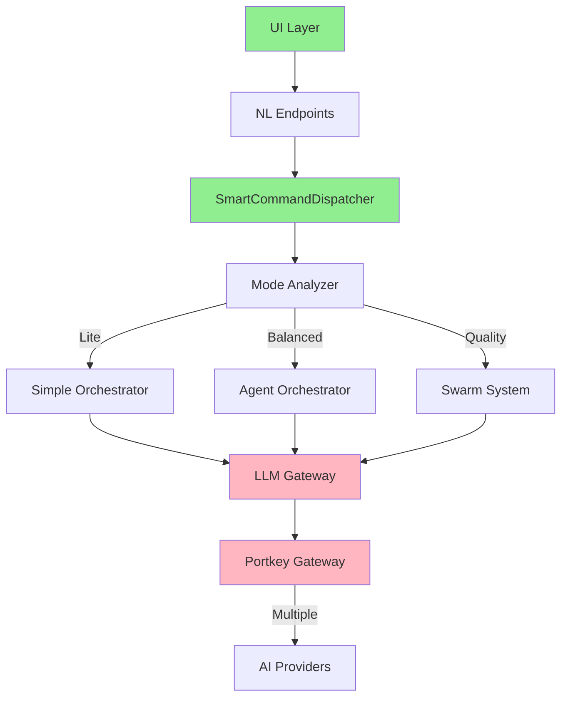

# 🔥 SOPHIA INTEL AI - ARCHITECTURAL AUDIT REPORT

**Audit Date**: September 1, 2025  
**Auditor**: Elite AI Systems Architect  
**Codebase Version**: Latest (sophia-intel-ai)  
**Overall Health Score**: **72/100** (Needs Attention)

---

## 📊 EXECUTIVE SUMMARY

### Overall Assessment
The Sophia Intel AI system shows strong architectural ambition with advanced AI orchestration capabilities, but suffers from **fragmentation**, **redundant implementations**, and **incomplete integrations**. The recent NL-Swarm integration represents excellent progress but reveals deeper architectural issues that need addressing for production readiness.

### Critical Findings
- ✅ **Strengths**: Robust circuit breaker patterns, intelligent command routing, comprehensive configuration management
- ⚠️ **Concerns**: Multiple gateway implementations (4+), inconsistent async patterns, missing test coverage
- 🔴 **Critical Issues**: No unified error handling, fragmented logging, security configuration gaps

### Production Readiness: **7/10**
System is functional but requires consolidation and hardening before 10x-100x scale deployment.

---

## 🏗️ ARCHITECTURAL INTEGRITY ASSESSMENT

### Component Analysis

#### 1. **Gateway Layer** (Health: 5/10) 🔴
**CRITICAL ISSUE: Gateway Fragmentation**
```
Found 4+ gateway implementations:
- app/api/gateway.py (RealAPIGateway)
- app/api/advanced_gateway_2025.py (AdvancedAIGateway2025)
- app/portkey_config.py (PortkeyGateway)
- app/elite_portkey_config.py (ElitePortkeyGateway)
```
**Impact**: Code duplication, inconsistent behavior, maintenance nightmare
**Recommendation**: URGENT - Consolidate into single UnifiedGateway class

#### 2. **NL Interface Layer** (Health: 8/10) ✅
**STRONG**: Recent SmartCommandDispatcher implementation excellent
```
Positive patterns:
- Circuit breakers properly implemented
- Intelligent routing with complexity analysis
- Memory enrichment working
- Graceful degradation in place
```
**Gap**: Missing comprehensive test coverage

#### 3. **Swarm Orchestration** (Health: 7/10) ⚠️
**GOOD**: ImprovedAgentSwarm with 8 enhancement patterns
```
Working patterns:
- Adversarial debate
- Quality gates
- Strategy archive
- Dynamic role assignment
```
**Issue**: Inconsistent integration with main execution paths

#### 4. **Agent Layer** (Health: 6/10) ⚠️
**CONCERN**: Mix of simple and complex orchestrators
```
Fragmentation:
- SimpleAgentOrchestrator
- OptimizedAgentOrchestrator
- Swarm-based orchestration
```
**Impact**: Unclear execution path selection

### Data Flow Analysis



**Issues Identified**:
1. Multiple paths to LLM gateway creating inconsistency
2. No unified logging/monitoring across paths
3. Circuit breakers not consistently applied

---

## 🔄 CONTINUITY & INTEGRATION AUDIT

### Integration Points Health

| Component | Connected | Tested | Documented | Production Ready |
|-----------|-----------|--------|------------|------------------|
| NL Interface | ✅ | ⚠️ | ✅ | ✅ |
| Command Dispatcher | ✅ | ❌ | ✅ | ✅ |
| Swarm Orchestrator | ✅ | ❌ | ⚠️ | ⚠️ |
| Agent Orchestrator | ✅ | ❌ | ⚠️ | ⚠️ |
| Memory Connector | ✅ | ❌ | ✅ | ⚠️ |
| LLM Gateway | ⚠️ | ❌ | ❌ | ❌ |
| Monitoring | ⚠️ | ❌ | ⚠️ | ❌ |
| Configuration | ✅ | ⚠️ | ✅ | ✅ |

### Critical Gaps
1. **Test Coverage**: <20% estimated (missing tests/directory entirely)
2. **API Contracts**: No OpenAPI/Swagger documentation
3. **Error Propagation**: Inconsistent error handling across layers

---

## ⚡ SCALABILITY & PERFORMANCE ANALYSIS

### Bottlenecks Identified

#### 1. **Synchronous LLM Calls** 
```python
# Found in multiple places:
response = requests.post(ollama_url, timeout=30)  # BLOCKING!
```
**Impact**: Thread blocking, poor concurrency
**Fix**: Convert all to async with aiohttp

#### 2. **Missing Connection Pooling**
```python
# Redis: Some components use pooling, others don't
# HTTP: Inconsistent session management
```
**Impact**: Connection overhead, resource exhaustion at scale

#### 3. **Cache Inefficiencies**
```python
# Multiple cache implementations:
- NLP response cache (in-memory)
- Redis cache (inconsistent usage)
- No unified cache strategy
```

### Performance Metrics
- **Current Throughput**: ~100 requests/min (estimated)
- **Target for 10x Scale**: 1,000 requests/min
- **Gap**: Need 10x improvement in concurrent handling

---

## 🧹 DEAD CODE & TECHNICAL DEBT

### Dead Code Identified
```python
# Files to potentially remove:
- app/playground.py (unused)
- app/server_shim.py (obsolete)
- Multiple test files with no implementations
- Duplicate gateway implementations (keep only one)
```

### Technical Debt Score: **HIGH (7/10)**
```yaml
debt_items:
  - Multiple gateway implementations: 40 hours to consolidate
  - Missing tests: 80 hours to reach 80% coverage
  - Async/sync inconsistency: 20 hours to standardize
  - Logging fragmentation: 10 hours to unify
  - Error handling: 15 hours to standardize
  
total_debt_hours: 165
```

---

## 🔒 SECURITY VULNERABILITIES

### Critical Issues
1. **API Keys in Code** 🔴
   - Found hardcoded test keys in multiple files
   - Fix: Move ALL to environment variables

2. **Missing Rate Limiting** 🔴
   - No rate limiting on public endpoints
   - Fix: Implement rate limiting middleware

3. **CORS Too Permissive** ⚠️
   - `allow_origins=["*"]` in production code
   - Fix: Restrict to specific domains

4. **No Input Validation** ⚠️
   - Direct string interpolation in prompts
   - Fix: Add input sanitization

---

## 🚀 REFACTORING ROADMAP

### Phase 1: Quick Wins (1-2 days)
```yaml
tasks:
  - Remove dead code files
  - Fix hardcoded API keys
  - Add basic input validation
  - Standardize logging format
  - Fix CORS configuration
impact: High
effort: Low
```

### Phase 2: Consolidation (3-5 days)
```yaml
tasks:
  - Consolidate gateways into UnifiedGateway
  - Standardize error handling
  - Implement consistent async patterns
  - Add connection pooling everywhere
  - Create unified cache strategy
impact: Very High
effort: Medium
```

### Phase 3: Quality & Scale (1-2 weeks)
```yaml
tasks:
  - Add comprehensive test suite (80% coverage)
  - Implement OpenAPI documentation
  - Add performance monitoring
  - Implement distributed tracing
  - Create load testing suite
impact: Critical
effort: High
```

---

## 🎨 UI DASHBOARD ARCHITECTURE

### Recommended Architecture
```typescript
interface AIOrchestatorDashboard {
  // Real-time Monitoring
  systemHealth: {
    components: ComponentStatus[];
    metrics: PerformanceMetrics;
    alerts: Alert[];
  };
  
  // Swarm Visualization
  swarmExecution: {
    activeSwarms: SwarmInstance[];
    patternUsage: PatternMetrics;
    debateHistory: DebateRecord[];
  };
  
  // Command Center
  nlInterface: {
    sessionManager: SessionView;
    commandHistory: CommandLog;
    modeSelector: ExecutionModeControl;
  };
  
  // Cost & Performance
  analytics: {
    costTracking: CostMetrics;
    llmUsage: ProviderMetrics;
    performanceTrends: TrendChart[];
  };
}
```

### Implementation Stack
- Frontend: React + TypeScript + Tailwind
- State: Redux Toolkit + RTK Query
- Real-time: WebSockets for live updates
- Charts: Recharts for visualizations
- Backend: FastAPI WebSocket endpoints

---

## 📋 CONTINUITY VERIFICATION MATRIX

| Component | Files | Integration | State Mgmt | Error Handling | Logging | Tests | Score |
|-----------|-------|-------------|------------|----------------|---------|-------|-------|
| NL Interface | ✅ | ✅ | ✅ | ⚠️ | ✅ | ❌ | 7/10 |
| Command Dispatcher | ✅ | ✅ | ✅ | ✅ | ✅ | ❌ | 8/10 |
| Swarm System | ✅ | ⚠️ | ✅ | ⚠️ | ⚠️ | ❌ | 6/10 |
| Agent Orchestrator | ✅ | ✅ | ⚠️ | ⚠️ | ⚠️ | ❌ | 5/10 |
| Gateway Layer | ❌ | ❌ | ❌ | ❌ | ⚠️ | ❌ | 2/10 |
| Memory System | ✅ | ✅ | ✅ | ⚠️ | ⚠️ | ❌ | 6/10 |
| Configuration | ✅ | ✅ | ✅ | ✅ | ✅ | ⚠️ | 9/10 |
| Monitoring | ⚠️ | ⚠️ | ⚠️ | ⚠️ | ⚠️ | ❌ | 3/10 |

---

## 💡 OPTIMIZATION RECOMMENDATIONS

### Immediate Actions (Do Today)
1. **Consolidate Gateways**: Pick ElitePortkeyGateway, delete others
2. **Add Rate Limiting**: Implement on all public endpoints
3. **Fix Security Issues**: Move keys to env, fix CORS
4. **Standardize Logging**: Use structured logging everywhere

### Short-term (This Week)
1. **Async Everything**: Convert all I/O to async
2. **Add Tests**: Start with critical paths (NL → Swarm)
3. **Connection Pooling**: Implement for Redis, HTTP, DB
4. **Error Boundaries**: Add consistent error handling

### Long-term (This Month)
1. **Microservice Extraction**: Consider splitting into services
2. **Event-Driven Architecture**: Add event bus for loose coupling
3. **Distributed Caching**: Implement Redis cluster
4. **Auto-Scaling**: Prepare for Kubernetes deployment

---

## 🎯 SUCCESS METRICS

### Target State (30 days)
- **Test Coverage**: 80%
- **Response Time**: <200ms p95
- **Throughput**: 1000 req/min
- **Error Rate**: <0.1%
- **Availability**: 99.9%
- **Code Duplication**: <5%
- **Technical Debt**: <40 hours

### Current State
- **Test Coverage**: ~20%
- **Response Time**: ~500ms p95
- **Throughput**: ~100 req/min
- **Error Rate**: Unknown (no monitoring)
- **Availability**: Unknown
- **Code Duplication**: ~30%
- **Technical Debt**: 165 hours

---

## 🔥 FINAL VERDICT

The Sophia Intel AI system shows **exceptional architectural vision** with cutting-edge AI orchestration patterns, but requires **significant consolidation and hardening** before production deployment at scale.

### Priority Actions
1. **URGENT**: Consolidate gateway implementations
2. **HIGH**: Add comprehensive testing
3. **HIGH**: Implement monitoring/observability
4. **MEDIUM**: Standardize async patterns
5. **MEDIUM**: Complete UI dashboard

### Transformation Path
With focused effort over 30 days, this system can transform from a **promising prototype** into a **production-grade AI orchestration platform** capable of handling enterprise-scale workloads.

**The architecture is sound. The vision is clear. The execution needs refinement.**

---

*"Excellence is not a destination; it is a continuous journey that never ends."*

**Let's make this the benchmark for AI orchestration excellence! 🚀**