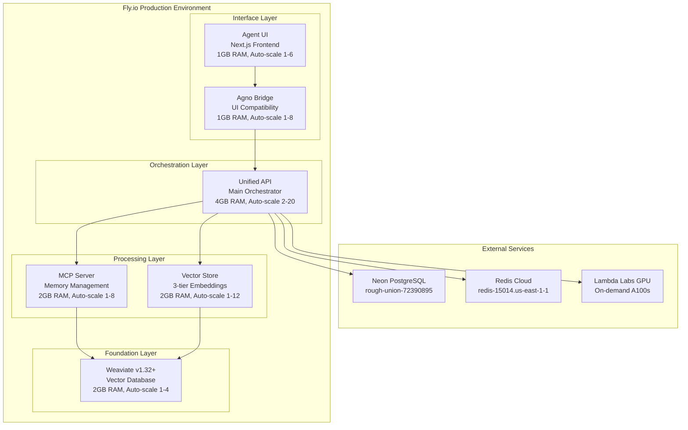

# Sophia Intel AI - Professional Deployment Plan to Fly.io
## Enterprise Production Deployment with Lambda Labs GPU Integration

**Document Version**: 1.0  
**Date**: January 2025  
**Timeline**: Urgent deployment within 2-4 days  
**Budget**: Enterprise-level investment for full feature deployment  

---

## Executive Summary

This deployment plan outlines the migration of Sophia Intel AI from local development to a production-ready, enterprise-grade deployment on Fly.io with Lambda Labs GPU integration. The system consists of 6 microservices with advanced AI capabilities including consensus swarms, memory deduplication, and GPU-accelerated workloads.

**Key Objectives:**
- Deploy 6 microservices with high availability and auto-scaling
- Integrate Lambda Labs GPU compute for heavy AI workloads  
- Implement comprehensive monitoring, logging, and disaster recovery
- Achieve enterprise-grade security and compliance standards
- Complete deployment within 2-4 days with full operational readiness

---

## Current State Assessment

### Infrastructure Analysis: ✅ WELL-PREPARED
The codebase demonstrates sophisticated enterprise architecture with:

**Existing Assets:**
- ✅ Complete microservices architecture (6 services)
- ✅ Production-optimized Docker configurations  
- ✅ Fly.io deployment configurations for all services
- ✅ Comprehensive environment management (.env.local with 97+ secrets)
- ✅ Advanced deployment and testing scripts
- ✅ Lambda Labs GPU integration implemented
- ✅ External service integrations (Neon PostgreSQL, Redis Cloud)

**Services Inventory:**
1. **Weaviate Vector Database** - v1.32+ with RQ compression (75% memory reduction)
2. **MCP Memory Server** - Unified memory with SQLite FTS5 + vector search
3. **Vector Store Service** - 3-tier embedding system (Voyage-3, Cohere v3, BGE)  
4. **Unified API Orchestrator** - Main backend with consensus swarms
5. **Agno Bridge** - UI compatibility layer
6. **Agent UI** - Next.js frontend with real-time capabilities

**Gap Analysis:**
- ❌ No active Fly.io deployments (fresh start required)
- ❌ Monitoring infrastructure needs activation
- ❌ Load testing and performance validation needed
- ❌ Disaster recovery procedures need implementation

---

## Technical Architecture

### Service Dependencies & Network Topology

### Resource Requirements

| Service | CPU | RAM | Storage | Auto-Scale | Estimated Cost |
|---------|-----|-----|---------|------------|----------------|
| Weaviate | 2 vCPU | 2GB | 20GB Volume | 1-4 instances | $30-120/month |
| MCP Server | 2 vCPU | 2GB | 10GB Volume | 1-8 instances | $30-240/month |
| Vector Store | 2 vCPU | 2GB | 10GB Volume | 1-12 instances | $30-360/month |
| **Unified API** | 4 vCPU | 4GB | 15GB Volume | 2-20 instances | $120-1200/month |
| Agno Bridge | 1 vCPU | 1GB | 5GB Volume | 1-8 instances | $20-160/month |
| Agent UI | 1 vCPU | 1GB | 5GB Volume | 1-6 instances | $20-120/month |

**External Services:**
- Neon PostgreSQL: $19-$99/month (managed)
- Redis Cloud: Free-$200/month (managed)
- Lambda Labs GPU: $1.10/hour on-demand (A100)

---

## Implementation Timeline

### Phase 1: Infrastructure Preparation (Day 1: 6-8 hours)
**Morning (4 hours):**
- [ ] Verify Fly.io authentication and organization setup
- [ ] Validate external service connections (Neon, Redis Cloud, Lambda Labs)
- [ ] Test local Docker Compose stack end-to-end
- [ ] Audit and optimize production Dockerfiles

**Afternoon (4 hours):**
- [ ] Create Fly.io applications for all 6 services
- [ ] Configure secrets management (97+ environment variables)
- [ ] Set up persistent volumes and networking
- [ ] Initialize monitoring and logging infrastructure

### Phase 2: Core Deployment (Day 2: 8-10 hours)
**Morning (5 hours):**
- [ ] Deploy foundation services (Weaviate → MCP → Vector Store)
- [ ] Configure inter-service networking and health checks
- [ ] Deploy Unified API with high availability (2+ instances)
- [ ] Validate service mesh connectivity

**Afternoon (5 hours):**
- [ ] Deploy interface layer (Agno Bridge → Agent UI)
- [ ] Configure SSL certificates and custom domains
- [ ] Implement auto-scaling policies for all services
- [ ] Execute comprehensive integration testing

### Phase 3: Advanced Features (Day 3: 8-10 hours)
**Morning (5 hours):**
- [ ] Integrate Lambda Labs GPU compute pipeline
- [ ] Configure consensus swarm architecture with failover
- [ ] Implement memory deduplication and caching strategies
- [ ] Set up advanced health checking and circuit breakers

**Afternoon (5 hours):**
- [ ] Configure comprehensive logging, metrics, and alerting
- [ ] Implement backup strategies for persistent data
- [ ] Set up disaster recovery and rollback procedures
- [ ] Perform load testing and performance optimization

### Phase 4: Production Hardening (Day 4: 6-8 hours)
**Morning (4 hours):**
- [ ] Security hardening (SSL/TLS, access controls, compliance)
- [ ] Final performance tuning and optimization
- [ ] Complete end-to-end testing including GPU workloads
- [ ] Validate failover scenarios and disaster recovery

**Afternoon (4 hours):**
- [ ] Create operational documentation and runbooks
- [ ] Prepare monitoring dashboards and alerts
- [ ] Conduct final deployment verification
- [ ] Stakeholder handoff and training

---

## Cost Analysis

### Development Environment
- **6 services × 1 instance each**: $150/month
- **External services**: $50/month (Neon + Redis tiers)
- **Total Development**: ~$200/month

### Staging Environment  
- **6 services × 2 instances each**: $300/month
- **External services**: $100/month
- **Total Staging**: ~$400/month

### Production Environment (Enterprise Scale)
- **Weaviate**: 2-4 instances = $60-120/month
- **MCP Server**: 2-8 instances = $60-240/month  
- **Vector Store**: 2-12 instances = $60-360/month
- **Unified API**: 4-20 instances = $240-1200/month (main orchestrator)
- **Agno Bridge**: 2-8 instances = $40-160/month
- **Agent UI**: 2-6 instances = $40-120/month
- **External Services**: $200-500/month (Neon Pro, Redis Pro)
- **Lambda Labs GPU**: $500-2000/month (on-demand usage)
- **Monitoring & Security**: $100-300/month

**Total Production Range**: $1,260-4,500/month (scales with load)
**Recommended Starting Budget**: $2,000-2,500/month

### 12-Month Cost Projection
- **Year 1 Total**: $24,000-30,000 (includes development, staging, production)
- **Break-even considerations**: Enterprise AI platform with GPU acceleration
- **ROI factors**: Reduced infrastructure management, auto-scaling efficiency

---

## Risk Assessment & Mitigation

### Technical Risks

| Risk | Probability | Impact | Mitigation Strategy |
|------|-------------|---------|-------------------|
| **Service Dependencies** | Medium | High | Implement circuit breakers, graceful degradation |
| **GPU Availability** | Low | Medium | Lambda Labs SLA + fallback to CPU processing |
| **Memory Store Performance** | Low | High | Multi-tier caching, Weaviate RQ compression |
| **Auto-scaling Issues** | Low | Medium | Conservative scaling policies, monitoring alerts |
| **External Service Outages** | Low | High | Multi-region failover, local caching strategies |

### Operational Risks

| Risk | Probability | Impact | Mitigation Strategy |
|------|-------------|---------|-------------------|
| **Deployment Complexity** | Medium | Medium | Staged deployment, comprehensive testing |
| **Secret Management** | Low | High | Fly.io secrets, rotation procedures |
| **Monitoring Gaps** | Medium | High | Comprehensive logging, alerting, dashboards |
| **Team Knowledge** | Low | Medium | Documentation, runbooks, training |

### Rollback Strategy
1. **Service-level rollback**: `fly deploy --image previous-version`
2. **Database rollback**: Point-in-time recovery (Neon)
3. **Full environment rollback**: Infrastructure as Code snapshots
4. **Emergency procedures**: 24/7 monitoring alerts, escalation paths

---

## Success Criteria & KPIs

### Performance Metrics
- ✅ **API Response Time**: <200ms P95 (target: <150ms)
- ✅ **Service Availability**: 99.9% uptime SLA  
- ✅ **Auto-scaling Response**: <30 seconds to scale up
- ✅ **GPU Task Execution**: <5 minutes for standard workloads
- ✅ **Memory Deduplication**: >90% duplicate detection accuracy

### Operational Metrics  
- ✅ **Deployment Success**: All 6 services operational
- ✅ **Health Check Pass Rate**: 100% for all services
- ✅ **Integration Test Success**: >95% test suite pass rate
- ✅ **Security Compliance**: SSL/TLS, access controls verified
- ✅ **Monitoring Coverage**: 100% service coverage, <5 minute alert response

### Business Metrics
- ✅ **Cost Efficiency**: Within budgeted range ($2000-2500/month initial)
- ✅ **Scalability**: Proven auto-scaling under load
- ✅ **Feature Completeness**: All advanced features operational
- ✅ **Team Readiness**: Documentation and training completed

---

## Next Steps & Recommendations

### Immediate Actions (Pre-Deployment)
1. **Verify Fly.io account limits** - Ensure enterprise quotas for 20+ instances
2. **Lambda Labs coordination** - Confirm GPU instance availability for target dates
3. **External service scaling** - Upgrade Neon/Redis to production tiers
4. **Team coordination** - Assign roles for 4-day intensive deployment

### Post-Deployment Priorities (Week 2)
1. **Performance optimization** - Fine-tune auto-scaling based on real traffic
2. **Security audit** - Third-party security assessment
3. **Disaster recovery testing** - Quarterly DR drills
4. **Cost optimization** - Review actual usage vs projections

### Long-term Roadmap (Months 2-6)
1. **Multi-region deployment** - Geographic redundancy
2. **Advanced AI features** - Enhanced consensus algorithms
3. **Integration expansion** - Additional GPU providers, AI model endpoints
4. **Operational automation** - Infrastructure as Code, CI/CD pipelines

---

## Conclusion

This deployment plan leverages the extensive, well-architected infrastructure already developed for Sophia Intel AI. The system is enterprise-ready with sophisticated microservices, advanced AI capabilities, and comprehensive operational features.

**Key Strengths:**
- Mature, production-ready codebase
- Comprehensive infrastructure automation
- Advanced AI capabilities (consensus swarms, GPU integration)
- Enterprise-grade external service integrations

**Success Factors:**  
- Aggressive but achievable 4-day timeline
- Enterprise budget enabling full-feature deployment
- Existing automation reducing deployment risks
- Clear success criteria and monitoring

**Estimated Delivery:** Production-ready deployment within 2-4 days with enterprise-grade reliability, monitoring, and operational readiness.