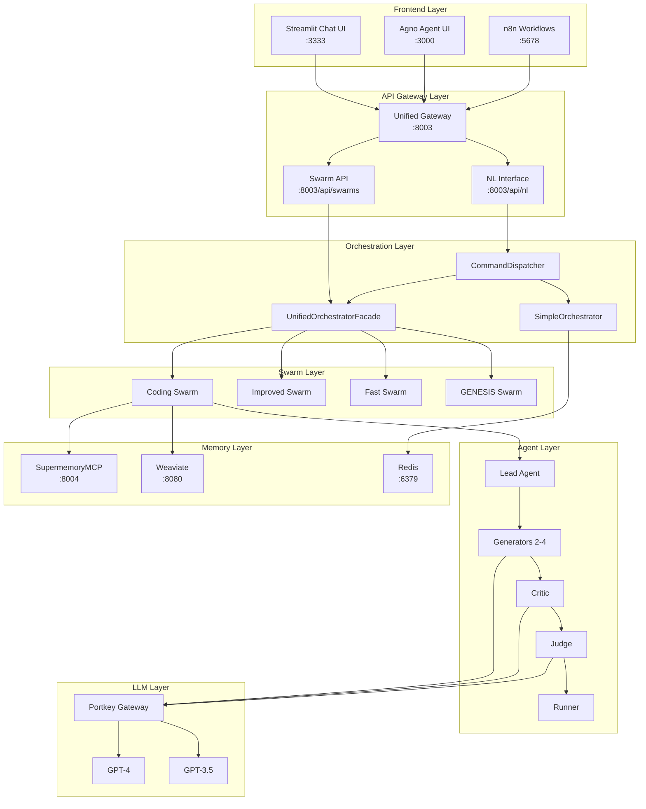
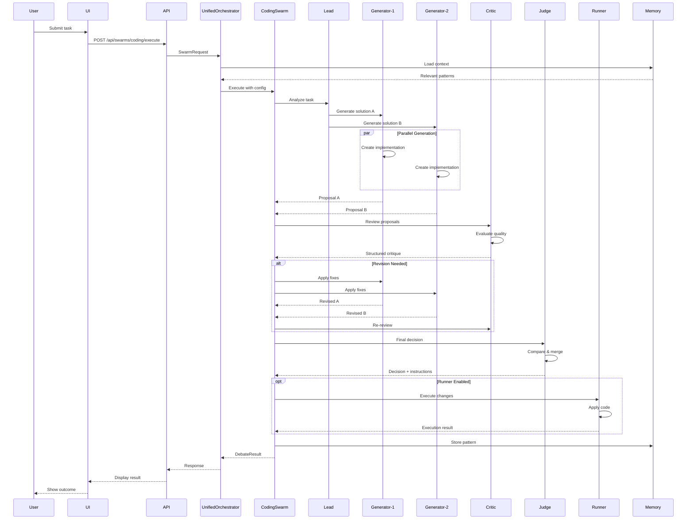
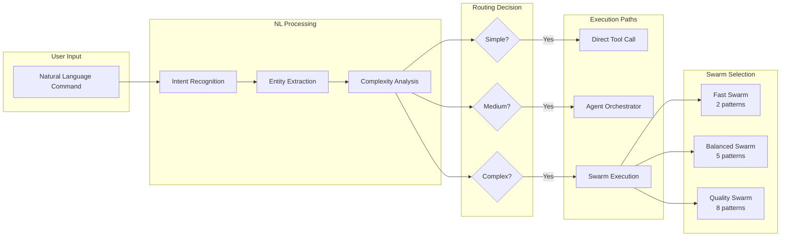
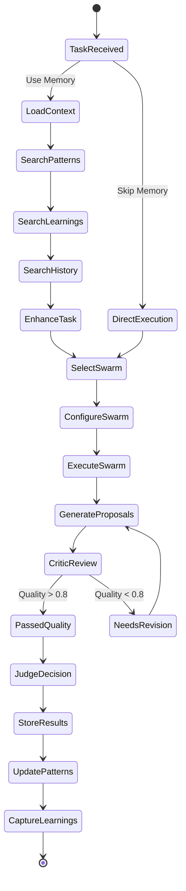

# Sophia Intel AI - Swarm Integration Enhancements & Recommendations

## Executive Summary

This document provides comprehensive integration analysis, visual workflow diagrams, creation/modification instructions, and strategic recommendations for improving the AI swarm system's integration with the orchestrator and UI components.

---

## 1. Current Integration Architecture

### 1.1 Complete Integration Flow



---

## 2. Visual Workflow Diagrams

### 2.1 Coding Swarm Debate Workflow



### 2.2 Natural Language to Swarm Execution



### 2.3 Memory-Enhanced Execution Flow



---

## 3. API Integration Endpoints

### 3.1 Swarm Management API

| Endpoint                           | Method | Description           | Request Body       | Response           |
| ---------------------------------- | ------ | --------------------- | ------------------ | ------------------ |
| `/api/swarms/coding/execute`       | POST   | Execute coding swarm  | SwarmRequest       | DebateResult       |
| `/api/swarms/coding/stream`        | POST   | Stream execution      | SwarmRequest       | Event stream       |
| `/api/swarms/coding/pools`         | GET    | Get available pools   | -                  | Pool info          |
| `/api/swarms/coding/configuration` | GET    | Get default config    | -                  | SwarmConfiguration |
| `/api/swarms/coding/validate`      | POST   | Validate config       | SwarmConfiguration | Validation result  |
| `/api/swarms/coding/history`       | GET    | Get execution history | Query params       | List of results    |
| `/api/swarms/coding/quick`         | POST   | Quick execution       | Query params       | DebateResult       |

### 3.2 Natural Language Interface

| Endpoint                     | Method | Description        | Integration        |
| ---------------------------- | ------ | ------------------ | ------------------ |
| `/api/nl/process`            | POST   | Process NL command | Routes to swarms   |
| `/api/nl/system/status`      | GET    | System status      | All components     |
| `/api/nl/agents/status/{id}` | GET    | Agent status       | Agent orchestrator |
| `/api/nl/intents`            | GET    | Available intents  | Intent mapping     |

---

## 4. How to Create and Modify Swarms

### 4.1 Creating a New Swarm Type

```python
# Step 1: Define the swarm class
from app.swarms.memory_enhanced_swarm import MemoryEnhancedImprovedSwarm

class CustomBusinessSwarm(MemoryEnhancedImprovedSwarm):
    """Custom swarm for business analysis tasks"""

    def __init__(self, agents: List):
        super().__init__(agents, "swarm_config.json", "business_swarm")

        # Customize memory configuration
        self.memory_pattern.config.max_context_patterns = 5
        self.memory_pattern.config.max_context_learnings = 10
        self.memory_pattern.config.min_quality_for_pattern_storage = 0.70

        # Define custom agent roles
        self.custom_roles = [
            "market_analyst",
            "financial_advisor",
            "strategy_consultant",
            "risk_assessor"
        ]

    async def execute_business_analysis(self, task: Dict) -> Dict:
        """Custom execution for business tasks"""
        # Implementation here
        pass
```

### 4.2 Modifying Existing Swarm Configuration

```python
# Step 1: Load existing configuration
import json

with open("app/swarms/swarm_optimization_config.json", "r") as f:
    config = json.load(f)

# Step 2: Modify optimization modes
config["optimization_modes"]["ultra_fast"] = {
    "timeout": 15,
    "max_patterns": 1,
    "max_agents": 2,
    "quality_threshold": 0.6,
    "enable_patterns": ["safety_boundaries"],
    "degradation_strategy": {
        "mode": "aggressive",
        "fallback_mode": "skip",
        "cache_priority": "high"
    }
}

# Step 3: Add custom pattern configuration
config["pattern_configs"]["business_analysis"] = {
    "enabled_patterns": [
        "market_research",
        "financial_modeling",
        "risk_assessment"
    ],
    "pattern_weights": {
        "market_research": 0.4,
        "financial_modeling": 0.35,
        "risk_assessment": 0.25
    }
}

# Step 4: Save updated configuration
with open("app/swarms/swarm_optimization_config.json", "w") as f:
    json.dump(config, f, indent=2)
```

### 4.3 Dynamic Swarm Creation via API

```python
# Create swarm dynamically through API
import requests

# Define custom configuration
swarm_config = {
    "pool": "heavy",  # Use powerful models
    "concurrent_models": ["openai/gpt-4", "anthropic/claude-3.5"],
    "include_default_pair": False,
    "include_runner": True,
    "max_generators": 6,
    "max_rounds": 5,
    "stream_responses": True,
    "timeout_seconds": 300,
    "accuracy_threshold": 8.5,
    "reliability_checks_enabled": True,
    "auto_approve_low_risk": False,
    "use_memory": True,
    "memory_search_limit": 10,
    "enable_file_write": True,
    "enable_test_execution": True,
    "enable_git_operations": True
}

# Create request
request = {
    "task": "Implement a microservices architecture",
    "configuration": swarm_config,
    "context": {
        "project_type": "enterprise",
        "tech_stack": ["python", "docker", "kubernetes"]
    },
    "session_id": "custom-session-123"
}

# Execute swarm
response = requests.post(
    "http://localhost:8003/api/swarms/coding/execute",
    json=request
)

result = response.json()
```

### 4.4 Registering Custom Swarm with Orchestrator

```python
# app/orchestration/swarm_registry.py
from typing import Dict, Type
from app.swarms.base import BaseSwarm

class SwarmRegistry:
    """Registry for custom swarm types"""

    _registry: Dict[str, Type[BaseSwarm]] = {}

    @classmethod
    def register(cls, name: str, swarm_class: Type[BaseSwarm]):
        """Register a custom swarm type"""
        cls._registry[name] = swarm_class

    @classmethod
    def get(cls, name: str) -> Type[BaseSwarm]:
        """Get swarm class by name"""
        return cls._registry.get(name)

    @classmethod
    def list_available(cls) -> List[str]:
        """List all registered swarm types"""
        return list(cls._registry.keys())

# Register custom swarm
from app.swarms.custom import CustomBusinessSwarm
SwarmRegistry.register("business", CustomBusinessSwarm)
```

---

## 5. Recommendations for Improvements

### 5.1 🚨 Critical Improvements (Priority 1)

#### 1. **Consolidate Gateway Implementations**

```python
# Current: 4 different gateways
# Recommended: Single UnifiedGateway with adapters

class UnifiedGateway:
    def __init__(self):
        self.adapters = {
            'portkey': PortkeyAdapter(),
            'openrouter': OpenRouterAdapter(),
            'together': TogetherAdapter(),
            'anthropic': AnthropicAdapter()
        }

    async def route(self, request: Request) -> Response:
        adapter = self.select_optimal_adapter(request)
        return await adapter.process(request)
```

#### 2. **Implement Real WebSocket Streaming**

```python
# Current: Pseudo-streaming with polling
# Recommended: True WebSocket implementation

from fastapi import WebSocket

@router.websocket("/ws/swarms/{session_id}")
async def swarm_websocket(websocket: WebSocket, session_id: str):
    await websocket.accept()

    async for event in swarm_orchestrator.stream_execution(session_id):
        await websocket.send_json(event.dict())
```

#### 3. **Add Swarm Health Monitoring Dashboard**

```python
# Recommended: Real-time swarm health monitoring
class SwarmHealthMonitor:
    async def get_swarm_health(self) -> Dict:
        return {
            "swarms": {
                "coding": self.check_coding_swarm(),
                "improved": self.check_improved_swarm(),
                "fast": self.check_fast_swarm(),
                "genesis": self.check_genesis_swarm()
            },
            "agents": self.check_agent_availability(),
            "memory": self.check_memory_systems(),
            "circuit_breakers": self.check_circuit_breakers()
        }
```

### 5.2 🔧 Technical Improvements (Priority 2)

#### 4. **Implement Swarm Versioning**

```python
class SwarmVersion:
    """Version control for swarm configurations"""

    def save_version(self, swarm_type: str, config: Dict) -> str:
        version_id = f"v{datetime.now().strftime('%Y%m%d_%H%M%S')}"
        # Store in version control
        return version_id

    def rollback(self, swarm_type: str, version_id: str):
        # Rollback to previous version
        pass
```

#### 5. **Add A/B Testing for Swarm Strategies**

```python
class SwarmABTester:
    async def execute_with_ab_test(self, task: str) -> Dict:
        # Run task with two different configurations
        result_a = await self.run_variant_a(task)
        result_b = await self.run_variant_b(task)

        # Compare and learn
        winner = self.compare_results(result_a, result_b)
        await self.store_ab_learning(winner)
        return winner
```

#### 6. **Implement Swarm Cost Tracking**

```python
class SwarmCostMonitor:
    def track_execution_cost(self, swarm_type: str, execution: Dict):
        cost = {
            "tokens_used": execution["total_tokens"],
            "compute_time": execution["duration"],
            "memory_operations": execution["memory_calls"],
            "estimated_cost": self.calculate_cost(execution)
        }
        return cost
```

### 5.3 🎨 UX/UI Improvements (Priority 3)

#### 7. **Enhanced Visual Swarm Builder**

```typescript
// React component for visual swarm configuration
const SwarmBuilder = () => {
    const [agents, setAgents] = useState([]);
    const [patterns, setPatterns] = useState([]);

    return (
        <DragDropContext>
            <AgentPalette />
            <SwarmCanvas
                agents={agents}
                patterns={patterns}
                onConnect={handleConnection}
            />
            <ConfigPanel />
        </DragDropContext>
    );
};
```

#### 8. **Real-time Execution Visualization**

```python
# Stream execution events for visualization
async def stream_execution_viz(session_id: str):
    async for event in orchestrator.execute_with_viz(session_id):
        yield {
            "timestamp": event.timestamp,
            "agent": event.agent,
            "action": event.action,
            "visualization": {
                "graph": event.to_graph(),
                "metrics": event.metrics
            }
        }
```

### 5.4 🔒 Security & Reliability (Priority 1)

#### 9. **Implement Swarm Sandboxing**

```python
class SwarmSandbox:
    """Isolate swarm execution environments"""

    async def execute_sandboxed(self, swarm: BaseSwarm, task: str):
        container = await self.create_container(swarm.requirements)
        try:
            result = await container.execute(swarm, task)
            return result
        finally:
            await container.cleanup()
```

#### 10. **Add Audit Logging**

```python
class SwarmAuditLogger:
    async def log_execution(self, request: SwarmRequest, result: Dict):
        audit_entry = {
            "timestamp": datetime.utcnow(),
            "user_id": request.user_id,
            "swarm_type": request.swarm_type,
            "task_hash": hashlib.sha256(request.task.encode()).hexdigest(),
            "result_summary": self.summarize_result(result),
            "compliance_checks": self.run_compliance_checks(result)
        }
        await self.store_audit_log(audit_entry)
```

### 5.5 📊 Performance Optimizations (Priority 2)

#### 11. **Implement Swarm Result Caching**

```python
class SwarmResultCache:
    async def get_or_execute(self, task: str, config: Dict) -> Dict:
        cache_key = self.generate_cache_key(task, config)

        # Check cache
        cached = await self.redis.get(cache_key)
        if cached and self.is_fresh(cached):
            return cached

        # Execute and cache
        result = await self.execute_swarm(task, config)
        await self.redis.setex(cache_key, 3600, result)
        return result
```

#### 12. **Add Predictive Resource Allocation**

```python
class PredictiveResourceAllocator:
    async def allocate_resources(self, task: str) -> Dict:
        # Predict resource needs
        complexity = self.predict_complexity(task)

        return {
            "agent_count": self.calculate_agents(complexity),
            "timeout": self.calculate_timeout(complexity),
            "memory_limit": self.calculate_memory(complexity),
            "pattern_count": self.calculate_patterns(complexity)
        }
```

---

## 6. Implementation Roadmap

### Phase 1: Foundation (Weeks 1-2)

- [ ] Consolidate gateway implementations
- [ ] Implement WebSocket streaming
- [ ] Add swarm health monitoring
- [ ] Enhance audit logging

### Phase 2: Intelligence (Weeks 3-4)

- [ ] Implement A/B testing framework
- [ ] Add predictive resource allocation
- [ ] Enhance memory integration
- [ ] Implement result caching

### Phase 3: User Experience (Weeks 5-6)

- [ ] Build visual swarm builder
- [ ] Create execution visualization
- [ ] Enhance Streamlit UI
- [ ] Add cost tracking dashboard

### Phase 4: Scale & Security (Weeks 7-8)

- [ ] Implement sandboxing
- [ ] Add swarm versioning
- [ ] Enhance circuit breakers
- [ ] Performance optimization

---

## Conclusion

The Sophia Intel AI swarm system is well-architected with strong foundations. The recommended improvements focus on:

1. **Consolidation**: Reducing redundancy in gateway implementations
2. **Real-time Capabilities**: True streaming and visualization
3. **Intelligence**: A/B testing and predictive optimization
4. **User Experience**: Visual builders and better monitoring
5. **Security**: Sandboxing and comprehensive audit logging

These enhancements will elevate the system from 80/100 to a target score of 95+/100, making it production-ready for enterprise deployment.
