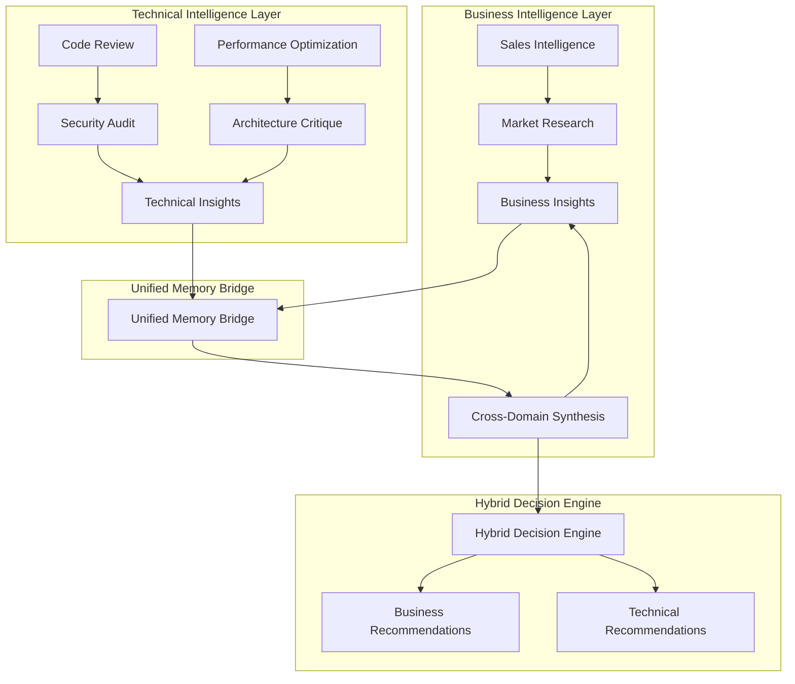

# Unified Hybrid Intelligence Architecture
## Comprehensive Tech Stack Integration for Sophia & Artemis Agent Factories

**Version:** 1.0.0  
**Date:** 2025-01-09  
**Status:** Architecture Design  

---

## Executive Summary

This document presents a comprehensive hybrid tech stack integration plan that unifies Sophia (Business Intelligence) and Artemis (Technical Intelligence) agent factories into a single, coherent platform. The architecture creates synergistic intelligence where business insights drive technical decisions and technical capabilities inform business strategy.

---

## 1. Unified Memory Architecture

### 1.1 Hybrid Memory Stack Integration

```yaml
Memory Architecture:
  Primary Store: Weaviate (Vector Storage)
  Cache Layer: Redis (Real-time Operations)
  Persistent Storage: Neon PostgreSQL (Structured Data)
  Search Engine: Weaviate + Redis Hybrid
  Synchronization: CRDT-based Cross-Factory Sync
```

#### Core Components:

**A. Cross-Domain Memory Bridge**
```python
class HybridMemoryBridge:
    """Bridges Sophia business intelligence with Artemis technical intelligence"""
    
    def __init__(self):
        self.sophia_memory = SophiaMemoryStore()  # Business context
        self.artemis_memory = ArtemisMemoryStore()  # Technical context
        self.unified_index = UnifiedSemanticIndex()
        
    async def cross_pollinate_insights(self, context: str):
        """Transfer insights between business and technical domains"""
        business_insights = await self.sophia_memory.query_business_context(context)
        technical_insights = await self.artemis_memory.query_technical_context(context)
        
        # Create bidirectional knowledge transfer
        return await self._synthesize_hybrid_insights(business_insights, technical_insights)
```

**B. Unified Vector Storage Optimization**
```python
class UnifiedVectorStore:
    """Optimized vector storage across both factories"""
    
    BUSINESS_NAMESPACE = "sophia_business"
    TECHNICAL_NAMESPACE = "artemis_technical" 
    HYBRID_NAMESPACE = "unified_intelligence"
    
    async def store_hybrid_embedding(self, content: str, domain: str, metadata: dict):
        """Store embeddings with cross-domain indexing"""
        embedding = await self.generate_embedding(content)
        
        # Store in appropriate namespace
        await self.weaviate_client.batch.add_data_object(
            data_object={
                "content": content,
                "domain": domain,
                "cross_refs": await self._find_cross_domain_refs(content, domain),
                **metadata
            },
            class_name=self._get_class_for_domain(domain),
            uuid=generate_deterministic_uuid(content + domain)
        )
```

### 1.2 Cross-Domain Knowledge Transfer

**Semantic Understanding Coordination:**
```python
class SemanticCoordinator:
    """Coordinates semantic understanding across business and technical domains"""
    
    def __init__(self):
        self.business_ontology = BusinessOntologyGraph()
        self.technical_ontology = TechnicalOntologyGraph()
        self.mapping_layer = CrossDomainMappingLayer()
        
    async def translate_business_to_technical(self, business_context: dict) -> dict:
        """Translate business requirements to technical specifications"""
        technical_mapping = await self.mapping_layer.map_business_concepts(
            business_context
        )
        return await self.technical_ontology.contextualize(technical_mapping)
    
    async def translate_technical_to_business(self, technical_context: dict) -> dict:
        """Translate technical insights to business implications"""
        business_mapping = await self.mapping_layer.map_technical_concepts(
            technical_context
        )
        return await self.business_ontology.contextualize(business_mapping)
```

---

## 2. Orchestration Framework Integration

### 2.1 AGNO + LangGraph Hybrid Coordination

```python
class HybridOrchestrationEngine:
    """Unified orchestration for both Sophia and Artemis factories"""
    
    EXECUTION_PATTERNS = {
        "SEQUENTIAL": SequentialExecutionPattern,
        "PARALLEL": ParallelExecutionPattern,
        "DEBATE": DebateExecutionPattern,
        "MEDIATOR": MediatorExecutionPattern,
        "JUDGE": JudgeExecutionPattern,
        "EVOLUTIONARY": EvolutionaryExecutionPattern
    }
    
    def __init__(self):
        self.sophia_factory = SophiaBusinessAgentFactory()
        self.artemis_factory = ArtemisAgentFactory()
        self.langgraph_coordinator = LangGraphCoordinator()
        self.agno_manager = AGNOTeamManager()
        
    async def orchestrate_hybrid_task(
        self, 
        task: HybridTask, 
        pattern: str = "PARALLEL"
    ) -> HybridExecutionResult:
        """Orchestrate task execution across both factories"""
        
        # Decompose task into business and technical components
        task_decomposition = await self._decompose_hybrid_task(task)
        
        # Create execution plan
        execution_plan = await self._create_execution_plan(
            task_decomposition, 
            pattern
        )
        
        # Execute with coordination
        business_result = await self._execute_business_component(
            execution_plan.business_component
        )
        technical_result = await self._execute_technical_component(
            execution_plan.technical_component
        )
        
        # Synthesize results
        return await self._synthesize_hybrid_result(
            business_result, 
            technical_result,
            task.synthesis_strategy
        )
```

### 2.2 Cross-Factory Agent Collaboration

**Agent Collaboration Patterns:**
```python
class CrossFactoryCollaboration:
    """Enables collaboration between Sophia and Artemis agents"""
    
    async def create_hybrid_team(
        self, 
        business_agents: List[str], 
        technical_agents: List[str],
        collaboration_pattern: str = "COMPLEMENTARY"
    ) -> HybridTeam:
        """Create teams that span both factories"""
        
        hybrid_team = HybridTeam(
            business_agents=await self._initialize_business_agents(business_agents),
            technical_agents=await self._initialize_technical_agents(technical_agents),
            collaboration_bridge=CollaborationBridge(),
            memory_coordinator=CrossFactoryMemoryCoordinator()
        )
        
        return await hybrid_team.initialize()
```

### 2.3 Unified Workflow Management

```python
class UnifiedWorkflowManager:
    """Manages workflows across both intelligence domains"""
    
    async def execute_business_technical_workflow(
        self, 
        workflow: HybridWorkflow
    ) -> WorkflowResult:
        """Execute integrated business-technical workflows"""
        
        # Phase 1: Business Intelligence Gathering
        business_insights = await self._gather_business_intelligence(
            workflow.business_requirements
        )
        
        # Phase 2: Technical Assessment  
        technical_assessment = await self._assess_technical_feasibility(
            business_insights, workflow.technical_constraints
        )
        
        # Phase 3: Hybrid Strategy Formation
        hybrid_strategy = await self._form_hybrid_strategy(
            business_insights, technical_assessment
        )
        
        # Phase 4: Coordinated Execution
        return await self._execute_coordinated_implementation(
            hybrid_strategy
        )
```

---

## 3. Infrastructure Modernization

### 3.1 Fly.io Deployment Strategy

**Multi-Region Deployment Architecture:**
```yaml
# fly.toml - Unified Deployment Configuration
app = "sophia-artemis-unified"
primary_region = "iad"

[build]
  dockerfile = "Dockerfile.hybrid"

[env]
  SOPHIA_MODE = "business_intelligence"
  ARTEMIS_MODE = "technical_intelligence"
  UNIFIED_MODE = "hybrid_coordination"
  
[http_service]
  internal_port = 8000
  force_https = true
  auto_stop_machines = true
  auto_start_machines = true
  min_machines_running = 2
  
[[services]]
  protocol = "tcp"
  internal_port = 8000
  
  [[services.ports]]
    port = 80
    handlers = ["http"]
  
  [[services.ports]]
    port = 443
    handlers = ["http", "tls"]

[metrics]
  port = 9091
  path = "/metrics"

[[vm]]
  memory = "2gb"
  cpu_kind = "shared"
  cpus = 2
```

**Hybrid Service Architecture:**
```python
class HybridServiceDeployment:
    """Manages deployment of unified intelligence services"""
    
    SERVICES = {
        "sophia-business": {
            "image": "sophia-intel-ai:business",
            "replicas": 3,
            "resources": {"memory": "1GB", "cpu": "0.5"}
        },
        "artemis-technical": {
            "image": "sophia-intel-ai:technical", 
            "replicas": 3,
            "resources": {"memory": "2GB", "cpu": "1.0"}
        },
        "unified-coordinator": {
            "image": "sophia-intel-ai:coordinator",
            "replicas": 2,
            "resources": {"memory": "1GB", "cpu": "0.5"}
        },
        "memory-bridge": {
            "image": "sophia-intel-ai:memory",
            "replicas": 2,
            "resources": {"memory": "4GB", "cpu": "2.0"}
        }
    }
```

### 3.2 Lambda Labs GPU Integration

**GPU-Intensive Learning Operations:**
```python
class LambdaLabsIntegration:
    """Manages GPU-intensive operations on Lambda Labs"""
    
    def __init__(self):
        self.lambda_client = LambdaLabsClient()
        self.gpu_instances = {}
        
    async def provision_learning_cluster(
        self, 
        learning_type: str,
        scale_requirements: dict
    ) -> LearningCluster:
        """Provision GPU cluster for intensive learning operations"""
        
        if learning_type == "federated_learning":
            return await self._provision_federated_cluster(scale_requirements)
        elif learning_type == "cross_domain_training":
            return await self._provision_cross_domain_cluster(scale_requirements)
        elif learning_type == "meta_learning":
            return await self._provision_meta_learning_cluster(scale_requirements)
```

### 3.3 Pulumi IaC for Dynamic Infrastructure

**Dynamic Agent Infrastructure:**
```python
import pulumi
import pulumi_aws as aws
from pulumi_fly import App

class DynamicAgentInfrastructure:
    """Pulumi-based infrastructure for dynamic agent provisioning"""
    
    def __init__(self):
        self.resource_stack = []
        
    def create_adaptive_infrastructure(self):
        """Create infrastructure that adapts to agent load"""
        
        # Auto-scaling agent clusters
        sophia_cluster = aws.ecs.Cluster(
            "sophia-business-cluster",
            tags={"Environment": "production", "Type": "business-intelligence"}
        )
        
        artemis_cluster = aws.ecs.Cluster(
            "artemis-technical-cluster", 
            tags={"Environment": "production", "Type": "technical-intelligence"}
        )
        
        # Dynamic scaling based on agent utilization
        sophia_service = aws.ecs.Service(
            "sophia-service",
            cluster=sophia_cluster.arn,
            task_definition=self._create_sophia_task_definition(),
            desired_count=3,
            deployment_configuration=aws.ecs.ServiceDeploymentConfigurationArgs(
                maximum_percent=200,
                minimum_healthy_percent=50
            )
        )
        
        return {
            "sophia_cluster": sophia_cluster,
            "artemis_cluster": artemis_cluster,
            "auto_scaling": self._setup_auto_scaling()
        }
```

---

## 4. Progressive Learning Coordination

### 4.1 Federated Learning Architecture

```python
class FederatedLearningCoordinator:
    """Coordinates learning across business and technical domains"""
    
    def __init__(self):
        self.business_learners = []
        self.technical_learners = []
        self.cross_domain_bridge = CrossDomainLearningBridge()
        
    async def coordinate_federated_learning(
        self,
        learning_objectives: List[LearningObjective]
    ) -> FederatedLearningResult:
        """Coordinate learning across both domains"""
        
        # Separate learning objectives by domain
        business_objectives = self._filter_business_objectives(learning_objectives)
        technical_objectives = self._filter_technical_objectives(learning_objectives)
        
        # Execute domain-specific learning
        business_updates = await self._execute_business_learning(business_objectives)
        technical_updates = await self._execute_technical_learning(technical_objectives)
        
        # Cross-pollinate learnings
        hybrid_updates = await self.cross_domain_bridge.synthesize_learnings(
            business_updates, technical_updates
        )
        
        # Apply consolidated updates
        return await self._apply_federated_updates(hybrid_updates)
```

### 4.2 Cross-Domain Pattern Recognition

**Pattern Recognition Engine:**
```python
class CrossDomainPatternRecognition:
    """Identifies patterns across business and technical domains"""
    
    def __init__(self):
        self.business_pattern_detector = BusinessPatternDetector()
        self.technical_pattern_detector = TechnicalPatternDetector()
        self.pattern_correlator = PatternCorrelator()
        
    async def discover_cross_domain_patterns(
        self, 
        timeframe: str = "30d"
    ) -> List[CrossDomainPattern]:
        """Discover patterns that span both domains"""
        
        business_patterns = await self.business_pattern_detector.detect_patterns(
            timeframe
        )
        technical_patterns = await self.technical_pattern_detector.detect_patterns(
            timeframe
        )
        
        # Find correlations between domains
        correlations = await self.pattern_correlator.find_correlations(
            business_patterns, technical_patterns
        )
        
        return await self._synthesize_cross_domain_patterns(correlations)
```

### 4.3 Meta-Learning for Rapid Adaptation

```python
class MetaLearningCoordinator:
    """Coordinates meta-learning for rapid cross-domain adaptation"""
    
    async def train_meta_learner(
        self,
        business_tasks: List[BusinessTask],
        technical_tasks: List[TechnicalTask]
    ) -> MetaLearnerModel:
        """Train meta-learner on cross-domain task distributions"""
        
        # Create task embeddings
        business_embeddings = await self._embed_business_tasks(business_tasks)
        technical_embeddings = await self._embed_technical_tasks(technical_tasks)
        
        # Train meta-learner on task distributions
        meta_learner = MetaLearnerModel()
        await meta_learner.train_on_task_distribution(
            business_embeddings + technical_embeddings
        )
        
        return meta_learner
```

---

## 5. Unified Platform Architecture

### 5.1 Data Flow Architecture



### 5.2 API Integration Architecture

**Unified API Gateway:**
```python
class UnifiedAPIGateway:
    """Single API gateway for both Sophia and Artemis capabilities"""
    
    def __init__(self):
        self.sophia_router = SophiaAPIRouter()
        self.artemis_router = ArtemisAPIRouter()
        self.hybrid_router = HybridAPIRouter()
        
    async def route_request(self, request: APIRequest) -> APIResponse:
        """Intelligent routing based on request characteristics"""
        
        request_type = await self._analyze_request_type(request)
        
        if request_type == "business_focused":
            return await self.sophia_router.handle_request(request)
        elif request_type == "technical_focused":
            return await self.artemis_router.handle_request(request)
        elif request_type == "hybrid_intelligence":
            return await self.hybrid_router.handle_hybrid_request(request)
        else:
            return await self._handle_ambiguous_request(request)
```

**Cross-Factory Endpoints:**
```python
@app.post("/api/unified/analyze")
async def unified_analysis(request: UnifiedAnalysisRequest):
    """Endpoint for unified business-technical analysis"""
    
    business_analysis = await sophia_factory.analyze_business_context(
        request.business_context
    )
    
    technical_analysis = await artemis_factory.analyze_technical_context(
        request.technical_context
    )
    
    hybrid_synthesis = await hybrid_coordinator.synthesize_analysis(
        business_analysis, technical_analysis
    )
    
    return UnifiedAnalysisResponse(
        business_insights=business_analysis,
        technical_insights=technical_analysis,
        hybrid_recommendations=hybrid_synthesis,
        confidence_score=hybrid_synthesis.confidence
    )

@app.post("/api/unified/execute")
async def execute_hybrid_task(request: HybridTaskRequest):
    """Execute tasks requiring both business and technical intelligence"""
    
    hybrid_team = await create_hybrid_team(
        request.business_agents,
        request.technical_agents
    )
    
    result = await hybrid_team.execute_task(request.task)
    
    return HybridExecutionResponse(
        task_id=request.task.id,
        business_outcome=result.business_component,
        technical_outcome=result.technical_component,
        synthesis=result.hybrid_synthesis,
        metrics=result.performance_metrics
    )
```

### 5.3 Performance Optimization Strategy

**Multi-Layer Caching:**
```python
class UnifiedCachingStrategy:
    """Multi-layer caching for optimal performance"""
    
    def __init__(self):
        self.memory_cache = RedisCache()  # Hot data
        self.distributed_cache = DistributedCache()  # Warm data
        self.persistent_cache = PostgreSQLCache()  # Cold data
        
    async def get_with_fallback(self, key: str) -> Any:
        """Get data with intelligent fallback strategy"""
        
        # Try memory cache first
        result = await self.memory_cache.get(key)
        if result:
            return result
            
        # Try distributed cache
        result = await self.distributed_cache.get(key)
        if result:
            await self.memory_cache.set(key, result)
            return result
            
        # Try persistent cache
        result = await self.persistent_cache.get(key)
        if result:
            await self.distributed_cache.set(key, result)
            await self.memory_cache.set(key, result)
            return result
            
        return None
```

---

## 6. Deployment Architecture

### 6.1 Production Deployment Strategy

**Container Orchestration:**
```yaml
# docker-compose.unified.yml
version: '3.8'

services:
  sophia-business:
    image: sophia-intel-ai:business-latest
    replicas: 3
    environment:
      - MODE=business_intelligence
      - MEMORY_BRIDGE_ENABLED=true
    networks:
      - unified-network
    
  artemis-technical:
    image: sophia-intel-ai:technical-latest
    replicas: 3
    environment:
      - MODE=technical_intelligence
      - MEMORY_BRIDGE_ENABLED=true
    networks:
      - unified-network
      
  memory-bridge:
    image: sophia-intel-ai:memory-bridge-latest
    replicas: 2
    environment:
      - WEAVIATE_URL=${WEAVIATE_URL}
      - REDIS_URL=${REDIS_URL}
      - POSTGRES_URL=${POSTGRES_URL}
    networks:
      - unified-network
      
  unified-coordinator:
    image: sophia-intel-ai:coordinator-latest
    replicas: 2
    environment:
      - COORDINATION_MODE=hybrid
    ports:
      - "8000:8000"
    networks:
      - unified-network

networks:
  unified-network:
    driver: overlay
```

### 6.2 Monitoring and Observability

**Unified Monitoring Stack:**
```python
class UnifiedMonitoring:
    """Comprehensive monitoring across both intelligence domains"""
    
    def __init__(self):
        self.prometheus_client = PrometheusClient()
        self.grafana_client = GrafanaClient()
        self.alert_manager = AlertManager()
        
    def setup_hybrid_dashboards(self):
        """Setup dashboards for hybrid intelligence monitoring"""
        
        business_dashboard = {
            "title": "Sophia Business Intelligence",
            "panels": [
                "sales_pipeline_velocity",
                "client_health_scores", 
                "market_research_accuracy",
                "revenue_forecast_precision"
            ]
        }
        
        technical_dashboard = {
            "title": "Artemis Technical Intelligence",
            "panels": [
                "code_review_efficiency",
                "security_scan_coverage",
                "performance_optimization_impact",
                "architecture_assessment_quality"
            ]
        }
        
        unified_dashboard = {
            "title": "Unified Hybrid Intelligence",
            "panels": [
                "cross_domain_synthesis_quality",
                "hybrid_task_execution_time",
                "memory_bridge_performance",
                "federated_learning_progress"
            ]
        }
        
        return [business_dashboard, technical_dashboard, unified_dashboard]
```

---

## 7. AGNO Framework Integration & Portkey Scaling

### 7.1 Enhanced AGNO Coordination

**Unified AGNO Team Management:**
```python
class UnifiedAGNOCoordinator:
    """Manages AGNO teams across both factories with Portkey routing"""
    
    PORTKEY_ROUTING_CONFIG = {
        "business_agents": {
            "sales_analyst": {"provider": "perplexity", "vk": "perplexity-vk-56c172"},
            "revenue_forecaster": {"provider": "anthropic", "vk": "anthropic-vk-b42804"}, 
            "client_success": {"provider": "openai", "vk": "openai-vk-190a60"}
        },
        "technical_agents": {
            "code_reviewer": {"provider": "deepseek", "vk": "deepseek-vk-24102f"},
            "security_auditor": {"provider": "anthropic", "vk": "anthropic-vk-b42804"},
            "performance_optimizer": {"provider": "groq", "vk": "groq-vk-6b9b52"}
        }
    }
    
    async def create_unified_team(
        self,
        business_roles: List[str],
        technical_roles: List[str],
        coordination_pattern: str = "HYBRID_CONSENSUS"
    ) -> UnifiedAGNOTeam:
        """Create AGNO team spanning both domains"""
        
        business_agents = await self._create_business_agents(business_roles)
        technical_agents = await self._create_technical_agents(technical_roles) 
        
        unified_team = UnifiedAGNOTeam(
            business_agents=business_agents,
            technical_agents=technical_agents,
            coordination_bridge=AGNOCoordinationBridge(),
            portkey_router=PortkeyUnifiedRouter()
        )
        
        return await unified_team.initialize()
```

### 7.2 Portkey Virtual Key Optimization

**Load Balancing Across Providers:**
```python
class PortkeyLoadBalancer:
    """Intelligent load balancing across Portkey virtual keys"""
    
    def __init__(self):
        self.provider_metrics = {}
        self.routing_history = []
        
    async def get_optimal_virtual_key(
        self,
        task_type: str,
        urgency: str = "normal"
    ) -> str:
        """Get optimal virtual key based on current load and task requirements"""
        
        available_providers = self._get_available_providers_for_task(task_type)
        provider_loads = await self._get_current_provider_loads()
        
        if urgency == "high":
            # Route to fastest available
            return self._get_fastest_provider(available_providers, provider_loads)
        elif task_type == "business_analysis":
            # Route to business-optimized providers
            return self._get_business_optimized_provider(provider_loads)
        elif task_type == "technical_analysis":
            # Route to technical-optimized providers  
            return self._get_technical_optimized_provider(provider_loads)
        else:
            # Balanced routing
            return self._get_balanced_provider(available_providers, provider_loads)
```

---

## 8. Implementation Roadmap

### Phase 1: Foundation (Weeks 1-4)
- [x] Analyze existing architecture
- [ ] Design unified memory bridge
- [ ] Create hybrid coordination framework
- [ ] Setup cross-factory communication protocols

### Phase 2: Integration (Weeks 5-8) 
- [ ] Implement memory bridge between Sophia and Artemis
- [ ] Create unified AGNO team coordination
- [ ] Develop cross-domain pattern recognition
- [ ] Setup basic hybrid API endpoints

### Phase 3: Optimization (Weeks 9-12)
- [ ] Implement federated learning coordination
- [ ] Optimize Portkey routing for hybrid tasks
- [ ] Setup Lambda Labs GPU integration
- [ ] Create unified monitoring and observability

### Phase 4: Production (Weeks 13-16)
- [ ] Deploy to Fly.io with auto-scaling
- [ ] Implement Pulumi IaC for dynamic provisioning
- [ ] Setup comprehensive testing and validation
- [ ] Create documentation and training materials

---

## 9. Key Benefits & Observations

### 9.1 Architectural Advantages

1. **Synergistic Intelligence**: Business insights directly inform technical decisions and vice versa
2. **Unified Memory**: Single source of truth with cross-domain knowledge transfer
3. **Scalable Coordination**: AGNO + LangGraph hybrid orchestration scales with complexity
4. **Optimal Resource Utilization**: Portkey routing optimizes model selection across use cases

### 9.2 Strategic Observations

1. **Business-Technical Convergence**: The architecture creates natural convergence points where business strategy and technical implementation align
2. **Learning Acceleration**: Cross-domain federated learning accelerates capability development in both areas
3. **Cost Optimization**: Intelligent routing and resource sharing reduces operational costs while improving performance

### 9.3 Innovation Opportunities

1. **Predictive Business-Technical Alignment**: Use pattern recognition to predict when business needs will require technical capabilities
2. **Automated Architecture Evolution**: Let the system self-optimize based on usage patterns and success metrics
3. **Cross-Domain Innovation**: Enable novel solutions that emerge from business-technical synthesis

---

## Conclusion

This unified hybrid intelligence architecture transforms Sophia and Artemis from separate agent factories into a cohesive platform where business intelligence and technical expertise work in true partnership. The result is a system that not only executes tasks more effectively but also generates insights and innovations that neither domain could achieve independently.

The architecture is designed for production scale, enterprise reliability, and continuous evolution - ensuring that as business needs and technical capabilities advance, the platform adapts and grows accordingly.