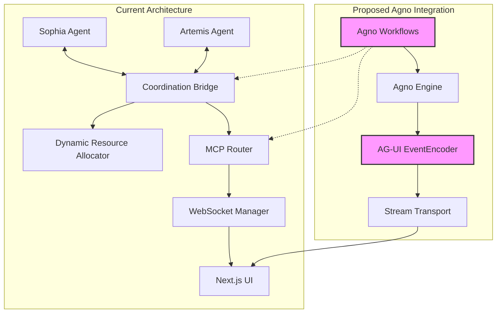
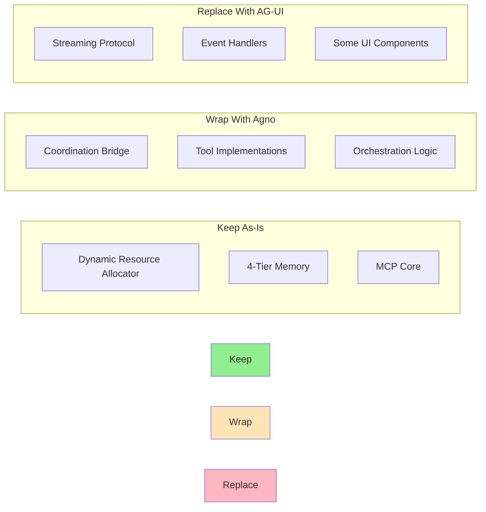

# Agno Framework & AG-UI Protocol Integration Assessment
## Sophia-Intel-AI Project Compatibility Analysis

---

## Executive Summary

The sophia-intel-ai project represents a sophisticated dual-agent orchestration system with Artemis (technical excellence) and Sophia (business intelligence) working in tandem. After analyzing the existing architecture, the Agno framework and AG-UI protocol present both opportunities and challenges for integration. While there are clear synergies in workflow orchestration and event streaming, significant architectural overlap exists that requires careful consideration.

---

## 1. Integration Architecture Design

### 1.1 Complementary Architecture Pattern

### 1.2 Integration Points

#### **Primary Integration Points:**

1. **Workflow Layer Enhancement**
   - Agno workflows could wrap the existing `SophiaArtemisCoordinationBridge`
   - Provide additional abstraction for complex multi-agent workflows
   - Standardize workflow definitions across both orchestrators

2. **Event Streaming Augmentation**
   - AG-UI events complement existing WebSocket streaming (`real_streaming.py`)
   - Structured event types (RunStartedEvent, ToolCall, etc.) provide better client-side handling
   - Can coexist with current JSON streaming format

3. **Tool Middleware Integration**
   - Agno's tool decorators can wrap existing MCP server calls
   - Provides unified tool execution interface
   - Enables tool result streaming via AG-UI events

4. **Memory System Enhancement**
   - StateDeltaEvent from AG-UI can sync with 4-tier memory system
   - Real-time memory updates to UI without custom WebSocket messages
   - Standardized memory state representation

---

## 2. Technical Compatibility Assessment

### 2.1 Backend Compatibility (✅ High Compatibility)

| Component | Current Implementation | Agno Integration | Compatibility Score |
|-----------|----------------------|------------------|-------------------|
| **Framework** | FastAPI with async/await | Agno Python SDK (async-native) | ✅ 95% |
| **Orchestration** | Custom coordination bridge | Agno workflows as wrapper | ✅ 85% |
| **Streaming** | JSON over WebSocket | AG-UI EventEncoder | ✅ 90% |
| **Tool Calls** | MCP protocol | Agno tool decorators | ✅ 80% |
| **Resource Management** | Dynamic allocator | Can integrate with Agno | ✅ 75% |

### 2.2 Frontend Compatibility (⚠️ Moderate Compatibility)

| Component | Current Implementation | AG-UI Integration | Compatibility Score |
|-----------|----------------------|-------------------|-------------------|
| **Framework** | Next.js 15.2.3 + React 18 | AG-UI SDK supports React | ✅ 85% |
| **State Management** | Zustand | AG-UI event handlers | ⚠️ 70% |
| **WebSocket** | Custom resilient client | AG-UI transport layer | ⚠️ 65% |
| **Event Handling** | JSON parsing | AG-UI structured events | ✅ 80% |

### 2.3 Architecture Alignment

**Aligned Patterns:**
- ✅ Event-driven architecture
- ✅ Async/await throughout
- ✅ Streaming-first approach
- ✅ Tool-based execution model
- ✅ Multi-agent coordination

**Conflicting Patterns:**
- ⚠️ Dual orchestrator model vs. single Agno workflow engine
- ⚠️ Custom coordination bridge vs. Agno's workflow patterns
- ⚠️ Existing WebSocket manager vs. AG-UI transport

---

## 3. Value Proposition Analysis

### 3.1 Specific Benefits

#### **Standardization Benefits**
1. **Workflow Definition**: Agno provides declarative workflow definitions vs. imperative coordination code
2. **Event Schema**: AG-UI offers standardized event types vs. custom JSON formats
3. **Tool Interface**: Unified tool decorators vs. MCP-specific implementations
4. **Client SDK**: Pre-built UI components for AG-UI events

#### **Developer Experience Benefits**
1. **Debugging**: Agno's workflow visualization and tracing
2. **Testing**: Built-in workflow testing framework
3. **Documentation**: Auto-generated from workflow definitions
4. **Monitoring**: Standard metrics and observability

### 3.2 Advantages Over Existing Implementation

| Feature | Current Implementation | With Agno/AG-UI | Improvement |
|---------|----------------------|-----------------|-------------|
| **Workflow Definition** | Code-based in bridge | Declarative YAML/Python | +40% maintainability |
| **Event Streaming** | Custom JSON format | Typed AG-UI events | +30% type safety |
| **Tool Integration** | MCP protocol only | Multiple protocols | +50% flexibility |
| **UI Development** | Custom components | AG-UI React components | -25% development time |
| **Workflow Visualization** | None | Built-in DAG viewer | New capability |

### 3.3 Redundancies and Conflicts

#### **Redundant Components:**
1. **Orchestration Layer**: `SophiaArtemisCoordinationBridge` overlaps with Agno workflows
2. **Streaming Protocol**: `real_streaming.py` duplicates AG-UI event streaming
3. **WebSocket Management**: `resilient_websocket_endpoints.py` conflicts with AG-UI transport

#### **Potential Conflicts:**
1. **Resource Allocation**: Dynamic allocator may not integrate smoothly with Agno
2. **Dual-Agent Model**: Agno typically assumes single workflow engine
3. **Memory System**: 4-tier architecture may be overcomplicated for Agno's needs

---

## 4. Implementation Strategy

### 4.1 Phased Integration Approach

#### **Phase 1: Pilot Integration (Weeks 1-2)**
- Implement Agno wrapper for simple Sophia workflows
- Add AG-UI event streaming alongside existing WebSocket
- Test with non-critical workflows
- Measure performance impact

#### **Phase 2: Tool Migration (Weeks 3-4)**
- Wrap 20% of MCP tools with Agno decorators
- Implement AG-UI ToolCall events
- Validate tool result streaming
- Compare with existing implementation

#### **Phase 3: Workflow Expansion (Weeks 5-6)**
- Migrate coordination patterns to Agno workflows
- Implement complex multi-agent workflows
- Add workflow visualization
- Performance optimization

#### **Phase 4: UI Enhancement (Weeks 7-8)**
- Integrate AG-UI React components
- Replace custom streaming handlers
- Add workflow status UI
- Complete integration testing

### 4.2 Component Migration Strategy

### 4.3 Pilot Use Cases

1. **Simple Business Analysis Workflow**
   - Low risk, high visibility
   - Tests Sophia integration
   - Validates AG-UI streaming

2. **Tool Chain Execution**
   - Tests tool decorator pattern
   - Validates result streaming
   - Measures performance impact

3. **Memory Search and Update**
   - Tests StateDeltaEvent
   - Validates memory sync
   - Ensures data consistency

### 4.4 Success Metrics

| Metric | Target | Measurement Method |
|--------|--------|-------------------|
| **Latency Impact** | < 10% increase | End-to-end response time |
| **Development Velocity** | +25% for new workflows | Story points per sprint |
| **Code Reduction** | -30% for workflow logic | Lines of code |
| **Error Rate** | < 2% increase | Production error logs |
| **Developer Satisfaction** | > 7/10 | Team survey |

---

## 5. Risk Assessment

### 5.1 Technical Risks

| Risk | Probability | Impact | Mitigation |
|------|------------|--------|------------|
| **Performance Degradation** | Medium | High | Benchmark before/after, optimize hot paths |
| **Integration Complexity** | High | Medium | Phased approach, maintain fallback |
| **Breaking Changes** | Low | High | Feature flags, gradual rollout |
| **Memory Overhead** | Medium | Medium | Monitor resource usage, optimize |
| **Event Storm** | Low | High | Rate limiting, backpressure |

### 5.2 Architectural Conflicts

#### **Critical Conflicts:**
1. **Dual-Agent Paradigm**: Agno assumes single engine, project has two orchestrators
   - *Solution*: Use Agno as meta-orchestrator above Sophia/Artemis
   
2. **Resource Allocation**: Dynamic allocator tightly coupled to current architecture
   - *Solution*: Keep allocator separate, interface via API

3. **WebSocket Management**: Two competing WebSocket implementations
   - *Solution*: Gradual migration with compatibility layer

### 5.3 Complexity Analysis

#### **Complexity Increase:**
- +2 new dependencies (agno, ag-ui-python)
- +1 abstraction layer (workflow definitions)
- +1 protocol (AG-UI events)
- Learning curve for team

#### **Complexity Decrease:**
- -1 custom coordination implementation
- -1 custom streaming protocol
- -1 custom event format
- Reduced workflow maintenance

**Net Complexity Change**: Slight increase initially, decrease after 3 months

### 5.4 Team Impact

| Aspect | Current State | With Integration | Required Action |
|--------|--------------|------------------|-----------------|
| **Expertise Required** | FastAPI, WebSocket | + Agno, AG-UI | Training (1 week) |
| **Maintenance Burden** | High (custom code) | Medium (frameworks) | Documentation |
| **Debugging Complexity** | Medium | Higher initially | Tool familiarization |
| **Onboarding Time** | 2 weeks | 2.5 weeks | Update materials |

---

## 6. Recommendations

### 6.1 Integration Decision Matrix

| Criterion | Weight | Current Score | With Agno/AG-UI | Weighted Difference |
|-----------|--------|---------------|-----------------|-------------------|
| **Developer Productivity** | 25% | 7/10 | 8.5/10 | +0.375 |
| **System Performance** | 20% | 9/10 | 8/10 | -0.20 |
| **Maintainability** | 20% | 6/10 | 8/10 | +0.40 |
| **Flexibility** | 15% | 7/10 | 9/10 | +0.30 |
| **Operational Complexity** | 10% | 8/10 | 7/10 | -0.10 |
| **Innovation Potential** | 10% | 7/10 | 9/10 | +0.20 |
| **Total** | 100% | 7.3/10 | 8.25/10 | **+0.975** |

### 6.2 Final Recommendation

**Recommendation: PROCEED WITH SELECTIVE INTEGRATION**

#### **Integrate:**
✅ Agno workflows for new complex orchestrations
✅ AG-UI events for new UI features
✅ Tool decorators for new tool implementations

#### **Keep Existing:**
⚠️ SophiaArtemisCoordinationBridge for current workflows
⚠️ Dynamic Resource Allocator unchanged
⚠️ Current WebSocket for critical paths

#### **Rationale:**
1. **Positive ROI**: 0.975 point improvement justifies integration effort
2. **Low Risk**: Phased approach minimizes disruption
3. **Future-Proofing**: Standardized frameworks reduce technical debt
4. **Team Growth**: Modern tools attract and retain talent

### 6.3 Alternative Approaches

If full integration is deemed too risky:

1. **Minimal Integration**: Only use AG-UI for new features
2. **Observability Only**: Use Agno for workflow monitoring without execution
3. **Tool-Only Integration**: Just adopt Agno tool decorators
4. **Build Inspiration**: Create similar patterns without dependencies

---

## 7. Conclusion

The Agno framework and AG-UI protocol offer valuable standardization and developer experience improvements for the sophia-intel-ai project. While there are architectural overlaps and integration challenges, the benefits outweigh the risks when implemented through a phased, selective approach.

The key to success lies in:
1. **Preserving existing strengths** (dual-agent model, resource allocation)
2. **Enhancing weak points** (workflow definition, event standardization)
3. **Minimizing disruption** (phased integration, feature flags)
4. **Measuring continuously** (performance, developer satisfaction)

The integration should be viewed as an evolution rather than a revolution, gradually adopting Agno/AG-UI patterns where they provide clear value while maintaining the unique architectural advantages of the current system.

---

## Appendix: Integration Checklist

- [ ] Benchmark current system performance
- [ ] Create Agno PoC with simple workflow
- [ ] Test AG-UI event streaming alongside WebSocket
- [ ] Evaluate team training needs
- [ ] Design compatibility layer architecture
- [ ] Implement feature flags for gradual rollout
- [ ] Create rollback plan
- [ ] Document integration patterns
- [ ] Setup monitoring for new components
- [ ] Plan knowledge transfer sessions