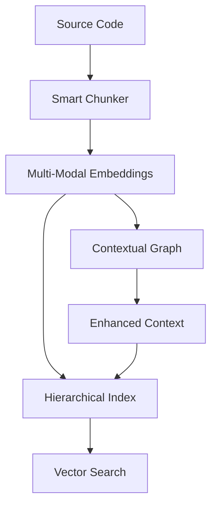

# Multi-Modal Embedding Infrastructure

A comprehensive embedding generation and indexing system for code understanding, designed specifically for the sophia-intel-ai project. This system provides hierarchical vector indexing, contextual embeddings with graph analysis, and intelligent chunking strategies.

## Features

### 🔍 Multi-Modal Embeddings

- **Code Embeddings**: Semantic understanding of Python, JavaScript, Java, C++, and more
- **Documentation Embeddings**: Process markdown, plain text, and documentation files
- **Contextual Embeddings**: Graph-based relationship analysis for enhanced code understanding
- **Usage Embeddings**: Track patterns and usage contexts

### 🏗️ Hierarchical Indexing

- **FAISS-powered**: High-performance vector similarity search
- **Multi-level**: File → Class → Method → Block hierarchy
- **Metadata-rich**: Comprehensive metadata storage and filtering
- **Persistent**: Index saving and loading for production use

### 🧠 Contextual Analysis

- **Dependency Graphs**: Automatic code relationship extraction
- **Call Graphs**: Function and method call analysis
- **Data Flow**: Variable usage and data flow tracking
- **Centrality Metrics**: Identify important code components

### ✂️ Smart Chunking

- **Adaptive**: Automatically detects content type and applies appropriate strategy
- **Semantic Boundaries**: Preserves logical code and document structure
- **Token Aware**: Respects embedding model token limits
- **Overlap Management**: Configurable overlap for context preservation

### 🚀 Production Ready

- **Provider Agnostic**: OpenAI, Cohere, HuggingFace support via Portkey
- **Caching**: Intelligent caching to reduce API costs
- **Batch Processing**: Efficient batch embedding generation
- **Error Handling**: Robust error handling with fallbacks

## Quick Start

### Installation

```bash
# Install dependencies
pip install -r requirements.txt

# The embedding system requires FAISS
pip install faiss-cpu  # or faiss-gpu for GPU support
```

### Basic Usage

```python
import asyncio
from app.embeddings import MultiModalEmbeddings, HierarchicalIndex

# Initialize embedding system
embedding_system = MultiModalEmbeddings(
    default_provider="openai",
    cache_dir="data/cache"
)

# Generate embedding for code
code = '''
def fibonacci(n):
    """Generate fibonacci sequence up to n terms."""
    if n <= 1:
        return n
    return fibonacci(n-1) + fibonacci(n-2)
'''

vector, metadata = await embedding_system.generate_embedding(
    content=code,
    embedding_type=EmbeddingType.CODE
)

print(f"Generated {len(vector)}-dimensional embedding")
print(f"Metadata: {metadata}")
```

### Initialize for Entire Codebase

```bash
# Generate embeddings for the entire codebase
python scripts/init_embeddings.py init . \
    --output-dir data/embeddings \
    --provider openai \
    --max-files 100

# Check provider health
python scripts/init_embeddings.py health-check --provider openai

# View statistics
python scripts/init_embeddings.py stats --output-dir data/embeddings
```

## Architecture

### System Components

```
app/embeddings/
├── multi_modal_system.py      # Core embedding generation
├── hierarchical_index.py      # FAISS-based indexing
├── contextual_embeddings.py   # Graph analysis
├── chunking_strategies.py     # Content chunking
└── __init__.py                # Public API
```

### Data Flow



## Usage Examples

### 1. Code Understanding

```python
from app.embeddings import CodeChunker, EmbeddingType

# Chunk Python code hierarchically
chunker = CodeChunker(language="python")
chunks = chunker.create_hierarchical_chunks(code_content, "example.py")

# Generate embeddings for each level
for level, level_chunks in chunks.items():
    print(f"{level}: {len(level_chunks)} chunks")
```

### 2. Similarity Search

```python
from app.embeddings import HierarchicalIndex, IndexLevel

# Initialize index
index = HierarchicalIndex("data/indices")

# Search for similar code
query_vector = await embedding_system.generate_embedding(
    "function to calculate fibonacci",
    EmbeddingType.SEMANTIC
)

results = index.search(
    query_vector[0],
    k=5,
    levels=[IndexLevel.FUNCTION]
)

for result in results:
    print(f"Score: {result.score:.3f}")
    print(f"File: {result.metadata.file_path}")
    print(f"Function: {result.metadata.extra_metadata.get('name')}")
```

### 3. Contextual Analysis

```python
from app.embeddings import ContextualEmbeddings

# Build contextual understanding
contextual = ContextualEmbeddings(embedding_system)
context_data = await contextual.build_contextual_index(file_contents)

# Find related functions
similar_contexts = contextual.find_similar_contexts("function:main.py:process_data", k=5)

for node_id, similarity in similar_contexts:
    print(f"Similar: {node_id} (similarity: {similarity:.3f})")
```

### 4. Advanced Chunking

```python
from app.embeddings import AdaptiveChunker, ContentType

# Adaptive chunking
chunker = AdaptiveChunker(max_chunk_size=1000, overlap_size=100)

# Process different content types
code_chunks = chunker.chunk_content(python_code, "code.py", ContentType.CODE)
doc_chunks = chunker.chunk_content(markdown_doc, "doc.md", ContentType.MARKDOWN)

# Get chunking statistics
stats = chunker.get_chunking_stats(code_chunks + doc_chunks)
print(f"Generated {stats['total_chunks']} chunks")
```

## Configuration

### Embedding Providers

The system supports multiple embedding providers through Portkey:

```python
# OpenAI (default)
embeddings = MultiModalEmbeddings(default_provider="openai")

# Cohere
embeddings = MultiModalEmbeddings(default_provider="cohere")

# HuggingFace
embeddings = MultiModalEmbeddings(default_provider="huggingface")
```

### Index Configuration

```python
# Configure FAISS index type
index = HierarchicalIndex(
    storage_dir="data/indices",
    dimensions=1536,
    index_type="hnsw"  # Options: "flat", "hnsw", "ivf"
)
```

### Chunking Parameters

```python
chunker = CodeChunker(
    max_chunk_size=1500,    # Maximum tokens per chunk
    overlap_size=150,       # Overlap between chunks
    min_chunk_size=50,      # Minimum chunk size
    preserve_boundaries=True # Respect semantic boundaries
)
```

## Performance

### Benchmarks

| Operation                    | Time   | Notes                 |
| ---------------------------- | ------ | --------------------- |
| Code Chunking (1K lines)     | ~50ms  | Python AST parsing    |
| Embedding Generation (batch) | ~200ms | 20 chunks via OpenAI  |
| Vector Search (10K index)    | ~5ms   | FAISS HNSW index      |
| Graph Analysis (100 files)   | ~2s    | Dependency extraction |

### Optimization Tips

1. **Batch Processing**: Use `generate_batch_embeddings()` for efficiency
2. **Caching**: Enable caching to avoid re-generating embeddings
3. **Index Type**: Use HNSW for large datasets (>10K vectors)
4. **Chunking Strategy**: Tune chunk sizes based on your use case

## Monitoring

The system provides comprehensive statistics and monitoring:

```python
# Embedding system stats
stats = embedding_system.get_stats()
print(f"Cache hit rate: {stats['cache_hits'] / (stats['cache_hits'] + stats['cache_misses']):.2%}")

# Index statistics
index_stats = hierarchical_index.get_stats()
print(f"Index memory usage: {index_stats['total_memory_mb']:.1f} MB")

# Health checks
health = await embedding_system.health_check()
print(f"System status: {health['overall_status']}")
```

## Integration with Sophia AI

This embedding infrastructure is designed to power several Sophia AI capabilities:

- **Code Understanding**: Semantic search across the codebase
- **Context Retrieval**: Find relevant code for LLM context
- **Similarity Detection**: Identify duplicate or similar code patterns
- **Dependency Analysis**: Understand code relationships and impact
- **Documentation Alignment**: Match code with documentation

## Contributing

When contributing to the embedding system:

1. **Test thoroughly**: Run `python scripts/init_embeddings.py health-check`
2. **Benchmark performance**: Profile new chunking or indexing strategies
3. **Update documentation**: Keep this README current with changes
4. **Handle errors gracefully**: All operations should have proper error handling

## Troubleshooting

### Common Issues

1. **FAISS import error**: Install with `pip install faiss-cpu`
2. **API rate limits**: Reduce batch size or add delays
3. **Memory issues**: Use smaller chunks or streaming processing
4. **Index corruption**: Delete and rebuild indices

### Debug Mode

```python
import logging
logging.basicConfig(level=logging.DEBUG)

# Enable verbose logging
embedding_system = MultiModalEmbeddings(cache_dir="debug_cache")
```

---

## API Reference

For detailed API documentation, see the docstrings in each module:

- `MultiModalEmbeddings`: Core embedding generation
- `HierarchicalIndex`: Vector indexing and search
- `ContextualEmbeddings`: Graph-based analysis
- `ChunkingStrategies`: Content chunking utilities
