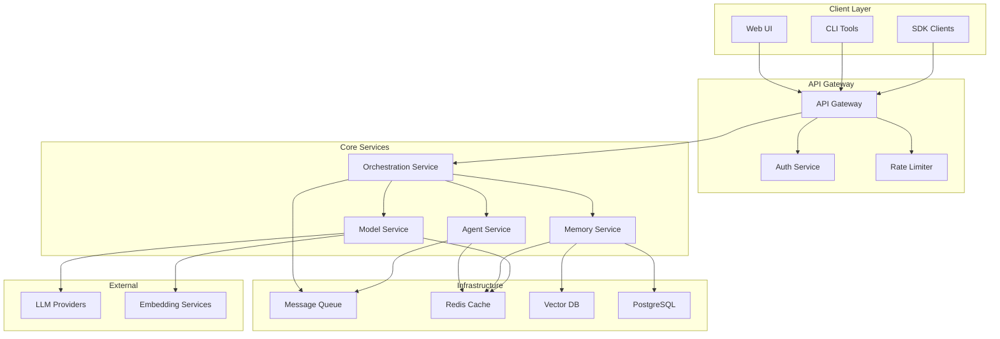
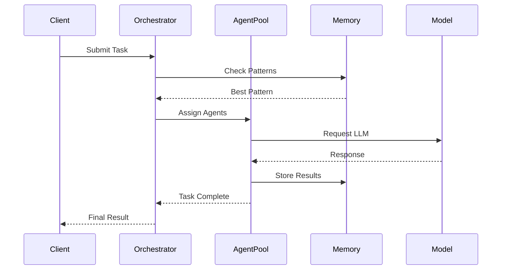

# Sophia Intel AI - Architectural Redesign Plan

## Executive Summary

This plan outlines a comprehensive architectural redesign of the Sophia Intel AI system to improve scalability, maintainability, and development velocity. The redesign focuses on modularization, clear domain boundaries, and modern architectural patterns.

## Current State Analysis

### Identified Issues
1. **Monolithic Structure**: 50+ subdirectories in `/app` with unclear boundaries
2. **Duplication**: Multiple implementations of similar functionality (memory systems, routers, etc.)
3. **Tight Coupling**: Components directly depend on each other without clear interfaces
4. **Inconsistent Patterns**: Different architectural approaches across modules
5. **Complex Dependencies**: Difficult to understand and modify dependency chains
6. **Scalability Limitations**: Current structure makes horizontal scaling challenging

### Current Components
- **API Layer**: FastAPI unified server with 20+ routers
- **LLM Integration**: Portkey/OpenRouter gateway with 300+ models
- **Swarm Intelligence**: Multi-agent coordination patterns
- **Memory Systems**: Enhanced memory with pattern storage
- **UI Layer**: Multiple React/Next.js frontends

## Proposed Architecture

### High-Level Design



### Domain-Driven Design Approach

#### 1. Bounded Contexts
- **Orchestration Domain**: Workflow management, task routing
- **Agent Domain**: Agent lifecycle, swarm patterns, collaboration
- **Memory Domain**: Knowledge storage, retrieval, pattern learning
- **Model Domain**: LLM routing, prompt management, embeddings
- **Analytics Domain**: Metrics, cost tracking, performance monitoring

#### 2. Service Architecture
Each domain becomes a separate service with clear boundaries:

```
sophia-intel-ai/
├── services/
│   ├── orchestration/
│   │   ├── api/
│   │   ├── domain/
│   │   ├── infrastructure/
│   │   └── tests/
│   ├── agents/
│   │   ├── api/
│   │   ├── domain/
│   │   ├── patterns/
│   │   └── tests/
│   ├── memory/
│   │   ├── api/
│   │   ├── domain/
│   │   ├── storage/
│   │   └── tests/
│   ├── models/
│   │   ├── api/
│   │   ├── routing/
│   │   ├── providers/
│   │   └── tests/
│   └── analytics/
│       ├── api/
│       ├── collectors/
│       ├── storage/
│       └── tests/
├── shared/
│   ├── contracts/
│   ├── events/
│   ├── utilities/
│   └── types/
├── infrastructure/
│   ├── kubernetes/
│   ├── terraform/
│   ├── docker/
│   └── monitoring/
└── frontend/
    ├── web-ui/
    ├── admin-ui/
    └── shared-components/
```

## Implementation Strategy

### Phase 1: Foundation (Weeks 1-4)
- Set up new project structure
- Create shared contracts and interfaces
- Implement event-driven communication patterns
- Set up CI/CD pipeline

### Phase 2: Core Services (Weeks 5-8)
- Extract and refactor orchestration service
- Implement agent service with clean patterns
- Modernize memory service
- Create unified model routing service

### Phase 3: Migration (Weeks 9-12)
- Migrate existing functionality incrementally
- Implement adapters for backward compatibility
- Update frontend to use new APIs
- Comprehensive testing

### Phase 4: Optimization (Weeks 13-16)
- Performance tuning
- Implement caching strategies
- Add monitoring and observability
- Documentation and training

## Key Design Decisions

### 1. Microservices vs Modular Monolith
**Recommendation**: Start with a **Modular Monolith** approach
- Easier to manage initially
- Clear module boundaries
- Can evolve to microservices later
- Lower operational complexity

### 2. Communication Patterns
- **Synchronous**: REST/gRPC for real-time operations
- **Asynchronous**: Event-driven for agent coordination
- **Message Queue**: Redis Streams or RabbitMQ for task distribution

### 3. Data Storage Strategy
- **PostgreSQL**: Primary data, configurations, audit logs
- **Weaviate**: Vector embeddings and semantic search
- **Redis**: Caching, session management, real-time state
- **S3/MinIO**: Large file storage, model artifacts

### 4. Agent Coordination


## Scalability Improvements

### 1. Horizontal Scaling
- Stateless services design
- Load balancing with consistent hashing
- Auto-scaling based on metrics

### 2. Performance Optimizations
- Connection pooling for all external services
- Batch processing for embeddings
- Lazy loading of heavy resources
- Circuit breakers for external dependencies

### 3. Caching Strategy
- L1: In-memory cache (application level)
- L2: Redis cache (distributed)
- L3: CDN for static assets
- Cache invalidation via events

## Maintainability Improvements

### 1. Code Organization
- Clear separation of concerns
- Dependency injection
- Interface-based programming
- Comprehensive error handling

### 2. Testing Strategy
- Unit tests: 80% coverage minimum
- Integration tests for service boundaries
- End-to-end tests for critical paths
- Performance benchmarks

### 3. Documentation
- API documentation (OpenAPI)
- Architecture decision records (ADRs)
- Runbooks for operations
- Developer onboarding guide

### 4. Monitoring & Observability
- Structured logging (JSON)
- Distributed tracing (OpenTelemetry)
- Metrics collection (Prometheus)
- Alerting rules (PagerDuty/Opsgenie)

## Technology Stack Recommendations

### Backend
- **Language**: Python 3.11+ (type hints mandatory)
- **Framework**: FastAPI for APIs, Pydantic for validation
- **Async**: asyncio throughout
- **Testing**: pytest, pytest-asyncio

### Infrastructure
- **Container**: Docker with multi-stage builds
- **Orchestration**: Kubernetes or Docker Swarm
- **CI/CD**: GitHub Actions or GitLab CI
- **Monitoring**: Prometheus + Grafana

### Development Tools
- **Code Quality**: Black, Ruff, mypy
- **Pre-commit**: Automated checks
- **Documentation**: Sphinx or MkDocs
- **API Testing**: Postman/Insomnia collections

## Migration Approach

### 1. Strangler Fig Pattern
- Build new components alongside old
- Gradually redirect traffic
- Remove old code once stable

### 2. Feature Flags
- Control rollout of new features
- A/B testing capabilities
- Quick rollback mechanism

### 3. Data Migration
- Dual writes during transition
- Background migration jobs
- Validation and reconciliation

## Risk Mitigation

### Technical Risks
- **Risk**: Service communication failures
  - **Mitigation**: Circuit breakers, retries, fallbacks
- **Risk**: Data consistency issues
  - **Mitigation**: Event sourcing, saga pattern
- **Risk**: Performance degradation
  - **Mitigation**: Load testing, gradual rollout

### Operational Risks
- **Risk**: Increased complexity
  - **Mitigation**: Comprehensive documentation, training
- **Risk**: Deployment failures
  - **Mitigation**: Blue-green deployments, rollback plans

## Success Metrics

### Technical Metrics
- API response time < 200ms (p95)
- System availability > 99.9%
- Deployment frequency > 10x per week
- Mean time to recovery < 1 hour

### Business Metrics
- Developer productivity increase by 40%
- Bug rate reduction by 50%
- Feature delivery time reduction by 30%
- Operational cost reduction by 20%

## Next Steps

1. Review and approve architectural design
2. Set up new project structure
3. Create detailed implementation plan
4. Form implementation team
5. Begin Phase 1 implementation

## Appendix

### A. Detailed Service Specifications
[To be developed for each service]

### B. API Contract Examples
[To be developed with OpenAPI specs]

### C. Database Schemas
[To be developed with migration scripts]

### D. Deployment Configurations
[To be developed with Kubernetes manifests]