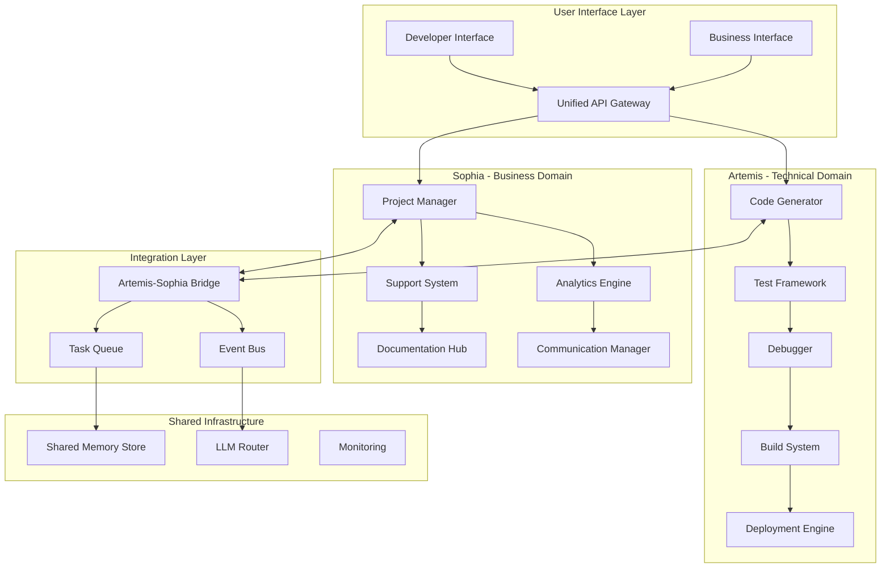
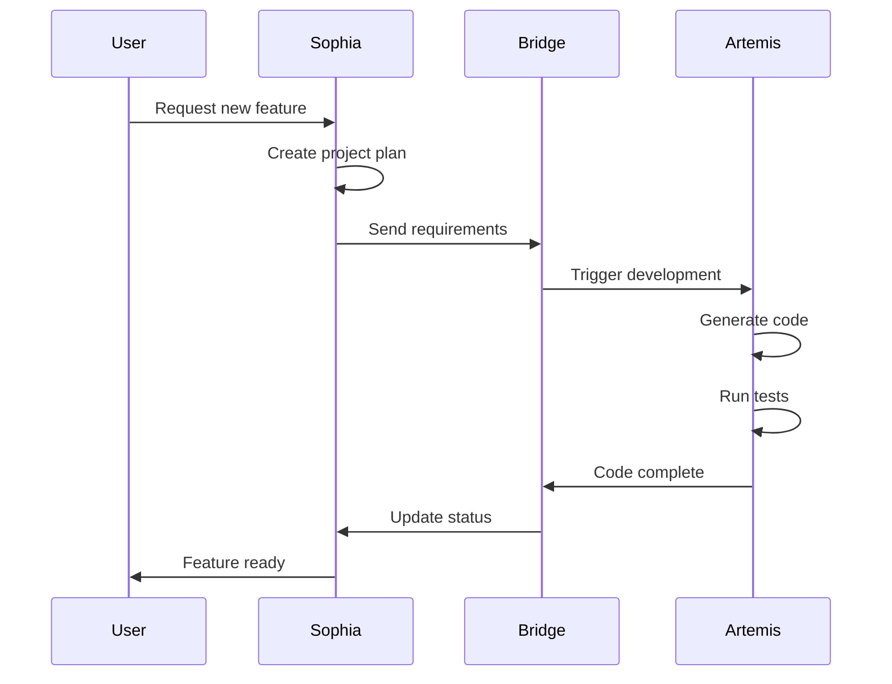
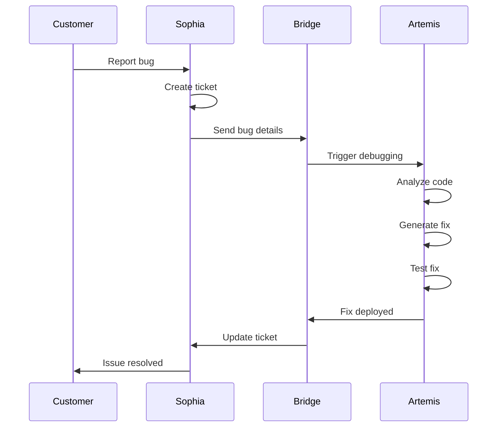

# Artemis & Sophia: Technical vs Business Separation Architecture

## Executive Summary

This architecture redesigns Artemis and Sophia with clear role separation:
- **Artemis**: Technical Development Platform - All coding, testing, debugging, and deployment tasks
- **Sophia**: Business Operations Platform - Project planning, customer support, analytics, and documentation

## System Roles and Responsibilities

### Artemis - Technical Development Platform

**Core Mission**: Execute all technical development tasks autonomously and efficiently

**Primary Responsibilities**:
1. **Code Generation & Implementation**
   - Generate new code from specifications
   - Implement features and functionality
   - Refactor existing code
   - Optimize performance

2. **Testing & Quality Assurance**
   - Write unit tests
   - Create integration tests
   - Perform code coverage analysis
   - Execute test suites

3. **Debugging & Troubleshooting**
   - Identify bugs and issues
   - Debug runtime errors
   - Analyze stack traces
   - Fix security vulnerabilities

4. **Deployment & DevOps**
   - Build and package applications
   - Deploy to various environments
   - Manage CI/CD pipelines
   - Handle infrastructure as code

### Sophia - Business Operations Platform

**Core Mission**: Manage all business, planning, and customer-facing operations

**Primary Responsibilities**:
1. **Project Management**
   - Sprint planning and tracking
   - Task prioritization
   - Resource allocation
   - Timeline management

2. **Customer Support**
   - Handle customer inquiries
   - Process support tickets
   - Manage feedback loops
   - Coordinate with technical teams

3. **Business Analytics**
   - Generate business reports
   - Track KPIs and metrics
   - Analyze market trends
   - Financial analysis

4. **Documentation & Communication**
   - Create user documentation
   - Write business requirements
   - Manage knowledge base
   - Internal/external communications

## High-Level Architecture



## Detailed Component Architecture

### Artemis Components

```
artemis/
├── core/
│   ├── code-generator/
│   │   ├── templates/         # Code templates
│   │   ├── parsers/          # Requirement parsers
│   │   ├── generators/       # Language-specific generators
│   │   └── validators/       # Code validators
│   ├── testing/
│   │   ├── unit-tests/       # Unit test generation
│   │   ├── integration/      # Integration test creation
│   │   ├── coverage/         # Coverage analysis
│   │   └── runners/          # Test executors
│   ├── debugging/
│   │   ├── analyzers/        # Error analysis
│   │   ├── tracers/         # Stack trace analysis
│   │   ├── fixers/          # Automated fix generation
│   │   └── profilers/       # Performance profiling
│   └── deployment/
│       ├── builders/         # Build orchestration
│       ├── packagers/        # Package creation
│       ├── deployers/        # Deployment strategies
│       └── rollback/         # Rollback mechanisms
├── languages/
│   ├── python/
│   ├── javascript/
│   ├── typescript/
│   ├── go/
│   └── rust/
├── frameworks/
│   ├── react/
│   ├── django/
│   ├── fastapi/
│   └── nextjs/
└── tools/
    ├── linters/
    ├── formatters/
    ├── analyzers/
    └── optimizers/
```

### Sophia Components

```
sophia/
├── core/
│   ├── project-management/
│   │   ├── planning/         # Sprint & project planning
│   │   ├── tracking/         # Progress tracking
│   │   ├── estimation/       # Time/effort estimation
│   │   └── reporting/        # Status reports
│   ├── customer-support/
│   │   ├── ticketing/        # Ticket management
│   │   ├── knowledge-base/   # KB management
│   │   ├── chat/            # Customer chat
│   │   └── escalation/      # Issue escalation
│   ├── analytics/
│   │   ├── metrics/          # Business metrics
│   │   ├── dashboards/       # Dashboard generation
│   │   ├── reports/          # Report creation
│   │   └── forecasting/      # Predictive analytics
│   └── documentation/
│       ├── technical/        # Technical docs
│       ├── user/           # User guides
│       ├── api/            # API documentation
│       └── process/        # Process documentation
├── integrations/
│   ├── jira/
│   ├── slack/
│   ├── zendesk/
│   ├── salesforce/
│   └── google-workspace/
├── workflows/
│   ├── onboarding/
│   ├── support/
│   ├── planning/
│   └── reporting/
└── templates/
    ├── documents/
    ├── reports/
    ├── communications/
    └── presentations/
```

## Integration & Communication

### Artemis-Sophia Bridge Protocol

```yaml
bridge_communication:
  protocols:
    - event_driven: "Real-time events"
    - request_response: "Synchronous calls"
    - async_queue: "Background tasks"
  
  event_types:
    from_artemis:
      - code_completed
      - test_results
      - deployment_status
      - bug_fixed
      - build_failed
    
    from_sophia:
      - task_created
      - requirement_updated
      - priority_changed
      - customer_feedback
      - deadline_approaching
```

### Example Workflows

#### 1. Feature Development Flow



#### 2. Bug Fix Flow



## Data Models

### Artemis Data Models

```python
# Code Task Model
class CodeTask:
    id: str
    type: Literal["feature", "bug_fix", "refactor", "optimization"]
    language: str
    framework: Optional[str]
    requirements: List[str]
    constraints: List[str]
    priority: int
    status: Literal["pending", "in_progress", "testing", "completed"]
    
# Test Result Model
class TestResult:
    task_id: str
    test_type: Literal["unit", "integration", "e2e"]
    passed: int
    failed: int
    coverage: float
    errors: List[str]
    
# Deployment Model
class Deployment:
    task_id: str
    environment: Literal["dev", "staging", "production"]
    version: str
    status: Literal["pending", "in_progress", "completed", "failed"]
    rollback_available: bool
```

### Sophia Data Models

```python
# Project Model
class Project:
    id: str
    name: str
    client: str
    status: Literal["planning", "active", "on_hold", "completed"]
    start_date: datetime
    end_date: datetime
    team_members: List[str]
    
# Support Ticket Model
class SupportTicket:
    id: str
    customer_id: str
    priority: Literal["low", "medium", "high", "critical"]
    category: str
    description: str
    status: Literal["open", "in_progress", "waiting", "resolved"]
    resolution: Optional[str]
    
# Analytics Report Model
class Report:
    id: str
    type: Literal["performance", "financial", "customer", "project"]
    period: str
    metrics: Dict[str, Any]
    insights: List[str]
    recommendations: List[str]
```

## Technology Stack

### Artemis Stack
- **Core Language**: Python 3.11+ (for AI/ML integration)
- **Secondary Languages**: Go (for performance-critical components)
- **Testing**: Pytest, Jest, Go testing
- **Code Analysis**: AST parsing, Tree-sitter
- **Build Tools**: Docker, Bazel
- **Deployment**: Kubernetes, Terraform

### Sophia Stack
- **Core Language**: Python 3.11+
- **Web Framework**: FastAPI
- **Workflow Engine**: Temporal
- **Analytics**: Pandas, Plotly
- **Documentation**: MkDocs, Sphinx
- **Integrations**: REST APIs, GraphQL

### Shared Infrastructure
- **Message Queue**: NATS or RabbitMQ
- **Database**: PostgreSQL (relational), MongoDB (documents)
- **Cache**: Redis
- **Vector Store**: Weaviate
- **LLM Router**: LiteLLM or Portkey
- **Monitoring**: Prometheus, Grafana
- **Tracing**: OpenTelemetry

## Implementation Phases

### Phase 1: Foundation (Week 1-2)
- Set up Artemis core structure
- Set up Sophia core structure
- Implement basic bridge communication
- Create shared data models

### Phase 2: Core Features (Week 3-5)
- **Artemis**: Code generation, basic testing
- **Sophia**: Project management, ticket system
- **Bridge**: Event handling, queue processing

### Phase 3: Advanced Features (Week 6-8)
- **Artemis**: Debugging, deployment automation
- **Sophia**: Analytics, documentation generation
- **Integration**: Workflow orchestration

### Phase 4: Production Ready (Week 9-10)
- Performance optimization
- Security hardening
- Monitoring setup
- Documentation completion

## Success Metrics

### Artemis Metrics
- Code generation time < 30 seconds
- Test execution time < 5 minutes
- Deployment success rate > 95%
- Bug fix time < 2 hours

### Sophia Metrics
- Ticket response time < 5 minutes
- Report generation < 1 minute
- Project tracking accuracy > 98%
- Customer satisfaction > 4.5/5

## Migration Strategy

1. **Extract Current Components**
   - Identify coding-related functions in current system
   - Identify business-related functions

2. **Create New Services**
   - Build Artemis service with coding focus
   - Build Sophia service with business focus

3. **Implement Bridge**
   - Create communication layer
   - Set up event handling

4. **Gradual Migration**
   - Move features incrementally
   - Test each migration step
   - Maintain backward compatibility

5. **Cutover**
   - Switch to new architecture
   - Monitor performance
   - Gather feedback

## Conclusion

This architecture creates a clear separation of concerns:
- **Artemis** becomes a powerful technical development engine
- **Sophia** becomes a comprehensive business operations platform
- The bridge ensures seamless communication while maintaining independence

This design enables:
1. Specialized optimization for each domain
2. Independent scaling based on workload
3. Clear responsibility boundaries
4. Easier maintenance and updates
5. Better resource utilization