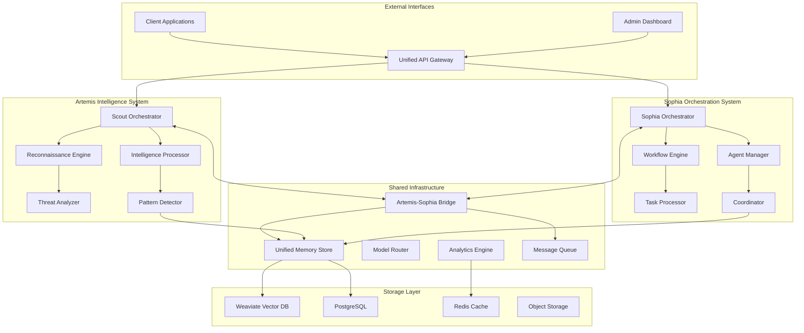
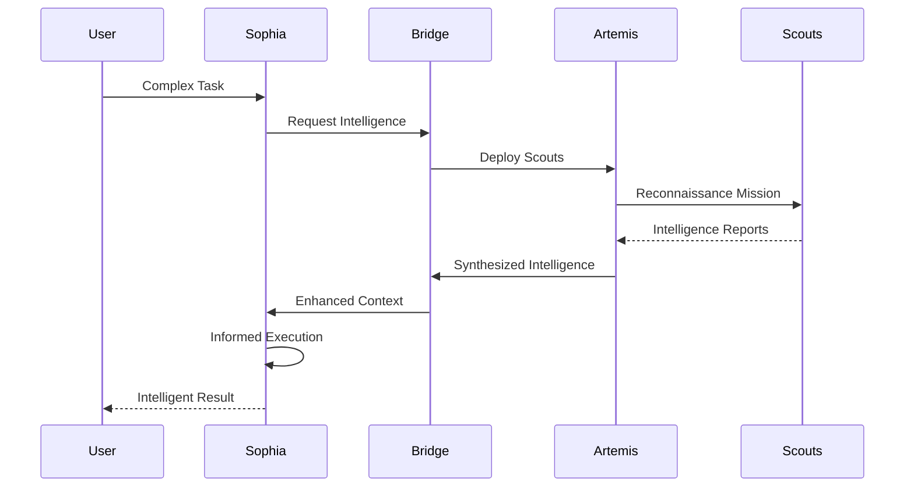
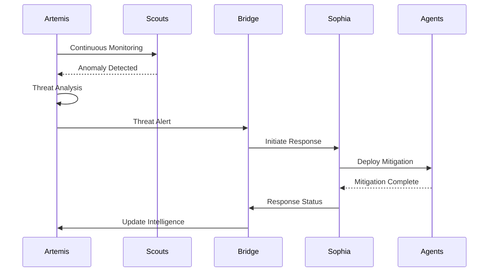

# Artemis & Sophia Intel AI - Complete Architectural Redesign Plan

## Executive Summary

This comprehensive plan redesigns BOTH the Artemis scout intelligence system and Sophia orchestration platform as equal, interconnected systems. Each system maintains its specialized purpose while sharing core infrastructure and integration points.

## System Overview

### Artemis - Scout Intelligence System
**Purpose**: Distributed reconnaissance, intelligence gathering, and threat detection
**Core Capabilities**:
- Autonomous scout swarm deployment
- Pattern recognition and anomaly detection
- Intelligence synthesis and reporting
- Proactive threat assessment
- Multi-domain reconnaissance (code, infrastructure, data)

### Sophia - Orchestration Platform
**Purpose**: General AI agent coordination and workflow management
**Core Capabilities**:
- Multi-agent task orchestration
- Workflow automation
- Memory and pattern management
- LLM routing and optimization
- General-purpose AI coordination

## Current State Analysis

### Artemis Current Issues
1. **Fragmented Scout Coordination**: Scout swarms operate in isolation
2. **Limited Intelligence Sharing**: No unified intelligence repository
3. **Manual Reconnaissance**: Requires human-initiated scout deployment
4. **Weak Pattern Recognition**: Limited cross-domain pattern analysis
5. **Poor Sophia Integration**: Minimal communication between systems

### Sophia Current Issues
1. **Monolithic Structure**: 50+ subdirectories with unclear boundaries
2. **No Artemis Awareness**: Cannot leverage scout intelligence
3. **Reactive Processing**: Only responds to explicit requests
4. **Limited Proactive Capabilities**: No autonomous monitoring
5. **Siloed Memory**: No shared intelligence with Artemis

## Proposed Dual-System Architecture



## Artemis System Design

### Scout Service Architecture
```
artemis/
├── scout-orchestrator/
│   ├── deployment/          # Scout deployment strategies
│   ├── coordination/        # Multi-scout coordination
│   ├── mission-planning/    # Reconnaissance mission planning
│   └── reporting/          # Intelligence reporting
├── reconnaissance-engine/
│   ├── code-analysis/      # Source code reconnaissance
│   ├── infra-scanning/     # Infrastructure discovery
│   ├── data-exploration/   # Data pattern exploration
│   └── api-discovery/      # API endpoint mapping
├── intelligence-processor/
│   ├── synthesis/          # Multi-source intelligence fusion
│   ├── classification/    # Intelligence categorization
│   ├── prioritization/    # Threat/opportunity ranking
│   └── correlation/       # Cross-domain correlation
├── threat-analyzer/
│   ├── vulnerability-detection/
│   ├── anomaly-detection/
│   ├── risk-assessment/
│   └── mitigation-planning/
└── pattern-detector/
    ├── behavioral-patterns/
    ├── structural-patterns/
    ├── temporal-patterns/
    └── emergent-patterns/
```

### Artemis Core Components

#### 1. Scout Orchestrator
- **Autonomous Deployment**: Self-initiating scout missions based on triggers
- **Swarm Coordination**: Managing 10-100 concurrent scout agents
- **Mission Templates**: Pre-configured reconnaissance patterns
- **Adaptive Strategies**: Dynamic scout behavior based on findings

#### 2. Reconnaissance Engine
- **Multi-Domain Scanning**: Code, infrastructure, APIs, data
- **Depth Control**: Configurable reconnaissance depth (surface/deep/exhaustive)
- **Stealth Modes**: Passive observation vs active probing
- **Coverage Tracking**: Ensuring complete target coverage

#### 3. Intelligence Processor
- **Real-time Synthesis**: Combining scout reports as they arrive
- **Deduplication**: Removing redundant intelligence
- **Enrichment**: Adding context from historical data
- **Confidence Scoring**: Reliability assessment of intelligence

#### 4. Threat Analyzer
- **Proactive Detection**: Identifying potential issues before they manifest
- **Risk Quantification**: Numerical risk scores for prioritization
- **Attack Path Analysis**: Mapping potential exploit chains
- **Mitigation Recommendations**: Automated fix suggestions

#### 5. Pattern Detector
- **Cross-Domain Patterns**: Patterns spanning code, config, and behavior
- **Temporal Analysis**: Time-based pattern evolution
- **Anomaly Baseline**: Normal vs abnormal pattern detection
- **Pattern Library**: Reusable pattern definitions

## Sophia System Design

### Sophia Service Architecture
```
sophia/
├── orchestration-core/
│   ├── workflow-engine/     # Complex workflow management
│   ├── task-scheduler/      # Task scheduling and prioritization
│   ├── resource-manager/    # Agent resource allocation
│   └── execution-monitor/   # Execution tracking
├── agent-manager/
│   ├── agent-registry/      # Available agent catalog
│   ├── capability-mapper/   # Agent capability mapping
│   ├── load-balancer/      # Agent workload distribution
│   └── health-monitor/     # Agent health tracking
├── coordination-engine/
│   ├── consensus-builder/   # Multi-agent consensus
│   ├── conflict-resolver/   # Disagreement resolution
│   ├── vote-aggregator/    # Democratic decision making
│   └── debate-moderator/   # Structured debate management
├── task-processor/
│   ├── task-decomposer/    # Breaking complex tasks
│   ├── dependency-resolver/ # Task dependency management
│   ├── parallel-executor/   # Concurrent task execution
│   └── result-aggregator/  # Combining task results
└── memory-interface/
    ├── context-manager/     # Conversation context
    ├── pattern-learner/     # Learning from executions
    ├── knowledge-indexer/   # Knowledge organization
    └── retrieval-optimizer/ # Optimized memory access
```

### Sophia Core Components

#### 1. Orchestration Core
- **Dynamic Workflows**: Self-modifying execution paths
- **Priority Queuing**: Intelligent task prioritization
- **Resource Optimization**: Efficient agent utilization
- **Real-time Monitoring**: Live execution tracking

#### 2. Agent Manager
- **Agent Specialization**: Role-based agent assignment
- **Capacity Planning**: Predictive agent scaling
- **Performance Tracking**: Agent effectiveness metrics
- **Fault Tolerance**: Automatic failover and recovery

#### 3. Coordination Engine
- **Swarm Intelligence**: Emergent behavior from agent groups
- **Consensus Mechanisms**: Various voting strategies
- **Debate Protocols**: Structured argumentation
- **Quality Gates**: Multi-stage approval processes

## Artemis-Sophia Integration

### Bridge Service Design
```
bridge/
├── event-translator/       # Artemis events ↔ Sophia events
├── data-transformer/      # Data format conversion
├── protocol-adapter/      # Communication protocol adaptation
├── sync-manager/         # State synchronization
└── routing-engine/       # Intelligent message routing
```

### Integration Patterns

#### 1. Intelligence-Driven Orchestration


#### 2. Proactive Threat Response


## Shared Infrastructure

### Unified Memory Architecture
```
memory/
├── intelligence-store/     # Artemis intelligence data
├── execution-store/       # Sophia execution history
├── pattern-store/        # Shared patterns
├── knowledge-graph/      # Connected knowledge
└── vector-store/        # Embeddings for both systems
```

### Message Queue Design
- **Artemis Channels**: High-priority intelligence streams
- **Sophia Channels**: Task and workflow queues
- **Bridge Channels**: Cross-system communication
- **Priority Levels**: Critical, High, Normal, Low
- **Dead Letter Queues**: Failed message handling

### Model Router Configuration
```yaml
model_routing:
  artemis:
    reconnaissance:
      primary: "claude-3-sonnet"
      fallback: "gpt-4"
    analysis:
      primary: "deepseek-v3"
      fallback: "gemini-2.5"
  sophia:
    orchestration:
      primary: "gpt-4"
      fallback: "claude-3"
    execution:
      primary: "qwen-2.5-coder"
      fallback: "codellama"
  shared:
    embeddings: "text-embedding-3-large"
    vision: "gpt-4-vision"
```

## Implementation Phases

### Phase 1: Foundation (Weeks 1-3)
**Artemis Tasks**:
- Set up Artemis service structure
- Implement Scout Orchestrator base
- Create reconnaissance templates
- Build intelligence data models

**Sophia Tasks**:
- Set up Sophia service structure
- Implement Orchestration Core
- Create workflow templates
- Build execution data models

**Shared Tasks**:
- Implement Bridge service
- Set up unified memory
- Configure message queues
- Deploy Pulumi infrastructure

### Phase 2: Core Services (Weeks 4-7)
**Artemis Development**:
- Complete Reconnaissance Engine
- Implement Intelligence Processor
- Build Threat Analyzer
- Develop Pattern Detector

**Sophia Development**:
- Complete Agent Manager
- Implement Coordination Engine
- Build Task Processor
- Develop Memory Interface

**Integration Work**:
- Connect Bridge to both systems
- Implement event translation
- Test cross-system communication
- Validate data flows

### Phase 3: Advanced Features (Weeks 8-11)
**Artemis Features**:
- Autonomous scout deployment
- Multi-domain correlation
- Predictive threat detection
- Pattern library expansion

**Sophia Features**:
- Complex workflow support
- Advanced consensus mechanisms
- Parallel execution optimization
- Learning from executions

**Joint Capabilities**:
- Intelligence-driven orchestration
- Proactive threat response
- Shared pattern recognition
- Cross-system optimization

### Phase 4: Production Readiness (Weeks 12-16)
- Performance optimization
- Security hardening
- Monitoring setup
- Documentation completion
- Team training
- Phased rollout

## Technology Stack

### Artemis-Specific
- **Languages**: Python 3.11+ (analysis), Go (high-performance scouts)
- **Frameworks**: FastAPI (APIs), Celery (async tasks)
- **Analysis**: Pandas, NumPy, Scikit-learn
- **Scanning**: Nmap, OWASP ZAP integration

### Sophia-Specific
- **Languages**: Python 3.11+ (orchestration)
- **Frameworks**: FastAPI, Pydantic, SQLModel
- **Workflow**: Temporal or Airflow
- **Consensus**: Custom voting algorithms

### Shared Infrastructure
- **IaC**: Pulumi (TypeScript)
- **Containers**: Docker, Kubernetes
- **Queue**: NATS or RabbitMQ
- **Cache**: Redis
- **Vector DB**: Weaviate
- **Monitoring**: Prometheus, Grafana
- **Tracing**: OpenTelemetry

## Pulumi Infrastructure

```typescript
// pulumi/index.ts
import * as pulumi from "@pulumi/pulumi";
import * as k8s from "@pulumi/kubernetes";
import * as aws from "@pulumi/aws";

// Artemis Services
const artemisNamespace = new k8s.core.v1.Namespace("artemis");
const artemisScoutDeployment = new k8s.apps.v1.Deployment("artemis-scout", {
    metadata: { namespace: artemisNamespace.metadata.name },
    spec: {
        replicas: 3,
        selector: { matchLabels: { app: "artemis-scout" } },
        template: {
            metadata: { labels: { app: "artemis-scout" } },
            spec: {
                containers: [{
                    name: "scout",
                    image: "artemis/scout:latest",
                    resources: {
                        requests: { memory: "256Mi", cpu: "250m" },
                        limits: { memory: "512Mi", cpu: "500m" }
                    }
                }]
            }
        }
    }
});

// Sophia Services
const sophiaNamespace = new k8s.core.v1.Namespace("sophia");
const sophiaOrchestratorDeployment = new k8s.apps.v1.Deployment("sophia-orchestrator", {
    metadata: { namespace: sophiaNamespace.metadata.name },
    spec: {
        replicas: 2,
        selector: { matchLabels: { app: "sophia-orchestrator" } },
        template: {
            metadata: { labels: { app: "sophia-orchestrator" } },
            spec: {
                containers: [{
                    name: "orchestrator",
                    image: "sophia/orchestrator:latest",
                    resources: {
                        requests: { memory: "512Mi", cpu: "500m" },
                        limits: { memory: "1Gi", cpu: "1000m" }
                    }
                }]
            }
        }
    }
});

// Shared Infrastructure
const sharedNamespace = new k8s.core.v1.Namespace("shared");
const bridgeService = new k8s.core.v1.Service("artemis-sophia-bridge", {
    metadata: { namespace: sharedNamespace.metadata.name },
    spec: {
        selector: { app: "bridge" },
        ports: [{ port: 8080, targetPort: 8080 }]
    }
});
```

## Success Metrics

### Artemis Metrics
- Scout deployment time < 5 seconds
- Intelligence synthesis < 30 seconds
- Pattern detection accuracy > 90%
- Threat detection rate > 95%
- False positive rate < 5%

### Sophia Metrics
- Orchestration latency < 200ms
- Agent utilization > 80%
- Workflow success rate > 95%
- Consensus time < 10 seconds
- Task throughput > 1000/hour

### Integration Metrics
- Bridge latency < 50ms
- Cross-system data sync < 1 second
- Intelligence-to-action time < 2 minutes
- System availability > 99.9%

## Risk Mitigation

### Technical Risks
- **Scout Overload**: Rate limiting and circuit breakers
- **Intelligence Conflicts**: Consensus mechanisms and confidence scoring
- **Bridge Failure**: Redundant bridges and fallback protocols
- **Data Inconsistency**: Event sourcing and reconciliation

### Operational Risks
- **Complexity Management**: Comprehensive documentation and training
- **Performance Degradation**: Auto-scaling and load balancing
- **Security Vulnerabilities**: Regular security audits and penetration testing

## Migration Strategy

### Artemis Migration
1. Extract scout components from current codebase
2. Implement new Scout Orchestrator
3. Migrate intelligence processing logic
4. Build pattern detection capabilities
5. Integrate with Sophia via Bridge

### Sophia Migration
1. Extract orchestration components
2. Implement new workflow engine
3. Migrate agent management
4. Build coordination mechanisms
5. Connect to Artemis intelligence

### Data Migration
1. Export existing patterns and knowledge
2. Transform to new schema
3. Load into unified memory
4. Validate data integrity
5. Switch over gradually with feature flags

## Conclusion

This redesign creates two powerful, specialized systems - Artemis for intelligence and Sophia for orchestration - that work together seamlessly. The architecture supports independent scaling, specialized optimization, and synergistic operation while maintaining clear boundaries and responsibilities.

The implementation prioritizes:
1. Equal development attention to both systems
2. Strong integration without tight coupling
3. Leveraging each system's strengths
4. Shared infrastructure where beneficial
5. Independent evolution capability

This design positions the combined Artemis-Sophia platform as a comprehensive AI intelligence and orchestration solution with both proactive (Artemis) and reactive (Sophia) capabilities.