# Service Dependency Graph

## System Architecture Overview

```mermaid
graph TD
    %% External Services
    Apollo[Apollo.io API] 
    Slack[Slack API]
    SF[Salesforce API]
    AT[Airtable API]
    AS[Asana API]
    LN[Linear API]
    HS[HubSpot API]
    LK[Looker API]
    NS[NetSuite API]
    
    %% AI Model Services
    ANT[Anthropic API]
    OAI[OpenAI API]
    GRQ[Groq API]
    TOG[Together AI]
    PTK[Portkey API]
    
    %% Core Infrastructure
    PG[(PostgreSQL)]
    RD[(Redis)]
    ES[(Elasticsearch)]
    WV[(Weaviate)]
    
    %% Sophia Intel AI Services
    subgraph "Sophia Intel AI Domain"
        SophiaAPI[Sophia API Server :8000]
        SophiaUI[Sophia Dashboard :3000]
        SophiaBiz[Business Intelligence :8021]
        SophiaSales[Sales Intelligence :8022]
        SophiaWeb[Web Search :8020]
        SophiaMem[Business Memory :8023]
    end
    
    %% Artemis CLI Services
    subgraph "Artemis CLI Domain"
        ArtemisFS[Filesystem Server :8010]
        ArtemisCode[Code Analysis :8011]
        ArtemisDesign[Design Server :8012]
        ArtemisMem[Code Memory :8013]
        ArtemisAgent[AI Coding Agent]
    end
    
    %% Shared MCP Services
    subgraph "Shared MCP Layer"
        SharedDB[Database MCP :8030]
        SharedIdx[Indexing MCP :8031]
        SharedEmb[Embedding MCP :8032]
        SharedTag[Meta Tagging :8033]
        SharedChunk[Chunking :8034]
        SharedKB[Knowledge Base :8035]
    end
    
    %% MCP Bridge
    MCPBridge[MCP Bridge Server :8050]
    
    %% Dependencies
    
    %% Sophia Dependencies
    Apollo --> SophiaAPI
    Slack --> SophiaAPI
    SF --> SophiaAPI
    AT --> SophiaAPI
    AS --> SophiaAPI
    LN --> SophiaAPI
    HS --> SophiaAPI
    LK --> SophiaAPI
    NS --> SophiaAPI
    
    SophiaAPI --> SophiaBiz
    SophiaAPI --> SophiaSales
    SophiaAPI --> SophiaWeb
    SophiaAPI --> SophiaMem
    SophiaUI --> SophiaAPI
    
    %% Artemis Dependencies
    ANT --> ArtemisAgent
    OAI --> ArtemisAgent
    GRQ --> ArtemisAgent
    TOG --> ArtemisAgent
    PTK --> ArtemisAgent
    
    ArtemisAgent --> ArtemisFS
    ArtemisAgent --> ArtemisCode
    ArtemisAgent --> ArtemisDesign
    ArtemisAgent --> ArtemisMem
    
    %% Shared Infrastructure Dependencies
    PG --> SharedDB
    RD --> SharedDB
    ES --> SharedIdx
    WV --> SharedEmb
    
    %% MCP Bridge Connections
    SophiaAPI -.-> MCPBridge
    ArtemisAgent -.-> MCPBridge
    MCPBridge --> SharedDB
    MCPBridge --> SharedIdx
    MCPBridge --> SharedEmb
    MCPBridge --> SharedTag
    MCPBridge --> SharedChunk
    MCPBridge --> SharedKB
    
    %% Cross-domain Communication (via MCP only)
    MCPBridge -.-> SophiaMem
    MCPBridge -.-> ArtemisMem
```



## Startup Order Dependencies

### Phase 1: Infrastructure Services
```
1. PostgreSQL (5432, 5433, 5434)
2. Redis (6379, 6380, 6381) 
3. Elasticsearch (9200)
4. Weaviate (8080)
```

### Phase 2: Shared MCP Services
```
5. Shared Database MCP (8030)
6. Shared Indexing MCP (8031)
7. Shared Embedding MCP (8032)
8. Shared Meta Tagging MCP (8033)
9. Shared Chunking MCP (8034)
10. Shared Knowledge Base MCP (8035)
```

### Phase 3: MCP Bridge
```
11. MCP Bridge Server (8050)
```

### Phase 4: Domain Services (Parallel)
```
Sophia Domain:
12. Sophia Web Search (8020)
13. Sophia Business Analytics (8021)
14. Sophia Sales Intelligence (8022)
15. Sophia Business Memory (8023)
16. Sophia API Server (8000)
17. Sophia Dashboard (3000)

Artemis Domain:
12. Artemis Filesystem (8010)
13. Artemis Code Analysis (8011)
14. Artemis Design Server (8012)
15. Artemis Code Memory (8013)
16. Artemis AI Agent
```

## Health Check Dependencies

Each service must verify its dependencies are healthy before starting:

- **API Services** → Database + Cache + MCP Bridge
- **MCP Services** → Infrastructure + Authentication
- **Bridge** → All shared infrastructure
- **UI Services** → API Services + Health endpoints

## Failure Recovery Patterns

1. **Circuit Breaker**: Services fail gracefully when dependencies are down
2. **Retry Logic**: Exponential backoff for transient failures
3. **Graceful Degradation**: Core functionality continues with reduced features
4. **Health Monitoring**: Continuous monitoring with automatic restarts