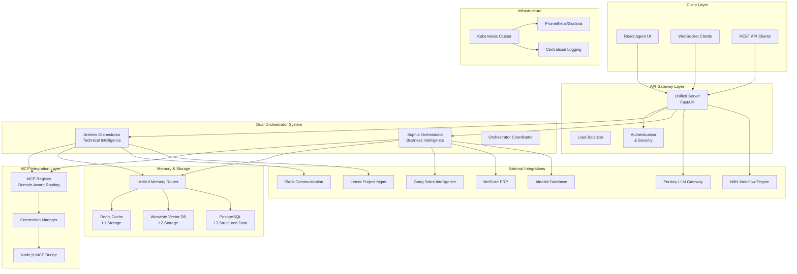

# Sophia Intel AI - System Architecture

**Version:** 2.0.0  
**Last Updated:** 2025-09-06  
**Status:** Production Ready  

## Executive Summary

Sophia Intel AI is a sophisticated AI orchestration platform featuring dual specialized orchestrators, comprehensive external service integrations, and production-ready infrastructure. The system processes 284,066 lines of Python code across 46,689 files, supporting real-time AI swarms, memory management, and enterprise integrations.

## Architecture Overview



## Core Components

### 1. Dual Orchestrator Architecture

The system implements a dual orchestrator pattern optimized for different intelligence domains:

#### Artemis Orchestrator (`app/artemis/artemis_orchestrator.py`)
- **Purpose**: Technical intelligence and code excellence
- **Specialization**: Software development, code generation, technical analysis
- **Features**:
  - Scout swarm implementations for repository analysis
  - Advanced code modification capabilities
  - Military-themed tactical intelligence operations
  - Domain enforcement with role-based access
  - Portkey integration for model routing

```python
@dataclass
class CodeContext:
    """Code-specific context for Artemis"""
    languages: list[str]
    frameworks: list[str]
    repository_path: Optional[str] = None
    test_framework: Optional[str] = None
    style_guide: Optional[str] = None
```

#### Sophia Orchestrator (`app/sophia/sophia_orchestrator.py`)
- **Purpose**: Business intelligence and enterprise operations
- **Specialization**: Analytics, strategic insights, business process automation
- **Features**:
  - Enhanced project management integration
  - External service connectivity (ERP, CRM, Communication platforms)
  - Business context awareness and foundational knowledge systems
  - Enterprise compliance and governance

```python
@dataclass
class BusinessContext:
    """Business-specific context for Sophia"""
    industry: str
    company_size: str
    key_metrics: list[str]
    fiscal_year_start: str
    currency: str = "USD"
    compliance_requirements: list[str] = field(default_factory=list)
```

### 2. MCP (Model Context Protocol) Integration

The system provides comprehensive MCP integration for AI model management:

#### Enhanced MCP Registry (`app/mcp/enhanced_registry.py`)
- Domain-aware routing and server allocation
- Intelligent load balancing and failover
- Server partitioning by domain and access level
- Real-time health monitoring and metrics

#### MCP Connection Manager (`app/mcp/connection_manager.py`)
- Connection pooling and lifecycle management
- Retry mechanisms with circuit breaker patterns
- WebSocket and HTTP protocol support
- Authentication and security enforcement

#### Node.js MCP Bridge (`mcp-bridge/`)
- Dedicated Node.js implementation for MCP server communication
- Configuration management for multiple MCP servers
- Load testing and resilience testing capabilities
- Event streaming and real-time updates

### 3. Memory and Vector Database Architecture

#### Unified Memory Router (`app/memory/unified_memory_router.py`)
Implements a three-tier memory architecture:

**L1 Cache (Redis)**
- Fast ephemeral storage for active sessions
- WebSocket connection state management
- Rate limiting and authentication tokens
- Circuit breaker state and metrics

**L2 Vector Storage (Weaviate)**
- Semantic search and similarity matching
- Document embeddings and vector operations
- AI-powered content retrieval and recommendations
- Contextual memory for conversational AI

**L3 Structured Data (PostgreSQL)**
- Relational data for business entities
- User profiles and enterprise configurations
- Audit logs and compliance records
- Long-term data persistence and analytics

#### Memory Domains
```python
class MemoryDomain(Enum):
    SHARED = "shared"
    ARTEMIS = "artemis" 
    SOPHIA = "sophia"
    USER_SESSION = "user_session"
    INTEGRATION = "integration"
```

### 4. External Service Integration Architecture

The system features a robust integration framework supporting 10+ external services:

#### Base Connector Pattern (`app/integrations/connectors/base_connector.py`)
```python
@dataclass
class ConnectorConfig:
    name: str
    base_url: str
    api_version: str = "v1"
    timeout_seconds: int = 30
    max_retries: int = 3
    rate_limit_strategy: RateLimitStrategy = RateLimitStrategy.EXPONENTIAL_BACKOFF
```

#### Production Integrations
1. **Gong Sales Intelligence** - Call analytics and sales insights
2. **NetSuite ERP** - Financial and operational data integration
3. **Slack Communication** - Team collaboration and notifications
4. **Linear Project Management** - Issue tracking and project coordination
5. **Airtable Database** - Flexible data management and workflows
6. **Portkey LLM Gateway** - Multi-model AI access and routing
7. **OpenRouter** - Additional LLM provider access
8. **Together AI** - Specialized AI model services
9. **Looker BI** - Business intelligence and analytics
10. **N8N Workflow** - Process automation and orchestration

### 5. API and WebSocket Infrastructure

#### Unified Server (`app/api/unified_server.py`)
- FastAPI-based high-performance API server
- Comprehensive routing with domain-specific endpoints
- OpenAPI documentation and schema validation
- CORS support for cross-origin requests

#### Secure WebSocket Manager (`app/core/websocket_manager.py`)
```python
class WebSocketManager:
    """Secure WebSocket Manager with comprehensive security"""
    
    def __init__(
        self,
        secret_key: str,
        redis_url: str = "redis://localhost:6379",
        enable_security: bool = True,
        enable_rate_limiting: bool = True,
        enable_ddos_protection: bool = True,
    ):
```

**Features**:
- Authentication and session management
- Rate limiting and DDoS protection
- Real-time streaming for AI responses
- Security event monitoring and threat detection
- Scales to 100+ concurrent connections

### 6. Redis Caching and State Management

#### Enhanced Redis Manager (`app/core/redis_manager.py`)
- Production-ready Redis operations with connection pooling
- Circuit breaker protection for resilience
- TTL management and bounded streams
- Performance monitoring and health checks

#### Redis Configuration
- Optimized configuration with 256MB memory limit
- LRU eviction policy for memory management
- Persistence enabled with incremental saves
- Authentication and security hardening

## Security Architecture

### Authentication and Authorization
- JWT-based authentication with role-based access control
- Multi-tenant support with domain isolation
- API key management for external integrations
- Session management with automatic timeout

### Security Layers
1. **Network Security**: TLS encryption for all external communications
2. **Application Security**: Input validation and sanitization
3. **Data Security**: Encryption at rest and in transit
4. **Access Control**: Fine-grained permissions and audit logging

### Security Monitoring
- Real-time threat detection and response
- Security event logging and analysis
- Automated incident response workflows
- Compliance reporting and audit trails

## Deployment Architecture

### Container Strategy
```yaml
# docker-compose.yml structure
services:
  redis:      # L1 cache
  weaviate:   # L2 vector storage
  postgres:   # L3 structured data
  app:        # Main application
```

### Kubernetes Deployment
```
k8s/
├── base/           # Base Kubernetes configurations
├── artemis/        # Artemis-specific deployments
├── sophia/         # Sophia-specific deployments
└── shared/         # Shared infrastructure
```

### Helm Charts
- Main application chart (`helm/sophia-intel-ai/`)
- Artemis-specific chart (`helm/sophia-artemis/`)
- Shared infrastructure components

## Performance and Scalability

### Current Capabilities
- **WebSocket Scaling**: 100+ concurrent connections
- **Memory Optimization**: 256MB Redis with intelligent eviction
- **Database Performance**: Connection pooling and query optimization
- **API Throughput**: FastAPI with async operations

### Monitoring and Observability
- Prometheus metrics collection
- Grafana dashboards for visualization
- Structured logging with centralized aggregation
- Performance profiling and bottleneck identification

## Technical Debt and Modernization Areas

### Identified Issues
1. **Security Hardening**: Redis credentials in configuration files
2. **Documentation Fragmentation**: 2,638 markdown files requiring consolidation
3. **Technical Debt**: 95 TODO/FIXME items across 49 files
4. **Architecture Complexity**: Dual orchestrator system needs clear separation

### Recommended Improvements
1. Implement proper secrets management
2. Consolidate and version documentation
3. Address technical debt systematically
4. Enhance CI/CD pipeline with security scanning
5. Implement service mesh for microservices communication

## Configuration Management

### Environment Strategy
The system uses a comprehensive environment configuration approach:
- `.env` - Main environment configuration
- `.env.production` - Production-specific settings
- `.env.staging` - Staging environment
- Service-specific environment files for integrations

### Key Configuration Areas
1. **API Keys**: External service authentication
2. **Database Connections**: Multi-tier storage configuration
3. **Security Settings**: Encryption keys and authentication
4. **Feature Flags**: Component enable/disable switches
5. **Performance Tuning**: Timeout, retry, and scaling parameters

## Future Architecture Considerations

### Service Mesh Integration
- Evaluate Istio or Linkerd for microservices communication
- Implement traffic management and security policies
- Add canary deployment capabilities

### Observability Enhancement
- Distributed tracing with Jaeger or Zipkin
- Advanced monitoring with custom metrics
- Automated anomaly detection and alerting

### Scalability Improvements
- Horizontal scaling with Kubernetes HPA
- Database sharding and read replicas
- CDN integration for static assets
- Caching strategy optimization

---

## Architectural Decision Records

### ADR-001: Dual Orchestrator Pattern
- **Decision**: Implement separate Artemis and Sophia orchestrators
- **Context**: Need for specialized intelligence domains
- **Consequences**: Increased complexity but improved specialization
- **Status**: Implemented

### ADR-002: MCP Integration Strategy
- **Decision**: Use Node.js bridge for MCP communication
- **Context**: Protocol compatibility and performance requirements
- **Consequences**: Additional runtime dependency but better performance
- **Status**: Implemented

### ADR-003: Three-Tier Memory Architecture
- **Decision**: Redis + Weaviate + PostgreSQL storage tiers
- **Context**: Different data access patterns and performance needs
- **Consequences**: Complex but optimized for different use cases
- **Status**: Implemented

---

*This architecture documentation serves as the foundation for Phase 2-4 modernization efforts and ongoing system development.*