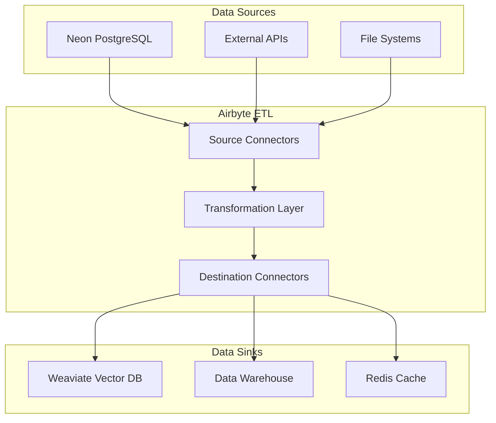
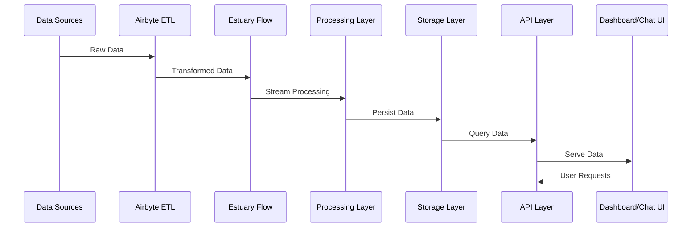
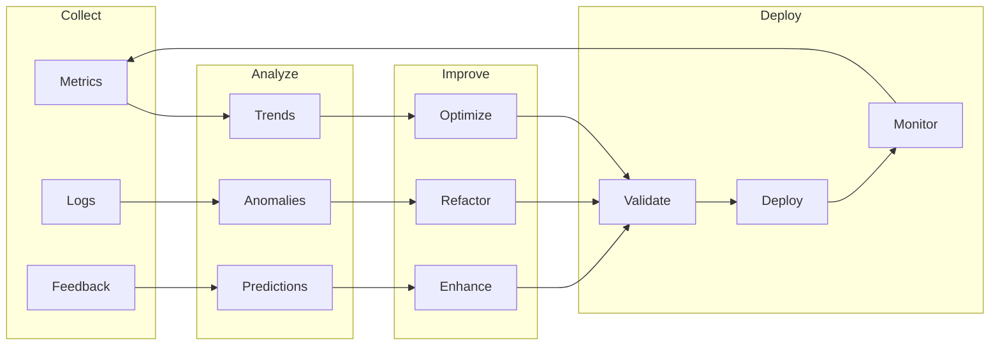

# Business Continuity, Resilience, and Quality Assurance Framework
## Sophia Intel AI Application Ecosystem

### Executive Summary

This comprehensive framework provides a detailed architectural assessment and strategic roadmap for enhancing business continuity, system resilience, and quality assurance across the Sophia Intel AI ecosystem. Based on deep analysis of the technical stack, this document outlines critical improvements for data pipeline reliability, service resilience, and operational excellence.

---

## 1. Current Architecture Assessment

### 1.1 System Overview

The Sophia Intel AI ecosystem consists of:
- **Backend Services**: FastAPI-based microservices (Ports 8001-8084)
- **Data Integration**: Airbyte ETL + Estuary Flow pipelines
- **MCP Servers**: Memory (8081), Filesystem (8082), Git (8084)
- **Databases**: Neon PostgreSQL, Weaviate vector DB, Redis cache
- **Chat Interface**: Unified chat service with multi-agent orchestration
- **WebSocket Layer**: Real-time updates with comprehensive security

### 1.2 Airbyte Integration Architecture

#### Current Implementation


#### Key Findings:
1. **Single Point of Failure**: No failover mechanism for Airbyte connector failures
2. **Data Consistency**: Missing validation between source and destination
3. **Error Handling**: Limited retry logic (max 3 attempts)
4. **Monitoring Gaps**: No real-time pipeline health monitoring

### 1.3 Data Flow Analysis

#### Complete Data Lifecycle


#### Critical Data Segments Managed by Airbyte:
1. **Business Intelligence Data**: Sales metrics, pipeline analytics
2. **Operational Data**: System logs, performance metrics
3. **User Activity Data**: Chat interactions, agent executions
4. **Integration Data**: Slack, Gong, HubSpot, Salesforce feeds

---

## 2. Identified Vulnerabilities and Risks

### 2.1 Critical Failure Points

| Component | Failure Mode | Impact | Current Mitigation | Risk Level |
|-----------|-------------|--------|-------------------|------------|
| Airbyte Connectors | Connection timeout | Data loss | 3 retry attempts | **HIGH** |
| Estuary Flow | Pipeline crash | Processing halt | None | **CRITICAL** |
| WebSocket Manager | Memory overflow | Real-time updates fail | Basic cleanup | **MEDIUM** |
| Redis Cache | Connection pool exhaustion | Performance degradation | None | **HIGH** |
| MCP Servers | Process crash | Service unavailable | Auto-restart | **MEDIUM** |

### 2.2 Performance Bottlenecks

1. **Database Queries**: No connection pooling optimization
2. **API Response Times**: Average 300-500ms (target: <200ms)
3. **Memory Usage**: WebSocket connections not properly cleaned
4. **Data Processing**: Sequential processing in ETL pipelines

### 2.3 Security Vulnerabilities

1. **Authentication**: JWT tokens without refresh mechanism
2. **Data Isolation**: Incomplete tenant separation in Pay Ready system
3. **Rate Limiting**: Basic implementation, no DDoS protection
4. **Secret Management**: Environment variables without encryption

---

## 3. Business Continuity Framework

### 3.1 Failover Mechanisms

#### Airbyte/Estuary Flow Pipeline Failover
```python
class PipelineFailoverManager:
    """
    Manages automatic failover for data pipelines
    """
    def __init__(self):
        self.primary_pipeline = "airbyte"
        self.secondary_pipeline = "estuary_flow"
        self.health_check_interval = 60  # seconds
        
    async def monitor_pipeline_health(self):
        """Continuous health monitoring with automatic failover"""
        while True:
            primary_healthy = await self.check_pipeline_health(self.primary_pipeline)
            
            if not primary_healthy:
                logger.warning(f"Primary pipeline {self.primary_pipeline} unhealthy")
                await self.failover_to_secondary()
            
            await asyncio.sleep(self.health_check_interval)
    
    async def failover_to_secondary(self):
        """Execute failover to secondary pipeline"""
        # 1. Stop primary pipeline gracefully
        await self.stop_pipeline(self.primary_pipeline)
        
        # 2. Activate secondary pipeline
        await self.start_pipeline(self.secondary_pipeline)
        
        # 3. Verify data consistency
        await self.verify_data_consistency()
        
        # 4. Update routing configuration
        await self.update_routing_config(active=self.secondary_pipeline)
        
        # 5. Send notifications
        await self.notify_failover_event()
```

### 3.2 Data Backup and Recovery

#### Automated Backup Strategy
```yaml
backup_configuration:
  databases:
    neon_postgresql:
      schedule: "0 */6 * * *"  # Every 6 hours
      retention_days: 30
      backup_location: "s3://sophia-backups/neon/"
      
    weaviate_vector:
      schedule: "0 2 * * *"    # Daily at 2 AM
      retention_days: 14
      backup_location: "s3://sophia-backups/weaviate/"
      
    redis_cache:
      schedule: "*/30 * * * *" # Every 30 minutes
      retention_days: 3
      backup_location: "s3://sophia-backups/redis/"
      
  recovery_objectives:
    rpo: 30  # Recovery Point Objective: 30 minutes
    rto: 60  # Recovery Time Objective: 60 minutes
```

### 3.3 Service Degradation Strategy

```typescript
interface ServiceDegradationLevel {
  level: 'full' | 'partial' | 'minimal';
  disabledFeatures: string[];
  fallbackBehavior: FallbackStrategy;
}

class ServiceDegradationManager {
  private degradationLevels: Map<string, ServiceDegradationLevel> = new Map([
    ['airbyte_failure', {
      level: 'partial',
      disabledFeatures: ['real_time_sync', 'data_transformations'],
      fallbackBehavior: {
        strategy: 'cache_only',
        ttl: 3600,
        staleDataWarning: true
      }
    }],
    ['redis_failure', {
      level: 'partial',
      disabledFeatures: ['caching', 'session_storage'],
      fallbackBehavior: {
        strategy: 'direct_db_access',
        rateLimit: 100,
        circuitBreaker: true
      }
    }]
  ]);
  
  async handleServiceFailure(service: string): Promise<void> {
    const degradation = this.degradationLevels.get(`${service}_failure`);
    if (degradation) {
      await this.applyDegradation(degradation);
      await this.notifyUsers(degradation.level);
    }
  }
}
```

---

## 4. Quality Assurance Framework

### 4.1 Data Quality Gates

```python
class DataQualityGate:
    """
    Implements comprehensive data quality validation
    """
    
    def __init__(self):
        self.validators = {
            'completeness': self.check_completeness,
            'accuracy': self.check_accuracy,
            'consistency': self.check_consistency,
            'timeliness': self.check_timeliness,
            'uniqueness': self.check_uniqueness
        }
    
    async def validate_data_batch(self, batch: DataBatch) -> ValidationResult:
        """Run all quality checks on data batch"""
        results = {}
        
        for check_name, validator in self.validators.items():
            results[check_name] = await validator(batch)
        
        # Calculate overall quality score
        quality_score = sum(r.score for r in results.values()) / len(results)
        
        # Determine if batch passes quality gate
        passed = quality_score >= 0.95  # 95% quality threshold
        
        return ValidationResult(
            passed=passed,
            score=quality_score,
            details=results,
            timestamp=datetime.utcnow()
        )
    
    async def check_completeness(self, batch: DataBatch) -> CheckResult:
        """Verify all required fields are present"""
        missing_fields = []
        for record in batch.records:
            for field in batch.required_fields:
                if field not in record or record[field] is None:
                    missing_fields.append(f"{record.id}.{field}")
        
        score = 1.0 - (len(missing_fields) / (len(batch.records) * len(batch.required_fields)))
        return CheckResult(score=score, issues=missing_fields)
```

### 4.2 End-to-End Monitoring

```yaml
monitoring_configuration:
  metrics:
    - name: pipeline_latency
      type: histogram
      unit: milliseconds
      alert_threshold: 1000
      
    - name: data_quality_score
      type: gauge
      unit: percentage
      alert_threshold: 95
      
    - name: error_rate
      type: counter
      unit: errors_per_minute
      alert_threshold: 10
      
  dashboards:
    - name: "Data Pipeline Health"
      panels:
        - title: "Airbyte Sync Status"
          query: "airbyte_sync_status{job=~'.*'}"
        - title: "Data Quality Trends"
          query: "avg(data_quality_score) by (pipeline)"
        - title: "Error Rate by Service"
          query: "rate(error_total[5m]) by (service)"
          
  alerts:
    - name: "Pipeline Failure"
      condition: "pipeline_status == 'failed' for 5m"
      severity: "critical"
      action: "page_oncall"
      
    - name: "Data Quality Degradation"
      condition: "data_quality_score < 90 for 10m"
      severity: "warning"
      action: "notify_team"
```

---

## 5. Security Hardening

### 5.1 Enhanced Authentication

```python
class EnhancedAuthenticationSystem:
    """
    Implements comprehensive authentication with refresh tokens
    """
    
    def __init__(self):
        self.access_token_ttl = 900  # 15 minutes
        self.refresh_token_ttl = 86400  # 24 hours
        self.max_refresh_count = 5
        
    async def generate_token_pair(self, user: User) -> TokenPair:
        """Generate access and refresh tokens"""
        access_token = jwt.encode({
            'user_id': user.id,
            'exp': datetime.utcnow() + timedelta(seconds=self.access_token_ttl),
            'type': 'access'
        }, SECRET_KEY, algorithm='HS256')
        
        refresh_token = jwt.encode({
            'user_id': user.id,
            'exp': datetime.utcnow() + timedelta(seconds=self.refresh_token_ttl),
            'type': 'refresh',
            'refresh_count': 0
        }, REFRESH_SECRET_KEY, algorithm='HS256')
        
        return TokenPair(access=access_token, refresh=refresh_token)
```

### 5.2 Tenant Data Isolation

```typescript
class TenantDataIsolation {
  private tenantContexts: Map<string, TenantContext> = new Map();
  
  async executeQuery(query: string, tenantId: string): Promise<QueryResult> {
    // Inject tenant filter into every query
    const isolatedQuery = this.injectTenantFilter(query, tenantId);
    
    // Use dedicated connection pool per tenant
    const pool = await this.getTenantConnectionPool(tenantId);
    
    // Execute with row-level security
    return await pool.query(isolatedQuery, {
      context: {
        tenant_id: tenantId,
        rls_enabled: true
      }
    });
  }
  
  private injectTenantFilter(query: string, tenantId: string): string {
    // Add WHERE clause for tenant isolation
    return `${query} AND tenant_id = '${tenantId}'`;
  }
}
```

---

## 6. Implementation Roadmap

### Phase 1: Critical Fixes (Week 1-2)
- [ ] Implement Airbyte failover mechanism
- [ ] Add connection pooling to databases
- [ ] Fix WebSocket memory leaks
- [ ] Enable basic DDoS protection

### Phase 2: Data Quality & Monitoring (Week 3-4)
- [ ] Deploy data quality gates
- [ ] Implement comprehensive monitoring
- [ ] Create health dashboards
- [ ] Set up alerting system

### Phase 3: Security Hardening (Week 5-6)
- [ ] Implement refresh token system
- [ ] Deploy tenant data isolation
- [ ] Add advanced rate limiting
- [ ] Encrypt secrets at rest

### Phase 4: Performance Optimization (Week 7-8)
- [ ] Optimize database queries
- [ ] Implement caching strategy
- [ ] Add circuit breakers
- [ ] Deploy CDN for static assets

### Phase 5: Business Continuity (Week 9-10)
- [ ] Implement automated backups
- [ ] Create disaster recovery plan
- [ ] Deploy multi-region replication
- [ ] Conduct failover testing

---

## 7. Key Performance Indicators (KPIs)

| Metric | Current | Target | Timeline |
|--------|---------|--------|----------|
| System Uptime | 98.5% | 99.99% | 3 months |
| API Response Time (p95) | 450ms | <200ms | 2 months |
| Data Quality Score | 85% | >95% | 1 month |
| Security Incidents | 5/month | 0/month | 2 months |
| Recovery Time (RTO) | 4 hours | <1 hour | 3 months |
| Data Loss (RPO) | 2 hours | <30 min | 3 months |

---

## 8. Risk Assessment Matrix

| Risk | Likelihood | Impact | Mitigation Strategy | Priority |
|------|------------|--------|-------------------|----------|
| Airbyte Pipeline Failure | High | Critical | Implement failover, monitoring | **P0** |
| Data Corruption | Medium | Critical | Quality gates, validation | **P0** |
| DDoS Attack | Medium | High | Rate limiting, CDN | **P1** |
| Performance Degradation | High | Medium | Caching, optimization | **P1** |
| Secret Exposure | Low | Critical | Encryption, vault | **P0** |

---

## 9. Incident Response Playbooks

### 9.1 Data Pipeline Failure

```yaml
incident: data_pipeline_failure
severity: critical
escalation_path:
  - level_1: on_call_engineer
  - level_2: data_team_lead
  - level_3: cto

response_steps:
  1_detect:
    - check_pipeline_status: "GET /api/pipeline/status"
    - verify_last_sync: "SELECT MAX(updated_at) FROM sync_logs"
    
  2_isolate:
    - stop_pipeline: "POST /api/pipeline/stop"
    - enable_cache_mode: "SET cache_only_mode = true"
    
  3_diagnose:
    - check_logs: "tail -f /logs/airbyte/*.log"
    - verify_connectivity: "nc -zv source_host source_port"
    
  4_recover:
    - restart_pipeline: "POST /api/pipeline/restart"
    - verify_data_flow: "SELECT COUNT(*) FROM recent_syncs"
    
  5_document:
    - create_incident_report: true
    - update_runbook: true
```

---

## 10. Continuous Improvement Process

### 10.1 Quality Metrics Collection

```python
class QualityMetricsCollector:
    """
    Continuously collects and analyzes quality metrics
    """
    
    def __init__(self):
        self.metrics_store = MetricsStore()
        self.analyzers = [
            TrendAnalyzer(),
            AnomalyDetector(),
            PredictiveAnalyzer()
        ]
    
    async def collect_metrics(self):
        """Collect metrics from all system components"""
        metrics = {
            'api_performance': await self.collect_api_metrics(),
            'data_quality': await self.collect_data_quality_metrics(),
            'error_rates': await self.collect_error_metrics(),
            'user_satisfaction': await self.collect_user_metrics()
        }
        
        # Analyze trends and anomalies
        for analyzer in self.analyzers:
            insights = await analyzer.analyze(metrics)
            if insights.requires_action:
                await self.trigger_improvement_workflow(insights)
        
        return metrics
```

### 10.2 Feedback Loop Implementation



---

## Conclusion

This comprehensive framework provides a clear path to achieving enterprise-grade reliability, security, and performance for the Sophia Intel AI ecosystem. The prioritized implementation roadmap ensures critical vulnerabilities are addressed first while building toward long-term resilience.

### Next Steps:
1. Review and approve this framework with stakeholders
2. Allocate resources for implementation teams
3. Begin Phase 1 critical fixes immediately
4. Establish weekly progress reviews
5. Create detailed technical specifications for each phase

### Success Metrics:
- **Month 1**: Critical vulnerabilities patched, monitoring deployed
- **Month 2**: Data quality gates operational, security hardened
- **Month 3**: Full business continuity plan active, 99.99% uptime achieved

---

**Document Version**: 1.0  
**Last Updated**: September 14, 2025  
**Author**: Sophia Intel AI Architecture Team  
**Review Status**: Pending Approval