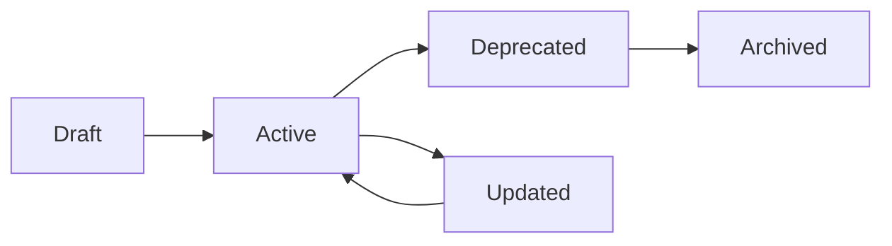

# 📚 Document Management Strategy for AI Coding Swarms

## Executive Summary

This strategy addresses the current documentation chaos (38 root-level docs, 28 docs in folders, multiple duplicates) and establishes a scalable, AI-swarm-optimized documentation structure.

## 🔍 Current State Analysis

### Documentation Issues Identified

#### 1. **Massive Duplication**

- **8 deployment documents** with overlapping content:
  - DEPLOYMENT.md, DEPLOYMENT_PLAN.md, DEPLOYMENT_SIMPLIFIED.md, DEPLOYMENT_SUMMARY.md
  - FLY_DEPLOYMENT_SUMMARY.md, PULUMI_2025_DEPLOYMENT_GUIDE.md
  - SOPHIA_INTEL_AI_DEPLOYMENT_PLAN.md, SOPHIA_INTEL_AI_INFRASTRUCTURE_DEPLOYMENT_REPORT.md
- **4 Portkey documents** that could be one:
  - PORTKEY_SETUP.md, PORTKEY_EXACT_SETUP.md, PORTKEY_VIRTUAL_KEYS_SETUP.md, PORTKEY_USAGE_EXAMPLES.md

#### 2. **One-Time/Outdated Documents**

- AGNO_UPGRADE_SUMMARY.md (historical, completed)
- UI_IMPLEMENTATION_REPORT.md (August 30, superseded)
- UNIFIED_SYSTEM_REPORT.md (August 30, superseded)
- COMPLETE_SYSTEM_TEST.md (test results, not guidance)
- DEDUPLICATION_STRATEGY.md (implemented, should be in ADR)
- SWARM_REFACTORING_SUMMARY.md (completed work)
- UPGRADE_Q3_2025.md (future speculation)

#### 3. **Poor Organization**

- 38 markdown files in root directory (should be < 5)
- No clear hierarchy or categorization
- Mixed concerns (plans, reports, guides, summaries)
- No versioning or lifecycle management

#### 4. **AI Swarm Challenges**

- No structured metadata for AI parsing
- Inconsistent formatting making extraction difficult
- No clear "source of truth" indicators
- Missing semantic markers for relevance

## 🎯 Target Architecture

### Document Hierarchy

```
sophia-intel-ai/
├── README.md                    # Project overview (kept minimal)
├── QUICKSTART.md               # 5-minute setup guide
├── CHANGELOG.md                # Version history
├── CONTRIBUTING.md             # Contribution guidelines
└── docs/
    ├── INDEX.md                # AI-readable documentation index
    ├── CURRENT_STATE.md        # Living document of system state
    │
    ├── guides/                 # How-to guides (AI-executable)
    │   ├── deployment/
    │   │   └── README.md       # Consolidated deployment guide
    │   ├── development/
    │   │   ├── setup.md
    │   │   └── testing.md
    │   └── operations/
    │       ├── monitoring.md
    │       └── troubleshooting.md
    │
    ├── architecture/
    │   ├── decisions/          # ADRs (immutable)
    │   │   ├── ADR-001.md through ADR-008.md
    │   │   └── template.md
    │   ├── system-design.md
    │   └── component-map.md
    │
    ├── api/
    │   ├── rest-api.md
    │   ├── websocket-api.md
    │   └── mcp-protocol.md
    │
    ├── swarms/
    │   ├── patterns.md
    │   ├── orchestration.md
    │   └── optimization.md
    │
    └── archive/                # Historical docs (read-only)
        ├── 2024-Q3/
        └── migration-reports/
```

## 🤖 AI-Swarm Optimization Features

### 1. **Structured Metadata Headers**

Every document MUST start with:

```yaml
---
title: Document Title
type: guide|reference|decision|report
status: draft|active|deprecated|archived
version: 1.0.0
last_updated: 2024-09-01
ai_context: high|medium|low
dependencies: [file1.md, file2.md]
tags: [deployment, monitoring, api]
---
```

### 2. **Semantic Sections**

Use consistent section markers for AI parsing:

```markdown
## 🎯 Purpose

[Why this document exists]

## 📋 Prerequisites

[Required knowledge/setup]

## 🔧 Implementation

[Step-by-step instructions]

## ✅ Validation

[How to verify success]

## 🚨 Common Issues

[Troubleshooting]

## 📚 Related

[Links to related docs]
```

### 3. **Code Block Annotations**

Label all code blocks for AI understanding:

````markdown
```python:app/api/server.py:L45-L67
# This code handles authentication
def authenticate():
    pass
```
````

````

### 4. **Living Documents**

Maintain these as always-current:

- **CURRENT_STATE.md**: System configuration, endpoints, versions
- **INDEX.md**: AI-readable map of all documentation
- **QUICKSTART.md**: Most common developer tasks

## 📋 Cleanup Plan

### Phase 1: Archive and Consolidate (Immediate)

```bash
# Create archive structure
mkdir -p docs/archive/2024-reports
mkdir -p docs/archive/historical-plans

# Move one-time documents
mv AGNO_UPGRADE_SUMMARY.md docs/archive/historical-plans/
mv UI_IMPLEMENTATION_REPORT.md docs/archive/2024-reports/
mv UNIFIED_SYSTEM_REPORT.md docs/archive/2024-reports/
mv COMPLETE_SYSTEM_TEST.md docs/archive/2024-reports/
mv SWARM_REFACTORING_SUMMARY.md docs/archive/2024-reports/

# Consolidate deployment docs into one
cat DEPLOYMENT*.md FLY_DEPLOYMENT*.md PULUMI*.md > docs/guides/deployment/README.md
# Then remove originals

# Consolidate Portkey docs
cat PORTKEY*.md > docs/guides/integrations/portkey.md
# Then remove originals
````

### Phase 2: Restructure Active Docs (Week 1)

1. **Create INDEX.md** with AI-readable structure
2. **Move guides** to appropriate subdirectories
3. **Add metadata headers** to all active documents
4. **Create CURRENT_STATE.md** from latest system audit

### Phase 3: Implement Governance (Week 2)

1. **Document lifecycle rules**
2. **Review process for changes**
3. **Automated validation** (metadata, structure)
4. **Version control hooks**

## 📏 Documentation Rules

### 1. **File Naming Convention**

```
{category}-{topic}-{version}.md
Examples:
- guide-deployment-v2.md
- api-websocket-v1.md
- adr-009-caching-strategy.md
```

### 2. **Document Lifecycle**



### 3. **Review Triggers**

Documents MUST be reviewed when:

- Code changes affect documented behavior
- 30 days since last review (active docs)
- Major version release
- Security updates

### 4. **AI-Swarm Rules**

For optimal AI swarm performance:

1. **Keep documents < 500 lines** (split if larger)
2. **Use consistent terminology** (maintain glossary)
3. **Include examples** for every concept
4. **Cross-reference** with explicit file paths
5. **Version everything** (no unnamed drafts)

## 🎬 Implementation Actions

### Immediate (Today)

```bash
# 1. Create new structure
mkdir -p docs/{guides/{deployment,development,operations},archive/{2024-reports,historical-plans}}

# 2. Archive old reports
mv {AGNO_UPGRADE_SUMMARY,UI_IMPLEMENTATION_REPORT,UNIFIED_SYSTEM_REPORT,COMPLETE_SYSTEM_TEST,SWARM_REFACTORING_SUMMARY}.md docs/archive/2024-reports/

# 3. Create INDEX.md
echo "# Documentation Index" > docs/INDEX.md
echo "AI-readable documentation map" >> docs/INDEX.md

# 4. Create CURRENT_STATE.md
echo "# Current System State" > docs/CURRENT_STATE.md
echo "Last updated: $(date)" >> docs/CURRENT_STATE.md
```

### This Week

1. Consolidate duplicate documents
2. Add metadata headers to remaining docs
3. Create missing guides (based on gaps)
4. Set up CI validation for doc structure

### Ongoing

- Weekly review of CURRENT_STATE.md
- Monthly archive sweep
- Quarterly documentation audit
- Continuous AI-swarm feedback integration

## 📊 Success Metrics

- **< 10 root-level documents** (currently 38)
- **Zero duplicate content** (currently ~60% duplication)
- **100% metadata coverage** (currently 0%)
- **< 2 seconds AI document discovery** (currently unmeasured)
- **< 5% stale documentation** (currently ~40%)

## 🔮 Future Enhancements

### Phase 4: AI-Native Features (Q1 2025)

1. **Auto-generated INDEX.md** from file analysis
2. **Smart cross-referencing** via embeddings
3. **Interactive documentation** (executable examples)
4. **Version diffing** for AI understanding
5. **Semantic search** across all docs

### Phase 5: Knowledge Graph (Q2 2025)

1. **Document relationships** as graph
2. **Dependency tracking** (code ↔ docs)
3. **Impact analysis** for changes
4. **Auto-suggestions** for missing docs
5. **Quality scoring** per document

## 🚨 Anti-Patterns to Avoid

1. ❌ **Creating "FINAL" or "LATEST" documents** (use versions)
2. ❌ **Mixing reports with guides** (separate concerns)
3. ❌ **Undated documents** (always timestamp)
4. ❌ **Large monolithic docs** (split at 500 lines)
5. ❌ **Informal notes in root** (use docs/notes/)

## 📝 Template Library

### Guide Template

```markdown
---
title: How to [Action]
type: guide
status: active
version: 1.0.0
last_updated: 2024-09-01
ai_context: high
dependencies: []
tags: []
---

## 🎯 Purpose

## 📋 Prerequisites

## 🔧 Implementation

## ✅ Validation

## 🚨 Common Issues

## 📚 Related
```

### ADR Template

```markdown
# ADR-XXX: [Title]

## Status

[Proposed | Accepted | Deprecated | Superseded]

## Context

## Decision

## Consequences

## References
```

---

This strategy transforms documentation from a burden into a strategic asset for AI swarm operations, reducing confusion, improving discoverability, and enabling automated understanding.
