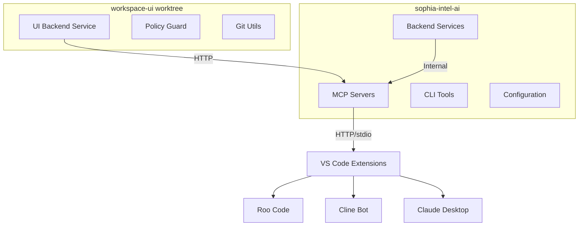
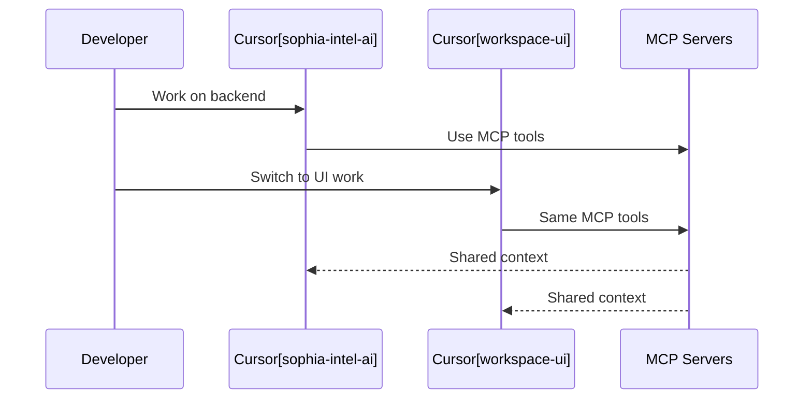
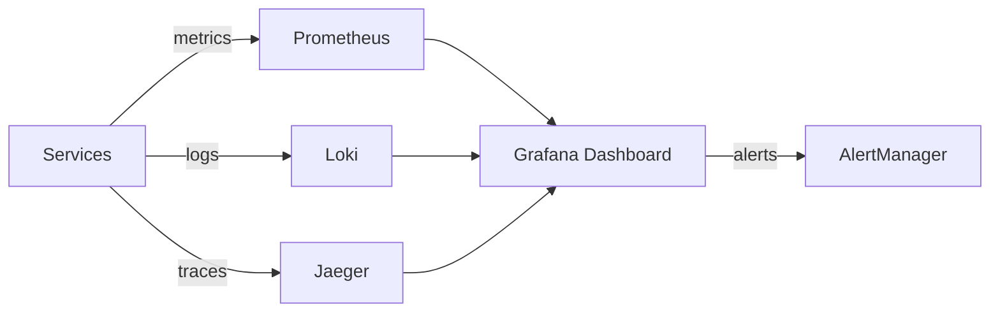

# Dual-Workspace Development Environment Architecture

## Executive Summary
Comprehensive architectural analysis and design for running sophia-intel-ai and workspace-ui repositories simultaneously in separate Cursor instances with shared MCP resources.

## 1. Current System Architecture

### 1.1 Repository Structure


### 1.2 MCP Server Architecture
- **Memory Server (8081)**: Context storage and retrieval
- **Filesystem Server (8082)**: File operations with allowlist
- **Git Server (8084)**: Repository operations and symbol search
- **Vector Server (8085)**: Semantic search and embeddings

### 1.3 CLI Tool Ecosystem
- **sophia**: Master CLI with service delegation
- **sophia-cli**: Python-based chat/plan/code/apply operations
- **bin/sophia-cli-v2**: Enhanced CLI with swarm support
- **dev**: Development helper script
- **startup.sh**: Smart startup with health checks
- **unified-system-manager.sh**: Service orchestration

## 2. MCP Integration Architecture

### 2.1 Connection Protocols
```yaml
HTTP-based (Cursor/Roo):
  - Direct HTTP connections to localhost ports
  - Stateless REST API interactions
  - JSON request/response format

stdio-based (Cline/Claude):
  - Process spawning with Python scripts
  - Bidirectional stdio communication
  - JSON-RPC protocol
```

### 2.2 Extension Configuration Matrix
| Extension | Protocol | Config Location | Connection Type |
|-----------|----------|-----------------|-----------------|
| Roo Code | HTTP | cursor_mcp.json | Direct REST |
| Cline Bot | stdio | cline_mcp_settings.json | Process spawn |
| Claude Desktop | stdio | claude_desktop_config.json | Process spawn |

### 2.3 Security Boundaries
- Environment isolation via .env.master
- Port-based service isolation
- Policy-based file access control
- No cross-repository imports

## 3. Dual-Workspace Configuration

### 3.1 Workspace Isolation Strategy
```bash
# Workspace 1: sophia-intel-ai
WORKSPACE_1_ROOT=/Users/lynnmusil/sophia-intel-ai
WORKSPACE_1_ENV=.env.master
WORKSPACE_1_PORTS=8081-8085

# Workspace 2: workspace-ui
WORKSPACE_2_ROOT=/Users/lynnmusil/worktrees/workbench-ui
WORKSPACE_2_ENV=REPO_ENV_MASTER_PATH
WORKSPACE_2_PORT=3200
```

### 3.2 Shared Resource Management
- MCP servers run once, shared by both workspaces
- Single Redis instance for caching
- Shared .env.master for credentials
- Unified logging to /logs directory

### 3.3 Development Context Switching


## 4. Agno AI Framework Analysis

### 4.1 Compatibility Assessment
- **Architecture Fit**: Compatible with worktree-based agent orchestration
- **Performance Impact**: Minimal overhead for agent coordination
- **Feature Enhancement**: Provides structured agent communication protocols
- **MCP Integration**: Can leverage existing MCP servers for agent tools

### 4.2 Integration Points
```python
# Potential Agno integration
class AgnoMCPBridge:
    """Bridge between Agno agents and MCP servers"""
    
    def __init__(self):
        self.memory_client = MCPMemoryClient(port=8081)
        self.fs_client = MCPFilesystemClient(port=8082)
        self.git_client = MCPGitClient(port=8084)
    
    async def agent_handoff(self, from_agent: str, to_agent: str, context: dict):
        """Handle agent-to-agent handoffs via MCP memory"""
        await self.memory_client.store(f"handoff_{from_agent}_{to_agent}", context)
```

### 4.3 Value Proposition
- Structured multi-agent orchestration
- Built-in agent personas and capabilities
- Standardized communication protocols
- Enhanced debugging and monitoring

## 5. Production-Grade Architecture Recommendations

### 5.1 Additional Tools/Frameworks
```yaml
Essential:
  - Process Manager: PM2 or Supervisor for service reliability
  - API Gateway: Kong or Traefik for routing
  - Monitoring: Prometheus + Grafana stack
  - Logging: ELK stack or Loki

Nice-to-have:
  - Service Mesh: Linkerd for microservice communication
  - Tracing: Jaeger for distributed tracing
  - Queue: RabbitMQ for async operations
```

### 5.2 Monitoring & Observability


### 5.3 Performance Optimization
- Connection pooling for MCP clients
- Redis caching layer for frequent operations
- Lazy loading of heavy resources
- Request batching for bulk operations

### 5.4 Security Hardening
```yaml
Authentication:
  - JWT tokens for API access
  - API key rotation mechanism
  - Rate limiting per client

Authorization:
  - RBAC for multi-user scenarios
  - Policy-based access control
  - Audit logging for all operations

Network:
  - TLS for all HTTP connections
  - Firewall rules for port access
  - VPN for remote development
```

## 6. Risk Assessment

### 6.1 Potential Conflicts
| Risk | Likelihood | Impact | Mitigation |
|------|------------|--------|------------|
| Port conflicts | Low | High | Dynamic port allocation |
| Memory leaks | Medium | Medium | Process monitoring & restart |
| Context corruption | Low | High | Transactional memory operations |
| Extension conflicts | Low | Low | Separate config namespaces |

### 6.2 Failure Modes
- MCP server crash: Auto-restart with systemd/supervisor
- Network partition: Local fallback operations
- Resource exhaustion: Circuit breakers and backpressure

## 7. Implementation Phases

### Phase 1: Foundation (Week 1)
- Set up dual workspace configuration
- Configure extension connections
- Implement health monitoring

### Phase 2: Integration (Week 2)
- Integrate Agno framework
- Set up monitoring stack
- Implement security measures

### Phase 3: Optimization (Week 3)
- Performance tuning
- Load testing
- Documentation updates

### Phase 4: Production (Week 4)
- CI/CD pipeline setup
- Deployment automation
- Operational runbooks

## 8. Performance & Scalability Analysis

### 8.1 Current Performance Baseline
- MCP response time: <50ms (local)
- Memory usage: ~200MB per server
- CPU usage: <5% idle, <20% active

### 8.2 Scalability Limits
- Concurrent connections: ~100 per MCP server
- Memory capacity: 2GB recommended
- Storage: 10GB for logs and cache

### 8.3 Optimization Opportunities
- Implement connection pooling
- Add Redis caching layer
- Use async/await patterns
- Batch similar operations

## 9. Tool Compatibility Matrix

| Tool | sophia-intel-ai | workspace-ui | Shared MCP | Notes |
|------|-----------------|--------------|------------|-------|
| VS Code | ✅ | ✅ | ✅ | Full support |
| Cursor | ✅ | ✅ | ✅ | Primary IDE |
| Cline | ✅ | ✅ | ✅ | stdio mode |
| Claude Desktop | ✅ | ✅ | ✅ | stdio mode |
| Roo Code | ✅ | ✅ | ✅ | HTTP mode |
| GitHub Copilot | ✅ | ✅ | N/A | Independent |
| Continue.dev | ✅ | ✅ | ⚠️ | Needs config |

## 10. Strategic Recommendations

### 10.1 Immediate Actions
1. Standardize MCP client libraries
2. Implement connection pooling
3. Add health check endpoints
4. Set up basic monitoring

### 10.2 Short-term (1 month)
1. Integrate Agno framework
2. Implement security hardening
3. Add performance monitoring
4. Create operational dashboards

### 10.3 Long-term (3 months)
1. Multi-tenant support
2. Cloud deployment options
3. Advanced agent orchestration
4. ML-powered optimization

## Conclusion

The dual-workspace architecture is well-suited for simultaneous development with shared MCP resources. The key success factors are:

1. **Proper isolation** between workspaces
2. **Shared resource management** via MCP servers
3. **Consistent configuration** across extensions
4. **Robust monitoring** and error handling
5. **Security-first** approach to credentials and access

With the recommended enhancements, this architecture can scale to support team development, production deployments, and advanced AI agent orchestration.