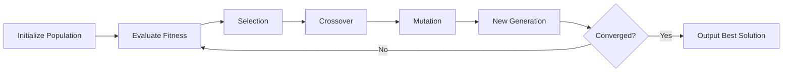

# 🧬 Genetic Algorithm Mode Guide

## Overview

The Genetic Algorithm Mode is an innovative AI development mode that applies evolutionary computing principles to code optimization. It evolves optimal solutions through biological-inspired operations like mutation, crossover, and natural selection, automatically discovering better implementations over successive generations.

## Table of Contents

1. [Core Concepts](#core-concepts)
2. [Installation & Setup](#installation--setup)
3. [Quick Start](#quick-start)
4. [API Reference](#api-reference)
5. [Usage Examples](#usage-examples)
6. [Advanced Features](#advanced-features)
7. [Performance Tuning](#performance-tuning)
8. [Troubleshooting](#troubleshooting)

## Core Concepts

### Genetic Representation

Code elements are encoded as **genes** that can be combined, mutated, and evolved:

- **Gene**: A single trait (algorithm choice, data structure, optimization technique)
- **Chromosome**: A complete solution composed of multiple genes
- **Population**: A collection of chromosomes evolving together
- **Generation**: One iteration of the evolution cycle

### Evolution Process



### Fitness Functions

Solutions are evaluated based on multiple optimization targets:

- **Performance**: Execution time, throughput, latency
- **Memory Usage**: Heap usage, stack usage, GC pressure
- **Code Complexity**: Cyclomatic complexity, cognitive complexity
- **Test Coverage**: Line coverage, branch coverage, mutation coverage
- **Bundle Size**: Compressed size, dependency count
- **Security Score**: Vulnerability count, OWASP compliance
- **Maintainability**: Code readability, documentation quality

## Installation & Setup

### Prerequisites

```bash
# Python 3.11+
python --version

# Install dependencies
pip install asyncio aiohttp numpy scipy

# Verify MCP servers are running
curl http://localhost:8081/health  # Memory Server
curl http://localhost:8082/health  # Filesystem Server
curl http://localhost:8084/health  # Git Server
```

### Configuration

1. **Add the agent to your project:**

```bash
# Copy the agent implementation
cp agents/specialized/genetic_algorithm_agent.py /path/to/your/project/agents/

# Copy the mode configuration
cp modes/genetic_algorithm_mode.json /path/to/your/project/modes/
```

2. **Configure MCP integration:**

```json
// .cursor/settings.json or .claude/settings.json
{
  "mcpServers": {
    "genetic-algorithm": {
      "command": "python",
      "args": ["agents/specialized/genetic_algorithm_agent.py"],
      "env": {
        "MCP_MEMORY_URL": "http://localhost:8081",
        "MCP_FILESYSTEM_URL": "http://localhost:8082",
        "MCP_GIT_URL": "http://localhost:8084"
      }
    }
  }
}
```

## Quick Start

### Basic Evolution

```python
from agents.specialized.genetic_algorithm_agent import GeneticAlgorithmAgent

# Initialize agent
agent = GeneticAlgorithmAgent()
await agent.initialize()

# Evolve a solution
result = await agent.evolve_solution(
    problem_description="optimize_sorting_algorithm",
    optimization_target=OptimizationTarget.PERFORMANCE,
    generations=50,
    population_size=30
)

print(f"Best solution fitness: {result.best_solution.fitness_score}")
print(f"Improvement: {result.achieved_improvement}%")
print(f"Evolution time: {result.evolution_time}s")
```

### Code Optimization

```python
# Optimize existing code
code = """
def process_data(items):
    result = []
    for item in items:
        if item > 0:
            result.append(item * 2)
    return result
"""

optimization_result = await agent.optimize_code(
    code_snippet=code,
    language="python",
    optimization_targets=[
        OptimizationTarget.PERFORMANCE,
        OptimizationTarget.MEMORY_USAGE
    ]
)

print(f"Original code:\n{optimization_result['original_code']}")
print(f"Optimized code:\n{optimization_result['optimized_code']}")
print(f"Performance improvement: {optimization_result['improvements']['performance']}%")
```

## API Reference

### Main Methods

#### `evolve_solution()`

Evolves an optimal solution using genetic algorithm.

```python
async def evolve_solution(
    problem_description: str,
    optimization_target: OptimizationTarget,
    initial_population: Optional[Population] = None,
    generations: int = 100,
    population_size: int = 50
) -> EvolutionResult
```

**Parameters:**
- `problem_description`: Description of the problem to solve
- `optimization_target`: Target metric to optimize
- `initial_population`: Optional starting population
- `generations`: Number of evolution cycles
- `population_size`: Number of solutions per generation

**Returns:** `EvolutionResult` with best solution and statistics

#### `optimize_code()`

Optimizes existing code using genetic algorithm.

```python
async def optimize_code(
    code_snippet: str,
    language: str,
    optimization_targets: List[OptimizationTarget],
    constraints: Optional[Dict[str, Any]] = None
) -> Dict[str, Any]
```

**Parameters:**
- `code_snippet`: Code to optimize
- `language`: Programming language
- `optimization_targets`: List of optimization goals
- `constraints`: Optional constraints (max memory, min performance, etc.)

**Returns:** Dictionary with optimized code and improvements

#### `analyze_population_fitness()`

Analyzes fitness distribution in a population.

```python
async def analyze_population_fitness(
    population: Population,
    target: OptimizationTarget
) -> Dict[str, Any]
```

## Usage Examples

### Example 1: Algorithm Selection

```python
# Evolve the best sorting algorithm for specific data patterns
result = await agent.process_task(
    "evolution-1",
    {
        "task_type": "evolve_solution",
        "problem_description": "Find optimal sorting for nearly-sorted arrays",
        "optimization_target": "performance",
        "generations": 100,
        "population_size": 50
    }
)

# Result: Adaptive algorithm that switches between insertion sort 
# for small segments and timsort for larger ones
```

### Example 2: Memory Optimization

```python
# Reduce memory footprint of a data structure
code = """
class DataCache:
    def __init__(self):
        self.cache = {}
        self.access_counts = {}
        self.timestamps = {}
        
    def get(self, key):
        self.access_counts[key] = self.access_counts.get(key, 0) + 1
        self.timestamps[key] = time.time()
        return self.cache.get(key)
"""

result = await agent.optimize_code(
    code_snippet=code,
    language="python",
    optimization_targets=[OptimizationTarget.MEMORY_USAGE],
    constraints={"maintain_functionality": True}
)

# Result: Optimized version using slots, weak references, and LRU eviction
```

### Example 3: Performance Tuning

```python
# Optimize database query logic
query_code = """
def fetch_user_data(user_ids):
    results = []
    for user_id in user_ids:
        user = db.query(f"SELECT * FROM users WHERE id = {user_id}")
        orders = db.query(f"SELECT * FROM orders WHERE user_id = {user_id}")
        results.append({"user": user, "orders": orders})
    return results
"""

result = await agent.optimize_code(
    code_snippet=query_code,
    language="python",
    optimization_targets=[
        OptimizationTarget.PERFORMANCE,
        OptimizationTarget.SECURITY_SCORE
    ]
)

# Result: Batched queries with prepared statements and connection pooling
```

### Example 4: Multi-Objective Optimization

```python
# Balance multiple optimization targets
result = await agent.evolve_solution(
    problem_description="optimize_api_endpoint",
    optimization_target=OptimizationTarget.PERFORMANCE,
    generations=200
)

# Custom fitness function combining multiple metrics
fitness_functions = [
    FitnessFunction("performance", OptimizationTarget.PERFORMANCE, weight=0.4),
    FitnessFunction("memory", OptimizationTarget.MEMORY_USAGE, weight=0.3),
    FitnessFunction("complexity", OptimizationTarget.CODE_COMPLEXITY, weight=0.2),
    FitnessFunction("coverage", OptimizationTarget.TEST_COVERAGE, weight=0.1)
]
```

## Advanced Features

### Custom Mutation Strategies

```python
# Define custom mutation for domain-specific optimizations
async def custom_mutation(gene: Gene) -> Gene:
    if gene.type == "caching_strategy":
        strategies = ["lru", "lfu", "fifo", "arc", "ttl"]
        new_strategy = random.choice(strategies)
        return Gene(
            id=gene.id,
            type=gene.type,
            value=new_strategy,
            metadata={**gene.metadata, "custom_mutated": True}
        )
    return gene

# Register custom mutation
agent.mutation_strategies[MutationType.CACHING_STRATEGY] = custom_mutation
```

### Adaptive Evolution Parameters

```python
# Dynamically adjust evolution parameters based on progress
class AdaptiveEvolution:
    def __init__(self):
        self.mutation_rate = 0.1
        self.crossover_rate = 0.7
        
    def adjust_parameters(self, generation: int, diversity: float):
        # Increase mutation if diversity is low
        if diversity < 0.2:
            self.mutation_rate = min(0.3, self.mutation_rate * 1.2)
        
        # Decrease crossover rate near convergence
        if generation > 80:
            self.crossover_rate = max(0.5, self.crossover_rate * 0.95)
```

### Parallel Evolution

```python
# Run multiple evolution streams in parallel
import asyncio

async def parallel_evolution():
    tasks = []
    targets = [
        OptimizationTarget.PERFORMANCE,
        OptimizationTarget.MEMORY_USAGE,
        OptimizationTarget.CODE_COMPLEXITY
    ]
    
    for target in targets:
        task = agent.evolve_solution(
            f"optimize_for_{target.value}",
            target,
            generations=50
        )
        tasks.append(task)
    
    results = await asyncio.gather(*tasks)
    
    # Combine best features from all evolutions
    combined = await agent._combine_best_solutions(
        {t.value: r for t, r in zip(targets, results)}
    )
    return combined
```

## Performance Tuning

### Population Size Guidelines

| Problem Complexity | Population Size | Generations |
|-------------------|-----------------|-------------|
| Simple (< 10 genes) | 20-30 | 50-100 |
| Medium (10-50 genes) | 50-100 | 100-500 |
| Complex (50+ genes) | 100-500 | 500-1000 |

### Convergence Optimization

```python
# Tune convergence parameters
config = {
    "convergence_threshold": 0.001,  # Stop if improvement < 0.1%
    "stagnation_limit": 10,          # Stop after 10 generations without improvement
    "elite_percentage": 0.1,         # Keep top 10% of solutions
    "diversity_threshold": 0.1       # Inject diversity if below 10%
}

result = await agent.evolve_solution(
    problem_description="optimize_with_tuning",
    optimization_target=OptimizationTarget.PERFORMANCE,
    **config
)
```

### Memory Management

```python
# Configure memory limits
agent.config.max_population_size = 1000
agent.config.max_memory_usage = "1GB"

# Enable generation cleanup
agent.config.cleanup_old_generations = True
agent.config.generations_to_keep = 10
```

## Troubleshooting

### Common Issues

#### 1. Premature Convergence

**Symptom:** Evolution stops improving too early

**Solution:**
```python
# Increase diversity through mutation
agent.default_mutation_rate = 0.2  # Increase from 0.1

# Use different selection method
selection_method = SelectionMethod.TOURNAMENT  # More diverse than elitism

# Inject random chromosomes
if population.diversity_score < 0.1:
    population.chromosomes.extend(create_random_chromosomes(10))
```

#### 2. Slow Evolution

**Symptom:** Evolution takes too long

**Solution:**
```python
# Reduce population size
population_size = 30  # Instead of 100

# Use faster fitness evaluation
fitness_function.use_approximation = True

# Enable parallel evaluation
agent.config.parallel_fitness_evaluation = True
agent.config.max_workers = 8
```

#### 3. Poor Solution Quality

**Symptom:** Final solutions don't meet requirements

**Solution:**
```python
# Refine fitness function
fitness_function = FitnessFunction(
    name="refined",
    target=OptimizationTarget.PERFORMANCE,
    evaluator=custom_detailed_evaluator
)

# Increase generations
generations = 500  # More time to evolve

# Use multiple optimization runs
best_of_runs = []
for _ in range(5):
    result = await agent.evolve_solution(...)
    best_of_runs.append(result.best_solution)
final_best = max(best_of_runs, key=lambda s: s.fitness_score)
```

### Debug Mode

```python
# Enable detailed logging
import logging
logging.basicConfig(level=logging.DEBUG)
agent.logger.setLevel(logging.DEBUG)

# Track evolution progress
async def debug_evolution():
    result = await agent.evolve_solution(
        problem_description="debug_test",
        optimization_target=OptimizationTarget.PERFORMANCE,
        generations=10
    )
    
    # Analyze evolution history
    for i, fitness in enumerate(result.fitness_history):
        print(f"Generation {i}: Best fitness = {fitness:.3f}")
    
    # Plot convergence
    import matplotlib.pyplot as plt
    plt.plot(result.fitness_history)
    plt.xlabel("Generation")
    plt.ylabel("Fitness")
    plt.title("Evolution Progress")
    plt.show()
```

## Best Practices

1. **Start Small**: Begin with small populations and few generations, then scale up
2. **Monitor Diversity**: Maintain genetic diversity to avoid local optima
3. **Balance Exploration/Exploitation**: Adjust mutation and crossover rates
4. **Use Domain Knowledge**: Incorporate problem-specific mutations and crossovers
5. **Validate Results**: Always test evolved solutions against original requirements
6. **Save Checkpoints**: Store promising populations for later refinement

## Integration with Other Modes

The Genetic Algorithm Mode can be combined with other modes for enhanced capabilities:

```python
# Combine with Prophecy Mode for predictive optimization
prophecy_predictions = await prophecy_mode.predict_future_requirements()
ga_result = await genetic_algorithm_mode.evolve_solution(
    problem_description=prophecy_predictions["anticipated_bottleneck"],
    optimization_target=OptimizationTarget.PERFORMANCE
)

# Use with Socratic Mode for iterative refinement
socratic_questions = await socratic_mode.generate_optimization_questions()
for question in socratic_questions:
    refined_solution = await genetic_algorithm_mode.evolve_solution(
        problem_description=question,
        initial_population=previous_result.final_population
    )
```

## Conclusion

The Genetic Algorithm Mode provides a powerful approach to code optimization through evolutionary computing. By mimicking natural selection, it can discover novel solutions that might not be obvious through traditional optimization techniques. The mode's flexibility allows it to tackle a wide range of optimization problems, from algorithm selection to memory management to performance tuning.

For more information, see:
- [`agents/specialized/genetic_algorithm_agent.py`](../agents/specialized/genetic_algorithm_agent.py)
- [`modes/genetic_algorithm_mode.json`](../modes/genetic_algorithm_mode.json)
- [MCP Integration Guide](./MCP_INTEGRATION_GUIDE.md)

---

*Last Updated: 2025-09-15*
*Version: 1.0.0*