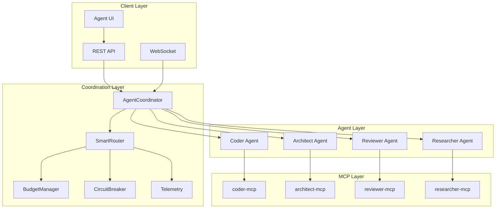

# Phase 3: Agent Wiring Architecture Plan

## Executive Summary
Phase 3 integrates four specialized AI agents (Coder, Architect, Reviewer, Researcher) with the router, budget manager, and circuit breaker from Phase 2. Each agent will be exposed via MCP (Model Context Protocol) servers and orchestrated through a unified coordinator.

## 🏗️ Architecture Overview



## 📦 Component Design

### 1. Base Agent Class
```python
# agno_core/agents/base.py
from abc import ABC, abstractmethod
from typing import Dict, Any, Optional, List
from agno_core.adapters.router import SmartRouter
from agno_core.adapters.telemetry import Telemetry

class BaseAgent(ABC):
    """Base class for all specialized agents"""
    
    def __init__(
        self,
        name: str,
        router: SmartRouter,
        telemetry: Telemetry,
        capabilities: List[str],
        cost_tier: str = "standard"  # economy, standard, premium
    ):
        self.name = name
        self.router = router
        self.telemetry = telemetry
        self.capabilities = capabilities
        self.cost_tier = cost_tier
        self.context_window = 8192  # default
        
    async def execute(
        self,
        task: str,
        context: Dict[str, Any],
        **kwargs
    ) -> Dict[str, Any]:
        """Execute agent task with routing and telemetry"""
        
        # 1. Pre-process and validate
        validated_task = await self.validate_task(task, context)
        
        # 2. Route to appropriate model
        route_result = await self.router.route(
            category=self.get_category(),
            prompt_tokens=self.estimate_tokens(validated_task),
            vk_env=kwargs.get("vk_override")
        )
        
        if not route_result.primary:
            return {
                "success": False,
                "error": "No available model due to budget/circuit constraints"
            }
        
        # 3. Emit telemetry
        self.telemetry.emit({
            "type": "agent_execution",
            "data": {
                "agent": self.name,
                "task": task[:100],  # truncate for logging
                "model": route_result.primary,
                "timestamp": datetime.now().isoformat()
            }
        })
        
        # 4. Execute with retry logic
        try:
            result = await self._execute_impl(
                task=validated_task,
                model=route_result.primary,
                context=context,
                **kwargs
            )
            
            # 5. Record success
            self.router.circuit_breaker.on_success(route_result.primary)
            
            return {
                "success": True,
                "result": result,
                "model_used": route_result.primary,
                "cost_estimate": self.estimate_cost(result)
            }
            
        except Exception as e:
            # 6. Handle failure and try fallback
            self.router.circuit_breaker.on_error(route_result.primary)
            
            if route_result.fallbacks:
                return await self._try_fallbacks(
                    task=validated_task,
                    fallbacks=route_result.fallbacks,
                    context=context,
                    original_error=str(e)
                )
            
            return {
                "success": False,
                "error": str(e),
                "model_attempted": route_result.primary
            }
    
    @abstractmethod
    async def _execute_impl(
        self,
        task: str,
        model: str,
        context: Dict[str, Any],
        **kwargs
    ) -> Any:
        """Actual implementation for each agent"""
        pass
    
    @abstractmethod
    def get_category(self) -> str:
        """Return the cost category for this agent"""
        pass
    
    @abstractmethod
    async def validate_task(self, task: str, context: Dict[str, Any]) -> str:
        """Validate and potentially modify the task"""
        pass
```

### 2. Specialized Agents

#### 2.1 Coder Agent
```python
# agno_core/agents/coder.py
class CoderAgent(BaseAgent):
    """Agent specialized in code generation and modification"""
    
    def __init__(self, router, telemetry):
        super().__init__(
            name="Coder",
            router=router,
            telemetry=telemetry,
            capabilities=[
                "code_generation",
                "code_modification",
                "test_generation",
                "documentation",
                "refactoring"
            ],
            cost_tier="premium"  # Needs powerful models
        )
        self.supported_languages = [
            "python", "javascript", "typescript", 
            "go", "rust", "java", "c++"
        ]
    
    async def _execute_impl(self, task, model, context, **kwargs):
        language = kwargs.get("language", "python")
        style_guide = kwargs.get("style_guide", "pep8")
        
        # Build prompt with code-specific instructions
        prompt = self._build_coding_prompt(
            task=task,
            language=language,
            style_guide=style_guide,
            existing_code=context.get("existing_code"),
            dependencies=context.get("dependencies")
        )
        
        # Call model via appropriate client
        response = await self._call_model(model, prompt)
        
        # Parse and validate generated code
        code_blocks = self._extract_code_blocks(response)
        validated_code = await self._validate_syntax(code_blocks, language)
        
        return {
            "code": validated_code,
            "language": language,
            "explanation": self._extract_explanation(response),
            "suggested_tests": self._suggest_tests(validated_code)
        }
    
    def get_category(self) -> str:
        return "code_generation"
    
    async def validate_task(self, task, context):
        # Ensure task is specific enough
        if len(task) < 20:
            raise ValueError("Task description too brief for code generation")
        
        # Add context about available tools/libraries
        if "dependencies" in context:
            task += f"\nAvailable dependencies: {context['dependencies']}"
        
        return task
```

#### 2.2 Architect Agent
```python
# agno_core/agents/architect.py
class ArchitectAgent(BaseAgent):
    """Agent specialized in system design and architecture"""
    
    def __init__(self, router, telemetry):
        super().__init__(
            name="Architect",
            router=router,
            telemetry=telemetry,
            capabilities=[
                "system_design",
                "api_design",
                "database_schema",
                "architecture_review",
                "scalability_analysis"
            ],
            cost_tier="premium"
        )
    
    async def _execute_impl(self, task, model, context, **kwargs):
        design_type = kwargs.get("design_type", "general")
        constraints = kwargs.get("constraints", {})
        
        prompt = self._build_architecture_prompt(
            task=task,
            design_type=design_type,
            constraints=constraints,
            existing_architecture=context.get("existing_architecture")
        )
        
        response = await self._call_model(model, prompt)
        
        # Parse architectural components
        design = self._parse_design(response)
        
        return {
            "design": design,
            "components": self._extract_components(design),
            "interfaces": self._extract_interfaces(design),
            "data_flow": self._extract_data_flow(design),
            "scalability_notes": self._analyze_scalability(design),
            "implementation_phases": self._suggest_phases(design)
        }
    
    def get_category(self) -> str:
        return "reasoning"  # Architectural design needs reasoning
```

#### 2.3 Reviewer Agent
```python
# agno_core/agents/reviewer.py
class ReviewerAgent(BaseAgent):
    """Agent specialized in code review and quality analysis"""
    
    def __init__(self, router, telemetry):
        super().__init__(
            name="Reviewer",
            router=router,
            telemetry=telemetry,
            capabilities=[
                "code_review",
                "security_analysis",
                "performance_review",
                "best_practices",
                "bug_detection"
            ],
            cost_tier="standard"  # Can use mid-tier models
        )
    
    async def _execute_impl(self, task, model, context, **kwargs):
        code_to_review = context.get("code", "")
        review_type = kwargs.get("review_type", "general")
        severity_threshold = kwargs.get("severity", "medium")
        
        prompt = self._build_review_prompt(
            code=code_to_review,
            review_type=review_type,
            language=context.get("language"),
            guidelines=context.get("guidelines")
        )
        
        response = await self._call_model(model, prompt)
        
        issues = self._parse_issues(response)
        
        return {
            "issues": issues,
            "summary": self._generate_summary(issues),
            "suggestions": self._extract_suggestions(response),
            "security_concerns": self._check_security(code_to_review),
            "complexity_score": self._calculate_complexity(code_to_review),
            "test_coverage_gaps": self._identify_test_gaps(code_to_review)
        }
    
    def get_category(self) -> str:
        return "code_review"  # Specialized category for review
```

#### 2.4 Researcher Agent
```python
# agno_core/agents/researcher.py
class ResearcherAgent(BaseAgent):
    """Agent specialized in information gathering and analysis"""
    
    def __init__(self, router, telemetry):
        super().__init__(
            name="Researcher",
            router=router,
            telemetry=telemetry,
            capabilities=[
                "web_search",
                "documentation_lookup",
                "api_exploration",
                "library_research",
                "best_practices_research"
            ],
            cost_tier="economy"  # Can use cheaper models
        )
        self.search_providers = ["google", "bing", "duckduckgo"]
        self.doc_sources = ["official_docs", "stackoverflow", "github"]
    
    async def _execute_impl(self, task, model, context, **kwargs):
        research_type = kwargs.get("research_type", "general")
        sources = kwargs.get("sources", self.doc_sources)
        max_results = kwargs.get("max_results", 10)
        
        # Gather information from multiple sources
        search_results = await self._search_sources(
            query=task,
            sources=sources,
            max_results=max_results
        )
        
        # Synthesize with LLM
        prompt = self._build_research_prompt(
            task=task,
            search_results=search_results,
            focus_areas=context.get("focus_areas")
        )
        
        response = await self._call_model(model, prompt)
        
        return {
            "findings": self._extract_findings(response),
            "sources": self._format_sources(search_results),
            "summary": self._generate_research_summary(response),
            "recommendations": self._extract_recommendations(response),
            "confidence_score": self._assess_confidence(search_results)
        }
    
    def get_category(self) -> str:
        return "simple"  # Research can use simpler models
```

### 3. Agent Coordinator
```python
# agno_core/coordinator/agent_coordinator.py
class AgentCoordinator:
    """Orchestrates multiple agents for complex tasks"""
    
    def __init__(
        self,
        router: SmartRouter,
        budget_manager: BudgetManager,
        telemetry: Telemetry
    ):
        self.router = router
        self.budget_manager = budget_manager
        self.telemetry = telemetry
        
        # Initialize agents
        self.agents = {
            "coder": CoderAgent(router, telemetry),
            "architect": ArchitectAgent(router, telemetry),
            "reviewer": ReviewerAgent(router, telemetry),
            "researcher": ResearcherAgent(router, telemetry)
        }
        
        self.execution_strategies = {
            "sequential": self._execute_sequential,
            "parallel": self._execute_parallel,
            "pipeline": self._execute_pipeline,
            "consensus": self._execute_consensus
        }
    
    async def execute_task(
        self,
        task: str,
        agent_names: List[str],
        strategy: str = "sequential",
        context: Dict[str, Any] = None,
        **kwargs
    ) -> Dict[str, Any]:
        """Execute task using specified agents and strategy"""
        
        # Check budget before starting
        estimated_cost = self._estimate_task_cost(task, agent_names)
        if not self._check_budget(estimated_cost):
            return {
                "success": False,
                "error": "Insufficient budget for task"
            }
        
        # Emit coordination event
        self.telemetry.emit({
            "type": "coordination_started",
            "data": {
                "task": task[:100],
                "agents": agent_names,
                "strategy": strategy,
                "estimated_cost": estimated_cost
            }
        })
        
        # Execute with selected strategy
        strategy_func = self.execution_strategies.get(strategy)
        if not strategy_func:
            raise ValueError(f"Unknown strategy: {strategy}")
        
        result = await strategy_func(
            task=task,
            agent_names=agent_names,
            context=context or {},
            **kwargs
        )
        
        # Record actual cost
        actual_cost = self._calculate_actual_cost(result)
        self.budget_manager.add_usage("coordination", actual_cost)
        
        return {
            "success": True,
            "results": result,
            "cost": actual_cost,
            "strategy_used": strategy
        }
    
    async def _execute_sequential(self, task, agent_names, context, **kwargs):
        """Execute agents one after another, passing results forward"""
        results = []
        current_context = context.copy()
        
        for agent_name in agent_names:
            agent = self.agents.get(agent_name)
            if not agent:
                continue
            
            # Execute agent with accumulated context
            agent_result = await agent.execute(
                task=task,
                context=current_context,
                **kwargs
            )
            
            results.append({
                "agent": agent_name,
                "result": agent_result
            })
            
            # Update context with results for next agent
            if agent_result.get("success"):
                current_context[f"{agent_name}_output"] = agent_result.get("result")
        
        return results
    
    async def _execute_parallel(self, task, agent_names, context, **kwargs):
        """Execute all agents in parallel"""
        import asyncio
        
        tasks = []
        for agent_name in agent_names:
            agent = self.agents.get(agent_name)
            if agent:
                tasks.append(
                    agent.execute(task=task, context=context.copy(), **kwargs)
                )
        
        results = await asyncio.gather(*tasks, return_exceptions=True)
        
        return [
            {
                "agent": agent_names[i],
                "result": results[i] if not isinstance(results[i], Exception) 
                         else {"success": False, "error": str(results[i])}
            }
            for i in range(len(agent_names))
        ]
    
    async def _execute_pipeline(self, task, agent_names, context, **kwargs):
        """Execute as a pipeline with specific data transformations"""
        # Similar to sequential but with explicit transformations
        pipeline_config = kwargs.get("pipeline_config", {})
        results = []
        data = context.get("initial_data")
        
        for agent_name in agent_names:
            agent = self.agents.get(agent_name)
            if not agent:
                continue
            
            # Get transformation config for this stage
            transform = pipeline_config.get(agent_name, {})
            
            # Prepare task for this stage
            stage_task = transform.get("task_template", task).format(data=data)
            
            # Execute agent
            agent_result = await agent.execute(
                task=stage_task,
                context={"pipeline_data": data},
                **transform.get("params", {})
            )
            
            results.append({
                "agent": agent_name,
                "result": agent_result
            })
            
            # Transform data for next stage
            if agent_result.get("success"):
                data = transform.get("transform", lambda x: x)(agent_result.get("result"))
        
        return results
```

### 4. MCP Server Wrappers

#### 4.1 Base MCP Server
```python
# mcp_servers/base_mcp.py
from mcp import McpServer, Tool, Resource
from typing import List, Dict, Any

class BaseAgentMCP(McpServer):
    """Base MCP server for agent exposure"""
    
    def __init__(self, agent: BaseAgent, port: int):
        super().__init__(
            name=f"{agent.name.lower()}-mcp",
            version="1.0.0",
            port=port
        )
        self.agent = agent
        self._register_tools()
        self._register_resources()
    
    def _register_tools(self):
        """Register agent capabilities as MCP tools"""
        for capability in self.agent.capabilities:
            self.add_tool(Tool(
                name=capability,
                description=f"{self.agent.name} {capability}",
                parameters={
                    "task": {"type": "string", "description": "Task description"},
                    "context": {"type": "object", "description": "Task context"}
                },
                handler=lambda params: self._handle_tool(capability, params)
            ))
    
    async def _handle_tool(self, capability: str, params: Dict[str, Any]):
        """Handle tool invocation"""
        result = await self.agent.execute(
            task=params.get("task"),
            context=params.get("context", {}),
            capability=capability
        )
        return result
```

#### 4.2 Coder MCP Server
```python
# mcp_servers/coder_mcp.py
class CoderMCP(BaseAgentMCP):
    """MCP server for Coder agent"""
    
    def __init__(self, router, telemetry, port=8001):
        agent = CoderAgent(router, telemetry)
        super().__init__(agent, port)
        
        # Add coder-specific tools
        self.add_tool(Tool(
            name="generate_tests",
            description="Generate unit tests for code",
            parameters={
                "code": {"type": "string"},
                "language": {"type": "string"},
                "framework": {"type": "string"}
            },
            handler=self._generate_tests
        ))
        
        self.add_tool(Tool(
            name="refactor_code",
            description="Refactor code for better quality",
            parameters={
                "code": {"type": "string"},
                "language": {"type": "string"},
                "patterns": {"type": "array"}
            },
            handler=self._refactor_code
        ))
    
    async def _generate_tests(self, params):
        return await self.agent.generate_tests(
            code=params["code"],
            language=params["language"],
            framework=params.get("framework", "pytest")
        )
    
    async def _refactor_code(self, params):
        return await self.agent.refactor(
            code=params["code"],
            language=params["language"],
            patterns=params.get("patterns", [])
        )
```

### 5. Integration Points

#### 5.1 REST API
```python
# webui/agent_api.py
from flask import Flask, request, jsonify
from agno_core.coordinator import AgentCoordinator

app = Flask(__name__)
coordinator = AgentCoordinator(router, budget_manager, telemetry)

@app.route("/api/agents/execute", methods=["POST"])
async def execute_agent_task():
    data = request.json
    
    result = await coordinator.execute_task(
        task=data["task"],
        agent_names=data.get("agents", ["coder"]),
        strategy=data.get("strategy", "sequential"),
        context=data.get("context", {})
    )
    
    return jsonify(result)

@app.route("/api/agents/status", methods=["GET"])
def get_agent_status():
    return jsonify({
        "agents": {
            name: {
                "available": not coordinator.router.circuit_breaker.is_open(name),
                "capabilities": agent.capabilities,
                "cost_tier": agent.cost_tier
            }
            for name, agent in coordinator.agents.items()
        }
    })
```

#### 5.2 WebSocket Integration
```python
# webui/agent_websocket.py
import asyncio
import websockets
import json

async def handle_agent_connection(websocket, path):
    async for message in websocket:
        data = json.loads(message)
        
        if data["type"] == "execute":
            # Stream results back as they complete
            async for partial_result in coordinator.execute_streaming(
                task=data["task"],
                agent_names=data["agents"],
                strategy=data.get("strategy", "sequential")
            ):
                await websocket.send(json.dumps({
                    "type": "partial_result",
                    "data": partial_result
                }))
        
        elif data["type"] == "subscribe":
            # Subscribe to telemetry events
            def telemetry_handler(event):
                asyncio.create_task(websocket.send(json.dumps({
                    "type": "telemetry",
                    "data": event
                })))
            
            telemetry.subscribe(telemetry_handler)
```

## 📋 Implementation Roadmap

### Week 1: Foundation
1. **Day 1-2**: Implement BaseAgent class with router integration
2. **Day 3-4**: Create specialized agents (Coder, Architect, Reviewer, Researcher)
3. **Day 5**: Write unit tests for agent base functionality

### Week 2: Coordination & MCP
1. **Day 1-2**: Implement AgentCoordinator with execution strategies
2. **Day 3-4**: Create MCP server wrappers for each agent
3. **Day 5**: Integration testing with mock models

### Week 3: Integration & Testing
1. **Day 1-2**: REST API and WebSocket endpoints
2. **Day 3**: End-to-end testing with actual models
3. **Day 4**: Performance optimization and caching
4. **Day 5**: Documentation and deployment scripts

## 🎯 Success Criteria

### Functional Requirements
- ✅ All 4 agents operational with router integration
- ✅ Budget enforcement per agent execution
- ✅ Circuit breaker protection for model failures
- ✅ Telemetry for all agent operations
- ✅ MCP exposure for external tool integration

### Performance Requirements
- Response time < 5s for simple tasks
- Response time < 30s for complex multi-agent tasks
- Budget tracking accuracy > 95%
- Circuit breaker recovery < 2 minutes
- Concurrent request handling: 100+ requests

### Quality Requirements
- Test coverage > 80%
- All agents gracefully handle failures
- Fallback models work correctly
- Telemetry captures all key events
- API documentation complete

## 🔧 Configuration

### Agent Configuration
```yaml
# config/agents.yaml
agents:
  coder:
    enabled: true
    default_model: "gpt-4-turbo"
    fallback_models: ["claude-3-opus", "gpt-3.5-turbo"]
    max_tokens: 4096
    temperature: 0.2
    timeout: 30
    
  architect:
    enabled: true
    default_model: "claude-3-opus"
    fallback_models: ["gpt-4", "gpt-3.5-turbo"]
    max_tokens: 8192
    temperature: 0.5
    timeout: 45
    
  reviewer:
    enabled: true
    default_model: "gpt-3.5-turbo"
    fallback_models: ["claude-3-haiku"]
    max_tokens: 2048
    temperature: 0.3
    timeout: 20
    
  researcher:
    enabled: true
    default_model: "gpt-3.5-turbo"
    fallback_models: ["mistral-medium"]
    max_tokens: 2048
    temperature: 0.7
    timeout: 25

coordination:
  max_parallel_agents: 4
  default_strategy: "sequential"
  budget_check_interval: 100  # Check budget every N executions
  telemetry_batch_size: 50    # Batch telemetry events
```

### MCP Configuration
```yaml
# config/mcp_servers.yaml
mcp_servers:
  coder:
    port: 8001
    host: "0.0.0.0"
    max_connections: 10
    
  architect:
    port: 8002
    host: "0.0.0.0"
    max_connections: 10
    
  reviewer:
    port: 8003
    host: "0.0.0.0"
    max_connections: 10
    
  researcher:
    port: 8004
    host: "0.0.0.0"
    max_connections: 10
```

## 🚀 Quick Start

```bash
# 1. Install dependencies
pip install -r requirements.txt

# 2. Configure agents
cp config/agents.yaml.example config/agents.yaml
# Edit config/agents.yaml with your settings

# 3. Start MCP servers
make mcp-agents-start

# 4. Start agent API
python webui/agent_api.py

# 5. Start WebSocket server
python webui/agent_websocket.py

# 6. Test agent execution
curl -X POST http://localhost:5000/api/agents/execute \
  -H "Content-Type: application/json" \
  -d '{
    "task": "Create a Python function to calculate fibonacci",
    "agents": ["coder", "reviewer"],
    "strategy": "sequential"
  }'
```

## 📊 Monitoring

### Key Metrics to Track
1. **Agent Performance**
   - Execution time per agent
   - Success/failure rates
   - Token usage per task

2. **Budget Metrics**
   - Cost per agent type
   - Budget utilization %
   - Cost overruns

3. **Circuit Breaker Metrics**
   - Open circuits per model
   - Recovery times
   - Fallback usage rates

4. **Coordination Metrics**
   - Multi-agent task success rate
   - Strategy effectiveness
   - Pipeline completion times

This comprehensive plan provides a clear path to implementing Phase 3 with robust agent integration, budget awareness, and production-ready monitoring.