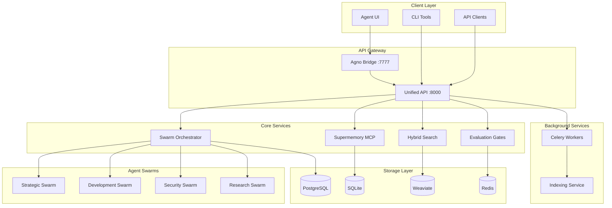

# Sophia Intel AI Documentation

## 📚 Documentation Overview

Welcome to the comprehensive documentation for Sophia Intel AI - a production-ready platform for AI agent orchestration and swarm intelligence.

### Quick Navigation

| Section | Description |
|---------|------------|
| [Architecture](./architecture/README.md) | System design and component interactions |
| [API Reference](./api/README.md) | Complete API documentation |
| [Swarms](./swarms/README.md) | Agent swarm configurations and patterns |
| [Memory System](./memory/README.md) | Supermemory and hybrid search |
| [Deployment](./deployment/README.md) | Installation and deployment guides |
| [Development](./development/README.md) | Contributing and extending the system |

## 🏗️ System Architecture



## 🚀 Key Features

### 1. **AI Agent Swarms**
- 4 specialized swarms with 24+ agents
- Parallel execution with streaming responses
- Dynamic role assignment
- Consensus-based decision making

### 2. **Memory & Retrieval**
- Supermemory with deduplication
- Hybrid search (BM25 + Vector)
- GraphRAG for knowledge graphs
- 70% embedding cache hit rate

### 3. **Production Features**
- Rate limiting and circuit breakers
- Prometheus metrics and tracing
- Background indexing with Celery
- Comprehensive error handling

### 4. **Developer Experience**
- Plugin architecture for extensibility
- Pre-commit hooks for code quality
- Comprehensive type hints
- Detailed API documentation

## 📊 Environment Configuration

### Required Environment Variables

| Variable | Description | Default | Required |
|----------|-------------|---------|----------|
| `OPENROUTER_API_KEY` | OpenRouter API key | - | ✅ |
| `PORTKEY_API_KEY` | Portkey virtual key | - | ✅ |
| `TOGETHER_API_KEY` | Together AI key | - | ⚠️ |
| `ANTHROPIC_API_KEY` | Anthropic API key | - | ⚠️ |
| `AGNO_API_KEY` | Agno platform key | - | ⚠️ |
| `WEAVIATE_URL` | Weaviate endpoint | `http://localhost:8080` | ❌ |
| `REDIS_URL` | Redis connection | `redis://localhost:6379` | ❌ |
| `POSTGRES_URL` | PostgreSQL connection | - | ❌ |
| `LOCAL_DEV_MODE` | Enable dev features | `false` | ❌ |

### Configuration Files

- `.env` - Environment variables
- `swarm_config.json` - Swarm configurations
- `pyproject.toml` - Package configuration
- `docker-compose.yml` - Container orchestration

## 🔧 Quick Start

```bash
# 1. Clone repository
git clone https://github.com/ai-cherry/sophia-intel-ai.git
cd sophia-intel-ai

# 2. Set up environment
cp .env.example .env
# Edit .env with your API keys

# 3. Deploy with Docker
docker-compose -f docker-compose.production.yml up -d

# 4. Verify deployment
curl http://localhost:8000/healthz
```

## 📖 Documentation Structure

```
docs/
├── README.md                # This file
├── architecture/           # System design
│   ├── README.md
│   ├── components.md
│   ├── data-flow.md
│   └── decisions.md
├── api/                    # API reference
│   ├── README.md
│   ├── teams.md
│   ├── memory.md
│   ├── search.md
│   └── openapi.json
├── swarms/                 # Agent documentation
│   ├── README.md
│   ├── patterns.md
│   ├── roles.md
│   └── examples.md
├── memory/                 # Memory system
│   ├── README.md
│   ├── supermemory.md
│   ├── embeddings.md
│   └── search.md
├── deployment/            # Deployment guides
│   ├── README.md
│   ├── docker.md
│   ├── kubernetes.md
│   └── production.md
└── development/           # Developer guides
    ├── README.md
    ├── plugin-system.md
    ├── testing.md
    └── contributing.md
```

## 🤝 Support

- **GitHub Issues**: [Report bugs](https://github.com/ai-cherry/sophia-intel-ai/issues)
- **Discussions**: [Ask questions](https://github.com/ai-cherry/sophia-intel-ai/discussions)
- **Discord**: Join our community
- **Email**: team@sophia-intel.ai

## 📄 License

MIT License - See [LICENSE](../LICENSE) for details.