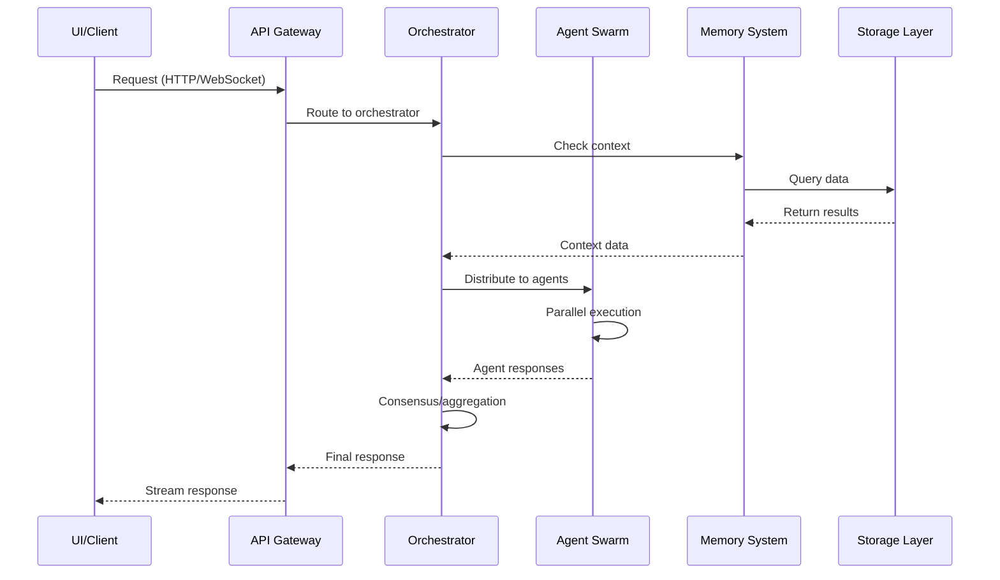

# System Architecture

## Overview

Sophia Intel AI is a production-ready platform for AI agent orchestration and swarm intelligence, built with a modular, scalable architecture.

## Core Components

### 1. API Gateway Layer
- **Unified API Server** (Port 8000): Main API endpoint for all agent operations
- **Agno Bridge** (Port 7777): Compatibility layer for Agno playground UI
- **WebSocket Support**: Real-time streaming responses

### 2. Agent Orchestration
- **Swarm Orchestrator**: Manages parallel agent execution
- **Role Assignment**: Dynamic agent selection based on task requirements
- **Consensus Engine**: Aggregates multi-agent responses
- **Execution Gates**: Quality control checkpoints

### 3. Memory & Retrieval
- **Supermemory MCP**: Persistent memory with deduplication
- **Hybrid Search**: BM25 + Vector similarity search
- **GraphRAG**: Knowledge graph relationships
- **Embedding Cache**: 70% hit rate optimization

### 4. Storage Layer
- **Weaviate**: Vector database for semantic search
- **PostgreSQL**: GraphRAG and relational data
- **Redis**: Caching and session management
- **SQLite**: Local Supermemory storage

### 5. Background Services
- **Celery Workers**: Asynchronous task processing
- **Indexing Service**: Background document indexing
- **Metrics Collector**: Prometheus metrics aggregation

## Data Flow



## Scalability Patterns

### Horizontal Scaling
- Agent swarms can be distributed across multiple workers
- Celery workers scale independently
- Redis clustering for cache distribution
- PostgreSQL read replicas for query scaling

### Vertical Scaling
- Memory-optimized instances for Weaviate
- GPU acceleration for embedding generation
- High-memory workers for large context processing

## Security Architecture

### API Security
- Rate limiting per endpoint and client
- API key authentication
- Request validation with Pydantic
- SQL injection prevention

### Data Security
- Encryption at rest for sensitive data
- TLS for all network communication
- Secure credential management
- Audit logging for compliance

## Monitoring & Observability

### Metrics
- Prometheus metrics for all components
- Custom business metrics
- Resource utilization tracking
- Error rate monitoring

### Tracing
- OpenTelemetry for distributed tracing
- Request flow visualization
- Performance bottleneck identification
- Dependency mapping

### Logging
- Structured JSON logging
- Centralized log aggregation
- Log levels per component
- Correlation IDs for request tracking

## Deployment Architecture

### Docker Compose (Development/Testing)
```yaml
Services:
  - API Server (Port 8000)
  - Agno Bridge (Port 7777)
  - UI Dashboard (Port 3001)
  - Agent UI (Port 3002)
  - Weaviate (Port 8080)
  - Redis (Port 6379)
  - PostgreSQL (Port 5432)
  - Prometheus (Port 9090)
  - Grafana (Port 3005)
```

### Kubernetes (Production)
- Helm charts for deployment
- Auto-scaling based on metrics
- Rolling updates with zero downtime
- Service mesh for inter-service communication

## Performance Characteristics

### Latency Targets
- P50: < 200ms
- P95: < 500ms
- P99: < 1000ms

### Throughput
- 1000+ requests/second per instance
- 100+ concurrent agent executions
- 10,000+ memories indexed/hour

### Resource Requirements
- **Minimum**: 4 CPU, 8GB RAM
- **Recommended**: 8 CPU, 16GB RAM
- **Production**: 16+ CPU, 32GB+ RAM

## Architecture Decisions

See [decisions.md](./decisions.md) for detailed architectural decision records (ADRs).