# AI Orchestra Component Interaction Diagrams

## System Architecture Overview

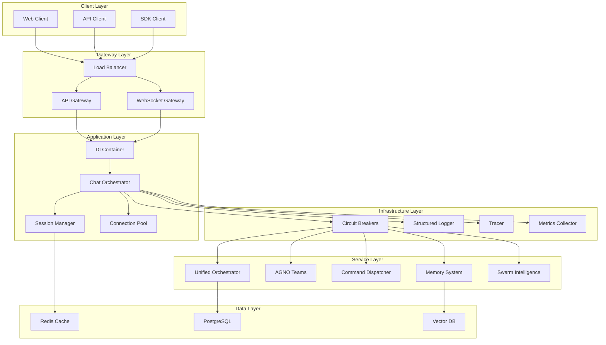

## Request Flow Sequence

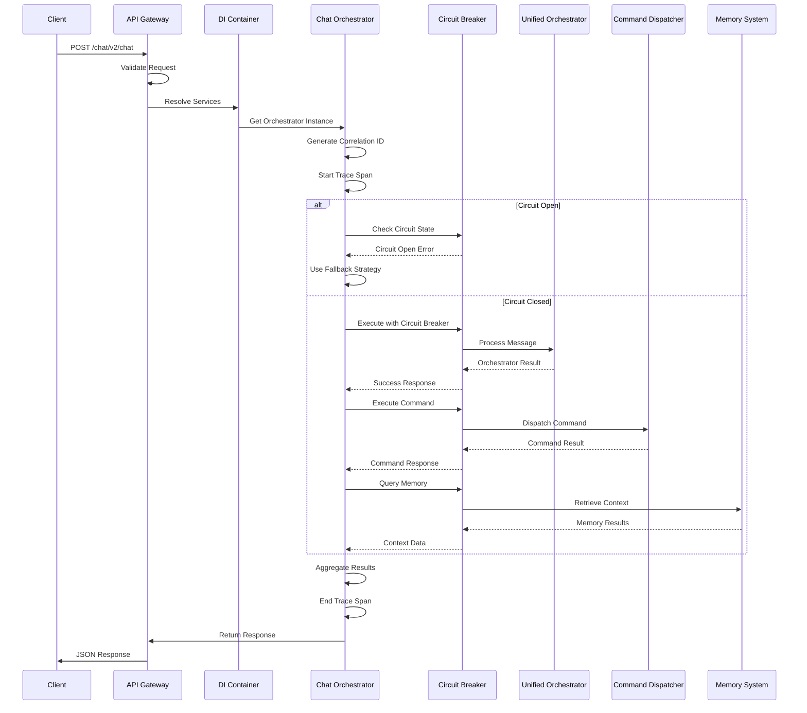

## WebSocket Connection Flow

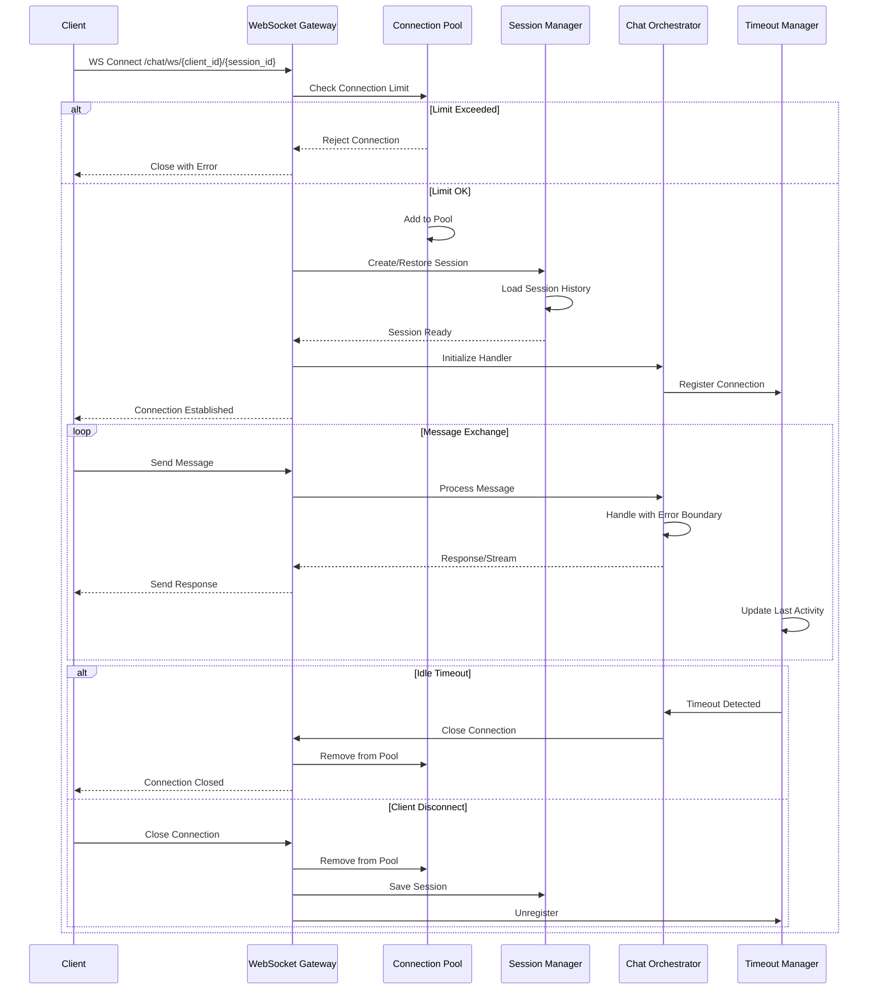

## Circuit Breaker State Machine

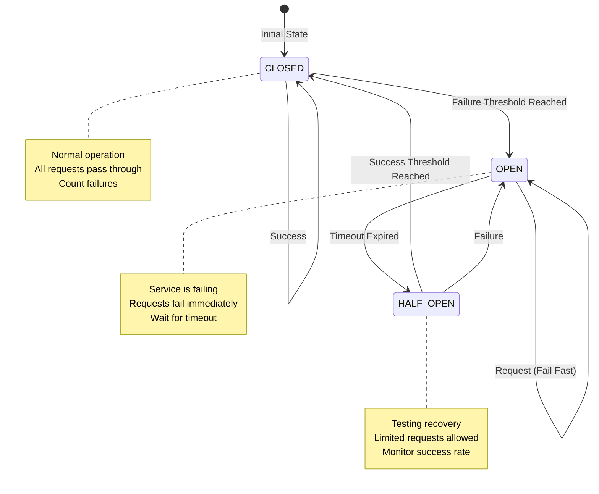

## Graceful Degradation Levels

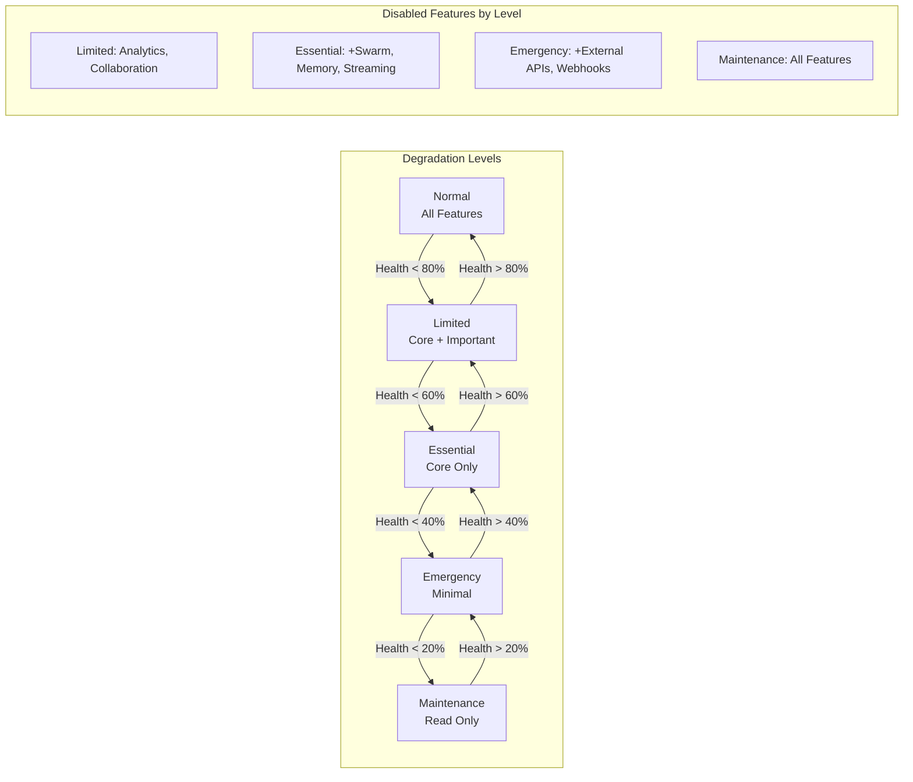

## Dependency Injection Container

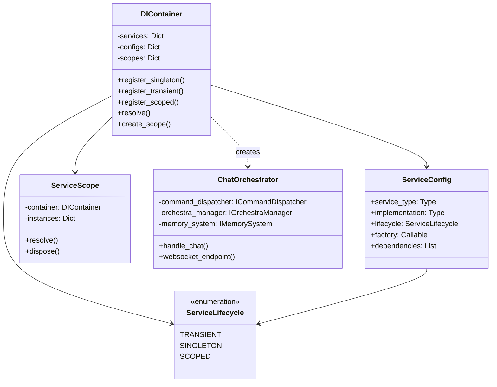

## Error Handling Flow

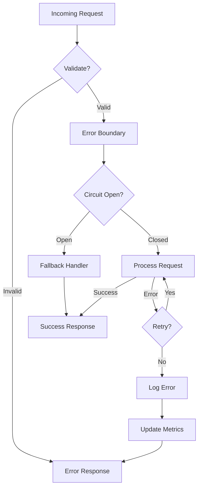

## Session State Management

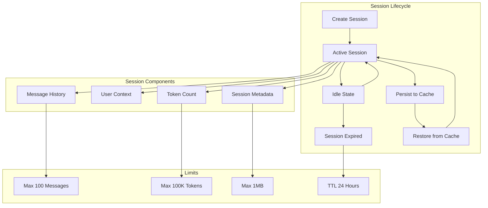

## Monitoring and Observability

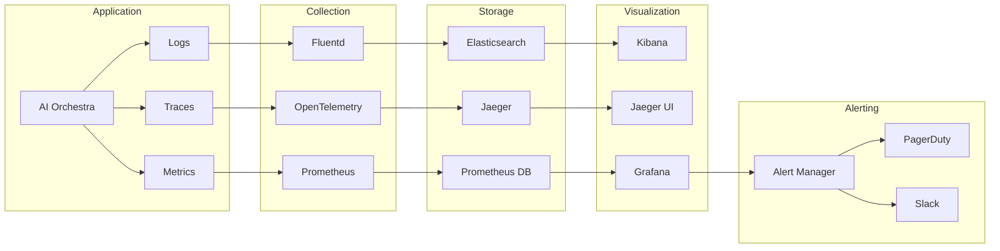

## API Version Compatibility

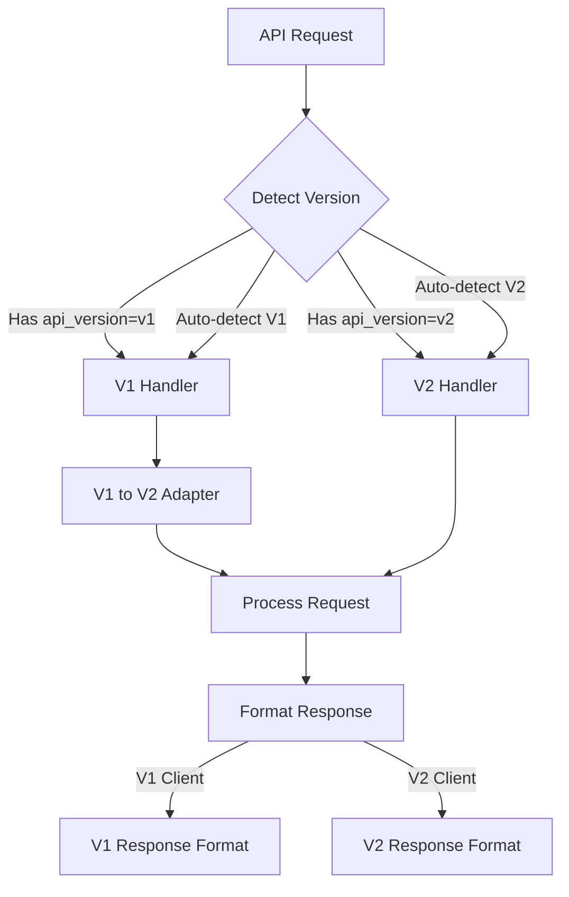

## Deployment Architecture

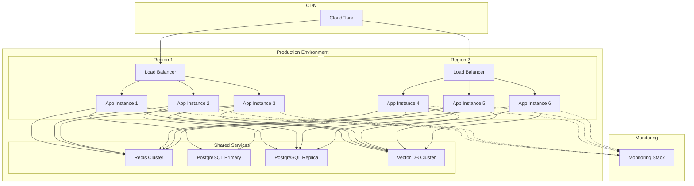

## Testing Strategy

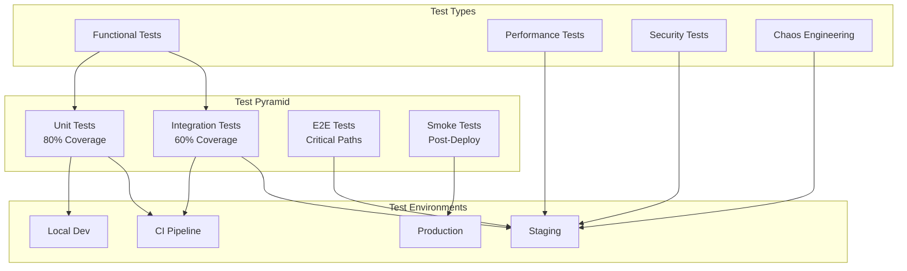

## Data Flow

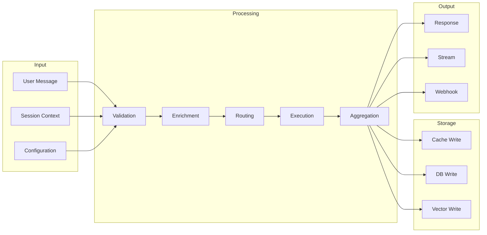

## Security Architecture

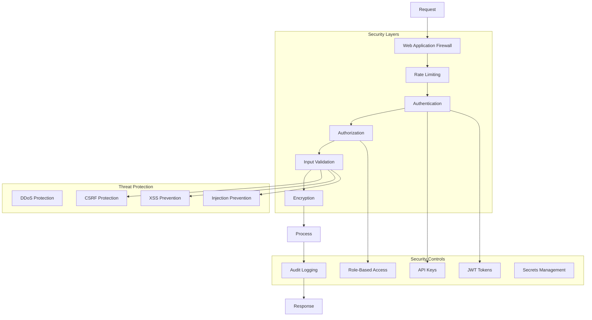

---

These diagrams provide a comprehensive view of the AI Orchestra system architecture, showing:

1. **System Architecture**: Overall component layout and relationships
2. **Request Flow**: Detailed sequence of request processing
3. **WebSocket Flow**: Real-time connection handling
4. **Circuit Breaker**: State machine for fault tolerance
5. **Graceful Degradation**: Feature reduction strategy
6. **Dependency Injection**: Service management structure
7. **Error Handling**: Comprehensive error flow
8. **Session Management**: Lifecycle and limits
9. **Monitoring**: Observability stack
10. **API Versioning**: Compatibility handling
11. **Deployment**: Production architecture
12. **Testing**: Test strategy pyramid
13. **Data Flow**: Information processing pipeline
14. **Security**: Defense in depth approach

Each diagram uses Mermaid syntax for easy rendering in documentation tools and provides clear visualization of component interactions and system behavior.
