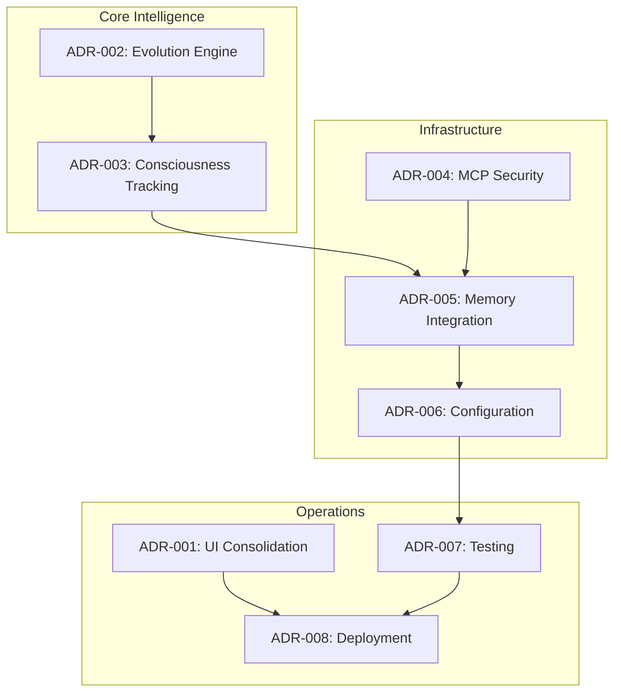

# Architecture Decision Records (ADRs)

This directory contains Architecture Decision Records for the Sophia Intel AI Autonomous Swarms Implementation.

## ADR Index

| ADR | Title | Status | Date | Implementation References |
|-----|-------|--------|------|-------------------------|
| [ADR-001](./ADR-001.md) | UI Consolidation Strategy | Accepted | 2025-01-09 | [`agent-ui/`](../../../agent-ui/), [`docker-compose.local.yml`](../../../docker-compose.local.yml:220) |
| [ADR-002](./ADR-002.md) | Evolution Engine Architecture | Accepted | 2025-01-09 | [`EvolutionEngine`](../../../app/swarms/unified_enhanced_orchestrator.py:461), [`ConsensusPattern`](../../../app/swarms/patterns/consensus.py) |
| [ADR-003](./ADR-003.md) | Consciousness Tracking System | Accepted | 2025-01-09 | [`ConsciousnessTracker`](../../../app/swarms/unified_enhanced_orchestrator.py:675) |
| [ADR-004](./ADR-004.md) | MCP Server Security Framework | Accepted | 2025-01-09 | [`UnifiedMemoryStore`](../../../pulumi/mcp-server/src/unified_memory.py:140) |
| [ADR-005](./ADR-005.md) | Memory System Integration Architecture | Accepted | 2025-01-09 | [`unified_memory.py`](../../../pulumi/mcp-server/src/unified_memory.py), [`modern_embeddings.py`](../../../pulumi/vector-store/src/modern_embeddings.py) |
| [ADR-006](./ADR-006.md) | Configuration Management Standardization | Accepted | 2025-01-09 | [`EnvLoader`](../../../app/config/env_loader.py:102), [`sophia-intel-base.yaml`](../../../pulumi/environments/sophia-intel-base.yaml) |
| [ADR-007](./ADR-007.md) | Testing and Validation Framework | Accepted | 2025-01-09 | [`test_consensus_swarm_memory_dedup.py`](../../../tests/integration/test_consensus_swarm_memory_dedup.py) |
| [ADR-008](./ADR-008.md) | Deployment and Operations Architecture | Accepted | 2025-01-09 | [`docker-compose.local.yml`](../../../docker-compose.local.yml), [`fly-*.toml`](../../../fly-unified-api.toml) |

## Decision Dependencies

## Using This Documentation

1. **For New Team Members**: Start with ADR-001 and ADR-008 to understand UI and deployment decisions
2. **For AI/ML Development**: Focus on ADR-002 and ADR-003 for swarm intelligence patterns  
3. **For Infrastructure Work**: Review ADR-004, ADR-005, and ADR-006 for system integration
4. **For Testing & Operations**: Refer to ADR-007 and ADR-008 for validation and deployment

## ADR Template

See [`template.md`](./template.md) for the standard ADR format used in this project.