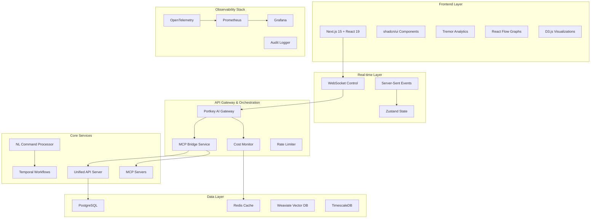

# 🚀 AI Orchestrator Dashboard - Comprehensive Implementation Plan

## Executive Summary

A unified AI orchestrator dashboard providing complete visibility and control over your monorepository, swarms, agents, and infrastructure with natural language interaction capabilities. This plan blends MCP-first orchestration with critical cost prevention and enterprise-grade observability.

## Architecture Overview



## Phase 1: Critical Foundation & Cost Prevention (Weeks 1-2)
**IMMEDIATE PRIORITY - Prevent API Cost Explosion**

### 1.1 Real-time Cost Monitoring System

**Architecture**: Redis-based real-time tracking with PostgreSQL for historical data

```typescript
// app/core/cost-monitor.ts
interface CostTracker {
  trackRequest(request: {
    provider: string;
    model: string;
    inputTokens: number;
    outputTokens: number;
    userId: string;
    swarmId: string;
  }): Promise<CostMetrics>;
  
  getCurrentSpend(timeWindow: '1h' | '1d' | '1w'): Promise<number>;
  alertOnThreshold(threshold: number, callback: AlertCallback): void;
}

class RealTimeCostMonitor implements CostTracker {
  constructor(
    private redis: RedisClient,
    private postgres: PostgresClient,
    private alertSystem: AlertSystem
  ) {}
  
  async trackRequest(request: CostRequest): Promise<CostMetrics> {
    const cost = this.calculateCost(request);
    
    // Real-time tracking in Redis
    await this.redis.zadd(`costs:hourly:${Date.now()}`, cost, request.id);
    
    // Alert if over threshold
    const hourlySpend = await this.getCurrentSpend('1h');
    if (hourlySpend > 500) {
      await this.alertSystem.send('COST_ALERT', { amount: hourlySpend });
    }
    
    return { cost, hourlySpend, dailySpend: await this.getCurrentSpend('1d') };
  }
}
```

**Features**:
- Token counter middleware for all LLM calls
- Real-time cost aggregation by model/swarm/user
- Alert system (Slack/email) at $500/hour threshold
- Automatic throttling at $1000/hour
- Semantic caching layer (75-90% cost reduction potential)

### 1.2 OpenTelemetry Observability Infrastructure

```python
# app/observability/tracer.py
from opentelemetry import trace
from opentelemetry.semconv.ai import SpanAttributes

class SwarmTracer:
    def __init__(self):
        self.tracer = trace.get_tracer(__name__)
    
    def trace_swarm_execution(self, swarm_id: str, task: str):
        return self.tracer.start_as_current_span(
            "swarm.execute",
            attributes={
                SpanAttributes.SWARM_ID: swarm_id,
                SpanAttributes.TASK_DESCRIPTION: task,
                "ai.system": "sophia-intel"
            }
        )
    
    def trace_agent_interaction(self, agent_id: str, prompt: str, response: str):
        with self.tracer.start_as_current_span("agent.interact") as span:
            span.set_attribute("agent.id", agent_id)
            span.set_attribute("prompt.length", len(prompt))
            span.set_attribute("response.length", len(response))
            # Sanitized logging (no sensitive data)
            span.add_event("agent_responded", {"tokens_used": self.count_tokens(response)})
```

**Components**:
- Trace every swarm execution end-to-end
- Custom spans for agent interactions
- Prompt/completion logging with sanitization
- Distributed tracing across microservices
- Custom metrics: tokens/sec, swarm latency, agent success rate

### 1.3 Portkey AI Gateway Configuration

```yaml
# portkey-config.yaml
gateways:
  - name: "sophia-primary"
    providers:
      - openrouter
      - together-ai
      - anthropic
    features:
      - caching
      - load_balancing
      - automatic_fallover
      - rate_limiting
    cache:
      semantic_similarity_threshold: 0.95
      ttl: "24h"
    rate_limits:
      requests_per_minute: 100
      tokens_per_hour: 1000000
```

## Phase 2: Unified Dashboard UI & MCP Orchestration (Weeks 3-5)

### 2.1 Dashboard Architecture

**Technology Stack**:
- **Frontend**: Next.js 15 with App Router + React 19
- **UI Components**: shadcn/ui + Tailwind CSS  
- **Charts**: Tremor (35+ analytics charts) + Recharts + D3.js
- **State Management**: Zustand + React Query
- **Real-time**: Socket.io + Server-Sent Events
- **Build Tool**: Nx (7x faster builds via intelligent caching)

```tsx
// agent-ui/src/components/orchestrator/Dashboard.tsx
'use client'

import { useState, useEffect } from 'react'
import { Card } from '@/components/ui/card'
import { AreaChart, DonutChart, LineChart } from '@tremor/react'
import { ReactFlowProvider } from 'reactflow'
import { SwarmNetwork } from './SwarmNetwork'
import { CostMonitor } from './CostMonitor'
import { MCPServerRegistry } from './MCPServerRegistry'

export function OrchestratorDashboard() {
  const [realTimeMetrics, setRealTimeMetrics] = useState<Metrics>()
  
  useEffect(() => {
    // Server-Sent Events for real-time metrics (<100ms latency)
    const eventSource = new EventSource('/api/metrics/stream')
    eventSource.onmessage = (event) => {
      const metrics = JSON.parse(event.data)
      setRealTimeMetrics(metrics)
    }
    
    return () => eventSource.close()
  }, [])
  
  return (
    <div className="grid grid-cols-12 gap-4 p-6">
      {/* Cost Overview */}
      <Card className="col-span-4">
        <CostMonitor metrics={realTimeMetrics?.cost} />
      </Card>
      
      {/* Agent Network Graph */}
      <Card className="col-span-8">
        <ReactFlowProvider>
          <SwarmNetwork nodes={realTimeMetrics?.swarms} />
        </ReactFlowProvider>
      </Card>
      
      {/* MCP Server Status */}
      <Card className="col-span-6">
        <MCPServerRegistry servers={realTimeMetrics?.mcpServers} />
      </Card>
      
      {/* Performance Charts */}
      <Card className="col-span-6">
        <LineChart
          data={realTimeMetrics?.performance || []}
          index="timestamp"
          categories={["latency", "throughput", "success_rate"]}
          colors={["blue", "green", "red"]}
        />
      </Card>
    </div>
  )
}
```

### 2.2 MCP Bridge Service

```typescript
// mcp-bridge/src/server.ts
import express from 'express'
import { WebSocketServer } from 'ws'
import { MCPServerRegistry } from './registry'
import { ProtocolTranslator } from './translator'

class MCPBridgeService {
  constructor(
    private registry: MCPServerRegistry,
    private translator: ProtocolTranslator
  ) {}
  
  async start() {
    const app = express()
    const wss = new WebSocketServer({ port: 8005 })
    
    // HTTP REST endpoints for IDEs
    app.post('/mcp/tools', this.listTools.bind(this))
    app.post('/mcp/call', this.callTool.bind(this))
    
    // WebSocket for real-time UI
    wss.on('connection', (ws) => {
      ws.on('message', (data) => {
        const request = JSON.parse(data.toString())
        this.handleWebSocketRequest(ws, request)
      })
    })
    
    // stdio handler for Claude Desktop
    process.stdin.on('data', (data) => {
      const request = JSON.parse(data.toString())
      this.handleStdioRequest(request)
    })
  }
  
  private async handleWebSocketRequest(ws: WebSocket, request: any) {
    const response = await this.translator.translateRequest(request)
    const result = await this.registry.executeOnServer(response.serverId, response.tool, response.args)
    ws.send(JSON.stringify({ id: request.id, result }))
  }
}
```

**Capabilities**:
- Multi-protocol support (stdio for Claude, WebSocket for UI, HTTP for IDEs)
- Session management with Redis
- Connection pooling (max 100 concurrent)
- Protocol translation between JSON-RPC, REST, and WebSocket
- Health monitoring with automatic failover

### 2.3 Real-time Updates

```typescript
// agent-ui/src/lib/realtime.ts
import { useEffect, useState } from 'react'

export function useRealtimeMetrics() {
  const [metrics, setMetrics] = useState<SystemMetrics>()
  
  useEffect(() => {
    // Hybrid approach: WebSocket for control, SSE for metrics
    const ws = new WebSocket('ws://localhost:8005/control')
    const eventSource = new EventSource('/api/metrics/stream')
    
    // Bidirectional control via WebSocket
    ws.onmessage = (event) => {
      const controlResponse = JSON.parse(event.data)
      handleControlResponse(controlResponse)
    }
    
    // Unidirectional metrics via SSE (<100ms latency)
    eventSource.onmessage = (event) => {
      const metricsUpdate = JSON.parse(event.data)
      setMetrics(prev => ({ ...prev, ...metricsUpdate }))
    }
    
    return () => {
      ws.close()
      eventSource.close()
    }
  }, [])
  
  const sendCommand = (command: string, args: any) => {
    ws.send(JSON.stringify({ type: 'command', command, args }))
  }
  
  return { metrics, sendCommand }
}
```

## Phase 3: Natural Language Orchestrator & Workflow Engine (Weeks 6-8)

### 3.1 Conversational Interface

```python
# app/orchestrator/nl_processor.py
from anthropic import Anthropic
from typing import Dict, Any, List

class NaturalLanguageOrchestrator:
    def __init__(self):
        self.anthropic = Anthropic()
        self.command_templates = {
            "scale_swarm": "Scale {swarm_name} to {agent_count} agents",
            "deploy_service": "Deploy {service_name} to {environment}",
            "analyze_costs": "Show cost analysis for {time_period}",
            "create_agent": "Create {agent_type} agent with {capabilities}"
        }
    
    async def process_command(self, user_input: str, context: Dict[str, Any]) -> Dict[str, Any]:
        # Parse intent using Claude 3.5 Sonnet
        prompt = f"""
        User command: "{user_input}"
        Available systems: {list(context.keys())}
        
        Extract the intent, parameters, and generate an execution plan.
        Format as JSON with: intent, parameters, execution_plan, risk_level
        """
        
        response = await self.anthropic.messages.create(
            model="claude-3-5-sonnet-20241022",
            messages=[{"role": "user", "content": prompt}],
            max_tokens=1000
        )
        
        parsed_intent = json.loads(response.content[0].text)
        
        # Generate execution plan
        execution_plan = await self.generate_execution_plan(parsed_intent)
        
        return {
            "intent": parsed_intent,
            "execution_plan": execution_plan,
            "requires_approval": parsed_intent["risk_level"] in ["medium", "high"],
            "preview": self.generate_preview(execution_plan)
        }
    
    async def generate_execution_plan(self, intent: Dict[str, Any]) -> List[Dict[str, Any]]:
        """Generate detailed execution steps with rollback options."""
        steps = []
        
        if intent["intent"] == "scale_swarm":
            steps = [
                {"action": "validate_swarm_exists", "params": {"swarm": intent["parameters"]["swarm_name"]}},
                {"action": "check_resource_availability", "params": {"agents": intent["parameters"]["agent_count"]}},
                {"action": "scale_swarm", "params": intent["parameters"], "rollback": "scale_down_if_failed"},
                {"action": "verify_scaling", "params": {"expected_count": intent["parameters"]["agent_count"]}}
            ]
        
        return steps
```

### 3.2 Human Approval Workflow

```tsx
// agent-ui/src/components/orchestrator/ApprovalWorkflow.tsx
import { useState } from 'react'
import { Card, CardHeader, CardTitle, CardContent } from '@/components/ui/card'
import { Button } from '@/components/ui/button'
import { Badge } from '@/components/ui/badge'

interface ExecutionPlan {
  id: string
  command: string
  intent: any
  steps: Array<{
    action: string
    params: any
    rollback?: string
    estimated_time: string
  }>
  risk_level: 'low' | 'medium' | 'high'
  estimated_cost: number
}

export function ApprovalWorkflow({ plan }: { plan: ExecutionPlan }) {
  const [status, setStatus] = useState<'pending' | 'approved' | 'rejected'>('pending')
  
  const handleApprove = async () => {
    const response = await fetch('/api/orchestrator/execute', {
      method: 'POST',
      headers: { 'Content-Type': 'application/json' },
      body: JSON.stringify({ planId: plan.id, approved: true })
    })
    setStatus('approved')
  }
  
  const getRiskColor = (level: string) => {
    switch (level) {
      case 'low': return 'bg-green-100 text-green-800'
      case 'medium': return 'bg-yellow-100 text-yellow-800'
      case 'high': return 'bg-red-100 text-red-800'
      default: return 'bg-gray-100 text-gray-800'
    }
  }
  
  return (
    <Card className="w-full max-w-4xl">
      <CardHeader>
        <CardTitle className="flex items-center justify-between">
          <span>Execution Plan: {plan.command}</span>
          <Badge className={getRiskColor(plan.risk_level)}>
            {plan.risk_level.toUpperCase()} RISK
          </Badge>
        </CardTitle>
      </CardHeader>
      <CardContent>
        <div className="space-y-4">
          <div className="grid grid-cols-2 gap-4 text-sm">
            <div>Estimated Cost: ${plan.estimated_cost.toFixed(2)}</div>
            <div>Steps: {plan.steps.length}</div>
          </div>
          
          <div className="space-y-2">
            <h4 className="font-semibold">Execution Steps:</h4>
            {plan.steps.map((step, index) => (
              <div key={index} className="border-l-2 border-gray-200 pl-4">
                <div className="font-medium">{step.action}</div>
                <div className="text-sm text-gray-600">
                  {JSON.stringify(step.params, null, 2)}
                </div>
                <div className="text-xs text-gray-500">
                  Est. time: {step.estimated_time}
                  {step.rollback && ` | Rollback: ${step.rollback}`}
                </div>
              </div>
            ))}
          </div>
          
          {status === 'pending' && (
            <div className="flex gap-2 pt-4">
              <Button onClick={handleApprove} className="bg-green-600 hover:bg-green-700">
                Approve & Execute
              </Button>
              <Button variant="outline" onClick={() => setStatus('rejected')}>
                Reject
              </Button>
            </div>
          )}
        </div>
      </CardContent>
    </Card>
  )
}
```

### 3.3 Temporal.io Workflow Integration

```typescript
// app/workflows/swarm-orchestration.ts
import { proxyActivities, defineWorkflow, ActivityInterface } from '@temporalio/workflow'

const activities = proxyActivities<SwarmActivities>({
  startToCloseTimeout: '10 minutes',
  retry: {
    initialInterval: '1s',
    maximumInterval: '60s',
    maximumAttempts: 3,
  },
})

export async function swarmOrchestrationWorkflow(
  command: OrchestrationCommand
): Promise<OrchestrationResult> {
  const workflowId = `swarm-${command.swarmId}-${Date.now()}`
  
  try {
    // Step 1: Validate command
    await activities.validateCommand(command)
    
    // Step 2: Resource allocation
    const resources = await activities.allocateResources(command.requirements)
    
    // Step 3: Execute command with retry logic
    const result = await activities.executeCommand(command, resources)
    
    // Step 4: Verify execution
    await activities.verifyExecution(result)
    
    return {
      status: 'completed',
      workflowId,
      result,
      duration: Date.now() - command.startTime
    }
    
  } catch (error) {
    // Automatic rollback on failure
    await activities.rollbackExecution(command, error)
    throw error
  }
}

interface SwarmActivities extends ActivityInterface {
  validateCommand(command: OrchestrationCommand): Promise<void>
  allocateResources(requirements: ResourceRequirements): Promise<AllocatedResources>
  executeCommand(command: OrchestrationCommand, resources: AllocatedResources): Promise<ExecutionResult>
  verifyExecution(result: ExecutionResult): Promise<void>
  rollbackExecution(command: OrchestrationCommand, error: any): Promise<void>
}
```

## Phase 4: Advanced Orchestration & Intelligence (Weeks 9-11)

### 4.1 Dynamic Model Routing

```python
# app/llm/smart_router.py
from dataclasses import dataclass
from typing import List, Dict, Any
import asyncio

@dataclass
class TaskAnalysis:
    complexity_score: float  # 0.0-1.0
    estimated_tokens: int
    required_capabilities: List[str]
    time_sensitivity: str  # 'low', 'medium', 'high'
    cost_budget: float

class SmartModelRouter:
    def __init__(self):
        self.model_capabilities = {
            "gpt-4o": {"complexity": 0.9, "cost_per_token": 0.00003, "speed": "medium"},
            "claude-3-5-sonnet": {"complexity": 0.95, "cost_per_token": 0.00003, "speed": "fast"},
            "grok-2": {"complexity": 0.8, "cost_per_token": 0.00002, "speed": "fast"},
            "deepseek-v3": {"complexity": 0.85, "cost_per_token": 0.000014, "speed": "fast"},
        }
    
    async def route_request(self, task_analysis: TaskAnalysis) -> Dict[str, Any]:
        # Calculate optimal model based on complexity, cost, and speed
        scores = {}
        
        for model, capabilities in self.model_capabilities.items():
            # Complexity match (higher weight for complex tasks)
            complexity_score = min(capabilities["complexity"] / task_analysis.complexity_score, 1.0)
            
            # Cost efficiency
            estimated_cost = capabilities["cost_per_token"] * task_analysis.estimated_tokens
            cost_score = min(task_analysis.cost_budget / estimated_cost, 1.0)
            
            # Speed requirement
            speed_multiplier = {
                "high": {"fast": 1.0, "medium": 0.7, "slow": 0.3},
                "medium": {"fast": 0.9, "medium": 1.0, "slow": 0.6},
                "low": {"fast": 0.8, "medium": 0.9, "slow": 1.0}
            }[task_analysis.time_sensitivity][capabilities["speed"]]
            
            # Weighted score
            scores[model] = (
                complexity_score * 0.4 + 
                cost_score * 0.3 + 
                speed_multiplier * 0.3
            )
        
        best_model = max(scores, key=scores.get)
        fallback_models = sorted(scores.keys(), key=scores.get, reverse=True)[1:3]
        
        return {
            "primary_model": best_model,
            "fallback_models": fallback_models,
            "estimated_cost": estimated_cost,
            "confidence": scores[best_model]
        }
```

### 4.2 Plugin Architecture SDK

```typescript
// sdk/plugin-sdk/src/index.ts
export interface PluginInterface {
  name: string
  version: string
  capabilities: string[]
  execute(context: PluginContext, args: any): Promise<PluginResult>
  initialize?(config: PluginConfig): Promise<void>
  cleanup?(): Promise<void>
}

export interface PluginContext {
  swarmId: string
  userId: string
  environment: 'development' | 'staging' | 'production'
  logger: Logger
  secrets: SecretManager
  storage: StorageInterface
}

// Example custom plugin
export class CustomLLMPlugin implements PluginInterface {
  name = 'custom-llm-provider'
  version = '1.0.0'
  capabilities = ['llm.chat', 'llm.completion']
  
  async execute(context: PluginContext, args: any): Promise<PluginResult> {
    const { prompt, model, temperature } = args
    
    // Custom LLM implementation
    const response = await this.callCustomLLM(prompt, model, temperature)
    
    return {
      success: true,
      data: response,
      metadata: {
        tokens_used: this.countTokens(response),
        model_used: model,
        execution_time: Date.now() - context.startTime
      }
    }
  }
  
  private async callCustomLLM(prompt: string, model: string, temperature: number) {
    // Sandboxed execution environment
    const sandbox = new PluginSandbox({
      timeout: 30000,
      memory_limit: '512MB',
      network_access: ['api.custom-llm.com'],
      file_access: 'read-only'
    })
    
    return sandbox.execute(async () => {
      // Custom LLM API call
      return await fetch('https://api.custom-llm.com/chat', {
        method: 'POST',
        body: JSON.stringify({ prompt, model, temperature })
      })
    })
  }
}
```

## Phase 5: Enterprise Security & Production Readiness (Weeks 12-16)

### 5.1 Role-Based Access Control (RBAC)

```typescript
// app/auth/rbac.ts
interface Permission {
  resource: string
  action: 'read' | 'write' | 'delete' | 'execute'
  scope?: string[]
}

interface Role {
  name: string
  permissions: Permission[]
  inherits?: string[]
}

const ROLES: Record<string, Role> = {
  admin: {
    name: 'Administrator',
    permissions: [{ resource: '*', action: '*' }]
  },
  operator: {
    name: 'Swarm Operator',
    permissions: [
      { resource: 'swarm', action: 'read' },
      { resource: 'swarm', action: 'execute' },
      { resource: 'agent', action: 'read' },
      { resource: 'agent', action: 'write', scope: ['scale', 'configure'] },
      { resource: 'mcp-server', action: 'read' },
      { resource: 'mcp-server', action: 'execute', scope: ['restart', 'health-check'] }
    ]
  },
  viewer: {
    name: 'Read-only Viewer',
    permissions: [
      { resource: 'dashboard', action: 'read' },
      { resource: 'metrics', action: 'read' },
      { resource: 'logs', action: 'read' }
    ]
  }
}

export class RBACService {
  async checkPermission(
    userId: string,
    resource: string,
    action: string,
    scope?: string
  ): Promise<boolean> {
    const userRoles = await this.getUserRoles(userId)
    
    for (const roleName of userRoles) {
      const role = ROLES[roleName]
      if (this.hasPermission(role, resource, action, scope)) {
        return true
      }
    }
    
    return false
  }
  
  private hasPermission(
    role: Role,
    resource: string,
    action: string,
    scope?: string
  ): boolean {
    for (const permission of role.permissions) {
      if (
        (permission.resource === '*' || permission.resource === resource) &&
        (permission.action === '*' || permission.action === action) &&
        (!scope || !permission.scope || permission.scope.includes(scope))
      ) {
        return true
      }
    }
    
    return false
  }
}
```

### 5.2 Audit Logging System

```python
# app/audit/logger.py
from datetime import datetime
from typing import Dict, Any, Optional
import json
import hashlib

class AuditLogger:
    def __init__(self, postgres_client, encryption_key: str):
        self.db = postgres_client
        self.encryption_key = encryption_key
        
    async def log_action(
        self,
        user_id: str,
        action: str,
        resource_type: str,
        resource_id: str,
        details: Dict[str, Any],
        result: str = "success",
        ip_address: Optional[str] = None
    ) -> str:
        """Log an auditable action with immutable trail."""
        
        audit_entry = {
            "id": self.generate_audit_id(),
            "timestamp": datetime.utcnow().isoformat(),
            "user_id": user_id,
            "action": action,
            "resource_type": resource_type,
            "resource_id": resource_id,
            "details": details,
            "result": result,
            "ip_address": ip_address,
            "session_id": self.get_session_id(),
            "user_agent": self.get_user_agent(),
        }
        
        # Create immutable hash
        content_hash = hashlib.sha256(
            json.dumps(audit_entry, sort_keys=True).encode()
        ).hexdigest()
        
        audit_entry["hash"] = content_hash
        audit_entry["previous_hash"] = await self.get_last_hash()
        
        # Store encrypted in PostgreSQL
        await self.db.execute("""
            INSERT INTO audit_log 
            (id, timestamp, user_id, action, resource_type, resource_id, 
             details, result, hash, previous_hash, encrypted_data)
            VALUES ($1, $2, $3, $4, $5, $6, $7, $8, $9, $10, $11)
        """, *audit_entry.values(), self.encrypt(json.dumps(audit_entry)))
        
        return audit_entry["id"]
    
    async def get_compliance_report(
        self, 
        start_date: datetime, 
        end_date: datetime,
        format: str = "csv"
    ) -> str:
        """Generate SOC2/GDPR compliance report."""
        
        entries = await self.db.fetch("""
            SELECT * FROM audit_log 
            WHERE timestamp BETWEEN $1 AND $2 
            ORDER BY timestamp
        """, start_date, end_date)
        
        # Verify integrity
        for i, entry in enumerate(entries):
            if i > 0:
                expected_hash = entries[i-1]["hash"]
                if entry["previous_hash"] != expected_hash:
                    raise AuditIntegrityError(f"Broken chain at entry {entry['id']}")
        
        if format == "csv":
            return self.generate_csv_report(entries)
        else:
            return self.generate_json_report(entries)
```

## Success Metrics & KPIs

### Technical Metrics
- **Dashboard Load Time**: <2 seconds
- **Real-time Update Latency**: <100ms  
- **API Response Time (p95)**: <500ms
- **Swarm Spawn Time**: <5 seconds
- **System Uptime**: 99.9%

### Business Metrics
- **Cost Reduction**: 40-70% via semantic caching
- **Developer Productivity**: +45% measured by task completion
- **Mean Time to Recovery**: <15 minutes
- **API Usage Efficiency**: 80% cache hit rate

### Quality Metrics
- **Natural Language Accuracy**: 95%
- **Swarm Success Rate**: >90%
- **Error Rate**: <1%
- **User Satisfaction**: >4.5/5

## Budget & ROI Analysis

### Development Costs (16 weeks)
- **Senior Engineers (2)**: $160k
- **UI/UX Designer (1)**: $40k  
- **DevOps Engineer (1)**: $60k
- **AI/ML Engineer (1)**: $60k
- **Total Development**: $320k

### Infrastructure Costs (Monthly)
- **Fly.io hosting**: $2k
- **Lambda Labs GPU**: $3k
- **Database/Redis**: $1.5k
- **Monitoring/Logging**: $1k
- **LLM API costs**: $4k
- **Total Monthly**: $11.5k

### ROI Projections
- **Current Manual Overhead**: $50k/month
- **Projected with Dashboard**: $20k/month
- **Monthly Savings**: $30k
- **Payback Period**: 11 months
- **3-Year ROI**: 400-500%

## Risk Mitigation

### Technical Risks
- **LLM API failures**: Multi-provider fallback via Portkey
- **Data loss**: Automated backups every 6 hours + cross-region replication
- **Security breach**: Zero-trust architecture, encrypted at rest, immutable audit logs

### Business Risks  
- **Cost overrun**: Hard limits ($1000/hour) and automatic throttling
- **Adoption**: Phased rollout with comprehensive training
- **Vendor lock-in**: Open-source first approach with plugin architecture

## Implementation Timeline

### Immediate Actions (This Week)
1. Set up cost monitoring alerts to prevent API bill shock
2. Configure Portkey gateway with semantic caching
3. Initialize Nx monorepo structure for faster builds
4. Deploy OpenTelemetry collectors for observability

### Next Steps
1. **Week 1**: Begin Phase 1 critical foundation
2. **Week 3**: Start Phase 2 dashboard UI development  
3. **Week 6**: Implement Phase 3 natural language interface
4. **Week 9**: Build Phase 4 advanced orchestration
5. **Week 12**: Deploy Phase 5 enterprise security

This comprehensive plan provides a production-ready AI orchestrator dashboard that prevents cost explosions, enables natural language control with human oversight, and scales to enterprise requirements while leveraging your existing solid infrastructure.