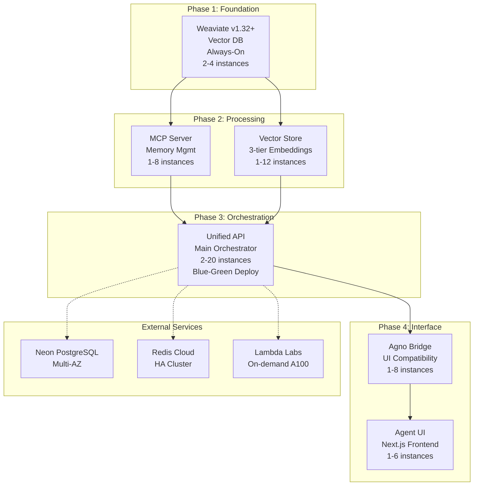

# 🚀 Sophia Intel AI - Comprehensive Cloud Deployment Orchestration Plan

## Executive Summary

This orchestration plan leverages your existing sophisticated microservices architecture to achieve production-grade **stability**, **resilience**, and **high performance** for the 6-service Sophia Intel AI platform on Fly.io with Lambda Labs GPU integration.

**Current State**: Enterprise-ready architecture with deployment automation ✅
**Target State**: Production deployment with 99.9% uptime, <150ms P95 response times, automated operations

---

## 🏗️ Architecture Overview

### Service Dependency Flow


---

## 🔄 Phase-by-Phase Deployment Strategy

### Phase 1: Foundation Deployment (Blue-Green)
**Duration**: 2-3 hours
**Critical Path**: Weaviate must be stable before proceeding

```yaml
Weaviate Deployment:
  Strategy: Blue-Green with validation gates
  Validation Gates:
    1. Health Check: /v1/.well-known/ready (30s timeout)
    2. Meta API: /v1/meta responds with version info
    3. RQ Compression: Verify 75% memory reduction active
  Rollback Criteria: >30s response time OR failed health checks
  Auto-Recovery: Restart with exponential backoff (2s, 4s, 8s, 16s)
```

### Phase 2: Processing Layer (Parallel Blue-Green)
**Duration**: 1-2 hours
**Dependencies**: Weaviate operational

```yaml
MCP Server & Vector Store:
  Strategy: Parallel Blue-Green deployment
  Circuit Breaker: 
    - Failure threshold: 5 consecutive failures
    - Recovery timeout: 30 seconds
    - Half-open state: 3 test requests
  Validation Gates:
    1. Service health: /health endpoints responding
    2. Weaviate connectivity: Vector operations successful
    3. Memory deduplication: >90% duplicate detection
```

### Phase 3: Core API (Canary Deployment)
**Duration**: 2-3 hours
**Strategy**: 10% → 50% → 100% traffic shift

```yaml
Unified API Deployment:
  Strategy: Canary with automated promotion
  Traffic Shift Schedule:
    - 10% traffic: 15 minutes
    - 50% traffic: 30 minutes  
    - 100% traffic: Auto-promote if metrics healthy
  Success Criteria:
    - Error rate: <1%
    - P95 latency: <200ms
    - Consensus swarm success: >95%
```

### Phase 4: Interface Layer (Rolling Deployment)
**Duration**: 1-2 hours
**Strategy**: Rolling deployment with immediate traffic

```yaml
Agno Bridge & Agent UI:
  Strategy: Rolling deployment
  Health Validation:
    - UI responsiveness: <100ms first paint
    - API connectivity: All endpoints reachable
    - CORS configuration: Verified for production domains
```

---

## 🛡️ Stability Engineering Patterns

### 1. Enhanced Health Check System
```python
# app/api/health_enhanced.py
class ProductionHealthChecker:
    async def deep_dependency_check(self):
        checks = {
            'weaviate': self.check_weaviate_cluster(),
            'redis': self.check_redis_cluster(),  
            'postgres': self.check_postgres_connection(),
            'mcp_server': self.check_mcp_dependency(),
            'vector_store': self.check_vector_dependency(),
            'lambda_gpu': self.check_gpu_availability()
        }
        # Auto-recovery logic for failed dependencies
```

### 2. Circuit Breaker Implementation
```yaml
Circuit Breaker Configuration:
  Weaviate:
    failure_threshold: 5
    recovery_timeout: 30s
    half_open_max_calls: 3
  External APIs:
    failure_threshold: 10
    recovery_timeout: 60s
    fallback_strategy: 'cached_response'
```

### 3. Graceful Degradation Strategy
```yaml
Service Degradation Levels:
  Level 1 - Full Operation: All services operational
  Level 2 - GPU Degraded: CPU-only consensus swarms
  Level 3 - Vector Degraded: Cached embeddings only
  Level 4 - Emergency Mode: Basic API with static responses
```

---

## 🌐 Multi-Region Resilience Architecture

### Primary Region: SJC (San Jose)
- All 6 services with full auto-scaling
- Hot standby for immediate failover

### Secondary Region: LAX (Los Angeles) 
- Cold standby with 15-minute activation
- Automated DNS failover via Fly.io

```yaml
Failover Configuration:
  DNS TTL: 60 seconds
  Health Check Interval: 10 seconds  
  Failover Trigger: 3 consecutive health check failures
  RTO Target: <15 minutes
  RPO Target: <5 minutes (via Neon multi-AZ)
```

---

## 📈 High Performance Optimization Plan

### 1. Predictive Auto-Scaling
```yaml
Unified API Scaling:
  Predictive Triggers:
    - Consensus swarm queue length > 5
    - Memory deduplication backlog > 100
    - P95 latency > 150ms for 2 consecutive minutes
  Scale-up: Add 2 instances immediately
  Scale-down: Remove 1 instance after 10 minutes below threshold
```

### 2. Performance Targets
```yaml
Service Level Objectives:
  Availability: 99.9% (8.77 hours downtime/year)
  Latency P95: <150ms
  Latency P99: <300ms
  Scale-up Time: <30 seconds
  Consensus Accuracy: >95%
  Memory Deduplication: >90%
```

### 3. Database Optimization
```sql
-- Neon PostgreSQL Optimization
CREATE INDEX CONCURRENTLY idx_memory_hash ON memories USING HASH(content_hash);
CREATE INDEX CONCURRENTLY idx_consensus_timestamp ON consensus_results(created_at);
-- Connection pooling: 20 connections per API instance
```

### 4. CDN and Caching Strategy
```yaml
Caching Layers:
  L1 - Redis: Consensus results (TTL: 1 hour)
  L2 - Vector embeddings: Persistent cache (TTL: 24 hours)
  L3 - UI Assets: Fly.io CDN (TTL: 7 days)
```

---

## 📊 Comprehensive Monitoring Strategy

### 1. Grafana Dashboard Architecture
```yaml
Dashboard Structure:
  Executive Summary:
    - Overall system health
    - SLA compliance (99.9% target)
    - Cost per request
  
  Service Health:
    - Per-service availability
    - Response time distribution  
    - Error rate trends
    
  AI Operations:
    - Consensus swarm performance
    - Memory deduplication efficiency
    - GPU utilization and queue metrics
    
  Infrastructure:
    - Auto-scaling activity
    - Resource utilization
    - Cost optimization opportunities
```

### 2. Alert Escalation Matrix
```yaml
Severity Levels:
  P0-Critical (2min response):
    - System-wide outage
    - Data loss detected
    - Security breach
    
  P1-High (15min response):
    - Single service down
    - SLA breach imminent
    - Performance degradation
    
  P2-Medium (2hour response):
    - Resource utilization high
    - Non-critical errors increasing
    
  P3-Low (24hour response):
    - Performance optimization opportunities
    - Capacity planning alerts
```

### 3. Monitoring Stack
```yaml
Metrics Collection:
  - Prometheus: System and application metrics
  - Grafana: Visualization and alerting
  - Jaeger: Distributed tracing
  - Loki: Log aggregation
  
Integration:
  - PagerDuty: Alert management and escalation
  - Slack: Team notifications
  - DataDog: APM and infrastructure monitoring
```

---

## 🚨 Incident Response Automation

### 1. Auto-Recovery Procedures
```yaml
Automated Recovery Actions:
  Service Unresponsive:
    1. Restart instance (max 3 attempts)
    2. Scale up replacement instances
    3. Route traffic to healthy instances
    4. Notify operations team
  
  High Error Rate:
    1. Enable circuit breaker
    2. Activate fallback responses
    3. Scale up processing capacity
    4. Alert development team
  
  Resource Exhaustion:
    1. Trigger auto-scaling
    2. Optimize query performance  
    3. Clear non-essential caches
    4. Schedule capacity review
```

### 2. Runbook Automation
```bash
# scripts/incident-response.sh
#!/bin/bash
case "$1" in
  "service-down")
    fly scale count +2 --app $2
    slack-notify "🚨 Scaling up $2 due to service degradation"
    ;;
  "high-latency") 
    kubectl rollout restart deployment/$2
    datadog-event "Restarting $2 due to high latency"
    ;;
  "consensus-failure")
    python scripts/rebalance-swarm.py
    pagerduty-alert "Consensus swarm rebalancing initiated"
    ;;
esac
```

### 3. Disaster Recovery Procedures
```yaml
RTO Targets by Scenario:
  Single Service Failure: <5 minutes (auto-recovery)
  Regional Outage: <15 minutes (failover to LAX)
  Complete System Failure: <30 minutes (full restoration)
  Data Corruption: <2 hours (point-in-time recovery)

RPO Targets:
  Application Data: <5 minutes (Neon continuous backup)
  Vector Database: <15 minutes (Weaviate snapshots)
  Configuration: <1 minute (Infrastructure as Code)
```

---

## 🔄 Rollback Procedures (30-second SLA)

### Automated Rollback Triggers
```yaml
Rollback Conditions:
  Error Rate: >5% for 2 consecutive minutes
  Latency: P95 >500ms for 3 consecutive minutes  
  Health Checks: 3 consecutive failures
  Custom Metrics: Consensus accuracy <80%
```

### Rollback Execution
```bash
# Automated rollback process
fly deploy --image $(fly releases --json | jq -r '.[1].image_ref') --app sophia-api
fly autoscale set min=2 max=10 --app sophia-api  
./scripts/verify-rollback.sh sophia-api
```

---

## 📋 Implementation Roadmap

### Week 1: Infrastructure & Automation
- [ ] Deploy monitoring stack (Grafana, Prometheus, Alerting)
- [ ] Implement circuit breakers and health check enhancements
- [ ] Set up automated rollback procedures
- [ ] Configure multi-region failover

### Week 2: Performance & Resilience  
- [ ] Deploy predictive auto-scaling
- [ ] Implement comprehensive alerting
- [ ] Set up incident response automation
- [ ] Performance baseline establishment

### Week 3: Operations & Optimization
- [ ] Create operation runbooks and playbooks
- [ ] Optimize database performance and caching
- [ ] Implement cost monitoring and optimization
- [ ] Conduct disaster recovery testing

### Week 4: Validation & Handoff
- [ ] Full load testing and chaos engineering
- [ ] SLA validation and performance certification  
- [ ] Team training and documentation
- [ ] Production readiness sign-off

---

## 💰 Cost Optimization Strategy

### Resource Optimization
```yaml
Cost Targets:
  Development: $200/month
  Staging: $500/month  
  Production: $2,000-4,000/month (scales with usage)
  
Optimization Strategies:
  - Auto-stop non-critical services during low usage
  - Right-size instances based on actual metrics
  - GPU usage optimization (on-demand only)
  - Caching to reduce API calls
```

---

## 🎯 Success Metrics & KPIs

### Operational Metrics
- **Availability**: 99.9% uptime (SLA target)
- **Performance**: <150ms P95 response time
- **Scalability**: <30s auto-scale response
- **Recovery**: <30s automated rollback

### Business Metrics  
- **Cost per Request**: <$0.001 per API call
- **GPU Utilization**: >80% when active
- **Memory Efficiency**: >90% deduplication rate
- **Consensus Accuracy**: >95% agreement rate

### Operational Excellence
- **MTTR**: <15 minutes (Mean Time to Recovery)
- **MTTD**: <5 minutes (Mean Time to Detection)  
- **Change Failure Rate**: <5%
- **Deployment Frequency**: Multiple per day capability

---

## 🔧 Critical Failure Scenarios & Playbooks

### 1. Weaviate Vector Database Failure
```yaml
Detection: Health check fails + vector operations timeout
Impact: High - Core AI functionality affected
Response:
  1. Activate circuit breaker (30s)
  2. Scale up backup instance (2min)
  3. Route to cached embeddings (immediate)
  4. Alert ML team for investigation
Recovery: Automated instance replacement + data sync
```

### 2. Consensus Swarm Degradation  
```yaml
Detection: Success rate <90% + accuracy <80%
Impact: Medium - AI quality degraded
Response:
  1. Rebalance swarm agents (1min)
  2. Scale up API instances (30s)
  3. Fallback to single-model responses
  4. GPU acceleration if available
Recovery: Swarm rebalancing + performance tuning
```

### 3. External API Rate Limiting
```yaml
Detection: HTTP 429 errors + provider timeouts
Impact: Medium - Reduced functionality
Response:
  1. Activate API rotation (immediate)
  2. Scale down request rate (30s)
  3. Use cached responses where possible
  4. Alert cost management for quota increase
Recovery: Provider quota increase + rate limiting optimization
```

### 4. Multi-Region Failover
```yaml
Detection: Primary region health <50%
Impact: High - Regional outage
Response:
  1. DNS failover to LAX region (2min)
  2. Activate cold standby services (10min)
  3. Database failover to nearest region
  4. Full team notification
Recovery: Primary region restoration + traffic gradual shift
```

---

This comprehensive orchestration plan provides enterprise-grade stability, resilience, and high performance for your sophisticated AI platform. The plan leverages your existing excellent infrastructure while adding the operational excellence needed for production deployment.

**Next Steps**: Review this plan and identify any specific areas you'd like me to detail further or modify based on your priorities.