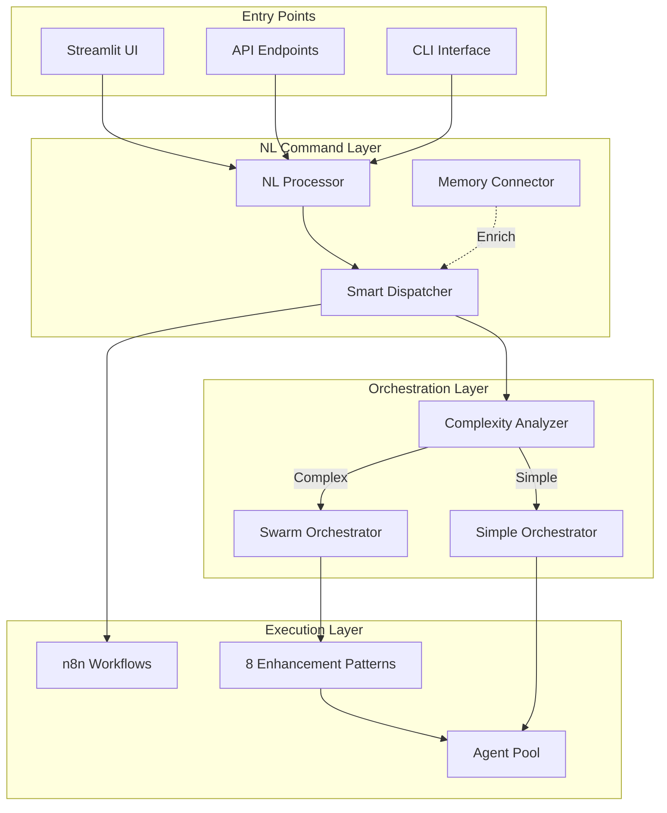

# NL-Swarm Integration Implementation Plan

## 🎯 Vision

Transform the NL interface into the **primary intelligent entry point** for all AI operations, seamlessly integrating with the sophisticated swarm orchestrator for automatic complexity-based optimization.

## 📊 Current State Analysis

### Existing Assets

- **NL Interface**: Production-ready with caching, auth, memory integration
- **Swarm Orchestrator**: 8 enhancement patterns with optimization modes
- **Performance Optimizer**: Circuit breakers, graceful degradation, metrics
- **Memory System**: MCP integration for context persistence

### Integration Gaps

- No connection between NL processor and swarm orchestrator
- Commands don't leverage complexity-based optimization
- Missing real-time swarm execution visibility
- No memory enrichment before command processing

## 🏗️ Architecture Overview

## 📋 Implementation Phases

### Phase 1: Core Integration (Week 1)

Smart command routing with complexity-based optimization

### Phase 2: UI Enhancement (Week 2)

Real-time visualization and memory browsing

### Phase 3: Production Hardening (Week 3)

Multi-tenancy, monitoring, and documentation

## 🚀 Quick Wins (1-2 Days)

1. Connect NL processor to swarm orchestrator
2. Add complexity scoring to command processing
3. Implement basic swarm status endpoint
