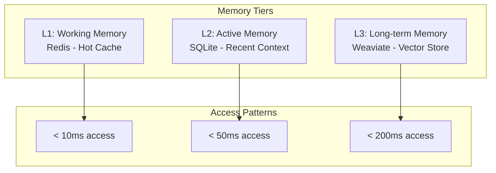

# Memory System Documentation

## Overview

The Sophia Intel AI memory system provides persistent, searchable, and intelligent memory capabilities for AI agents, enabling context retention, knowledge accumulation, and experience-based learning.

## Architecture

### Three-Tier Memory System



## Memory Types

### 1. Episodic Memory

**Purpose**: Store specific events and experiences

```json
{
  "type": "episodic",
  "event": "User requested code review",
  "timestamp": "2024-01-15T10:30:00Z",
  "context": {
    "file": "auth.py",
    "changes": 42,
    "outcome": "3 issues found"
  }
}
```

### 2. Semantic Memory

**Purpose**: Store facts and general knowledge

```json
{
  "type": "semantic",
  "topic": "Python best practices",
  "content": "Use type hints for better code clarity",
  "confidence": 0.95,
  "sources": ["PEP 484", "Google Style Guide"]
}
```

### 3. Procedural Memory

**Purpose**: Store how-to knowledge and procedures

```json
{
  "type": "procedural",
  "procedure": "Deploy to production",
  "steps": [
    "Run tests",
    "Build Docker image",
    "Push to registry",
    "Update Kubernetes"
  ],
  "prerequisites": ["All tests passing", "Approval from team lead"]
}
```

### 4. Working Memory

**Purpose**: Temporary storage for active tasks

```json
{
  "type": "working",
  "task_id": "task_001",
  "state": {
    "current_step": 3,
    "total_steps": 5,
    "intermediate_results": {...}
  },
  "ttl": 3600
}
```

## Supermemory MCP Server

### Features

- **Automatic Deduplication**: Prevents duplicate memories
- **Semantic Clustering**: Groups related memories
- **Temporal Decay**: Weights recent memories higher
- **Cross-referencing**: Links related memories

### Configuration

```python
class SupermemoryConfig:
    # Storage settings
    database_path = "/data/supermemory.db"
    max_memory_size = 10_000_000  # 10MB per memory
    total_capacity = 100_000  # Max memories

    # Deduplication settings
    similarity_threshold = 0.85
    hash_algorithm = "sha256"

    # Indexing settings
    chunk_size = 1000
    overlap = 200

    # Retrieval settings
    default_limit = 10
    max_limit = 100
```

### API Usage

#### Store Memory

```python
from sophia_intel.memory import SupermemoryStore

store = SupermemoryStore()

memory = await store.add_memory(
    topic="Authentication Implementation",
    content="Implemented OAuth2 with JWT tokens...",
    memory_type="procedural",
    tags=["auth", "security", "oauth2"],
    metadata={
        "project": "user-service",
        "version": "2.1.0"
    }
)
```

#### Search Memory

```python
results = await store.search(
    query="How to implement authentication?",
    memory_types=["procedural", "semantic"],
    limit=5,
    threshold=0.7
)

for memory in results:
    print(f"Score: {memory.score}")
    print(f"Content: {memory.content}")
```

## Hybrid Search System

### BM25 + Vector Search

Combines keyword matching with semantic understanding:

```python
class HybridSearch:
    def search(self, query: str, alpha: float = 0.5):
        # BM25 for exact matches
        bm25_results = self.bm25_search(query)

        # Vector search for semantic similarity
        vector_results = self.vector_search(query)

        # Combine with weighted scoring
        combined = self.reciprocal_rank_fusion(
            bm25_results,
            vector_results,
            alpha=alpha  # 0.5 = equal weight
        )

        return combined
```

### Search Strategies

#### 1. Exact Match

```python
results = await search.exact_match(
    field="content",
    value="def authenticate"
)
```

#### 2. Fuzzy Search

```python
results = await search.fuzzy_search(
    query="autenticate",  # Typo tolerant
    max_edits=2
)
```

#### 3. Semantic Search

```python
results = await search.semantic_search(
    query="How do I verify user identity?",
    model="text-embedding-3-small"
)
```

#### 4. Contextual Search

```python
results = await search.contextual_search(
    query="Fix the bug",
    context={
        "file": "auth.py",
        "function": "validate_token",
        "error": "JWT expired"
    }
)
```

## Embedding Management

### Dual-Tier Embedding System

```python
class DualTierEmbedder:
    def __init__(self):
        # Fast, lightweight embeddings for initial filtering
        self.fast_model = "text-embedding-3-small"

        # Accurate embeddings for final ranking
        self.accurate_model = "text-embedding-3-large"

    async def get_embeddings(self, text: str, tier: str = "fast"):
        if tier == "fast":
            return await self.embed_fast(text)
        else:
            return await self.embed_accurate(text)
```

### Embedding Cache

```python
class EmbeddingCache:
    def __init__(self):
        self.cache = {}
        self.hit_rate = 0.0

    def get_or_compute(self, text: str):
        # Check cache first
        cache_key = hashlib.md5(text.encode()).hexdigest()

        if cache_key in self.cache:
            self.hit_rate = self.update_hit_rate(hit=True)
            return self.cache[cache_key]

        # Compute and cache
        embedding = self.compute_embedding(text)
        self.cache[cache_key] = embedding
        self.hit_rate = self.update_hit_rate(hit=False)

        return embedding
```

## Memory Indexing

### Background Indexing with Celery

```python
@celery_app.task
def index_document(doc_path: str):
    # Parse document
    content = parse_document(doc_path)

    # Chunk for processing
    chunks = chunk_text(
        content,
        chunk_size=1000,
        overlap=200
    )

    # Generate embeddings
    embeddings = generate_embeddings(chunks)

    # Store in memory system
    for chunk, embedding in zip(chunks, embeddings):
        store_memory(
            content=chunk,
            embedding=embedding,
            source=doc_path
        )
```

### Indexing Strategies

#### 1. Incremental Indexing

```python
def incremental_index(new_content: str):
    # Only index what's new
    existing_hash = get_content_hash()
    new_hash = compute_hash(new_content)

    if new_hash != existing_hash:
        index_content(new_content)
        update_hash(new_hash)
```

#### 2. Batch Indexing

```python
async def batch_index(documents: List[str]):
    # Process in parallel batches
    batch_size = 100

    for i in range(0, len(documents), batch_size):
        batch = documents[i:i+batch_size]
        await asyncio.gather(*[
            index_document(doc) for doc in batch
        ])
```

## GraphRAG Integration

### Knowledge Graph Construction

```python
class KnowledgeGraph:
    def __init__(self):
        self.nodes = {}  # Entities
        self.edges = {}  # Relationships

    def add_memory_to_graph(self, memory: Memory):
        # Extract entities
        entities = extract_entities(memory.content)

        # Create nodes
        for entity in entities:
            self.add_node(entity)

        # Create relationships
        relationships = extract_relationships(memory.content)
        for rel in relationships:
            self.add_edge(
                source=rel.subject,
                target=rel.object,
                relation=rel.predicate
            )
```

### Graph-Enhanced Retrieval

```python
def graph_enhanced_search(query: str):
    # Standard search
    memories = search_memories(query)

    # Expand with graph neighbors
    expanded = []
    for memory in memories:
        # Get related entities
        entities = get_entities(memory)

        # Find connected memories
        for entity in entities:
            neighbors = graph.get_neighbors(entity)
            expanded.extend(neighbors)

    # Rank and return
    return rank_memories(memories + expanded)
```

## Memory Optimization

### Compression Strategies

```python
class MemoryCompressor:
    def compress(self, memory: str) -> str:
        # Remove redundancy
        memory = remove_duplicate_phrases(memory)

        # Summarize if too long
        if len(memory) > MAX_LENGTH:
            memory = summarize(memory)

        # Compress with zlib
        compressed = zlib.compress(memory.encode())

        return compressed
```

### Memory Pruning

```python
class MemoryPruner:
    def prune_old_memories(self):
        # Remove based on access patterns
        for memory in self.get_all_memories():
            if self.should_prune(memory):
                self.delete_memory(memory)

    def should_prune(self, memory: Memory) -> bool:
        # Check age
        if memory.age > MAX_AGE:
            return True

        # Check access frequency
        if memory.access_count < MIN_ACCESS_COUNT:
            return True

        # Check relevance score
        if memory.relevance_score < MIN_RELEVANCE:
            return True

        return False
```

## Performance Metrics

### Key Metrics

| Metric                      | Target  | Current |
| --------------------------- | ------- | ------- |
| Memory Write Latency        | < 50ms  | 35ms    |
| Memory Read Latency         | < 20ms  | 15ms    |
| Search Latency (10 results) | < 100ms | 85ms    |
| Embedding Cache Hit Rate    | > 70%   | 72%     |
| Deduplication Rate          | > 90%   | 94%     |
| Memory Compression Ratio    | > 3:1   | 3.5:1   |

### Monitoring

```python
# Prometheus metrics
memory_operations = Counter(
    'memory_operations_total',
    'Total memory operations',
    ['operation', 'memory_type']
)

memory_latency = Histogram(
    'memory_operation_duration_seconds',
    'Memory operation duration',
    ['operation']
)

memory_size = Gauge(
    'memory_store_size_bytes',
    'Total size of memory store'
)
```

## Best Practices

### 1. Memory Structure

- Use consistent schemas for memory entries
- Include rich metadata for better retrieval
- Tag memories appropriately for filtering

### 2. Deduplication

- Set appropriate similarity thresholds
- Use semantic hashing for efficiency
- Periodically merge similar memories

### 3. Search Optimization

- Pre-filter with metadata before embedding search
- Use appropriate alpha values for hybrid search
- Cache frequent queries

### 4. Maintenance

- Regular pruning of old memories
- Reindex after significant changes
- Monitor embedding model updates

### 5. Security

- Encrypt sensitive memories
- Implement access control
- Audit memory access

## Troubleshooting

### Common Issues

1. **High Memory Usage**

   - Enable compression
   - Increase pruning frequency
   - Reduce embedding dimensions

2. **Slow Search**

   - Add more specific filters
   - Optimize index configuration
   - Use faster embedding model for initial filtering

3. **Poor Search Results**

   - Adjust hybrid search alpha
   - Improve memory metadata
   - Fine-tune embedding model

4. **Duplicate Memories**
   - Lower similarity threshold
   - Improve content normalization
   - Check deduplication logic
