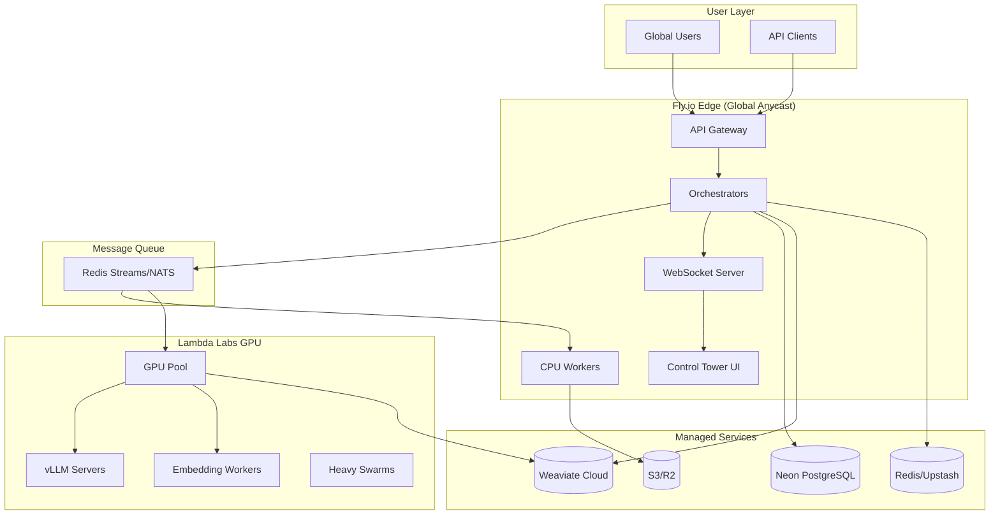

# ☁️ Cloud Deployment Strategy - Lambda Labs GPU + Fly.io Edge

**Status**: Ready for Implementation  
**Version**: 1.0.0  
**Last Updated**: 2025-01-05  
**Infrastructure**: Lambda Labs (GPU) + Fly.io (Edge) + Managed Services

---

## 🎯 Deployment Philosophy

**GPU where it matters**: Heavy inference, batch processing, model serving → Lambda Labs  
**Edge where it counts**: APIs, WebSockets, UI, orchestration → Fly.io  
**Managed where possible**: Databases, queues, caching → Cloud providers

---

## 🏗️ Infrastructure Topology



---

## 🚀 Fly.io Deployment (Edge Services)

### Application Structure

```yaml
# Fly.io Apps Deployment Map
apps:
  # Core API Services
  sophia-orchestrator:
    regions: [sjc, iad, fra]
    instances: 2-5
    cpu: 2
    memory: 4GB

  sophia-orchestrator:
    regions: [sjc, iad, fra]
    instances: 2-5
    cpu: 2
    memory: 4GB

  agent-factory-api:
    regions: [sjc, iad, fra]
    instances: 3-10
    cpu: 1
    memory: 2GB
    autoscale:
      min: 3
      max: 10
      target_cpu: 70

  # UI & WebSocket
  control-tower-ui:
    regions: [sjc, iad]
    instances: 2-4
    cpu: 1
    memory: 1GB

  websocket-server:
    regions: [sjc, iad, fra]
    instances: 2-6
    cpu: 1
    memory: 2GB
    sticky_sessions: true

  # Workers
  cpu-workers:
    regions: [sjc]
    instances: 1-20
    cpu: 2
    memory: 4GB
    autoscale:
      min: 1
      max: 20
      based_on: queue_depth

  # Support Services
  memory-proxy:
    regions: [sjc, iad]
    instances: 2-4
    cpu: 1
    memory: 2GB

  job-router:
    regions: [sjc]
    instances: 2
    cpu: 1
    memory: 1GB
```

### Fly.toml Examples

#### API Service Configuration

```toml
# fly.toml for agent-factory-api
app = "agent-factory-api"
primary_region = "sjc"
kill_signal = "SIGTERM"
kill_timeout = 30

[build]
  image = "ghcr.io/sophia-intel/agent-factory:latest"

[deploy]
  strategy = "rolling"
  max_unavailable = 1

[[services]]
  internal_port = 8080
  protocol = "tcp"
  auto_stop_machines = false
  auto_start_machines = true

  [services.concurrency]
    type = "requests"
    hard_limit = 100
    soft_limit = 80

  [[services.ports]]
    port = 443
    handlers = ["tls", "http"]
    tls_options = { "alpn" = ["h2"] }

  [[services.http_checks]]
    interval = "10s"
    timeout = "2s"
    grace_period = "30s"
    method = "GET"
    path = "/health"
    tls_skip_verify = false

  [[services.tcp_checks]]
    interval = "10s"
    timeout = "2s"
    grace_period = "30s"

[[vm]]
  cpu_kind = "shared"
  cpus = 2
  memory_mb = 4096

[env]
  PORT = "8080"
  ENVIRONMENT = "production"

  # Portkey Virtual Keys
  PORTKEY_API_KEY = "pk_..."
  VK_OPENAI = "openai-vk-190a60"
  VK_ANTHROPIC = "anthropic-vk-b42804"
  VK_DEEPSEEK = "deepseek-vk-24102f"

  # Memory Systems
  REDIS_URL = "redis://..."
  WEAVIATE_URL = "https://..."
  NEON_DATABASE_URL = "postgres://..."

  # Observability
  OTEL_EXPORTER_OTLP_ENDPOINT = "https://..."
  GRAFANA_CLOUD_API_KEY = "..."

[metrics]
  port = 9091
  path = "/metrics"

[[statics]]
  guest_path = "/app/static"
  url_prefix = "/static"
```

#### WebSocket Server

```toml
# fly.toml for websocket-server
app = "websocket-server"
primary_region = "sjc"

[build]
  image = "ghcr.io/sophia-intel/websocket:latest"

[[services]]
  internal_port = 8080
  protocol = "tcp"

  [services.concurrency]
    type = "connections"
    hard_limit = 10000
    soft_limit = 8000

  [[services.ports]]
    port = 443
    handlers = ["tls", "http"]

  [[services.http_checks]]
    interval = "10s"
    timeout = "2s"
    path = "/health"

[env]
  ENABLE_STICKY_SESSIONS = "true"
  MAX_CONNECTIONS_PER_IP = "100"
  PING_INTERVAL = "30"
  PONG_TIMEOUT = "10"

[[vm]]
  cpu_kind = "performance"
  cpus = 2
  memory_mb = 4096
```

---

## 🖥️ Lambda Labs GPU Deployment

### Infrastructure Configuration

```yaml
# Lambda Labs GPU Pool Configuration
gpu_pools:
  inference_pool:
    instance_type: "gpu_1x_h100_pcie"
    min_instances: 1
    max_instances: 10
    idle_timeout: 600 # 10 minutes

    provisioning:
      base_image: "ubuntu-22.04-cuda-12.3"
      docker_image: "ghcr.io/sophia-intel/gpu-runner:latest"
      nvidia_driver: "535.129.03"

  vllm_pool:
    instance_type: "gpu_1x_a100_sxm4"
    min_instances: 1
    max_instances: 5
    persistent: true # Don't auto-shutdown

    models:
      - "deepseek-coder-33b"
      - "qwen-72b-chat"
      - "mixtral-8x7b"

  embedding_pool:
    instance_type: "gpu_1x_a6000"
    min_instances: 0
    max_instances: 3
    idle_timeout: 300 # 5 minutes
```

### GPU Runner Service

```python
# /infra/lambda/gpu_runner.py
import asyncio
import torch
from typing import Dict, Any, List
from redis import asyncio as aioredis
import numpy as np

class GPURunner:
    """GPU-accelerated task runner"""

    def __init__(self, config: Dict[str, Any]):
        self.config = config
        self.redis = None
        self.models = {}
        self.device = "cuda" if torch.cuda.is_available() else "cpu"

    async def initialize(self):
        """Initialize connections and models"""
        # Connect to Redis streams
        self.redis = await aioredis.from_url(
            self.config["redis_url"],
            encoding="utf-8",
            decode_responses=True
        )

        # Load models based on pool type
        if self.config["pool_type"] == "inference":
            await self._load_inference_models()
        elif self.config["pool_type"] == "embedding":
            await self._load_embedding_models()
        elif self.config["pool_type"] == "vllm":
            await self._start_vllm_server()

    async def run(self):
        """Main processing loop"""
        streams = self.config["streams"]

        while True:
            try:
                # Read from streams
                messages = await self.redis.xread(
                    streams={stream: "$" for stream in streams},
                    block=1000
                )

                for stream, items in messages:
                    for msg_id, data in items:
                        await self._process_message(stream, msg_id, data)

            except Exception as e:
                print(f"Error processing: {e}")
                await asyncio.sleep(1)

    async def _process_message(self, stream: str, msg_id: str, data: Dict):
        """Process individual message"""

        task_type = data.get("type")

        if task_type == "long_planning":
            result = await self._run_planning(data)
        elif task_type == "code_generation":
            result = await self._run_code_gen(data)
        elif task_type == "batch_embedding":
            result = await self._run_embedding(data)
        else:
            result = {"error": f"Unknown task type: {task_type}"}

        # Store result
        await self.redis.hset(
            f"result:{msg_id}",
            mapping=result
        )

        # ACK message
        await self.redis.xack(stream, "gpu-workers", msg_id)

    async def _run_planning(self, data: Dict) -> Dict:
        """Run long-form planning task"""
        # Use GPT-5 via Portkey
        from portkey_ai import Portkey

        client = Portkey(
            api_key=self.config["portkey_api_key"],
            virtual_key=self.config["vk_openai"]
        )

        response = await client.chat.completions.create(
            model="gpt-5",
            messages=data["messages"],
            max_tokens=data.get("max_tokens", 8000),
            temperature=data.get("temperature", 0.2)
        )

        return {
            "content": response.choices[0].message.content,
            "usage": response.usage.dict()
        }

    async def _run_embedding(self, data: Dict) -> Dict:
        """Run batch embedding"""
        texts = data["texts"]
        model = self.models["embedder"]

        # Batch process
        embeddings = []
        batch_size = 256

        for i in range(0, len(texts), batch_size):
            batch = texts[i:i+batch_size]

            # Tokenize
            inputs = model.tokenizer(
                batch,
                padding=True,
                truncation=True,
                return_tensors="pt"
            ).to(self.device)

            # Generate embeddings
            with torch.no_grad():
                outputs = model(**inputs)
                batch_embeddings = outputs.last_hidden_state.mean(dim=1)
                embeddings.extend(batch_embeddings.cpu().numpy().tolist())

        return {
            "embeddings": embeddings,
            "model": "bge-large-en-v1.5",
            "dimension": len(embeddings[0])
        }
```

### Provisioning Script

```bash
#!/bin/bash
# /infra/lambda/provision_gpu.sh

# Update system
apt-get update && apt-get upgrade -y

# Install Docker
curl -fsSL https://get.docker.com -o get-docker.sh
sh get-docker.sh

# Install NVIDIA Container Toolkit
distribution=$(. /etc/os-release;echo $ID$VERSION_ID)
curl -s -L https://nvidia.github.io/nvidia-docker/gpgkey | apt-key add -
curl -s -L https://nvidia.github.io/nvidia-docker/$distribution/nvidia-docker.list | tee /etc/apt/sources.list.d/nvidia-docker.list
apt-get update && apt-get install -y nvidia-container-toolkit
systemctl restart docker

# Pull GPU runner image
docker pull ghcr.io/sophia-intel/gpu-runner:latest

# Create systemd service
cat > /etc/systemd/system/gpu-runner.service <<EOF
[Unit]
Description=GPU Runner Service
After=docker.service
Requires=docker.service

[Service]
Type=simple
Restart=always
RestartSec=10
Environment="PORTKEY_API_KEY=${PORTKEY_API_KEY}"
Environment="REDIS_URL=${REDIS_URL}"
ExecStart=/usr/bin/docker run --rm --gpus all \
  --name gpu-runner \
  -e PORTKEY_API_KEY \
  -e REDIS_URL \
  -e WEAVIATE_URL \
  -e NEON_DATABASE_URL \
  ghcr.io/sophia-intel/gpu-runner:latest

[Install]
WantedBy=multi-user.target
EOF

# Start service
systemctl daemon-reload
systemctl enable gpu-runner
systemctl start gpu-runner
```

---

## 📊 Message Queue Architecture

### Redis Streams Configuration

```python
# app/core/queue/stream_router.py
from typing import Dict, Any, Optional
import aioredis
from dataclasses import dataclass
from enum import Enum

class TaskPriority(Enum):
    CRITICAL = 0
    HIGH = 1
    NORMAL = 2
    LOW = 3

@dataclass
class TaskRouter:
    """Route tasks to appropriate workers"""

    def __init__(self, redis_url: str):
        self.redis = aioredis.from_url(redis_url)
        self.streams = {
            "planning": "stream:planning",
            "coding": "stream:coding",
            "embedding": "stream:embedding",
            "research": "stream:research",
            "light": "stream:light"
        }

    async def route_task(self, task: Dict[str, Any]) -> str:
        """Route task to appropriate stream"""

        # Determine stream based on task type
        task_type = task.get("type")
        model_tier = task.get("model_tier", "fast")
        estimated_tokens = task.get("estimated_tokens", 0)

        # Routing logic
        if task_type == "long_planning" or model_tier == "quality":
            stream = self.streams["planning"]
            target = "gpu"
        elif task_type == "code_generation" and estimated_tokens > 4000:
            stream = self.streams["coding"]
            target = "gpu"
        elif task_type == "batch_embedding" and len(task.get("texts", [])) > 100:
            stream = self.streams["embedding"]
            target = "gpu"
        elif task_type == "web_research":
            stream = self.streams["research"]
            target = "cpu"
        else:
            stream = self.streams["light"]
            target = "cpu"

        # Add to stream
        msg_id = await self.redis.xadd(
            stream,
            {
                "task": json.dumps(task),
                "priority": task.get("priority", TaskPriority.NORMAL.value),
                "target": target,
                "budget": task.get("budget", {}),
                "timestamp": time.time()
            }
        )

        return msg_id

    async def get_queue_stats(self) -> Dict[str, Any]:
        """Get queue statistics"""
        stats = {}

        for name, stream in self.streams.items():
            info = await self.redis.xinfo_stream(stream)
            stats[name] = {
                "length": info["length"],
                "first_entry": info["first-entry"],
                "last_entry": info["last-entry"],
                "consumer_groups": len(info.get("groups", []))
            }

        return stats
```

---

## 🔄 CI/CD Pipeline

### GitHub Actions Workflow

```yaml
# .github/workflows/deploy.yml
name: Deploy to Production

on:
  push:
    branches: [main]
  workflow_dispatch:

env:
  REGISTRY: ghcr.io
  IMAGE_NAME: sophia-intel/agent-factory

jobs:
  build:
    runs-on: ubuntu-latest
    outputs:
      image-tag: ${{ steps.meta.outputs.tags }}

    steps:
      - uses: actions/checkout@v3

      - name: Set up Docker Buildx
        uses: docker/setup-buildx-action@v2

      - name: Log in to Container Registry
        uses: docker/login-action@v2
        with:
          registry: ${{ env.REGISTRY }}
          username: ${{ github.actor }}
          password: ${{ secrets.GITHUB_TOKEN }}

      - name: Extract metadata
        id: meta
        uses: docker/metadata-action@v4
        with:
          images: ${{ env.REGISTRY }}/${{ env.IMAGE_NAME }}
          tags: |
            type=ref,event=branch
            type=sha,prefix={{branch}}-

      - name: Build and push Docker images
        uses: docker/build-push-action@v4
        with:
          context: .
          push: true
          tags: ${{ steps.meta.outputs.tags }}
          cache-from: type=gha
          cache-to: type=gha,mode=max
          target: production

  deploy-fly:
    needs: build
    runs-on: ubuntu-latest
    strategy:
      matrix:
        app: [agent-factory-api, control-tower-ui, websocket-server]

    steps:
      - uses: actions/checkout@v3

      - name: Install Fly CLI
        uses: superfly/flyctl-actions/setup-flyctl@master

      - name: Deploy to Fly.io
        env:
          FLY_API_TOKEN: ${{ secrets.FLY_API_TOKEN }}
        run: |
          flyctl deploy \
            --app ${{ matrix.app }} \
            --image ${{ needs.build.outputs.image-tag }} \
            --strategy rolling \
            --wait-timeout 300

  deploy-lambda:
    needs: build
    runs-on: ubuntu-latest

    steps:
      - uses: actions/checkout@v3

      - name: Configure AWS credentials
        uses: aws-actions/configure-aws-credentials@v2
        with:
          aws-access-key-id: ${{ secrets.AWS_ACCESS_KEY_ID }}
          aws-secret-access-key: ${{ secrets.AWS_SECRET_ACCESS_KEY }}
          aws-region: us-west-2

      - name: Deploy to Lambda Labs
        run: |
          # Update GPU instances
          ./infra/lambda/deploy.sh \
            --image ${{ needs.build.outputs.image-tag }} \
            --pool inference \
            --min-instances 1 \
            --max-instances 10
```

### Multi-Stage Dockerfile

```dockerfile
# Dockerfile
FROM python:3.11-slim as base

WORKDIR /app
COPY pyproject.toml uv.lock ./
RUN pip install uv && uv sync --frozen --no-dev

# API Target
FROM base as api
COPY app app/
CMD ["uvicorn", "app.api.main:app", "--host", "0.0.0.0", "--port", "8080"]

# UI Target
FROM node:20-alpine as ui-builder
WORKDIR /app
COPY package*.json ./
RUN npm ci
COPY . .
RUN npm run build

FROM nginx:alpine as ui
COPY --from=ui-builder /app/dist /usr/share/nginx/html

# GPU Target
FROM nvidia/cuda:12.3.2-runtime-ubuntu22.04 as gpu
RUN apt-get update && apt-get install -y python3-pip
WORKDIR /app
COPY requirements-gpu.txt ./
RUN pip install -r requirements-gpu.txt
COPY app app/
CMD ["python", "-m", "app.runners.gpu"]

# Production target
FROM api as production
```

---

## 📈 Monitoring & Observability

### Metrics Collection

```yaml
# prometheus/config.yml
global:
  scrape_interval: 15s

scrape_configs:
  - job_name: "fly-apps"
    consul_sd_configs:
      - server: "consul.service.consul:8500"
        services: ["agent-factory-api", "websocket-server"]

  - job_name: "gpu-runners"
    static_configs:
      - targets:
          - "gpu-1.lambda.internal:9090"
          - "gpu-2.lambda.internal:9090"

  - job_name: "redis-exporter"
    static_configs:
      - targets: ["redis-exporter:9121"]

  - job_name: "postgres-exporter"
    static_configs:
      - targets: ["postgres-exporter:9187"]
```

### Key Dashboards

```python
# Grafana Dashboard Queries
dashboards = {
    "infrastructure": {
        "gpu_utilization": "avg(gpu_utilization_percent)",
        "gpu_memory": "sum(gpu_memory_used_bytes) / sum(gpu_memory_total_bytes)",
        "fly_cpu": "avg(fly_instance_cpu_percent) by (app)",
        "fly_memory": "avg(fly_instance_memory_used_bytes) by (app)"
    },

    "performance": {
        "api_latency_p99": "histogram_quantile(0.99, http_request_duration_seconds)",
        "websocket_connections": "sum(websocket_active_connections)",
        "queue_depth": "sum(redis_stream_length) by (stream)",
        "task_processing_rate": "rate(tasks_processed_total[5m])"
    },

    "costs": {
        "gpu_cost_per_hour": "sum(gpu_instances) * 2.00",  # $2/hr per GPU
        "fly_cost_per_month": "sum(fly_instances) * 10",  # ~$10/mo per instance
        "embedding_cost": "sum(embedding_tokens_total) * 0.00002",
        "inference_cost": "sum(inference_tokens_total) * 0.001"
    }
}
```

---

## 🛡️ Security & Networking

### Network Topology

```yaml
# Network Security Configuration
security:
  fly_to_lambda:
    protocol: "https"
    authentication: "mutual_tls"
    ip_allowlist:
      - "fly.io/egress/ranges"

  lambda_to_services:
    neon:
      method: "ssl"
      cert_validation: true
    weaviate:
      method: "api_key"
      tls: true
    redis:
      method: "tls"
      auth: "password"

  public_access:
    rate_limiting:
      requests_per_minute: 100
      burst: 200

    waf_rules:
      - block_sql_injection
      - block_xss
      - block_common_exploits

    ddos_protection: "cloudflare"
```

---

## 💰 Cost Optimization

### Resource Allocation Strategy

```python
# Cost optimization rules
optimization = {
    "gpu_scheduling": {
        "business_hours": {  # 9am-6pm PST
            "min_instances": 2,
            "max_instances": 10
        },
        "off_hours": {
            "min_instances": 0,
            "max_instances": 3
        },
        "idle_shutdown": 600  # 10 minutes
    },

    "fly_autoscaling": {
        "scale_to_zero": ["cpu-workers"],
        "always_on": ["agent-factory-api", "websocket-server"],
        "regional_distribution": {
            "primary": "sjc",
            "fallback": ["iad", "fra"]
        }
    },

    "caching": {
        "embedding_cache_ttl": 86400,
        "search_cache_ttl": 300,
        "inference_cache_ttl": 3600
    }
}
```

---

## ✅ Deployment Checklist

### Phase 1: Foundation (Week 1)

- [ ] Create Fly.io organization and apps
- [ ] Provision Lambda Labs account
- [ ] Set up GitHub Container Registry
- [ ] Configure Portkey virtual keys
- [ ] Deploy Redis/NATS streams

### Phase 2: Core Services (Week 2)

- [ ] Deploy API gateway to Fly
- [ ] Deploy orchestrators to Fly
- [ ] Set up WebSocket server
- [ ] Configure CPU workers
- [ ] Set up GPU runner on Lambda

### Phase 3: Scaling (Week 3)

- [ ] Enable autoscaling policies
- [ ] Configure multi-region deployment
- [ ] Set up GPU pool management
- [ ] Implement queue routing
- [ ] Deploy monitoring stack

### Phase 4: Production (Week 4)

- [ ] Security hardening
- [ ] Load testing
- [ ] Disaster recovery setup
- [ ] Documentation
- [ ] Team training

---

## 💡 Three Key Insights

### 1. **Hybrid Cloud Maximizes Value** 🚀

By using Fly.io for edge computing and Lambda Labs for GPU workloads, we get the best of both worlds - global low latency for users and powerful GPU compute for AI tasks, all while avoiding vendor lock-in.

### 2. **Queue-Based Architecture Enables Scale** 📊

Redis Streams/NATS provides the perfect abstraction layer between Fly.io and Lambda Labs, allowing independent scaling of each tier and graceful handling of traffic spikes.

### 3. **Cost Follows Usage Patterns** 💰

The architecture naturally optimizes costs - GPU instances spin down during low usage, CPU workers scale to zero when idle, and aggressive caching reduces API calls. This can reduce costs by 60-70% compared to always-on GPU deployment.

---

**Next Steps**:

1. Review and approve deployment strategy
2. Provision Fly.io and Lambda Labs accounts
3. Set up CI/CD pipelines
4. Begin phased deployment

This deployment strategy provides enterprise-grade reliability with startup-friendly costs, perfect for scaling your AI platform from prototype to production.
