# 🧠 Unified Hybrid Memory System - Architecture & Implementation

**Status**: Ready for Implementation  
**Version**: 2.0.0  
**Last Updated**: 2025-01-05  
**Targets**: Sophia (Enterprise BI) & Artemis (Coding Excellence)

---

## 🎯 Executive Summary

This document defines a production-grade, multi-tiered memory architecture that optimizes for both performance and intelligence. By combining traditional caching (Redis), AI-native memory (Mem0), vector search (Weaviate/Milvus), structured storage (Neon), and optional graph overlays, we create a system that learns, adapts, and scales with enterprise demands.

**Key Innovations**:

- **4-Tier Architecture**: L1 (Redis/Mem0) → L2 (Weaviate/Milvus) → L3 (Neon) → L4 (S3/Cold)
- **Intelligent Routing**: Policy-driven backend selection with automatic failover
- **Domain Isolation**: Sophia/Artemis separation with controlled cross-pollination
- **Cost Optimization**: 80/20 rule - fast/expensive for hot data, slow/cheap for cold

---

## 🏗️ Architecture Overview

### Mental Model: Four Tiers + Optional Graph

```mermaid
graph TB
    subgraph "L1: Ephemeral/Working (μs-ms)"
        Redis[Redis Cache]
        Mem0[Mem0 Episodic]
    end

    subgraph "L2: Semantic/Vector (ms)"
        Weaviate[Weaviate Hybrid]
        Milvus[Milvus Dense]
        Qdrant[Qdrant Filtered]
    end

    subgraph "L3: Structured/Facts (ms)"
        Neon[Neon PostgreSQL]
    end

    subgraph "L4: Cold Storage (s)"
        S3[S3/GCS Objects]
    end

    subgraph "G: Graph Layer (Optional)"
        Neo4j[Entity Graph]
    end

    Agent --> Router
    Router --> Redis
    Router --> Mem0
    Router --> Weaviate
    Router --> Milvus
    Router --> Neon
    Router --> S3
    Router -.-> Neo4j
```



### Tier Specifications

| Tier   | Technology       | Purpose                | Latency  | TTL        | Cost |
| ------ | ---------------- | ---------------------- | -------- | ---------- | ---- |
| **L1** | Redis + Mem0     | Hot cache, agent state | <10ms    | Hours-Days | $$$  |
| **L2** | Weaviate/Milvus  | Semantic search, RAG   | 50-200ms | Months     | $$   |
| **L3** | Neon PostgreSQL  | Facts, lineage, audit  | 20-100ms | Years      | $    |
| **L4** | S3/GCS           | Archives, raw data     | 100ms-1s | Forever    | ¢    |
| **G**  | Neo4j (optional) | Relationships          | 50-500ms | Months     | $$   |

---

## 🔄 Memory Router - Unified Interface

### Core Abstraction

```python
from typing import Any, Dict, List, Optional
from dataclasses import dataclass
from enum import Enum

class MemoryDomain(Enum):
    SOPHIA = "sophia"      # Business Intelligence
    ARTEMIS = "artemis"    # Coding Excellence
    SHARED = "shared"      # Cross-domain knowledge

@dataclass
class MemoryRouter:
    """Unified memory interface for all agents"""

    def __init__(self, policy_path: str = "app/core/memory/policy.yaml"):
        self.policy = self._load_policy(policy_path)
        self.adapters = self._init_adapters()
        self.metrics = MemoryMetrics()

    # L1: Ephemeral Operations
    async def put_ephemeral(self, key: str, value: Any, ttl_s: int = 3600) -> None:
        """Store in fast cache with TTL"""
        adapter = self._select_adapter("ephemeral")
        await adapter.put(key, value, ttl_s)
        self.metrics.record_write("L1", len(str(value)))

    async def get_ephemeral(self, key: str) -> Optional[Any]:
        """Retrieve from fast cache"""
        adapter = self._select_adapter("ephemeral")
        result = await adapter.get(key)
        self.metrics.record_read("L1", cache_hit=result is not None)
        return result

    # L2: Vector Operations
    async def upsert_chunks(self, chunks: List[DocChunk], domain: MemoryDomain) -> UpsertReport:
        """Store document chunks with embeddings"""
        adapter = self._select_adapter("vector", domain)

        # Deduplication
        unique_chunks = self._deduplicate(chunks)

        # Batch embedding
        embedded = await self._batch_embed(unique_chunks)

        # Upsert with domain namespace
        report = await adapter.upsert(embedded, namespace=f"{domain.value}/*")

        # Record lineage in L3
        await self._record_lineage(report)

        self.metrics.record_upsert("L2", len(unique_chunks))
        return report

    async def search(
        self,
        query: str,
        domain: MemoryDomain,
        k: int = 12,
        alpha: float = 0.65,
        filters: Optional[Dict] = None,
        rerank: bool = False
    ) -> List[SearchHit]:
        """Hybrid search with optional reranking"""

        # Check cache first
        cache_key = self._hash_query(query, domain, filters)
        cached = await self.get_ephemeral(f"search:{cache_key}")
        if cached:
            return cached

        # Select backend based on policy
        adapter = self._select_adapter("vector", domain)

        # Execute hybrid search
        hits = await adapter.search_hybrid(
            query=query,
            k=k,
            alpha=alpha,  # Balance between BM25 and vector
            namespace=f"{domain.value}/*",
            filters=filters
        )

        # Optional reranking
        if rerank and len(hits) > 5:
            hits = await self._rerank(query, hits[:20])[:k]

        # Cache results
        await self.put_ephemeral(f"search:{cache_key}", hits, ttl_s=300)

        self.metrics.record_search("L2", len(hits))
        return hits

    # L3: Structured Operations
    async def record_fact(self, table: str, data: Dict[str, Any]) -> str:
        """Store structured fact in PostgreSQL"""
        adapter = self._select_adapter("structured")
        fact_id = await adapter.insert(table, data)
        self.metrics.record_write("L3", 1)
        return fact_id

    async def query_facts(self, sql: str, params: Dict = None) -> List[Dict]:
        """Query structured data"""
        adapter = self._select_adapter("structured")
        results = await adapter.query(sql, params or {})
        self.metrics.record_read("L3", len(results))
        return results

    # L4: Cold Storage Operations
    async def archive(self, key: str, data: bytes, metadata: Dict = None) -> str:
        """Store in cold storage"""
        adapter = self._select_adapter("cold")
        uri = await adapter.put(key, data, metadata)
        self.metrics.record_write("L4", len(data))
        return uri

    # Memory Management
    async def audit(self, namespace: str = "*", fix: bool = False) -> AuditReport:
        """Audit memory for issues"""
        report = AuditReport()

        # Check for orphans
        orphans = await self._find_orphans(namespace)
        report.orphans = orphans

        # Check for duplicates
        duplicates = await self._find_duplicates(namespace)
        report.duplicates = duplicates

        # Check PII compliance
        pii_violations = await self._check_pii(namespace)
        report.pii_violations = pii_violations

        # Fix if requested
        if fix:
            await self._fix_issues(report)

        return report

    async def purge(self, source_uri: str, hard: bool = False) -> PurgeReport:
        """Remove data from all tiers"""
        report = PurgeReport()

        # Purge from each tier
        for tier in ["L1", "L2", "L3", "L4"]:
            adapter = self.adapters.get(tier)
            if adapter:
                count = await adapter.purge(source_uri, hard)
                report.purged[tier] = count

        # Invalidate caches
        await self._invalidate_caches(source_uri)

        return report
```

---

## 📋 Memory Policy Configuration

### `app/core/memory/policy.yaml`

```yaml
# Memory System Policy Configuration
version: "2.0.0"

# Domain namespaces
namespaces:
  sophia:
    patterns: ["sophia/*", "bi/*", "sales/*", "customer/*"]
    isolation: strict
    cross_read: ["shared/*"]

  artemis:
    patterns: ["artemis/*", "code/*", "tech/*", "repo/*"]
    isolation: strict
    cross_read: ["shared/*"]

  shared:
    patterns: ["shared/*", "company/*", "glossary/*"]
    isolation: none
    cross_read: ["*"]

# Tier configurations
tiers:
  L1_ephemeral:
    primary: redis
    fallback: mem0
    config:
      redis:
        url: ${REDIS_URL}
        max_connections: 100
        ttl_default: 3600
      mem0:
        api_key: ${MEM0_API_KEY}
        organization: ${MEM0_ORG}
        ttl_default: 7200

  L2_vector:
    primary: weaviate
    fallback: milvus
    config:
      weaviate:
        url: ${WEAVIATE_URL}
        api_key: ${WEAVIATE_API_KEY}
        embedding_model: "text-embedding-3-small"
        hybrid_alpha: 0.65
        classes:
          - name: "DocChunk"
            vectorizer: "text2vec-openai"
            properties:
              - name: "content"
                dataType: ["text"]
              - name: "source_uri"
                dataType: ["string"]
              - name: "domain"
                dataType: ["string"]
              - name: "timestamp"
                dataType: ["date"]
              - name: "confidence"
                dataType: ["number"]
          - name: "CodeSymbol"
            vectorizer: "text2vec-openai"
            properties:
              - name: "code"
                dataType: ["text"]
              - name: "symbol"
                dataType: ["string"]
              - name: "language"
                dataType: ["string"]
              - name: "repo"
                dataType: ["string"]
              - name: "path"
                dataType: ["string"]

      milvus:
        uri: ${MILVUS_URI}
        token: ${MILVUS_TOKEN}
        collection_configs:
          sophia_dense:
            dimension: 1536
            index_type: "IVF_FLAT"
            metric_type: "L2"
          artemis_code:
            dimension: 1536
            index_type: "HNSW"
            metric_type: "COSINE"

      qdrant:
        url: ${QDRANT_URL}
        api_key: ${QDRANT_API_KEY}
        collection_configs:
          filtered_search:
            size: 1536
            distance: "Cosine"

  L3_structured:
    primary: neon
    fallback: postgres
    config:
      neon:
        dsn: ${NEON_DATABASE_URL}
        pool_size: 20
        schemas:
          - facts
          - lineage
          - audit
      postgres:
        dsn: ${POSTGRES_URL}
        pool_size: 10

  L4_cold:
    primary: s3
    fallback: gcs
    config:
      s3:
        bucket: ${S3_BUCKET}
        region: ${AWS_REGION}
        access_key: ${AWS_ACCESS_KEY_ID}
        secret_key: ${AWS_SECRET_ACCESS_KEY}
      gcs:
        bucket: ${GCS_BUCKET}
        credentials: ${GCS_CREDENTIALS_PATH}

# Routing rules
routing:
  by_domain:
    sophia:
      L2_vector:
        primary: weaviate
        conditions:
          - workload: "general"
            use: weaviate
          - workload: "dense_retrieval"
            use: milvus
          - workload: "filtered"
            use: qdrant

    artemis:
      L2_vector:
        primary: weaviate
        conditions:
          - workload: "code_search"
            use: weaviate
          - workload: "symbol_lookup"
            use: milvus

  by_operation:
    batch_embed:
      size_threshold: 100
      route_to: "gpu_worker"

    rerank:
      model: "cross-encoder/ms-marco-MiniLM-L-12-v2"
      enabled: true
      threshold: 20

# Performance settings
performance:
  batch_sizes:
    embedding: 32
    upsert: 100
    search: 10

  cache:
    search_ttl: 300
    fact_ttl: 3600
    embedding_ttl: 86400

  timeouts:
    search_ms: 1000
    upsert_ms: 5000
    embed_ms: 2000

# Data governance
governance:
  pii_detection:
    enabled: true
    scanner: "presidio"
    actions:
      sensitive: "reject"
      moderate: "redact"
      low: "allow"

  retention:
    default_days: 365
    by_namespace:
      "sophia/sales/*": 730
      "artemis/code/*": 180
      "shared/scratch/*": 7

  audit:
    enabled: true
    frequency: "weekly"
    report_to: ["platform-team@company.com"]

# Cost controls
cost_controls:
  embedding:
    daily_limit_usd: 100
    alert_threshold: 0.8

  vector_storage:
    monthly_limit_gb: 1000
    alert_threshold: 0.9

  api_calls:
    rate_limit:
      sophia: 1000/min
      artemis: 2000/min
      shared: 500/min
```

---

## 🔀 Migration Strategy

### Phase 0: Foundation (Week 1-2)

```python
# app/core/memory/migration/phase_0.py
async def phase_0_foundation():
    """Set up memory infrastructure"""

    # 1. Deploy services
    await deploy_redis_cluster()
    await deploy_weaviate_cloud()
    await provision_neon_database()
    await configure_s3_buckets()

    # 2. Create schemas
    await create_weaviate_classes()
    await create_neon_tables()

    # 3. Set up monitoring
    await configure_memory_metrics()
    await create_dashboards()

    # 4. Validate connectivity
    await test_all_connections()
```

### Phase 1: Migration (Week 3-4)

```python
async def phase_1_migration():
    """Migrate existing data"""

    # 1. Backup current state
    backup_id = await backup_existing_memory()

    # 2. Migrate by tier
    await migrate_redis_to_l1()      # Fast cache
    await migrate_vectors_to_l2()     # Embeddings
    await migrate_facts_to_l3()       # Structured
    await archive_old_data_to_l4()    # Cold storage

    # 3. Validate migration
    report = await validate_migration()
    if not report.success:
        await rollback(backup_id)

    # 4. Update routing
    await switch_to_new_router()
```

### Phase 2: Optimization (Week 5-6)

```python
async def phase_2_optimization():
    """Optimize performance"""

    # 1. Enable batching
    await configure_batch_processors()

    # 2. Set up caching
    await enable_search_cache()
    await enable_embedding_cache()

    # 3. Configure reranking
    await deploy_rerank_model()

    # 4. Tune parameters
    await optimize_hybrid_alpha()
    await adjust_cache_ttls()
```

---

## 🎯 Domain-Specific Configurations

### Sophia (Business Intelligence)

```python
class SophiaMemoryConfig:
    """Sophia-specific memory settings"""

    # Prioritize business data sources
    VECTOR_COLLECTIONS = [
        "salesforce_accounts",
        "gong_transcripts",
        "hubspot_contacts",
        "financial_reports",
        "market_research"
    ]

    # PII handling
    PII_STRATEGY = "redact_before_embed"

    # Retention
    RETENTION_DAYS = {
        "customer_data": 730,  # 2 years
        "sales_pipeline": 365,  # 1 year
        "market_intel": 180     # 6 months
    }

    # Search preferences
    SEARCH_CONFIG = {
        "min_confidence": 0.7,
        "require_citations": True,
        "max_sources": 5,
        "prefer_recent": True
    }
```

### Artemis (Coding Excellence)

```python
class ArtemisMemoryConfig:
    """Artemis-specific memory settings"""

    # Code-focused collections
    VECTOR_COLLECTIONS = [
        "code_symbols",
        "api_docs",
        "design_patterns",
        "error_solutions",
        "performance_tips"
    ]

    # No PII concerns
    PII_STRATEGY = "none"

    # Shorter retention
    RETENTION_DAYS = {
        "code_snippets": 90,
        "build_artifacts": 30,
        "temp_analysis": 7
    }

    # Search optimization
    SEARCH_CONFIG = {
        "prefer_exact": True,
        "include_deprecated": False,
        "max_file_size": 50000,
        "language_boost": {
            "python": 1.5,
            "typescript": 1.3
        }
    }
```

---

## 📊 Monitoring & Metrics

### Key Performance Indicators

```python
class MemoryMetrics:
    """Track memory system performance"""

    # Latency targets (ms)
    SLA = {
        "L1_read_p50": 5,
        "L1_read_p99": 20,
        "L2_search_p50": 100,
        "L2_search_p99": 500,
        "L3_query_p50": 50,
        "L3_query_p99": 200
    }

    # Cost targets (USD)
    BUDGET = {
        "embedding_daily": 50,
        "storage_monthly": 500,
        "api_calls_daily": 100
    }

    # Quality metrics
    QUALITY = {
        "search_precision_at_5": 0.8,
        "cache_hit_rate": 0.6,
        "dedup_effectiveness": 0.95
    }
```

### Grafana Dashboard Configuration

```yaml
dashboards:
  memory_overview:
    panels:
      - title: "Request Latency by Tier"
        query: "histogram_quantile(0.99, memory_latency_ms)"

      - title: "Cache Hit Rates"
        query: "rate(cache_hits) / rate(cache_requests)"

      - title: "Storage Usage by Domain"
        query: "sum(storage_bytes) by (domain, tier)"

      - title: "Embedding Costs"
        query: "sum(embedding_cost_usd) by (model, domain)"

      - title: "Search Quality"
        query: "avg(search_precision) by (domain)"
```

---

## 🚀 GPU-Accelerated Operations (Lambda Labs)

### Batch Embedding Pipeline

```python
class GPUEmbeddingWorker:
    """GPU-accelerated embedding generation"""

    def __init__(self):
        self.model = load_embedding_model("BAAI/bge-large-en-v1.5")
        self.batch_size = 256
        self.gpu_memory = "40GB"

    async def process_batch(self, texts: List[str]) -> List[List[float]]:
        """Generate embeddings on GPU"""

        # Tokenize
        inputs = self.tokenizer(texts, padding=True, truncation=True)

        # Move to GPU
        inputs = {k: v.cuda() for k, v in inputs.items()}

        # Generate embeddings
        with torch.no_grad():
            outputs = self.model(**inputs)
            embeddings = outputs.last_hidden_state.mean(dim=1)

        # Return as list
        return embeddings.cpu().numpy().tolist()
```

### Reranking on GPU

```python
class GPUReranker:
    """GPU-accelerated reranking"""

    def __init__(self):
        self.model = CrossEncoder("cross-encoder/ms-marco-MiniLM-L-12-v2")
        self.device = "cuda"

    async def rerank(self, query: str, documents: List[str]) -> List[float]:
        """Score documents against query"""

        pairs = [[query, doc] for doc in documents]
        scores = self.model.predict(pairs)

        return scores.tolist()
```

---

## 🌍 Edge Deployment (Fly.io)

### Memory Proxy Service

```toml
# fly.toml for memory proxy
app = "memory-proxy"
primary_region = "sjc"

[build]
  image = "ghcr.io/sophia-intel/memory-proxy:latest"

[[services]]
  internal_port = 8080
  protocol = "tcp"

  [[services.ports]]
    port = 443
    handlers = ["tls", "http"]

  [[services.http_checks]]
    interval = "10s"
    timeout = "2s"
    path = "/health"

[env]
  REDIS_URL = "redis://..."
  WEAVIATE_URL = "https://..."
  NEON_DSN = "postgres://..."
```

---

## ✅ Implementation Checklist

### Week 1-2: Foundation

- [ ] Deploy Redis cluster (Upstash/Fly)
- [ ] Set up Weaviate Cloud instance
- [ ] Provision Neon database with schemas
- [ ] Configure S3/GCS buckets
- [ ] Deploy memory router service
- [ ] Set up monitoring dashboards

### Week 3-4: Migration

- [ ] Backup existing memory systems
- [ ] Migrate Redis data to L1
- [ ] Import vectors to Weaviate
- [ ] Transfer facts to Neon
- [ ] Archive old data to S3
- [ ] Validate data integrity

### Week 5-6: Optimization

- [ ] Enable batch processing
- [ ] Configure caching layers
- [ ] Deploy GPU workers (Lambda)
- [ ] Set up reranking
- [ ] Tune search parameters
- [ ] Load test and optimize

### Week 7-8: Production

- [ ] Enable PII scanning
- [ ] Configure retention policies
- [ ] Set up audit automation
- [ ] Deploy to all regions
- [ ] Document runbooks
- [ ] Train team

---

## 💡 Three Key Insights

### 1. **Memory Hierarchy Mirrors Human Cognition** 🧠

Just as humans have working memory (7±2 items), short-term memory (hours), and long-term memory (years), this architecture provides L1 for immediate context, L2 for semantic associations, and L3 for factual knowledge. The optional graph layer (G) represents the "wisdom" level where connections between memories create new insights.

### 2. **Domain Boundaries Enable Specialized Intelligence** 🎯

By maintaining strict Sophia/Artemis separation with controlled cross-pollination through the shared namespace, we prevent the "jack of all trades, master of none" problem. Each domain can optimize its memory strategies - Sophia for business pattern recognition, Artemis for code comprehension.

### 3. **Cost-Performance Optimization Through Tiering** 💰

The 80/20 rule applies perfectly here: 80% of queries hit L1/L2 (fast but expensive), while 20% reach L3/L4 (slow but cheap). This delivers excellent user experience for common queries while keeping costs manageable for large-scale knowledge storage.

---

**Next Steps**:

1. Review and approve this architecture
2. Begin Phase 0 infrastructure deployment
3. Set up CI/CD pipelines for memory services
4. Start migrating existing memory systems

This hybrid approach gives you the best of all worlds - the speed of Redis, the intelligence of Mem0, the search power of Weaviate/Milvus, the reliability of PostgreSQL, and the scale of object storage.
