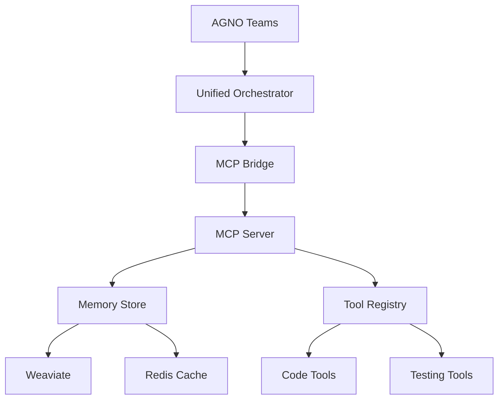

# AGNO + MCP Integration Guide

## Overview

This guide explains how to integrate AGNO Teams with the Model Context Protocol (MCP) server for the sophia-intel-ai repository. It covers configuration, auto-tagging, memory operations, and best practices.

## Table of Contents

1. [Architecture Overview](#architecture-overview)
2. [AGNO Team Configuration](#agno-team-configuration)
3. [MCP Server Connection](#mcp-server-connection)
4. [Memory Auto-Tagging](#memory-auto-tagging)
5. [Meta-Tag Schemas](#meta-tag-schemas)
6. [CLI and HTTP Examples](#cli-and-http-examples)
7. [Troubleshooting](#troubleshooting)

## Architecture Overview



## AGNO Team Configuration

### Mapping agents.yaml to AGNO Teams

AGNO Teams are configured through `agents.yaml` files that define roles, models, and execution patterns:

```yaml
# agents.yaml
team: coding_swarm
version: 1.0.0
api_key: ${AGNO_API_KEY}

agents:
  planner:
    model: qwen/qwen3-30b-a3b
    role: strategic_planning
    temperature: 0.3
    tags:
      - role:planner
      - team:coding
    
  generator:
    model: x-ai/grok-4
    role: code_generation
    temperature: 0.7
    tags:
      - role:generator
      - team:coding
    
  critic:
    model: x-ai/grok-4
    role: code_review
    temperature: 0.1
    tags:
      - role:critic
      - team:coding

execution_patterns:
  - type: debate
    participants: [generator, critic]
    rounds: 3
  - type: consensus
    participants: [planner, generator, critic]
    threshold: 0.8
```

### Creating AGNO Teams Programmatically

```python
from agno import Team, Agent
from app.swarms.enhanced_memory_integration import EnhancedSwarmMemoryClient

# Initialize AGNO Team
team = Team(
    name="coding_swarm",
    agents=[
        Agent(name="planner", model="qwen/qwen3-30b-a3b"),
        Agent(name="generator", model="x-ai/grok-4"),
        Agent(name="critic", model="x-ai/grok-4")
    ]
)

# Connect memory client
memory_client = EnhancedSwarmMemoryClient(
    swarm_type="coding_team",
    swarm_id=team.id
)

# Set execution context for auto-tagging
context = {
    "task_id": "TASK-123",
    "agent_role": "generator",
    "repo_path": "/path/to/repo",
    "file_path": "/path/to/file.py"
}

memory_client.push_context(context)
```

## MCP Server Connection

### Environment Variables

Configure MCP server connection through environment variables:

```bash
# .env.local
MCP_SERVER_URL=http://localhost:8003
MCP_API_KEY=your-mcp-api-key
MCP_TIMEOUT=30
MCP_RETRY_COUNT=3

# AGNO Configuration
AGNO_API_KEY=phi-your-agno-key
PORTKEY_API_KEY=your-portkey-key
PORTKEY_GATEWAY_URL=https://api.portkey.ai/v1

# Memory Configuration
WEAVIATE_URL=http://localhost:8080
REDIS_URL=redis://localhost:6379
MEMORY_CACHE_TTL=3600
```

### Connecting to MCP Servers

```python
import os
from app.mcp.client import MCPClient

# Initialize MCP client
mcp_client = MCPClient(
    server_url=os.getenv("MCP_SERVER_URL"),
    api_key=os.getenv("MCP_API_KEY")
)

# Register tools with MCP
await mcp_client.register_tools([
    "code_search",
    "linting",
    "testing",
    "memory_operations"
])

# Health check
health = await mcp_client.health_check()
print(f"MCP Server Status: {health['status']}")
```

## Memory Auto-Tagging

### Automatic Tag Extraction

The enhanced memory system automatically extracts tags from:

1. **Content Analysis**
   - Programming language detection
   - Code patterns (async, decorators, classes)
   - Domain keywords (API, database, testing)

2. **Metadata Context**
   - Task IDs and agent roles
   - File paths and extensions
   - Execution patterns and strategies

3. **Performance Metrics**
   - Execution time (fast/normal/slow)
   - Success rates (high/medium/low)
   - Error states and types

### Usage Example

```python
# Auto-tagging in action
await memory_client.store_memory(
    topic="Code Generation",
    content=generated_code,
    auto_tag=True,  # Enable auto-tagging
    context_aware=True,  # Use execution context
    metadata={
        "task_id": "TASK-123",
        "agent_role": "generator",
        "repo_path": "/sophia-intel-ai",
        "file_path": "/app/api/endpoints.py",
        "execution_pattern": "debate",
        "model_used": "x-ai/grok-4",
        "execution_time": 2.5,
        "success": True
    }
)

# Generated tags will include:
# - task:TASK-123
# - role:generator
# - repo:sophia-intel-ai
# - file:endpoints.py
# - ext:.py
# - lang:python
# - pattern:debate
# - model:x-ai/grok-4
# - perf:normal
# - status:success
```

## Meta-Tag Schemas

### Required Tag Categories

All memory entries must include tags from these categories:

| Category | Format | Example | Required |
|----------|--------|---------|----------|
| Task | `task:{id}` | `task:TASK-123` | Yes |
| Role | `role:{name}` | `role:generator` | Yes |
| Repository | `repo:{name}` | `repo:sophia-intel-ai` | Yes |
| File | `file:{name}` | `file:api.py` | When applicable |
| Language | `lang:{name}` | `lang:python` | Auto-detected |
| Pattern | `pattern:{type}` | `pattern:async` | Auto-detected |
| Model | `model:{name}` | `model:gpt-5` | Yes |
| Status | `status:{state}` | `status:success` | Yes |

### Hierarchical Tagging

Tags support hierarchical organization:

```
team:coding
  ├── role:planner
  ├── role:generator
  └── role:critic

domain:api
  ├── endpoint:create
  ├── endpoint:read
  └── endpoint:update

perf:metrics
  ├── perf:fast (<1s)
  ├── perf:normal (1-5s)
  └── perf:slow (>5s)
```

## CLI and HTTP Examples

### CLI Commands

```bash
# Store memory with auto-tagging
curl -X POST http://localhost:8003/memory/store \
  -H "Content-Type: application/json" \
  -d '{
    "topic": "API Implementation",
    "content": "def create_endpoint()...",
    "tags": ["auto"],
    "metadata": {
      "task_id": "TASK-456",
      "agent_role": "generator",
      "repo_path": "/sophia-intel-ai"
    }
  }'

# Search memories by tags
curl -X POST http://localhost:8003/memory/search \
  -H "Content-Type: application/json" \
  -d '{
    "query": "error handling",
    "tags": ["role:generator", "status:success"],
    "limit": 10
  }'

# Get MCP health status
curl http://localhost:8003/health

# List available tools
curl http://localhost:8003/tools
```

### HTTP API Examples

```python
import httpx

async def store_with_tagging():
    async with httpx.AsyncClient() as client:
        response = await client.post(
            "http://localhost:8003/memory/store",
            json={
                "topic": "Code Review",
                "content": review_content,
                "auto_tag": True,
                "metadata": {
                    "task_id": "TASK-789",
                    "agent_role": "critic",
                    "repo_path": "/sophia-intel-ai",
                    "file_path": "/app/swarms/agent.py",
                    "execution_pattern": "consensus",
                    "model_used": "x-ai/grok-4"
                }
            }
        )
        return response.json()

async def search_by_tags():
    async with httpx.AsyncClient() as client:
        response = await client.post(
            "http://localhost:8003/memory/search",
            json={
                "query": "optimization",
                "filters": {
                    "tags": ["role:critic", "perf:fast"],
                    "memory_type": "semantic"
                },
                "limit": 20
            }
        )
        return response.json()
```

### WebSocket Connection

```python
import websockets
import json

async def connect_mcp_websocket():
    uri = "ws://localhost:8003/ws"
    async with websockets.connect(uri) as websocket:
        # Subscribe to memory events
        await websocket.send(json.dumps({
            "action": "subscribe",
            "topics": ["memory_stored", "memory_retrieved"]
        }))
        
        # Listen for events
        async for message in websocket:
            event = json.loads(message)
            print(f"Event: {event['type']}, Tags: {event['tags']}")
```

## Troubleshooting

### Common Issues and Solutions

#### 1. MCP Connection Failed

**Symptom**: `ConnectionError: Cannot connect to MCP server`

**Solution**:
```bash
# Check if MCP server is running
curl http://localhost:8003/health

# Start MCP server if needed
python -m app.api.unified_server

# Check firewall/port settings
lsof -i :8003
```

#### 2. Auto-Tagging Not Working

**Symptom**: Tags are not being automatically generated

**Solution**:
```python
# Ensure auto_tag is enabled
result = await memory_client.store_memory(
    topic="Test",
    content="test content",
    auto_tag=True,  # Must be True
    context_aware=True  # For context tags
)

# Check if context is set
memory_client.push_context({
    "task_id": "required",
    "agent_role": "required",
    "repo_path": "required"
})
```

#### 3. Memory Search Returns Empty

**Symptom**: Search queries return no results

**Solution**:
```python
# Check tag format
results = await memory_client.search_memories(
    query="your query",
    tags=["role:generator"],  # Use correct format
    memory_type=MemoryType.SEMANTIC
)

# Verify memories are stored
all_memories = await memory_client.search_memories(
    query="*",
    limit=100
)
```

### Performance Optimization

1. **Batch Operations**
   ```python
   # Store multiple memories efficiently
   memories = [...]
   results = await memory_client.batch_store(memories)
   ```

2. **Connection Pooling**
   ```python
   # Reuse connections
   async with aiohttp.ClientSession() as session:
       memory_client.session = session
       # Multiple operations...
   ```

3. **Cache Frequently Used Tags**
   ```python
   # Cache tag lookups
   from functools import lru_cache
   
   @lru_cache(maxsize=1000)
   def get_tag_hierarchy(tag: str):
       return parse_tag_hierarchy(tag)
   ```

## Best Practices

1. **Always provide required metadata** for proper auto-tagging
2. **Use hierarchical tags** for better organization
3. **Enable context awareness** for comprehensive tagging
4. **Monitor MCP health** regularly
5. **Batch operations** when possible
6. **Cache frequently accessed memories**
7. **Use specific tags** for precise searches
8. **Document custom tag schemas** for your team

## Related Documentation

- [AGNO Teams Documentation](https://docs.agno.com)
- [MCP Protocol Specification](https://mcp.ai/docs)
- [Swarm Architecture](./README.md)
- [Memory System Design](../memory/README.md)