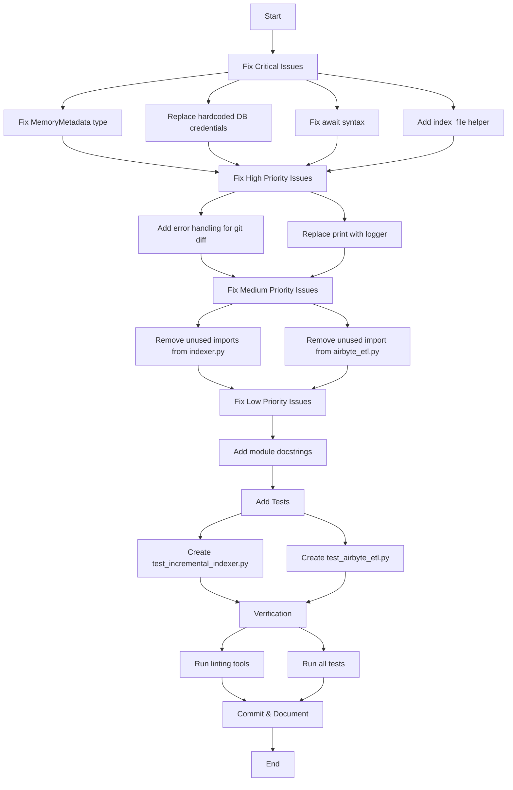

# Repository Fix Workflow

## Overview

This workflow addresses 9 issues across 4 severity levels to improve the sophia-intel-ai repository's health score from 55%.

## Issue Fix Flow

## Files to Modify

1. **app/indexing/airbyte_etl.py**

   - Fix MemoryMetadata type value
   - Replace hardcoded credentials
   - Remove unused import
   - Add module docstring

2. **app/indexing/indexer.py**

   - Fix await syntax
   - Add index_file helper function
   - Remove unused imports

3. **app/indexing/incremental_indexer.py**

   - Add error handling
   - Replace print with logger
   - Fix import issue

4. **app/indexing/chunker.py**

   - Expand documentation

5. **New Test Files**
   - tests/unit/test_incremental_indexer.py
   - tests/unit/test_airbyte_etl.py

## Expected Outcomes

- All critical ValidationErrors and TypeErrors will be resolved
- Security vulnerability from hardcoded credentials eliminated
- Improved error handling and logging
- Better test coverage for critical paths
- Clean linting results
- Comprehensive documentation
