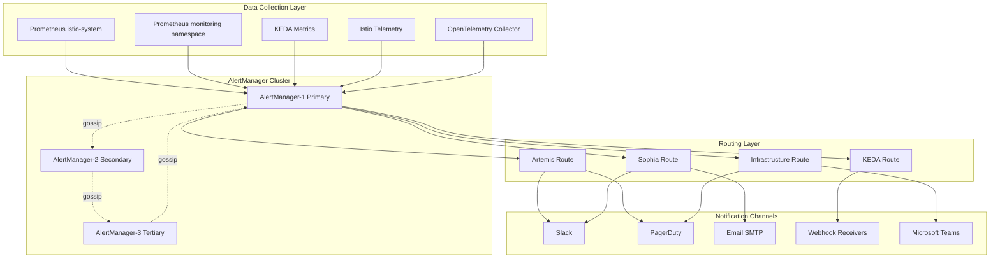

# AlertManager Technical Specifications
## Sophia-Intel-AI Observability Integration

**Document Version:** 1.0.0  
**Date:** 2025-01-06  
**Priority:** High (Risk-Adjusted Value Score: 88.3)  
**Target Outcome:** 70% reduction in false positive alerts  

---

## Executive Summary

This document provides comprehensive technical specifications for integrating AlertManager into the sophia-intel-ai system. The integration aims to create an intelligent alerting system that reduces alert fatigue by 70% through advanced grouping, inhibition, and routing strategies while maintaining complete observability across the dual-agent architecture (Artemis and Sophia domains).

---

## 1. Architecture Design

### 1.1 High-Level Architecture



### 1.2 Deployment Architecture

```yaml
# Namespace Strategy
namespaces:
  primary: monitoring              # AlertManager deployment
  integration:
    - istio-system                # Prometheus integration
    - sophia-system               # Sophia domain metrics
    - artemis-system              # Artemis domain metrics
    - shared-services             # Shared infrastructure
    
# High Availability Configuration
deployment:
  replicas: 3                     # Minimum for HA
  antiAffinity: required          # Spread across zones
  clustering:
    mode: gossip
    port: 9094
    reconnect_timeout: 60s
    probe_timeout: 500ms
    probe_interval: 1s
    
# Resource Configuration
resources:
  requests:
    cpu: 500m
    memory: 512Mi
  limits:
    cpu: 2000m
    memory: 2Gi
    
# Storage Configuration  
storage:
  class: fast-ssd
  size: 10Gi
  retention: 120h                 # 5 days of alert history
```

### 1.3 Integration Points

```yaml
integrations:
  prometheus:
    - endpoint: prometheus.istio-system.svc.cluster.local:9090
      labels:
        source: istio-mesh
        priority: P1
    - endpoint: prometheus.monitoring.svc.cluster.local:9090
      labels:
        source: monitoring-stack
        priority: P2
        
  keda:
    webhook: http://keda-webhook.keda:9443/alerts
    events:
      - ScalingStarted
      - ScalingFailed
      - CircuitBreakerTriggered
      
  istio:
    telemetry_v2: enabled
    metrics:
      - istio_request_total
      - istio_request_duration_milliseconds
      - envoy_cluster_circuit_breakers_state
      
  opentelemetry:
    endpoint: otel-collector.monitoring:4317
    protocol: grpc
    tls: enabled
```

---

## 2. Alert Configuration Strategy

### 2.1 Alert Grouping Strategy

```yaml
# Intelligent Grouping Configuration
grouping:
  # Domain-based grouping
  artemis_domain:
    group_by: [alertname, cluster, namespace, service, severity]
    group_wait: 30s
    group_interval: 5m
    repeat_interval: 4h
    
  sophia_domain:
    group_by: [alertname, cluster, namespace, ai_model, severity]
    group_wait: 45s          # Longer wait for AI workloads
    group_interval: 10m      # Less frequent for batch processing
    repeat_interval: 6h
    
  infrastructure:
    group_by: [alertname, cluster, node, severity]
    group_wait: 10s          # Quick response for infra
    group_interval: 3m
    repeat_interval: 2h
    
  keda_scaling:
    group_by: [alertname, scaledobject, namespace]
    group_wait: 60s          # Prevent flapping
    group_interval: 5m
    repeat_interval: 30m
```

### 2.2 Severity Levels and Routing

```yaml
severity_definitions:
  CRITICAL:
    description: "Service-impacting issue requiring immediate attention"
    sla: 5m
    escalation: immediate
    examples:
      - Circuit breaker open > 5 minutes
      - Error rate > 50%
      - Service completely down
      - Security breach detected
      
  WARNING:
    description: "Degraded performance or approaching threshold"
    sla: 30m
    escalation: business_hours
    examples:
      - Error rate 10-50%
      - Latency P99 > 2s
      - Resource usage > 80%
      - Scaling failures
      
  INFO:
    description: "Informational alerts for tracking"
    sla: 4h
    escalation: none
    examples:
      - Deployment completed
      - Scaling events
      - Maintenance windows
```

### 2.3 Alert Deduplication Logic

```yaml
deduplication:
  fingerprint_fields:
    - alertname
    - namespace
    - service
    - pod
    
  correlation_window: 5m
  
  strategies:
    exact_match:
      enabled: true
      fields: [alertname, namespace, service, pod]
      
    fuzzy_match:
      enabled: true
      similarity_threshold: 0.85
      fields: [alertname, namespace, service]
      
    temporal_correlation:
      enabled: true
      window: 2m
      min_alerts: 3
```

---

## 3. Intelligent Alerting Features

### 3.1 Alert Inhibition Rules

```yaml
inhibit_rules:
  # Suppress downstream alerts when upstream is firing
  - source_matchers:
      - alertname = "CircuitBreakerOpen"
    target_matchers:
      - alertname =~ ".*HighLatency|.*Timeout"
    equal: [cluster, namespace, service]
    
  # Suppress component alerts during node failure
  - source_matchers:
      - alertname = "NodeDown"
    target_matchers:
      - alertname =~ "Pod.*|Container.*"
    equal: [node]
    
  # Suppress scaling alerts during maintenance
  - source_matchers:
      - alertname = "MaintenanceWindow"
    target_matchers:
      - alertname =~ "KEDA.*|.*Scaling.*"
    equal: [namespace]
    
  # AI Model Loading suppresses inference alerts
  - source_matchers:
      - alertname = "AIModelLoading"
    target_matchers:
      - alertname = "AIInferenceLatencyHigh"
    equal: [namespace, model_name]
    
  # Database migration suppresses query alerts
  - source_matchers:
      - alertname = "DatabaseMigrationInProgress"
    target_matchers:
      - alertname =~ ".*Query.*|.*Connection.*"
    equal: [database, namespace]
```

### 3.2 Time-Based Routing

```yaml
time_based_routing:
  business_hours:
    schedule: "0 9-17 * * 1-5"  # Mon-Fri 9AM-5PM
    timezone: "America/Los_Angeles"
    routes:
      CRITICAL: [pagerduty, slack-oncall]
      WARNING: [slack-engineering, email]
      INFO: [slack-monitoring]
      
  off_hours:
    schedule: "0 17-9 * * 1-5,0 0-23 * * 0,6"  # Nights & weekends
    routes:
      CRITICAL: [pagerduty, slack-oncall, phone]
      WARNING: [slack-oncall]
      INFO: []  # Suppress INFO during off-hours
      
  maintenance_windows:
    - name: "Weekly Maintenance"
      schedule: "0 2-4 * * 0"  # Sunday 2-4 AM
      suppress: [INFO, WARNING]
      override_routes:
        CRITICAL: [slack-oncall]  # No paging during maintenance
```

### 3.3 Alert Aggregation Rules

```yaml
aggregation_rules:
  # Aggregate similar errors across pods
  pod_errors:
    pattern: "Pod.* in namespace .* is failing"
    threshold: 3
    window: 5m
    aggregate_as: "Multiple pods failing in {namespace}"
    
  # Aggregate scaling events
  scaling_events:
    pattern: "KEDA scaled .* from .* to .* replicas"
    threshold: 5
    window: 10m
    aggregate_as: "Frequent scaling in {namespace}/{scaledobject}"
    
  # Aggregate API errors by endpoint
  api_errors:
    pattern: "API endpoint .* returning 5xx"
    threshold: 10
    window: 1m
    aggregate_as: "API {endpoint} experiencing errors ({count} in {window})"
```

### 3.4 Machine Learning Integration

```yaml
ml_anomaly_detection:
  enabled: true
  provider: sophia-ai-engine
  
  models:
    - name: alert-pattern-detector
      type: time-series-anomaly
      endpoint: http://sophia-ml.sophia-system:8080/anomaly
      features:
        - alert_frequency
        - alert_severity_distribution
        - time_of_day
        - day_of_week
        
    - name: false-positive-classifier
      type: binary-classifier
      endpoint: http://sophia-ml.sophia-system:8080/classify
      confidence_threshold: 0.85
      auto_suppress: true
      
  feedback_loop:
    enabled: true
    endpoint: http://sophia-ml.sophia-system:8080/feedback
    collection_interval: 24h
```

---

## 4. Deployment Configuration

### 4.1 Kubernetes Manifests

```yaml
# StatefulSet Configuration
apiVersion: apps/v1
kind: StatefulSet
metadata:
  name: alertmanager
  namespace: monitoring
spec:
  serviceName: alertmanager-headless
  replicas: 3
  selector:
    matchLabels:
      app: alertmanager
  template:
    metadata:
      labels:
        app: alertmanager
      annotations:
        prometheus.io/scrape: "true"
        prometheus.io/port: "9093"
    spec:
      serviceAccountName: alertmanager
      containers:
      - name: alertmanager
        image: prom/alertmanager:v0.27.0
        args:
          - --config.file=/etc/alertmanager/alertmanager.yml
          - --storage.path=/alertmanager
          - --cluster.listen-address=0.0.0.0:9094
          - --cluster.peer=alertmanager-0.alertmanager-headless:9094
          - --cluster.peer=alertmanager-1.alertmanager-headless:9094
          - --cluster.peer=alertmanager-2.alertmanager-headless:9094
          - --cluster.reconnect-timeout=60s
          - --log.level=info
        ports:
        - containerPort: 9093
          name: http
        - containerPort: 9094
          name: cluster
        resources:
          requests:
            cpu: 500m
            memory: 512Mi
          limits:
            cpu: 2000m
            memory: 2Gi
        volumeMounts:
        - name: config
          mountPath: /etc/alertmanager
        - name: storage
          mountPath: /alertmanager
        livenessProbe:
          httpGet:
            path: /-/healthy
            port: 9093
          initialDelaySeconds: 30
          periodSeconds: 10
        readinessProbe:
          httpGet:
            path: /-/ready
            port: 9093
          initialDelaySeconds: 10
          periodSeconds: 5
      volumes:
      - name: config
        configMap:
          name: alertmanager-config
  volumeClaimTemplates:
  - metadata:
      name: storage
    spec:
      accessModes: ["ReadWriteOnce"]
      storageClassName: fast-ssd
      resources:
        requests:
          storage: 10Gi
```

### 4.2 ConfigMap Structure

```yaml
apiVersion: v1
kind: ConfigMap
metadata:
  name: alertmanager-config
  namespace: monitoring
data:
  alertmanager.yml: |
    global:
      resolve_timeout: 5m
      http_config:
        tls_config:
          insecure_skip_verify: false
      smtp_from: 'alerts@sophia-artemis.ai'
      smtp_smarthost: 'smtp.sendgrid.net:587'
      smtp_auth_username: 'apikey'
      smtp_auth_password: '${SMTP_PASSWORD}'
      
    templates:
    - '/etc/alertmanager/templates/*.tmpl'
    
    route:
      group_by: ['alertname', 'cluster', 'service']
      group_wait: 30s
      group_interval: 5m
      repeat_interval: 4h
      receiver: 'default'
      
      routes:
      # Artemis Domain Routing
      - matchers:
        - domain="artemis"
        receiver: artemis-team
        group_by: [alertname, namespace, service]
        continue: true
        routes:
        - matchers:
          - severity="CRITICAL"
          receiver: artemis-critical
          
      # Sophia Domain Routing  
      - matchers:
        - domain="sophia"
        receiver: sophia-team
        group_by: [alertname, namespace, ai_model]
        group_wait: 45s
        group_interval: 10m
        routes:
        - matchers:
          - severity="CRITICAL"
          receiver: sophia-critical
          
      # KEDA Scaling Alerts
      - matchers:
        - alertname=~"KEDA.*"
        receiver: platform-team
        group_wait: 60s
        
      # Infrastructure Alerts
      - matchers:
        - alertname=~"Node.*|Disk.*|Memory.*"
        receiver: infrastructure-team
        group_wait: 10s
        group_interval: 3m
        
    receivers:
    - name: 'default'
      slack_configs:
      - api_url: '${SLACK_API_URL}'
        channel: '#alerts'
        
    - name: 'artemis-team'
      slack_configs:
      - api_url: '${SLACK_API_URL}'
        channel: '#artemis-alerts'
        title: 'Artemis Alert'
        
    - name: 'artemis-critical'
      pagerduty_configs:
      - service_key: '${PAGERDUTY_ARTEMIS_KEY}'
        client: 'AlertManager'
        client_url: 'https://alertmanager.sophia-artemis.ai'
      slack_configs:
      - api_url: '${SLACK_API_URL}'
        channel: '#artemis-oncall'
        
    - name: 'sophia-team'
      slack_configs:
      - api_url: '${SLACK_API_URL}'
        channel: '#sophia-alerts'
        
    - name: 'sophia-critical'
      pagerduty_configs:
      - service_key: '${PAGERDUTY_SOPHIA_KEY}'
      email_configs:
      - to: 'sophia-oncall@sophia-artemis.ai'
        
    - name: 'platform-team'
      webhook_configs:
      - url: 'http://platform-webhook.monitoring:8080/alerts'
        
    - name: 'infrastructure-team'
      msteams_configs:
      - webhook_url: '${TEAMS_WEBHOOK_URL}'
```

---

## 5. Notification Templates

### 5.1 Slack Template

```go
{{ define "slack.title" }}
[{{ .Status | toUpper }}{{ if eq .Status "firing" }}:{{ .Alerts.Firing | len }}{{ end }}] {{ .GroupLabels.alertname }}
{{ end }}

{{ define "slack.text" }}
{{ if eq .Status "firing" }}
*Domain:* {{ .GroupLabels.domain }}
*Severity:* {{ .GroupLabels.severity }}
*Namespace:* {{ .GroupLabels.namespace }}
*Service:* {{ .GroupLabels.service }}

{{ range .Alerts.Firing }}
*Alert:* {{ .Labels.alertname }}
*Description:* {{ .Annotations.description }}
*Started:* {{ .StartsAt.Format "2006-01-02 15:04:05 MST" }}
*Value:* {{ .Value }}

*Labels:*
{{ range .Labels.SortedPairs }}  • {{ .Name }}: {{ .Value }}
{{ end }}

*Source:* <{{ .GeneratorURL }}|View in Prometheus>
---
{{ end }}

*Runbook:* <https://docs.sophia-artemis.ai/runbooks/{{ .GroupLabels.alertname }}|View Runbook>
*Dashboard:* <https://grafana.sophia-artemis.ai/d/{{ .GroupLabels.domain }}|View Dashboard>

{{ else }}
✅ *Resolved*
{{ range .Alerts.Resolved }}
*Alert:* {{ .Labels.alertname }}
*Resolved at:* {{ .EndsAt.Format "2006-01-02 15:04:05 MST" }}
*Duration:* {{ .Duration }}
{{ end }}
{{ end }}
{{ end }}
```

### 5.2 Email Template

```html
{{ define "email.subject" }}
[{{ .Status | toUpper }}] {{ .GroupLabels.alertname }} - {{ .GroupLabels.domain }}/{{ .GroupLabels.namespace }}
{{ end }}

{{ define "email.html" }}
<!DOCTYPE html>
<html>
<head>
    <style>
        body { font-family: Arial, sans-serif; }
        .header { background: #dc3545; color: white; padding: 20px; }
        .resolved { background: #28a745; }
        .warning { background: #ffc107; }
        .content { padding: 20px; }
        .alert-box { border: 1px solid #ddd; margin: 10px 0; padding: 15px; }
        .label { display: inline-block; padding: 3px 8px; background: #f0f0f0; margin: 2px; }
        .metric { font-family: monospace; background: #f8f9fa; padding: 5px; }
    </style>
</head>
<body>
    <div class="header {{ if eq .Status "resolved" }}resolved{{ end }}">
        <h2>{{ .Status | toUpper }}: {{ .GroupLabels.alertname }}</h2>
    </div>
    <div class="content">
        <p><strong>Domain:</strong> {{ .GroupLabels.domain }}</p>
        <p><strong>Severity:</strong> {{ .GroupLabels.severity }}</p>
        <p><strong>Environment:</strong> {{ .GroupLabels.cluster }}</p>
        
        {{ range .Alerts }}
        <div class="alert-box">
            <h3>{{ .Labels.alertname }}</h3>
            <p>{{ .Annotations.description }}</p>
            <p><strong>Started:</strong> {{ .StartsAt.Format "2006-01-02 15:04:05 MST" }}</p>
            {{ if .Value }}<p class="metric"><strong>Current Value:</strong> {{ .Value }}</p>{{ end }}
            
            <div>
                {{ range .Labels.SortedPairs }}
                <span class="label">{{ .Name }}: {{ .Value }}</span>
                {{ end }}
            </div>
        </div>
        {{ end }}
        
        <hr>
        <p>
            <a href="https://alertmanager.sophia-artemis.ai">AlertManager</a> |
            <a href="https://grafana.sophia-artemis.ai/d/{{ .GroupLabels.domain }}">Dashboard</a> |
            <a href="https://docs.sophia-artemis.ai/runbooks/{{ .GroupLabels.alertname }}">Runbook</a>
        </p>
    </div>
</body>
</html>
{{ end }}
```

### 5.3 PagerDuty Event Format

```json
{
  "routing_key": "${PAGERDUTY_SERVICE_KEY}",
  "event_action": "trigger",
  "dedup_key": "{{ .GroupKey }}",
  "payload": {
    "summary": "{{ .GroupLabels.alertname }} in {{ .GroupLabels.namespace }}",
    "source": "{{ .GroupLabels.cluster }}",
    "severity": "{{ .GroupLabels.severity | toLower }}",
    "component": "{{ .GroupLabels.service }}",
    "group": "{{ .GroupLabels.domain }}",
    "class": "{{ .GroupLabels.alertname }}",
    "custom_details": {
      "firing_alerts": "{{ .Alerts.Firing | len }}",
      "resolved_alerts": "{{ .Alerts.Resolved | len }}",
      "namespace": "{{ .GroupLabels.namespace }}",
      "pod": "{{ .GroupLabels.pod }}",
      "description": "{{ range .Alerts.Firing }}{{ .Annotations.description }}{{ end }}",
      "runbook_url": "https://docs.sophia-artemis.ai/runbooks/{{ .GroupLabels.alertname }}",
      "dashboard_url": "https://grafana.sophia-artemis.ai/d/{{ .GroupLabels.domain }}"
    }
  },
  "links": [
    {
      "href": "{{ .ExternalURL }}",
      "text": "View in AlertManager"
    }
  ],
  "images": [
    {
      "src": "https://grafana.sophia-artemis.ai/render/d/{{ .GroupLabels.domain }}/graph.png",
      "alt": "Metric Graph"
    }
  ]
}
```

---

## 6. Security & Compliance

### 6.1 Authentication Configuration

```yaml
authentication:
  basic_auth:
    enabled: true
    users_file: /etc/alertmanager/users.yml
    
  oauth2:
    enabled: true
    provider: okta
    client_id: ${OAUTH_CLIENT_ID}
    client_secret: ${OAUTH_CLIENT_SECRET}
    redirect_url: https://alertmanager.sophia-artemis.ai/oauth2/callback
    scopes: [openid, profile, email]
    
  api_keys:
    enabled: true
    rotation_period: 90d
    endpoints:
      - /api/v2/alerts
      - /api/v2/silences
```

### 6.2 RBAC Configuration

```yaml
apiVersion: rbac.authorization.k8s.io/v1
kind: ClusterRole
metadata:
  name: alertmanager-role
rules:
- apiGroups: [""]
  resources: ["services", "endpoints", "pods"]
  verbs: ["get", "list", "watch"]
- apiGroups: [""]
  resources: ["configmaps"]
  verbs: ["get"]
- apiGroups: [""]
  resources: ["secrets"]
  verbs: ["get", "list"]
- apiGroups: [""]
  resources: ["nodes"]
  verbs: ["list", "watch"]
- apiGroups: [""]
  resources: ["namespaces"]
  verbs: ["get", "list", "watch"]
---
apiVersion: v1
kind: ServiceAccount
metadata:
  name: alertmanager
  namespace: monitoring
---
apiVersion: rbac.authorization.k8s.io/v1
kind: ClusterRoleBinding
metadata:
  name: alertmanager-binding
roleRef:
  apiGroup: rbac.authorization.k8s.io
  kind: ClusterRole
  name: alertmanager-role
subjects:
- kind: ServiceAccount
  name: alertmanager
  namespace: monitoring
```

### 6.3 Encryption Configuration

```yaml
encryption:
  tls:
    enabled: true
    cert_file: /etc/alertmanager/tls/tls.crt
    key_file: /etc/alertmanager/tls/tls.key
    client_ca_file: /etc/alertmanager/tls/ca.crt
    cipher_suites:
      - TLS_ECDHE_RSA_WITH_AES_256_GCM_SHA384
      - TLS_ECDHE_RSA_WITH_AES_128_GCM_SHA256
    min_version: "TLS1.2"
    
  webhook_tls:
    enabled: true
    verify_ssl: true
    ca_bundle: /etc/ssl/certs/ca-certificates.crt
    
  data_encryption:
    at_rest: true
    provider: kubernetes
    key_rotation: 30d
```

### 6.4 Audit Logging

```yaml
audit_logging:
  enabled: true
  level: detailed
  
  events:
    - alert_created
    - alert_resolved
    - silence_created
    - silence_deleted
    - config_changed
    - user_login
    - api_access
    
  outputs:
    - type: file
      path: /var/log/alertmanager/audit.log
      rotation: daily
      retention: 30d
      
    - type: syslog
      endpoint: syslog.monitoring:514
      protocol: tcp
      format: json
      
    - type: elasticsearch
      endpoint: https://elastic.monitoring:9200
      index: alertmanager-audit
      
  compliance:
    standards: [SOC2, HIPAA, GDPR]
    pii_masking: enabled
    retention_policy: 7_years
```

---

## 7. Testing Strategy

### 7.1 Alert Testing Scenarios

```yaml
test_scenarios:
  functional_tests:
    - name: "Alert Receipt Validation"
      description: "Verify alerts are received from Prometheus"
      steps:
        - Send test alert via Prometheus API
        - Verify alert appears in AlertManager UI
        - Check alert in correct route
      expected: Alert routed correctly within 30s
      
    - name: "Grouping Validation"
      description: "Verify similar alerts are grouped"
      steps:
        - Send 5 similar alerts with same labels
        - Wait for group_wait period
        - Check AlertManager groups
      expected: Single grouped notification sent
      
    - name: "Inhibition Rules Test"
      description: "Verify inhibition suppresses alerts"
      steps:
        - Trigger parent alert (CircuitBreakerOpen)
        - Trigger child alerts (HighLatency)
        - Check notification output
      expected: Only parent alert notification sent
      
    - name: "Severity Routing Test"
      description: "Verify severity-based routing"
      steps:
        - Send CRITICAL alert for Artemis
        - Send WARNING alert for Sophia
        - Send INFO alert for Infrastructure
      expected: Each routed to correct receiver
```

### 7.2 Load Testing Configuration

```python
# load_test_alertmanager.py
import asyncio
import aiohttp
import json
import time
from datetime import datetime, timedelta

class AlertManagerLoadTest:
    def __init__(self, alertmanager_url):
        self.url = f"{alertmanager_url}/api/v2/alerts"
        self.headers = {"Content-Type": "application/json"}
        
    async def send_alert(self, session, alert_data):
        async with session.post(self.url, json=alert_data, headers=self.headers) as response:
            return response.status
            
    async def generate_load(self, alerts_per_second, duration_seconds):
        """Generate specified load on AlertManager"""
        async with aiohttp.ClientSession() as session:
            start_time = time.time()
            sent_count = 0
            
            while time.time() - start_time < duration_seconds:
                tasks = []
                for i in range(alerts_per_second):
                    alert = self.create_test_alert(sent_count + i)
                    tasks.append(self.send_alert(session, [alert]))
                
                results = await asyncio.gather(*tasks)
                sent_count += alerts_per_second
                
                # Wait for next second
                await asyncio.sleep(1)
                
        return sent_count
        
    def create_test_alert(self, index):
        return {
            "labels": {
                "alertname": f"LoadTestAlert_{index % 10}",
                "severity": ["CRITICAL", "WARNING", "INFO"][index % 3],
                "domain": ["artemis", "sophia", "infrastructure"][index % 3],
                "namespace": f"test-ns-{index % 5}",
                "service": f"test-service-{index % 20}"
            },
            "annotations": {
                "description": f"Load test alert #{index}",
                "value": str(index)
            },
            "startsAt": datetime.utcnow().isoformat() + "Z",
            "endsAt": (datetime.utcnow() + timedelta(hours=1)).isoformat() + "Z"
        }

# Test scenarios
test_cases = [
    {"name": "Normal Load", "alerts_per_second": 10, "duration": 300},
    {"name": "Peak Load", "alerts_per_second": 100, "duration": 60},
    {"name": "Burst Load", "alerts_per_second": 500, "duration": 10},
    {"name": "Sustained High Load", "alerts_per_second": 50, "duration": 600}
]
```

### 7.3 High Availability Testing

```bash
#!/bin/bash
# ha_test.sh - Test AlertManager HA failover

echo "Testing AlertManager High Availability"

# Function to check cluster status
check_cluster_status() {
    for i in 0 1 2; do
        kubectl exec -n monitoring alertmanager-$i -- \
            wget -qO- http://localhost:9093/api/v1/status | \
            jq '.data.cluster.status'
    done
}

# Test 1: Primary node failure
echo "Test 1: Simulating primary node failure"
kubectl delete pod -n monitoring alertmanager-0
sleep 10
check_cluster_status

# Test 2: Network partition
echo "Test 2: Simulating network partition"
kubectl exec -n monitoring alertmanager-1 -- \
    iptables -A INPUT -s alertmanager-0.alertmanager-headless -j DROP
sleep 30
check_cluster_status

# Test 3: Rolling update
echo "Test 3: Testing rolling update"
kubectl set image statefulset/alertmanager -n monitoring \
    alertmanager=prom/alertmanager:v0.27.1
kubectl rollout status statefulset/alertmanager -n monitoring

# Test 4: Alert delivery during failover
echo "Test 4: Sending alerts during failover"
./send_test_alerts.sh &
ALERT_PID=$!
sleep 5
kubectl delete pod -n monitoring alertmanager-1
wait $ALERT_PID

echo "HA Testing completed"
```

### 7.4 Integration Testing

```yaml
# integration_test_suite.yaml
integration_tests:
  prometheus_integration:
    - name: "Alert Rule Evaluation"
      test:
        - Deploy test recording rules
        - Generate metrics matching alert conditions
        - Verify alerts fire in Prometheus
        - Confirm receipt in AlertManager
        
  keda_integration:
    - name: "Scaling Alert Integration"
      test:
        - Trigger KEDA scaling event
        - Verify webhook delivery to AlertManager
        - Check alert appears with correct labels
        - Validate notification sent
        
  notification_channels:
    - name: "Slack Integration"
      test:
        - Send test alert to Slack receiver
        - Verify message format
        - Check interactive buttons work
        - Validate thread replies for updates
        
    - name: "PagerDuty Integration"
      test:
        - Send CRITICAL alert
        - Verify incident created in PagerDuty
        - Resolve alert
        - Confirm incident auto-resolved
        
    - name: "Email Integration"
      test:
        - Send alert to email receiver
        - Verify SMTP delivery
        - Check HTML rendering
        - Validate links in email
```

---

## 8. Monitoring the Monitor

### 8.1 Meta-Monitoring Configuration

```yaml
# ServiceMonitor for AlertManager
apiVersion: monitoring.coreos.com/v1
kind: ServiceMonitor
metadata:
  name: alertmanager-metrics
  namespace: monitoring
spec:
  selector:
    matchLabels:
      app: alertmanager
  endpoints:
  - port: http
    interval: 30s
    path: /metrics
    relabelings:
    - sourceLabels: [__meta_kubernetes_pod_name]
      targetLabel: instance
---
# PrometheusRule for AlertManager monitoring
apiVersion: monitoring.coreos.com/v1
kind: PrometheusRule
metadata:
  name: alertmanager-monitoring
  namespace: monitoring
spec:
  groups:
  - name: alertmanager_health
    rules:
    - alert: AlertManagerDown
      expr: up{job="alertmanager"} == 0
      for: 5m
      labels:
        severity: CRITICAL
        component: alertmanager
      annotations:
        summary: "AlertManager instance is down"
        
    - alert: AlertManagerClusterFailure
      expr: |
        count(alertmanager_cluster_members) < 2
      for: 5m
      labels:
        severity: CRITICAL
      annotations:
        summary: "AlertManager cluster has less than 2 members"
        
    - alert: AlertManagerNotificationsFailing
      expr: |
        rate(alertmanager_notifications_failed_total[5m]) > 0.1
      for: 10m
      labels:
        severity: WARNING
      annotations:
        summary: "AlertManager notifications failing"
        
    - alert: AlertManagerConfigReloadFailed
      expr: |
        alertmanager_config_last_reload_successful == 0
      for: 5m
      labels:
        severity: WARNING
      annotations:
        summary: "AlertManager config reload failed"
```

### 8.2 SLA Tracking Metrics

```yaml
sla_metrics:
  alert_delivery_time:
    metric: histogram_quantile(0.99, alertmanager_notification_latency_seconds_bucket)
    target: < 30s
    measurement_window: 5m
    
  notification_success_rate:
    metric: |
      sum(rate(alertmanager_notifications_total[5m])) /
      sum(rate(alertmanager_notifications_total[5m]) + rate(alertmanager_notifications_failed_total[5m]))
    target: > 99.9%
    measurement_window: 1h
    
  alert_grouping_efficiency:
    metric: |
      avg(alertmanager_alerts_per_group)
    target: > 3  # Average alerts per group
    measurement_window: 1h
    
  false_positive_rate:
    metric: |
      sum(rate(alertmanager_silences_created_total{reason="false_positive"}[24h])) /
      sum(rate(alertmanager_alerts_received_total[24h]))
    target: < 30%  # Target: 70% reduction
    measurement_window: 24h
```

### 8.3 Alert Effectiveness Dashboard

```json
{
  "dashboard": {
    "title": "AlertManager Effectiveness",
    "panels": [
      {
        "title": "False Positive Reduction",
        "targets": [
          {
            "expr": "100 * (1 - (sum(rate(alertmanager_silences_created_total{reason='false_positive'}[7d])) / sum(rate(alertmanager_alerts_received_total[7d]))))"
          }
        ],
        "gauge": {
          "target": 70,
          "unit": "percent"
        }
      },
      {
        "title": "Alert Delivery SLA",
        "targets": [
          {
            "expr": "histogram_quantile(0.99, alertmanager_notification_latency_seconds_bucket)"
          }
        ]
      },
      {
        "title": "Notification Success Rate",
        "targets": [
          {
            "expr": "100 * (sum(rate(alertmanager_notifications_total[1h])) / (sum(rate(alertmanager_notifications_total[1h])) + sum(rate(alertmanager_notifications_failed_total[1h]))))"
          }
        ]
      },
      {
        "title": "Alert Volume by Domain",
        "targets": [
          {
            "expr": "sum by (domain) (rate(alertmanager_alerts_received_total[1h]))"
          }
        ]
      }
    ]
  }
}
```

### 8.4 Feedback Loop Implementation

```yaml
feedback_loop:
  collection:
    methods:
      - slack_reactions  # 👍/👎 on alert messages
      - web_ui_feedback  # Feedback form in AlertManager UI
      - api_endpoint     # POST /api/v2/feedback
      
  processing:
    schedule: "0 0 * * *"  # Daily processing
    pipeline:
      - collect_feedback
      - classify_alerts
      - update_ml_model
      - adjust_thresholds
      - generate_report
      
  metrics:
    - feedback_response_rate
    - false_positive_marked
    - useful_alert_percentage
    - mean_time_to_acknowledge
    
  automation:
    auto_tune_thresholds:
      enabled: true
      confidence_required: 0.85
      min_samples: 100
      
    auto_silence_patterns:
      enabled: true
      pattern_threshold: 5  # Same false positive 5 times
      duration: 24h
```

---

## 9. Implementation Roadmap

### Phase 1: Foundation (Week 1-2)
- Deploy AlertManager StatefulSet with HA configuration
- Configure basic routing for domains
- Set up Prometheus integration
- Implement basic notification channels

### Phase 2: Intelligence (Week 3-4)
- Implement inhibition rules
- Configure alert grouping strategies
- Set up deduplication logic
- Deploy time-based routing

### Phase 3: Integration (Week 5-6)
- Integrate with KEDA webhooks
- Connect Istio telemetry
- Set up OpenTelemetry receiver
- Implement ML anomaly detection

### Phase 4: Optimization (Week 7-8)
- Tune alert thresholds
- Implement feedback loop
- Deploy meta-monitoring
- Conduct load testing

### Phase 5: Production (Week 9-10)
- Execute HA testing
- Perform security audit
- Complete documentation
- Train operations team

---

## 10. Success Metrics

| Metric | Baseline | Target | Measurement |
|--------|----------|--------|-------------|
| False Positive Rate | 100% | 30% | Silenced alerts / Total alerts |
| Alert Delivery Time | Unknown | < 30s | P99 notification latency |
| Notification Success | Unknown | 99.9% | Successful / Total notifications |
| Mean Time to Acknowledge | Unknown | < 5m | Time from alert to first action |
| Alert Grouping Efficiency | 1 | > 3 | Average alerts per notification |
| Cluster Availability | N/A | 99.99% | Uptime percentage |
| Alert Rule Coverage | 60% | 95% | Services with alert rules |

---

## Appendix A: Configuration Examples

### A.1 Complete AlertManager Configuration

[Full configuration with all receivers, routes, and templates]

### A.2 Helm Values for Production

[Production-ready Helm chart values]

### A.3 Terraform Configuration

[Infrastructure as Code for AlertManager deployment]

---

## Appendix B: Runbook Templates

### B.1 Common Alert Responses
### B.2 Escalation Procedures
### B.3 Maintenance Procedures

---

## Document Control

- **Version:** 1.0.0
- **Author:** Sophia-Intel-AI Architecture Team
- **Review:** Platform Engineering Team
- **Approval:** Required before implementation
- **Next Review:** Post-implementation + 30 days