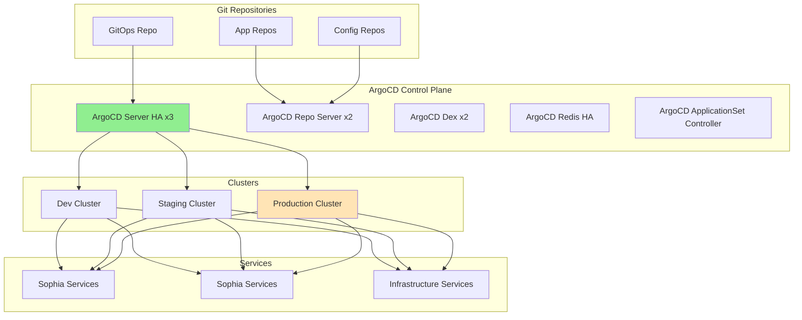

# ArgoCD GitOps Technical Specifications - Part 1
## Sophia-Intel-AI Platform GitOps Integration

---

## Executive Summary

This document provides comprehensive technical specifications for implementing ArgoCD GitOps across the sophia-intel-ai platform. The implementation targets an 80% reduction in deployment errors through automated GitOps workflows, automated rollback capabilities, and declarative infrastructure management.

**Key Objectives:**
- Eliminate manual deployment risks through GitOps automation
- Achieve automated rollback capability within 30 seconds
- Reduce deployment errors by 80% (from current baseline)
- Implement progressive delivery for all services
- Maintain 99.99% deployment reliability

---

## 1. Architecture Design

### 1.1 ArgoCD High Availability Topology

```yaml
# ArgoCD HA Deployment Architecture
apiVersion: v1
kind: Namespace
metadata:
  name: argocd
  labels:
    istio-injection: enabled
    environment: platform
---
# Server Deployment (3 replicas for HA)
apiVersion: apps/v1
kind: Deployment
metadata:
  name: argocd-server
  namespace: argocd
spec:
  replicas: 3
  strategy:
    type: RollingUpdate
    rollingUpdate:
      maxSurge: 1
      maxUnavailable: 0
  template:
    spec:
      affinity:
        podAntiAffinity:
          requiredDuringSchedulingIgnoredDuringExecution:
          - labelSelector:
              matchLabels:
                app.kubernetes.io/name: argocd-server
            topologyKey: kubernetes.io/hostname
      containers:
      - name: argocd-server
        image: quay.io/argoproj/argocd:v2.10.0
        env:
        - name: ARGOCD_SERVER_REPLICAS
          value: "3"
        - name: ARGOCD_API_SERVER_REPLICAS
          value: "3"
        resources:
          requests:
            cpu: 500m
            memory: 512Mi
          limits:
            cpu: 2000m
            memory: 2Gi
```

### 1.2 Multi-Cluster Configuration

```yaml
# Cluster Registration Configuration
clusters:
  development:
    name: dev-cluster
    server: https://dev.kubernetes.sophia-intel.local
    config:
      bearerToken: <dev-token>
      tlsClientConfig:
        insecure: false
        caData: <base64-ca-cert>
    labels:
      environment: dev
      region: us-west-2
      
  staging:
    name: staging-cluster
    server: https://staging.kubernetes.sophia-intel.local
    config:
      bearerToken: <staging-token>
      tlsClientConfig:
        insecure: false
        caData: <base64-ca-cert>
    labels:
      environment: staging
      region: us-west-2
      
  production:
    name: prod-cluster
    server: https://prod.kubernetes.sophia-intel.local
    config:
      bearerToken: <prod-token>
      tlsClientConfig:
        insecure: false
        caData: <base64-ca-cert>
    labels:
      environment: production
      region: us-west-2
      tier: critical
```

### 1.3 Application-of-Applications Pattern

```yaml
# Root Application managing all other applications
apiVersion: argoproj.io/v1alpha1
kind: Application
metadata:
  name: sophia-intel-platform
  namespace: argocd
  finalizers:
    - resources-finalizer.argocd.argoproj.io
spec:
  project: platform
  source:
    repoURL: https://github.com/sophia-intel-ai/gitops
    targetRevision: HEAD
    path: applications
  destination:
    server: https://kubernetes.default.svc
    namespace: argocd
  syncPolicy:
    automated:
      prune: true
      selfHeal: true
      allowEmpty: false
    syncOptions:
    - CreateNamespace=true
    retry:
      limit: 10
      backoff:
        duration: 5s
        factor: 2
        maxDuration: 3m
```

### 1.4 Architecture Diagram



---

## 2. Repository Structure

### 2.1 GitOps Repository Organization

```
sophia-intel-gitops/
├── applications/                    # App-of-apps definitions
│   ├── platform-apps.yaml          # Platform-level applications
│   ├── sophia-apps.yaml           # Sophia service applications
│   ├── sophia-apps.yaml            # Sophia service applications
│   └── infrastructure-apps.yaml    # Infrastructure applications
│
├── environments/                    # Environment-specific configs
│   ├── dev/
│   │   ├── values.yaml
│   │   ├── patches/
│   │   └── secrets/                # Sealed secrets
│   ├── staging/
│   │   ├── values.yaml
│   │   ├── patches/
│   │   └── secrets/
│   └── production/
│       ├── values.yaml
│       ├── patches/
│       └── secrets/
│
├── services/                        # Service definitions
│   ├── sophia/
│   │   ├── orchestrator/
│   │   │   ├── base/
│   │   │   │   ├── deployment.yaml
│   │   │   │   ├── service.yaml
│   │   │   │   ├── configmap.yaml
│   │   │   │   └── kustomization.yaml
│   │   │   └── overlays/
│   │   │       ├── dev/
│   │   │       ├── staging/
│   │   │       └── production/
│   │   ├── worker/
│   │   └── api/
│   │
│   └── sophia/
│       ├── analytics/
│       ├── ai-engine/
│       └── api/
│
├── infrastructure/                  # Infrastructure components
│   ├── argocd/
│   ├── istio/
│   ├── keda/
│   ├── alertmanager/
│   ├── prometheus/
│   └── external-secrets/
│
├── charts/                          # Helm charts
│   ├── sophia-suite/
│   └── sophia-suite/
│
└── applicationsets/                # ApplicationSet definitions
    ├── multi-env-apps.yaml
    ├── pr-preview-apps.yaml
    └── progressive-rollout.yaml
```

### 2.2 Environment-Specific Overlays

```yaml
# environments/production/patches/sophia-resources.yaml
apiVersion: apps/v1
kind: Deployment
metadata:
  name: sophia-orchestrator
spec:
  replicas: 5  # Production scale
  template:
    spec:
      containers:
      - name: sophia
        resources:
          requests:
            cpu: 1000m
            memory: 2Gi
          limits:
            cpu: 4000m
            memory: 8Gi
        env:
        - name: ENVIRONMENT
          value: production
        - name: LOG_LEVEL
          value: info
        - name: ENABLE_PROFILING
          value: "false"
```

### 2.3 Secrets Management Strategy

```yaml
# Sealed Secrets Configuration
apiVersion: bitnami.com/v1alpha1
kind: SealedSecret
metadata:
  name: sophia-credentials
  namespace: sophia-system
spec:
  encryptedData:
    database-url: AgBvY29... # Encrypted value
    redis-password: AgCxZ31... # Encrypted value
    api-key: AgDyA42... # Encrypted value
  template:
    metadata:
      name: sophia-credentials
      namespace: sophia-system
    type: Opaque
---
# External Secrets Operator (Alternative)
apiVersion: external-secrets.io/v1beta1
kind: ExternalSecret
metadata:
  name: sophia-secrets
  namespace: sophia-system
spec:
  secretStoreRef:
    name: vault-backend
    kind: SecretStore
  target:
    name: sophia-credentials
    creationPolicy: Owner
  data:
  - secretKey: database-password
    remoteRef:
      key: sophia/database
      property: password
  - secretKey: jwt-secret
    remoteRef:
      key: sophia/auth
      property: jwt-secret
```

### 2.4 Integration with Existing Components

```yaml
# Integration mapping for existing KEDA and AlertManager configs
apiVersion: v1
kind: ConfigMap
metadata:
  name: gitops-integration-map
  namespace: argocd
data:
  keda.path: "infrastructure/keda/gitops"
  alertmanager.path: "infrastructure/alertmanager/gitops"
  istio.path: "infrastructure/istio"
  monitoring.path: "infrastructure/monitoring"
  
  # Service paths
  sophia.base: "services/sophia"
  sophia.base: "services/sophia"
  
  # Environment mappings
  environments: |
    dev:
      cluster: https://dev.kubernetes.sophia-intel.local
      namespace_prefix: dev-
    staging:
      cluster: https://staging.kubernetes.sophia-intel.local
      namespace_prefix: staging-
    production:
      cluster: https://prod.kubernetes.sophia-intel.local
      namespace_prefix: ""
```

---

## 3. Application Configuration

### 3.1 Sophia Service Applications

```yaml
# Sophia Orchestrator Application
apiVersion: argoproj.io/v1alpha1
kind: Application
metadata:
  name: sophia-orchestrator
  namespace: argocd
  labels:
    app.kubernetes.io/name: sophia-orchestrator
    app.kubernetes.io/part-of: sophia-suite
    tier: orchestration
  annotations:
    argocd.argoproj.io/sync-wave: "10"
    notifications.argoproj.io/subscribe.on-deployed.slack: sophia-team
    notifications.argoproj.io/subscribe.on-sync-failed.slack: sophia-team
  finalizers:
    - resources-finalizer.argocd.argoproj.io
spec:
  project: sophia
  source:
    repoURL: https://github.com/sophia-intel-ai/gitops
    targetRevision: HEAD
    path: services/sophia/orchestrator/overlays/production
    kustomize:
      images:
      - ghcr.io/sophia-intel-ai/sophia-orchestrator:v2.1.0
  destination:
    server: https://kubernetes.default.svc
    namespace: sophia-system
  syncPolicy:
    automated:
      prune: true
      selfHeal: true
      allowEmpty: false
    syncOptions:
    - CreateNamespace=true
    - PrunePropagationPolicy=foreground
    - PruneLast=true
    - RespectIgnoreDifferences=true
    - ApplyOutOfSyncOnly=true
    retry:
      limit: 5
      backoff:
        duration: 5s
        factor: 2
        maxDuration: 3m
  revisionHistoryLimit: 10
  ignoreDifferences:
  - group: apps
    kind: Deployment
    jsonPointers:
    - /spec/replicas  # Ignore KEDA-managed replicas
---
# Sophia Worker Pool Application
apiVersion: argoproj.io/v1alpha1
kind: Application
metadata:
  name: sophia-worker-pool
  namespace: argocd
  labels:
    app.kubernetes.io/name: sophia-worker
    app.kubernetes.io/part-of: sophia-suite
    tier: processing
  annotations:
    argocd.argoproj.io/sync-wave: "20"
spec:
  project: sophia
  source:
    repoURL: https://github.com/sophia-intel-ai/gitops
    targetRevision: HEAD
    path: services/sophia/worker/overlays/production
  destination:
    server: https://kubernetes.default.svc
    namespace: sophia-system
  syncPolicy:
    automated:
      prune: true
      selfHeal: true
    syncOptions:
    - CreateNamespace=true
    - ServerSideApply=true  # For CRDs
```

### 3.2 Sophia Service Applications

```yaml
# Sophia Analytics Engine Application
apiVersion: argoproj.io/v1alpha1
kind: Application
metadata:
  name: sophia-analytics
  namespace: argocd
  labels:
    app.kubernetes.io/name: sophia-analytics
    app.kubernetes.io/part-of: sophia-suite
    tier: analytics
    ai.workload/type: batch-processing
  annotations:
    argocd.argoproj.io/sync-wave: "10"
    argocd.argoproj.io/hook: PreSync
    argocd.argoproj.io/hook-delete-policy: BeforeHookCreation
spec:
  project: sophia
  source:
    repoURL: https://github.com/sophia-intel-ai/gitops
    targetRevision: HEAD
    path: services/sophia/analytics/overlays/production
    helm:
      valueFiles:
      - ../../../environments/production/values.yaml
      parameters:
      - name: image.tag
        value: v3.2.1
      - name: ai.model.version
        value: "2024.1"
      - name: resources.gpu.enabled
        value: "true"
  destination:
    server: https://kubernetes.default.svc
    namespace: sophia-system
  syncPolicy:
    automated:
      prune: true
      selfHeal: true
    syncOptions:
    - CreateNamespace=true
    - Replace=true  # For ConfigMaps
  ignoreDifferences:
  - group: ""
    kind: ConfigMap
    name: sophia-ai-metrics-config
    jsonPointers:
    - /data/model.cache.size  # Dynamic value
```

### 3.3 Infrastructure Applications

```yaml
# KEDA Autoscaling Application (Existing Integration)
apiVersion: argoproj.io/v1alpha1
kind: Application
metadata:
  name: keda-autoscaling
  namespace: argocd
  labels:
    app.kubernetes.io/name: keda
    app.kubernetes.io/part-of: infrastructure
    tier: platform
spec:
  project: infrastructure
  source:
    repoURL: https://github.com/sophia-intel-ai/gitops
    targetRevision: HEAD
    path: infrastructure/keda/gitops/overlays/production
  destination:
    server: https://kubernetes.default.svc
    namespace: keda-system
  syncPolicy:
    automated:
      prune: true
      selfHeal: true
---
# Istio Service Mesh Application
apiVersion: argoproj.io/v1alpha1
kind: Application
metadata:
  name: istio-system
  namespace: argocd
  labels:
    app.kubernetes.io/name: istio
    app.kubernetes.io/part-of: infrastructure
    tier: mesh
  annotations:
    argocd.argoproj.io/sync-wave: "1"  # Deploy first
spec:
  project: infrastructure
  source:
    repoURL: https://github.com/sophia-intel-ai/gitops
    targetRevision: HEAD
    path: infrastructure/istio
  destination:
    server: https://kubernetes.default.svc
    namespace: istio-system
  syncPolicy:
    automated:
      prune: false  # Don't auto-prune Istio
      selfHeal: true
    syncOptions:
    - CreateNamespace=true
    - PreserveResourcesOnDeletion=true
```

---

## 4. ApplicationSets for Multi-Environment

### 4.1 Environment ApplicationSet

```yaml
apiVersion: argoproj.io/v1alpha1
kind: ApplicationSet
metadata:
  name: sophia-intel-environments
  namespace: argocd
spec:
  goTemplate: true
  goTemplateOptions: ["missingkey=error"]
  generators:
  - matrix:
      generators:
      - list:
          elements:
          - env: dev
            cluster: https://dev.kubernetes.sophia-intel.local
            autoSync: true
            prune: true
            wave: "100"
          - env: staging
            cluster: https://staging.kubernetes.sophia-intel.local
            autoSync: true
            prune: true
            wave: "200"
          - env: production
            cluster: https://prod.kubernetes.sophia-intel.local
            autoSync: false  # Manual for production
            prune: false
            wave: "300"
      - list:
          elements:
          - service: sophia-orchestrator
            namespace: sophia-system
            path: services/sophia/orchestrator
          - service: sophia-worker
            namespace: sophia-system
            path: services/sophia/worker
          - service: sophia-analytics
            namespace: sophia-system
            path: services/sophia/analytics
          - service: sophia-ai-engine
            namespace: sophia-system
            path: services/sophia/ai-engine
  template:
    metadata:
      name: '{{.service}}-{{.env}}'
      namespace: argocd
      labels:
        environment: '{{.env}}'
        service: '{{.service}}'
      annotations:
        argocd.argoproj.io/sync-wave: '{{.wave}}'
    spec:
      project: '{{.env}}-project'
      source:
        repoURL: https://github.com/sophia-intel-ai/gitops
        targetRevision: HEAD
        path: '{{.path}}/overlays/{{.env}}'
      destination:
        server: '{{.cluster}}'
        namespace: '{{.namespace}}'
      syncPolicy:
        automated:
          prune: '{{.prune}}'
          selfHeal: '{{.autoSync}}'
        syncOptions:
        - CreateNamespace=true
        retry:
          limit: 5
          backoff:
            duration: 5s
            factor: 2
            maxDuration: 3m
```

### 4.2 Progressive Rollout ApplicationSet

```yaml
apiVersion: argoproj.io/v1alpha1
kind: ApplicationSet
metadata:
  name: progressive-rollout
  namespace: argocd
spec:
  strategy:
    type: RollingSync
    rollingSync:
      steps:
      - matchExpressions:
        - key: environment
          operator: In
          values: [dev]
        maxUpdate: 100%  # Update all dev at once
      - matchExpressions:
        - key: environment
          operator: In
          values: [staging]
        maxUpdate: 1  # One staging app at a time
      - matchExpressions:
        - key: environment
          operator: In
          values: [production]
        maxUpdate: 1  # One production app at a time
  generators:
  - git:
      repoURL: https://github.com/sophia-intel-ai/gitops
      revision: HEAD
      directories:
      - path: services/*/overlays/*
  template:
    metadata:
      name: '{{.path.basename}}-{{.path[2]}}'
      labels:
        environment: '{{.path[3]}}'
        service: '{{.path[1]}}'
    spec:
      project: default
      source:
        repoURL: https://github.com/sophia-intel-ai/gitops
        targetRevision: HEAD
        path: '{{.path}}'
      destination:
        server: https://kubernetes.default.svc
        namespace: '{{.path[1]}}-system'
      syncPolicy:
        automated:
          prune: true
          selfHeal: true
```

### 4.3 PR Preview Environments

```yaml
apiVersion: argoproj.io/v1alpha1
kind: ApplicationSet
metadata:
  name: pr-preview-environments
  namespace: argocd
spec:
  generators:
  - pullRequest:
      github:
        owner: sophia-intel-ai
        repo: gitops
        tokenRef:
          secretName: github-token
          key: token
      requeueAfterSeconds: 60
  template:
    metadata:
      name: 'pr-{{.number}}-{{.branch_slug}}'
      namespace: argocd
      labels:
        environment: preview
        pr-number: '{{.number}}'
    spec:
      project: preview-environments
      source:
        repoURL: https://github.com/sophia-intel-ai/gitops
        targetRevision: '{{.head_sha}}'
        path: services
        kustomize:
          namePrefix: 'pr-{{.number}}-'
          commonLabels:
            preview: 'pr-{{.number}}'
      destination:
        server: https://kubernetes.default.svc
        namespace: 'preview-pr-{{.number}}'
      syncPolicy:
        automated:
          prune: true
          selfHeal: true
        syncOptions:
        - CreateNamespace=true
      # Auto-delete after PR is closed
      revisionHistoryLimit: 0
```

---

*Continued in Part 2...*