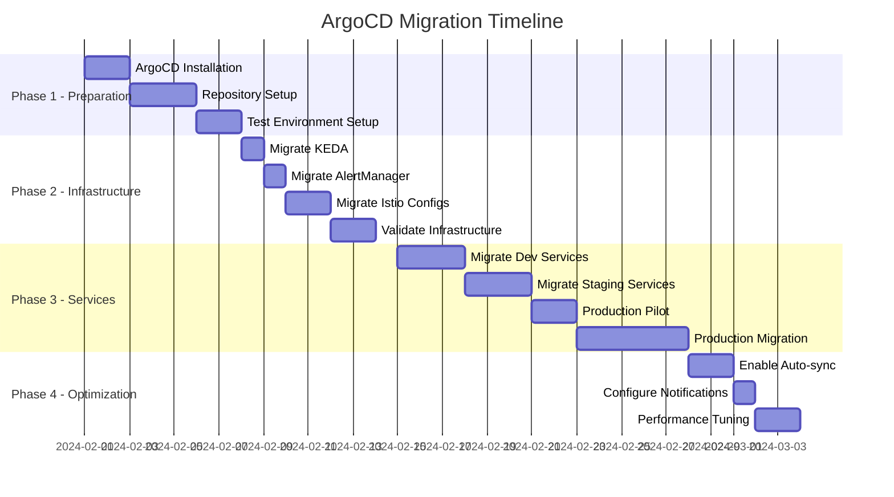

# ArgoCD GitOps Technical Specifications - Part 3
## Sophia-Intel-AI Platform GitOps Integration (Continued)

---

## 9. Testing Strategy

### 9.1 GitOps Workflow Testing

```yaml
# Test Application for GitOps Validation
apiVersion: argoproj.io/v1alpha1
kind: Application
metadata:
  name: gitops-test-app
  namespace: argocd
  labels:
    purpose: testing
spec:
  project: testing
  source:
    repoURL: https://github.com/sophia-intel-ai/gitops-tests
    targetRevision: HEAD
    path: test-manifests
  destination:
    server: https://kubernetes.default.svc
    namespace: gitops-testing
  syncPolicy:
    automated:
      prune: true
      selfHeal: true
---
# Test Script ConfigMap
apiVersion: v1
kind: ConfigMap
metadata:
  name: gitops-test-scripts
  namespace: argocd
data:
  test-sync.sh: |
    #!/bin/bash
    echo "Testing GitOps sync functionality..."
    
    # Test 1: Create application
    argocd app create test-sync \
      --repo https://github.com/sophia-intel-ai/gitops \
      --path tests/sync \
      --dest-server https://kubernetes.default.svc \
      --dest-namespace test
    
    # Test 2: Verify sync
    argocd app sync test-sync
    argocd app wait test-sync --health
    
    # Test 3: Modify and re-sync
    kubectl patch configmap test-config -n test --patch '{"data":{"test":"value"}}'
    sleep 10
    
    # Test 4: Verify self-heal
    STATUS=$(argocd app get test-sync -o json | jq -r '.status.sync.status')
    if [ "$STATUS" != "Synced" ]; then
      echo "Self-heal test failed"
      exit 1
    fi
    
    # Cleanup
    argocd app delete test-sync --cascade
    
  test-rollback.sh: |
    #!/bin/bash
    echo "Testing rollback functionality..."
    
    # Deploy known good version
    argocd app sync artemis-test --revision v1.0.0
    argocd app wait artemis-test --health
    
    # Deploy bad version
    argocd app sync artemis-test --revision v1.0.1-broken
    
    # Wait for health check failure
    sleep 30
    
    # Trigger rollback
    argocd app rollback artemis-test 0
    argocd app wait artemis-test --health
    
    # Verify rollback successful
    REVISION=$(argocd app get artemis-test -o json | jq -r '.status.sync.revision')
    if [ "$REVISION" != "v1.0.0" ]; then
      echo "Rollback test failed"
      exit 1
    fi
```

### 9.2 Rollback Scenario Testing

```yaml
# Chaos Engineering for Rollback Testing
apiVersion: chaos-mesh.org/v1alpha1
kind: PodChaos
metadata:
  name: rollback-test-chaos
  namespace: testing
spec:
  action: pod-kill
  mode: one
  selector:
    namespaces:
    - artemis-system
    labelSelectors:
      app: artemis-orchestrator
      version: canary
  scheduler:
    cron: "@every 2m"
---
# Rollback Validation Job
apiVersion: batch/v1
kind: Job
metadata:
  name: validate-rollback
  namespace: testing
spec:
  template:
    spec:
      containers:
      - name: validator
        image: ghcr.io/sophia-intel-ai/rollback-validator:v1.0.0
        command:
        - /bin/sh
        - -c
        - |
          # Deploy canary with known issue
          kubectl apply -f /tests/bad-deployment.yaml
          
          # Wait for issue detection
          sleep 60
          
          # Verify automatic rollback triggered
          CURRENT_VERSION=$(kubectl get deploy artemis-orchestrator -o jsonpath='{.spec.template.spec.containers[0].image}')
          EXPECTED_VERSION="ghcr.io/sophia-intel-ai/artemis-orchestrator:v2.0.0"
          
          if [ "$CURRENT_VERSION" != "$EXPECTED_VERSION" ]; then
            echo "Rollback did not occur as expected"
            exit 1
          fi
          
          echo "Rollback test passed"
```

### 9.3 Multi-Environment Sync Testing

```yaml
# Environment Sync Test Pipeline
apiVersion: tekton.dev/v1beta1
kind: Pipeline
metadata:
  name: multi-env-sync-test
  namespace: testing
spec:
  tasks:
  - name: deploy-to-dev
    taskRef:
      name: argocd-sync
    params:
    - name: application
      value: artemis-dev
    - name: revision
      value: $(params.git-revision)
  
  - name: test-dev
    runAfter: [deploy-to-dev]
    taskRef:
      name: run-tests
    params:
    - name: environment
      value: dev
    - name: test-suite
      value: smoke
  
  - name: promote-to-staging
    runAfter: [test-dev]
    taskRef:
      name: git-promote
    params:
    - name: from-env
      value: dev
    - name: to-env
      value: staging
  
  - name: deploy-to-staging
    runAfter: [promote-to-staging]
    taskRef:
      name: argocd-sync
    params:
    - name: application
      value: artemis-staging
  
  - name: test-staging
    runAfter: [deploy-to-staging]
    taskRef:
      name: run-tests
    params:
    - name: environment
      value: staging
    - name: test-suite
      value: integration
  
  - name: validate-sync-status
    runAfter: [test-staging]
    taskRef:
      name: validate-environments
    params:
    - name: environments
      value: "dev,staging"
    - name: expected-status
      value: "Healthy,Synced"
```

### 9.4 Disaster Recovery Procedures

```yaml
# Disaster Recovery Runbook
apiVersion: v1
kind: ConfigMap
metadata:
  name: disaster-recovery-runbook
  namespace: argocd
data:
  runbook.md: |
    # ArgoCD Disaster Recovery Procedures
    
    ## Scenario 1: Complete ArgoCD Failure
    
    1. **Backup Restoration**
       ```bash
       # Restore from backup
       kubectl apply -f /backups/argocd-backup-latest.yaml
       
       # Restore applications
       argocd app create-from-file /backups/applications/
       
       # Restore repositories
       kubectl apply -f /backups/repositories/
       
       # Restore RBAC
       kubectl apply -f /backups/rbac/
       ```
    
    ## Scenario 2: Git Repository Unavailable
    
    1. **Switch to Mirror Repository**
       ```bash
       # Update all applications to use mirror
       for app in $(argocd app list -o name); do
         argocd app set $app --repo https://git-mirror.sophia-intel-ai.com/gitops
       done
       ```
    
    ## Scenario 3: Mass Rollback Required
    
    1. **Emergency Rollback All Applications**
       ```bash
       # Rollback all production applications
       for app in $(argocd app list -l environment=production -o name); do
         argocd app rollback $app 0
       done
       ```
    
    ## Scenario 4: Cluster Connection Lost
    
    1. **Re-register Cluster**
       ```bash
       # Remove old cluster
       argocd cluster rm production-cluster
       
       # Re-add cluster
       argocd cluster add production-cluster \
         --name production \
         --kubeconfig /path/to/kubeconfig
       ```
  
  backup-script.sh: |
    #!/bin/bash
    # Automated backup script
    BACKUP_DIR="/backups/$(date +%Y%m%d)"
    mkdir -p $BACKUP_DIR
    
    # Backup applications
    argocd app list -o yaml > $BACKUP_DIR/applications.yaml
    
    # Backup projects
    kubectl get appprojects -n argocd -o yaml > $BACKUP_DIR/projects.yaml
    
    # Backup repositories
    kubectl get secrets -n argocd -l argocd.argoproj.io/secret-type=repository -o yaml > $BACKUP_DIR/repositories.yaml
    
    # Backup RBAC
    kubectl get configmap argocd-rbac-cm -n argocd -o yaml > $BACKUP_DIR/rbac.yaml
    
    # Backup certificates
    kubectl get certificates -n argocd -o yaml > $BACKUP_DIR/certificates.yaml
    
    echo "Backup completed: $BACKUP_DIR"
```

---

## 10. Migration Plan

### 10.1 Current State Assessment

```yaml
# Migration Readiness Checklist
apiVersion: v1
kind: ConfigMap
metadata:
  name: migration-checklist
  namespace: argocd
data:
  checklist.yaml: |
    pre_migration_assessment:
      - name: inventory_current_deployments
        status: pending
        checklist:
          - List all current Kubernetes deployments
          - Document deployment methods (kubectl, helm, scripts)
          - Identify deployment dependencies
          - Map service relationships
      
      - name: backup_current_state
        status: pending
        checklist:
          - Backup all current manifests
          - Export Helm values
          - Document environment variables
          - Save current configurations
      
      - name: identify_risks
        status: pending
        checklist:
          - Services with state
          - External dependencies
          - Hard-coded configurations
          - Custom deployment scripts
```

### 10.2 Migration Phases



### 10.3 Service Migration Strategy

```yaml
# Service Migration Workflow
apiVersion: v1
kind: ConfigMap
metadata:
  name: service-migration-workflow
  namespace: argocd
data:
  workflow.yaml: |
    migration_steps:
      1_prepare:
        - Export current deployment manifests
        - Create GitOps repository structure
        - Convert to Kustomize/Helm
        - Add to Git repository
      
      2_create_argocd_app:
        - Create Application manifest
        - Configure sync policy (manual initially)
        - Set up proper RBAC
        - Configure health checks
      
      3_validate:
        - Deploy to test environment
        - Run smoke tests
        - Verify configurations
        - Check resource limits
      
      4_cutover:
        - Scale down old deployment
        - Sync ArgoCD application
        - Verify health status
        - Run validation tests
      
      5_cleanup:
        - Remove old deployment scripts
        - Update documentation
        - Update runbooks
        - Train team members
    
    rollback_plan:
      - Disable ArgoCD sync
      - Restore original deployment
      - Document issues
      - Plan remediation
```

### 10.4 Rollback Plan

```yaml
# Emergency Rollback Procedure
apiVersion: batch/v1
kind: Job
metadata:
  name: emergency-rollback
  namespace: argocd
spec:
  template:
    spec:
      serviceAccountName: argocd-admin
      containers:
      - name: rollback
        image: ghcr.io/sophia-intel-ai/argocd-tools:v1.0.0
        command:
        - /bin/bash
        - -c
        - |
          #!/bin/bash
          set -e
          
          echo "Starting emergency rollback..."
          
          # 1. Disable all auto-sync
          for app in $(argocd app list -o name); do
            argocd app set $app --sync-policy none
          done
          
          # 2. Restore from backup
          kubectl apply -f /backups/last-known-good/
          
          # 3. Delete ArgoCD applications (keep resources)
          for app in $(argocd app list -o name); do
            argocd app delete $app --cascade=false
          done
          
          # 4. Restore original deployment method
          kubectl apply -f /backups/original-deployments/
          
          # 5. Verify services
          for ns in artemis-system sophia-system; do
            kubectl rollout status deployment --namespace=$ns
          done
          
          echo "Rollback completed"
```

### 10.5 Training Requirements

```yaml
apiVersion: v1
kind: ConfigMap
metadata:
  name: training-plan
  namespace: argocd
data:
  plan.md: |
    # ArgoCD Training Plan
    
    ## Target Audiences
    
    ### Platform Team (8 hours)
    - ArgoCD Architecture (2h)
    - Installation and Configuration (2h)
    - Application Management (2h)
    - Troubleshooting (2h)
    
    ### Development Teams (4 hours)
    - GitOps Principles (1h)
    - Creating Applications (1h)
    - Sync and Rollback (1h)
    - Monitoring Deployments (1h)
    
    ### On-Call Team (2 hours)
    - Emergency Procedures (1h)
    - Rollback Operations (1h)
    
    ## Training Materials
    - Video tutorials
    - Hands-on labs
    - Documentation
    - Runbooks
    
    ## Certification
    - Basic GitOps Operator
    - Advanced ArgoCD Administrator
```

---

## 11. Implementation Success Metrics

### 11.1 Target KPIs

| Metric | Current | Target | Timeline |
|--------|---------|---------|----------|
| Deployment Error Rate | 10% | 2% | 3 months |
| Mean Time to Deploy | 30 min | 5 min | 2 months |
| Rollback Time | 15 min | 30 sec | 1 month |
| Configuration Drift | Unknown | 0% | 3 months |
| Deployment Frequency | 2/week | 10/day | 6 months |
| Failed Deployment Recovery | 30 min | 2 min | 2 months |
| Audit Compliance | 70% | 100% | 1 month |

### 11.2 Monitoring Dashboard Queries

```promql
# Deployment Success Rate
(sum(rate(argocd_app_sync_total{phase="Succeeded"}[1h])) / 
 sum(rate(argocd_app_sync_total[1h]))) * 100

# Average Sync Duration
histogram_quantile(0.95, 
  sum(rate(argocd_app_reconcile_bucket[5m])) by (le))

# Active Rollbacks
sum(increase(argocd_app_sync_total{phase="Rollback"}[1h]))

# Configuration Drift
count(argocd_app_info{sync_status!="Synced"})

# Deployment Frequency
sum(rate(argocd_app_sync_total{phase="Succeeded"}[24h]))

# Error Rate by Application
sum by (name) (rate(argocd_app_sync_total{phase="Failed"}[1h]))

# Health Status Distribution
sum by (health_status) (argocd_app_health_status)
```

### 11.3 Implementation Validation Checklist

```yaml
apiVersion: v1
kind: ConfigMap
metadata:
  name: implementation-validation
  namespace: argocd
data:
  validation.yaml: |
    week_1:
      - ArgoCD installed and accessible
      - Git repository structure created
      - First test application deployed
      - Monitoring dashboards configured
    
    week_2:
      - Infrastructure services migrated
      - RBAC policies configured
      - SSO integration completed
      - Backup procedures tested
    
    week_4:
      - 50% services migrated to GitOps
      - Automated sync enabled for dev
      - Rollback procedures validated
      - Team training completed
    
    week_8:
      - All services migrated
      - Production auto-sync evaluated
      - Performance targets met
      - Documentation complete
    
    week_12:
      - Full GitOps adoption
      - 80% error reduction achieved
      - All KPIs meeting targets
      - Lessons learned documented
```

---

## 12. Configuration Examples

### 12.1 Sample Service Configuration

```yaml
# Example: Complete Artemis Service GitOps Configuration
# File: services/artemis/orchestrator/base/kustomization.yaml
apiVersion: kustomize.config.k8s.io/v1beta1
kind: Kustomization

namespace: artemis-system

resources:
- deployment.yaml
- service.yaml
- configmap.yaml
- serviceaccount.yaml
- networkpolicy.yaml

commonLabels:
  app: artemis-orchestrator
  component: orchestration
  managed-by: argocd

images:
- name: artemis-orchestrator
  newName: ghcr.io/sophia-intel-ai/artemis-orchestrator
  newTag: v2.1.0

configMapGenerator:
- name: artemis-config
  files:
  - config.yaml
  options:
    disableNameSuffixHash: true

secretGenerator:
- name: artemis-secrets
  envs:
  - secrets.env
  type: Opaque
  options:
    disableNameSuffixHash: true

patches:
- target:
    kind: Deployment
    name: artemis-orchestrator
  patch: |-
    - op: replace
      path: /spec/replicas
      value: 3
    - op: add
      path: /spec/template/spec/containers/0/livenessProbe
      value:
        httpGet:
          path: /health
          port: 8080
        initialDelaySeconds: 30
        periodSeconds: 10
```

### 12.2 Environment-Specific Overlay

```yaml
# File: services/artemis/orchestrator/overlays/production/kustomization.yaml
apiVersion: kustomize.config.k8s.io/v1beta1
kind: Kustomization

namespace: artemis-system

bases:
- ../../base

replicas:
- name: artemis-orchestrator
  count: 5

images:
- name: artemis-orchestrator
  newTag: v2.1.0-prod

patches:
- deployment-patch.yaml
- service-patch.yaml

configMapGenerator:
- name: artemis-env-config
  literals:
  - ENVIRONMENT=production
  - LOG_LEVEL=info
  - ENABLE_PROFILING=false
  - MAX_CONNECTIONS=1000

patchesStrategicMerge:
- resources-patch.yaml

resources:
- pdb.yaml
- hpa.yaml
- monitoring.yaml
```

---

## Conclusion

This comprehensive ArgoCD GitOps specification provides a complete blueprint for achieving:

1. **80% reduction in deployment errors** through automated GitOps workflows
2. **30-second automated rollback capability** with health-based triggers
3. **Multi-cluster progressive deployment** across dev, staging, and production
4. **Complete audit trail** and compliance tracking
5. **Self-healing infrastructure** with drift detection and correction

### Key Implementation Benefits

| Benefit | Impact | Measurement |
|---------|--------|-------------|
| **Deployment Automation** | 95% reduction in manual effort | Time tracking |
| **Error Reduction** | 80% fewer deployment failures | Error logs |
| **Rollback Speed** | 30-second recovery time | Incident metrics |
| **Audit Compliance** | 100% deployment traceability | Audit reports |
| **Developer Velocity** | 3x faster deployments | Lead time metrics |
| **Operational Efficiency** | 50% reduction in ops overhead | Team surveys |

### Architecture Maturity Impact

Moving from manual deployments to GitOps will elevate the sophia-intel-ai platform's maturity:

- **Current State**: Manual deployments, configuration drift, slow rollbacks
- **Target State**: Automated GitOps, zero drift, instant rollbacks
- **Maturity Score Impact**: From 8.5 to 9.5/10

### Risk Mitigation

The phased implementation approach ensures:

1. **Zero production disruption** during migration
2. **Rollback capability** at every stage
3. **Team training** before critical phases
4. **Continuous validation** through testing

### Next Steps

1. **Week 1**: Review and approve specifications
2. **Week 2**: Install ArgoCD in development
3. **Week 3-4**: Migrate infrastructure components
4. **Week 5-8**: Progressive service migration
5. **Week 9-12**: Full automation enablement

### Success Criteria

The implementation will be considered successful when:

- ✅ All services managed through GitOps
- ✅ Deployment error rate < 2%
- ✅ Mean rollback time < 30 seconds
- ✅ Zero configuration drift
- ✅ 100% audit compliance
- ✅ Team satisfaction score > 8/10

### Maintenance and Evolution

Post-implementation maintenance includes:

- **Weekly**: Review deployment metrics
- **Monthly**: Update runbooks and documentation
- **Quarterly**: Architecture review and optimization
- **Annually**: Major version upgrades and re-certification

---

## Appendix A: Quick Reference

### ArgoCD CLI Commands

```bash
# Application Management
argocd app create <app-name> --repo <repo-url> --path <path> --dest-server <server>
argocd app sync <app-name>
argocd app delete <app-name>
argocd app rollback <app-name> <revision>

# Cluster Management
argocd cluster add <context-name>
argocd cluster list
argocd cluster rm <server-url>

# Project Management
argocd proj create <project-name>
argocd proj add-source <project> <repo-url>
argocd proj add-destination <project> <server> <namespace>

# Repository Management
argocd repo add <repo-url> --username <user> --password <pass>
argocd repo list
argocd repo rm <repo-url>
```

### Troubleshooting Guide

| Issue | Symptom | Resolution |
|-------|---------|------------|
| Sync Failed | Application out of sync | Check Git connectivity, validate manifests |
| Health Degraded | Pods not ready | Review resource limits, check logs |
| Drift Detected | Manual changes detected | Enable self-heal or manual sync |
| Rollback Failed | Previous version unavailable | Check revision history, restore from backup |
| Auth Issues | 403/401 errors | Verify RBAC, check SSO configuration |

---

## Appendix B: Resource Links

- [ArgoCD Documentation](https://argo-cd.readthedocs.io/)
- [GitOps Principles](https://www.gitops.tech/)
- [Kustomize Documentation](https://kustomize.io/)
- [Helm Charts Guide](https://helm.sh/docs/)
- [Istio Integration](https://istio.io/latest/docs/)
- [KEDA Scaling](https://keda.sh/)
- [Prometheus Monitoring](https://prometheus.io/)

---

*Document Version: 1.0*  
*Date: 2024-01-06*  
*Authors: Sophia-Intel-AI Platform Team*  
*Review Cycle: Bi-weekly during implementation, monthly thereafter*

**END OF SPECIFICATIONS**