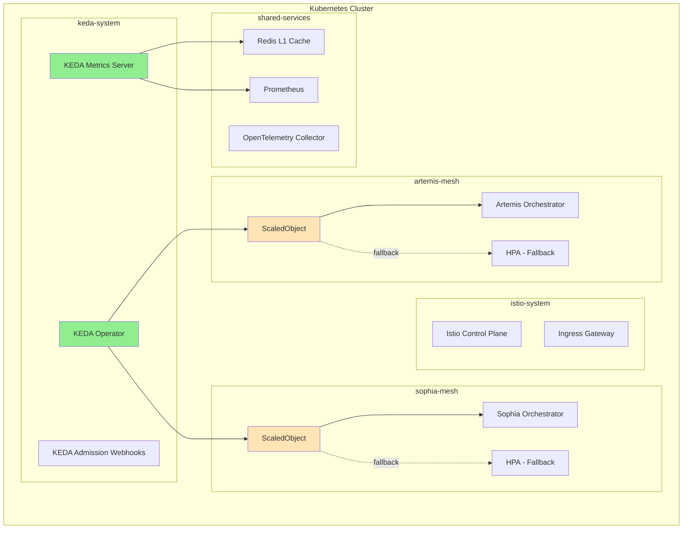

# KEDA Autoscaling Technical Specifications
## Sophia-Intel-AI System Integration

**Version:** 1.0  
**Date:** January 6, 2025  
**Priority:** P0 - MUST HAVE (RAV Score: 92.5)  
**Expected ROI:** 625% Year 1  

---

## 1. Architecture Design

### 1.1 Integration Pattern Overview



### 1.2 KEDA Integration with Dual-Agent Architecture

#### Component Placement
```yaml
Component Namespace Configuration:
  keda-system:
    - KEDA Operator (v2.13.0)
    - KEDA Metrics Server
    - KEDA Admission Webhooks
    
  artemis-mesh:
    - ScaledObject for Artemis Orchestrator
    - TriggerAuthentication for Redis/Prometheus
    - Fallback HPA configuration
    
  sophia-mesh:
    - ScaledObject for Sophia Orchestrator  
    - ScaledObject for AI Services
    - TriggerAuthentication for Redis/Prometheus
    - Fallback HPA configuration
    
  shared-services:
    - Redis instance (existing)
    - Prometheus instance (existing)
    - Metrics aggregation endpoints
```

### 1.3 Istio Service Mesh Integration

```yaml
KEDA-Istio Interaction:
  Traffic Management:
    - KEDA scales pods behind Istio VirtualServices
    - Istio automatically updates endpoint discovery
    - No modification to existing DestinationRules required
    
  mTLS Configuration:
    - KEDA operator excluded from mesh injection
    - Metrics server uses Istio-aware service discovery
    - TLS termination at sidecar proxies
    
  Network Policies:
    - Allow keda-system → artemis-mesh (metrics)
    - Allow keda-system → sophia-mesh (metrics)
    - Allow keda-system → shared-services (Redis/Prometheus)
```

### 1.4 Fallback Mechanism Design

```yaml
Fallback Strategy:
  Primary: KEDA ScaledObject
  Secondary: Kubernetes HPA
  
  Circuit Breaker Logic:
    Trigger Conditions:
      - KEDA operator unhealthy for >2 minutes
      - Scaling oscillation detected (>3 events/minute)
      - Metrics server unavailable
      
    Fallback Actions:
      1. Pause ScaledObject (set `paused: true`)
      2. Enable HPA with cached metrics
      3. Alert to operations team
      4. Log fallback event to audit trail
      
    Recovery Process:
      1. Verify KEDA health status
      2. Test with single ScaledObject
      3. Gradually re-enable all ScaledObjects
      4. Disable fallback HPA
```

---

## 2. Scaler Configuration

### 2.1 Redis List Scaler for Task Queue Monitoring

```yaml
apiVersion: keda.sh/v1alpha1
kind: ScaledObject
metadata:
  name: artemis-redis-scaler
  namespace: artemis-mesh
spec:
  scaleTargetRef:
    name: artemis-orchestrator
    kind: Deployment
  minReplicaCount: 2
  maxReplicaCount: 20
  pollingInterval: 5
  cooldownPeriod: 30
  fallback:
    failureThreshold: 3
    replicas: 4
  triggers:
  - type: redis
    metadata:
      addressFromEnv: REDIS_HOST
      listName: "artemis:task:queue"
      listLength: "10"  # Scale up when queue > 10 items
      activationListLength: "5"  # Start scaling at 5 items
      databaseIndex: "0"
    authenticationRef:
      name: redis-trigger-auth

---
apiVersion: v1
kind: Secret
metadata:
  name: redis-credentials
  namespace: artemis-mesh
type: Opaque
data:
  redis-password: <base64-encoded-password>

---
apiVersion: keda.sh/v1alpha1
kind: TriggerAuthentication
metadata:
  name: redis-trigger-auth
  namespace: artemis-mesh
spec:
  secretTargetRef:
  - parameter: password
    name: redis-credentials
    key: redis-password
```

### 2.2 Prometheus Scaler for AI Metrics

```yaml
apiVersion: keda.sh/v1alpha1
kind: ScaledObject
metadata:
  name: sophia-ai-prometheus-scaler
  namespace: sophia-mesh
spec:
  scaleTargetRef:
    name: sophia-orchestrator
    kind: Deployment
  minReplicaCount: 3
  maxReplicaCount: 30
  pollingInterval: 10
  cooldownPeriod: 60
  advanced:
    horizontalPodAutoscalerConfig:
      behavior:
        scaleDown:
          stabilizationWindowSeconds: 120
          policies:
          - type: Percent
            value: 50
            periodSeconds: 60
        scaleUp:
          stabilizationWindowSeconds: 0
          policies:
          - type: Percent
            value: 100
            periodSeconds: 15
          - type: Pods
            value: 4
            periodSeconds: 15
          selectPolicy: Max
  triggers:
  - type: prometheus
    metadata:
      serverAddress: http://prometheus.istio-system:9090
      metricName: inference_latency_p95
      query: |
        histogram_quantile(0.95, 
          sum(rate(inference_latency_seconds_bucket[1m])) 
          by (le, pod)
        )
      threshold: "2"  # Scale when P95 > 2 seconds
      activationThreshold: "1.5"
  - type: prometheus
    metadata:
      serverAddress: http://prometheus.istio-system:9090
      metricName: gpu_utilization
      query: |
        avg(gpu_utilization_percent{namespace="sophia-mesh"})
      threshold: "70"  # Scale when GPU > 70%
      activationThreshold: "60"
```

### 2.3 Cron Scaler for Predictable Patterns

```yaml
apiVersion: keda.sh/v1alpha1
kind: ScaledObject
metadata:
  name: sophia-cron-scaler
  namespace: sophia-mesh
spec:
  scaleTargetRef:
    name: sophia-orchestrator
    kind: Deployment
  minReplicaCount: 3
  maxReplicaCount: 25
  triggers:
  - type: cron
    metadata:
      timezone: America/Los_Angeles
      start: "0 8 * * 1-5"  # Scale up at 8 AM weekdays
      end: "0 20 * * 1-5"    # Scale down at 8 PM weekdays
      desiredReplicas: "15"
  - type: cron
    metadata:
      timezone: America/Los_Angeles
      start: "0 10 * * 0,6"  # Weekend reduced scaling
      end: "0 18 * * 0,6"
      desiredReplicas: "5"

---
apiVersion: keda.sh/v1alpha1
kind: ScaledObject
metadata:
  name: artemis-batch-processor
  namespace: artemis-mesh
spec:
  scaleTargetRef:
    name: artemis-batch-processor
    kind: Deployment
  minReplicaCount: 1
  maxReplicaCount: 10
  triggers:
  - type: cron
    metadata:
      timezone: UTC
      start: "0 2 * * *"     # Daily batch at 2 AM UTC
      end: "0 6 * * *"       # Complete by 6 AM UTC
      desiredReplicas: "8"

### 2.4 Scaling Thresholds and Cooldown Configuration

```yaml
Global Scaling Parameters:
  Polling Intervals:
    - Redis Queue: 5 seconds (high frequency)
    - Prometheus Metrics: 10 seconds (medium frequency)
    - Cron Triggers: 60 seconds (low frequency)
    
  Cooldown Periods:
    - Scale Up: 0 seconds (immediate response)
    - Scale Down: 60-120 seconds (prevent thrashing)
    
  Activation Thresholds:
    - Queue Length: 5 items (early activation)
    - Latency: 1.5 seconds P95 (proactive)
    - GPU Utilization: 60% (resource optimization)
    
  Scaling Thresholds:
    - Queue Length: 10 items per replica
    - Latency: 2.0 seconds P95
    - GPU Utilization: 70%
    - CPU Utilization: 60% (fallback metric)
```

---

## 3. Integration Points

### 3.1 Redis Connection Configuration

```yaml
apiVersion: v1
kind: ConfigMap
metadata:
  name: keda-redis-config
  namespace: shared-services
data:
  REDIS_HOST: "redis-master.shared-services.svc.cluster.local:6379"
  REDIS_DB: "0"
  REDIS_QUEUE_PREFIXES: |
    artemis:task:queue
    sophia:task:queue
    artemis:batch:queue
    sophia:inference:queue
  REDIS_SENTINEL_ENABLED: "false"
  REDIS_CLUSTER_ENABLED: "false"
  REDIS_TLS_ENABLED: "true"
```

### 3.2 Prometheus Integration

```yaml
apiVersion: v1
kind: Service
metadata:
  name: keda-prometheus-metrics
  namespace: keda-system
  labels:
    app: keda-operator
spec:
  ports:
  - name: metrics
    port: 8080
    targetPort: 8080
  selector:
    app: keda-operator

---
apiVersion: monitoring.coreos.com/v1
kind: ServiceMonitor
metadata:
  name: keda-metrics
  namespace: keda-system
spec:
  selector:
    matchLabels:
      app: keda-operator
  endpoints:
  - port: metrics
    interval: 30s
    path: /metrics
```

### 3.3 MCP Routing Integration

```yaml
Service Discovery Configuration:
  MCP Integration:
    - KEDA respects existing Istio service discovery
    - No changes to MCP routing required
    - Scaled pods automatically registered with Istio
    
  Endpoint Updates:
    - Istio Pilot detects new pod endpoints
    - VirtualService routing unchanged
    - DestinationRule subsets auto-updated
    
  Load Balancing:
    - Existing ROUND_ROBIN/LEAST_REQUEST preserved
    - Connection pool limits apply per pod
    - Circuit breaker thresholds maintained
```

### 3.4 Circuit Breaker Implementation

```yaml
apiVersion: v1
kind: ConfigMap
metadata:
  name: keda-circuit-breaker
  namespace: keda-system
data:
  circuit_breaker.yaml: |
    thresholds:
      scale_events_per_minute: 3
      consecutive_failures: 5
      error_rate_percentage: 30
    
    actions:
      on_trip:
        - pause_scaled_object
        - enable_hpa_fallback
        - send_alert
        - log_event
      
      on_recovery:
        - test_single_scaler
        - gradual_reenable
        - disable_hpa
        - clear_alert
    
    monitoring:
      health_check_interval: 30s
      recovery_test_period: 5m
      alert_channels:
        - slack
        - pagerduty
        - email
```

---

## 4. Deployment Strategy

### 4.1 Namespace Configuration

```yaml
apiVersion: v1
kind: Namespace
metadata:
  name: keda-system
  labels:
    name: keda-system
    istio-injection: disabled  # KEDA operator outside mesh
    monitoring: enabled
    component: autoscaling
  annotations:
    description: "KEDA autoscaling system namespace"

---
apiVersion: networking.k8s.io/v1
kind: NetworkPolicy
metadata:
  name: keda-network-policy
  namespace: keda-system
spec:
  podSelector:
    matchLabels:
      app: keda-operator
  policyTypes:
  - Ingress
  - Egress
  ingress:
  - from:
    - namespaceSelector:
        matchLabels:
          name: istio-system
    ports:
    - protocol: TCP
      port: 8080  # Metrics
    - protocol: TCP
      port: 9443  # Webhooks
  egress:
  - to:
    - namespaceSelector: {}  # Allow all namespaces
    ports:
    - protocol: TCP
      port: 443   # Kubernetes API
    - protocol: TCP
      port: 6379  # Redis
    - protocol: TCP
      port: 9090  # Prometheus
```

### 4.2 RBAC Configuration

```yaml
apiVersion: v1
kind: ServiceAccount
metadata:
  name: keda-operator
  namespace: keda-system

---
apiVersion: rbac.authorization.k8s.io/v1
kind: ClusterRole
metadata:
  name: keda-operator
rules:
- apiGroups: [""]
  resources: ["pods", "services", "endpoints", "events"]
  verbs: ["get", "list", "watch"]
- apiGroups: ["apps"]
  resources: ["deployments", "deployments/scale"]
  verbs: ["get", "list", "watch", "update", "patch"]
- apiGroups: ["autoscaling"]
  resources: ["horizontalpodautoscalers"]
  verbs: ["*"]
- apiGroups: ["keda.sh"]
  resources: ["scaledobjects", "scaledjobs", "triggerauthentications"]
  verbs: ["*"]
- apiGroups: ["metrics.k8s.io"]
  resources: ["pods", "nodes"]
  verbs: ["get", "list"]

---
apiVersion: rbac.authorization.k8s.io/v1
kind: ClusterRoleBinding
metadata:
  name: keda-operator
roleRef:
  apiGroup: rbac.authorization.k8s.io
  kind: ClusterRole
  name: keda-operator
subjects:
- kind: ServiceAccount
  name: keda-operator
  namespace: keda-system

---
apiVersion: rbac.authorization.k8s.io/v1
kind: Role
metadata:
  name: keda-operator
  namespace: artemis-mesh
rules:
- apiGroups: [""]
  resources: ["secrets"]
  verbs: ["get", "list", "watch"]
- apiGroups: ["apps"]
  resources: ["deployments/scale"]
  verbs: ["get", "update", "patch"]

---
apiVersion: rbac.authorization.k8s.io/v1
kind: RoleBinding
metadata:
  name: keda-operator
  namespace: artemis-mesh
roleRef:
  apiGroup: rbac.authorization.k8s.io
  kind: Role
  name: keda-operator
subjects:
- kind: ServiceAccount
  name: keda-operator
  namespace: keda-system
```

### 4.3 Resource Quotas and Limits

```yaml
apiVersion: v1
kind: ResourceQuota
metadata:
  name: keda-system-quota
  namespace: keda-system
spec:
  hard:
    requests.cpu: "2"
    requests.memory: "4Gi"
    limits.cpu: "4"
    limits.memory: "8Gi"
    persistentvolumeclaims: "2"

---
apiVersion: v1
kind: LimitRange
metadata:
  name: keda-limit-range
  namespace: keda-system
spec:
  limits:
  - max:
      cpu: "1"
      memory: "2Gi"
    min:
      cpu: "100m"
      memory: "128Mi"
    default:
      cpu: "500m"
      memory: "1Gi"
    defaultRequest:
      cpu: "200m"
      memory: "256Mi"
    type: Container
```

### 4.4 Canary Deployment Plan

```yaml
Phase 1 - Development Environment (Week 1):
  Day 1-2:
    - Deploy KEDA operator in dev cluster
    - Configure single ScaledObject for testing
    - Validate metrics collection
    
  Day 3-5:
    - Test all scaler types (Redis, Prometheus, Cron)
    - Verify fallback to HPA
    - Load testing with simulated traffic

Phase 2 - Staging Environment (Week 2):
  Day 1-3:
    - Deploy to staging with production config
    - Enable for 10% of workloads
    - Monitor scaling behavior
    
  Day 4-5:
    - Increase to 50% of workloads
    - Stress testing with peak loads
    - Validate circuit breaker triggers

Phase 3 - Production Canary (Week 3):
  Day 1:
    - Deploy to production (disabled)
    - Enable for single non-critical service
    - Monitor for 24 hours
    
  Day 2-3:
    - Enable for Artemis namespace (10% traffic)
    - Gradual increase to 50%
    - Continuous monitoring
    
  Day 4-5:
    - Enable for Sophia namespace
    - Full production rollout
    - Performance validation

Phase 4 - Full Production (Week 4):
  - All services using KEDA
  - HPA as fallback only
  - Documentation complete
  - Runbooks updated
```

---

## 5. Monitoring & Observability

### 5.1 Custom Metrics Definition

```yaml
apiVersion: v1
kind: ConfigMap
metadata:
  name: keda-custom-metrics
  namespace: keda-system
data:
  metrics.yaml: |
    keda_scaler_errors_total:
      description: Total number of scaler errors
      type: counter
      labels: [scaler, namespace, scaledObject]
    
    keda_scaler_metrics_latency_seconds:
      description: Latency of retrieving metrics from scaler
      type: histogram
      buckets: [0.005, 0.01, 0.025, 0.05, 0.1, 0.25, 0.5, 1, 2.5, 5, 10]
      labels: [scaler, namespace, scaledObject]
    
    keda_scaled_object_errors_total:
      description: Total number of errors for scaled object
      type: counter
      labels: [namespace, scaledObject]
    
    keda_trigger_metric_value:
      description: Current value of trigger metric
      type: gauge
      labels: [namespace, scaledObject, metric, trigger_type]
    
    keda_scaling_duration_seconds:
      description: Duration of scaling operations
      type: histogram
      buckets: [1, 2, 5, 10, 15, 30, 45, 60, 120]
      labels: [namespace, scaledObject, direction]
    
    keda_hpa_fallback_active:
      description: Whether HPA fallback is active
      type: gauge
      labels: [namespace, scaledObject]
```

### 5.2 Grafana Dashboard Specification

```json
{
  "dashboard": {
    "title": "KEDA Autoscaling - Sophia-Intel-AI",
    "uid": "keda-sophia-intel",
    "panels": [
      {
        "title": "Scaling Events Timeline",
        "type": "graph",
        "targets": [
          {
            "expr": "rate(keda_scaled_object_errors_total[5m])",
            "legendFormat": "Errors - {{namespace}}/{{scaledObject}}"
          },
          {
            "expr": "keda_trigger_metric_value",
            "legendFormat": "{{metric}} - {{namespace}}/{{scaledObject}}"
          }
        ]
      },
      {
        "title": "Current Replica Count",
        "type": "stat",
        "targets": [
          {
            "expr": "kube_deployment_status_replicas{namespace=~'artemis-mesh|sophia-mesh'}"
          }
        ]
      },
      {
        "title": "Scaling Latency P95",
        "type": "gauge",
        "targets": [
          {
            "expr": "histogram_quantile(0.95, keda_scaling_duration_seconds_bucket)"
          }
        ],
        "thresholds": {
          "steps": [
            {"value": 0, "color": "green"},
            {"value": 10, "color": "yellow"},
            {"value": 30, "color": "red"}
          ]
        }
      },
      {
        "title": "Queue Depth vs Replicas",
        "type": "graph",
        "targets": [
          {
            "expr": "redis_queue_length{queue=~'.*task.*'}",
            "legendFormat": "Queue: {{queue}}"
          },
          {
            "expr": "kube_deployment_status_replicas",
            "legendFormat": "Replicas: {{deployment}}"
          }
        ]
      },
      {
        "title": "AI Workload Metrics",
        "type": "graph",
        "targets": [
          {
            "expr": "inference_latency_p95",
            "legendFormat": "Inference P95"
          },
          {
            "expr": "gpu_utilization_percent",
            "legendFormat": "GPU Utilization"
          }
        ]
      },
      {
        "title": "HPA Fallback Status",
        "type": "stat",
        "targets": [
          {
            "expr": "keda_hpa_fallback_active",
            "legendFormat": "{{namespace}}/{{scaledObject}}"
          }
        ],
        "thresholds": {
          "steps": [
            {"value": 0, "color": "green"},
            {"value": 1, "color": "red"}
          ]
        }
      }
    ]
  }
}
```

### 5.3 Alert Rules

```yaml
apiVersion: monitoring.coreos.com/v1
kind: PrometheusRule
metadata:
  name: keda-alerts
  namespace: keda-system
spec:
  groups:
  - name: keda.rules
    interval: 30s
    rules:
    - alert: KEDAScalerErrors
      expr: rate(keda_scaler_errors_total[5m]) > 0.1
      for: 5m
      labels:
        severity: warning
        component: keda
      annotations:
        summary: "KEDA scaler errors detected"
        description: "KEDA scaler {{ $labels.scaler }} in {{ $labels.namespace }} has error rate of {{ $value }}"
    
    - alert: KEDAScalingLatencyHigh
      expr: histogram_quantile(0.95, keda_scaling_duration_seconds_bucket) > 30
      for: 10m
      labels:
        severity: warning
        component: keda
      annotations:
        summary: "KEDA scaling latency is high"
        description: "P95 scaling latency is {{ $value }}s for {{ $labels.namespace }}/{{ $labels.scaledObject }}"
    
    - alert: KEDAHPAFallbackActive
      expr: keda_hpa_fallback_active > 0
      for: 2m
      labels:
        severity: critical
        component: keda
      annotations:
        summary: "KEDA HPA fallback activated"
        description: "HPA fallback is active for {{ $labels.namespace }}/{{ $labels.scaledObject }}"
    
    - alert: KEDAScalingOscillation
      expr: |
        abs(delta(kube_deployment_status_replicas[1m])) > 3
        and
        rate(kube_deployment_status_replicas[5m]) > 0.5
      for: 5m
      labels:
        severity: warning
        component: keda
      annotations:
        summary: "Scaling oscillation detected"
        description: "Deployment {{ $labels.deployment }} is oscillating with {{ $value }} replica changes/min"
```

### 5.4 OpenTelemetry Integration

```yaml
apiVersion: v1
kind: ConfigMap
metadata:
  name: keda-otel-config
  namespace: keda-system
data:
  otel-collector-config.yaml: |
    receivers:
      prometheus:
        config:
          scrape_configs:
          - job_name: 'keda-metrics'
            scrape_interval: 30s
            static_configs:
            - targets:
              - keda-operator-metrics-server:8080
    
    processors:
      batch:
        timeout: 10s
        send_batch_size: 1024
      
      attributes:
        actions:
        - key: service.name
          value: keda-autoscaling
          action: insert
        - key: service.namespace
          value: keda-system
          action: insert
    
    exporters:
      otlp:
        endpoint: opentelemetry-collector.istio-system:4317
        tls:
          insecure: false
      
      prometheus:
        endpoint: "0.0.0.0:8889"
        namespace: keda
    
    service:
      pipelines:
        metrics:
          receivers: [prometheus]
          processors: [batch, attributes]
          exporters: [otlp, prometheus]
```

---

## 6. Testing Requirements

### 6.1 Load Testing Scenarios

```yaml
Test Suite 1 - Queue-Based Scaling:
  Setup:
    - Deploy Redis with simulated queue
    - Configure ScaledObject with queue trigger
    - Initial replicas: 2
  
  Scenarios:
    1. Gradual Load Increase:
       - Add 5 items/second for 5 minutes
       - Expected: Linear scaling to 10 replicas
       - Success: Scale time < 10 seconds
    
    2. Spike Load:
       - Add 100 items instantly
       - Expected: Rapid scale to max replicas
       - Success: Scale time < 10 seconds
    
    3. Load Decrease:
       - Remove items gradually
       - Expected: Controlled scale down
       - Success: No thrashing, cooldown respected

Test Suite 2 - AI Workload Scaling:
  Setup:
    - Deploy inference service
    - Configure Prometheus metrics
    - Simulate GPU workloads
  
  Scenarios:
    1. Latency-Based Scaling:
       - Increase request latency to 3s
       - Expected: Scale up within 15s
       - Success: P95 latency < 2s after scaling
    
    2. GPU Utilization:
       - Increase GPU load to 80%
       - Expected: Scale up at 70% threshold
       - Success: GPU utilization < 70% after scaling
    
    3. Mixed Metrics:
       - High latency + High GPU
       - Expected: Scale based on most critical
       - Success: Both metrics within thresholds

Test Suite 3 - Cron Scaling:
  Setup:
    - Configure daily/weekly patterns
    - Set timezone to match production
  
  Scenarios:
    1. Daily Peak Hours:
       - Trigger at 8 AM
       - Expected: Scale to 15 replicas
       - Success: Replicas ready before load
    
    2. Weekend Scaling:
       - Trigger weekend schedule
       - Expected: Reduce to 5 replicas
       - Success: Cost optimization achieved
```

### 6.2 Chaos Engineering Tests

```yaml
Failure Scenarios:
  1. KEDA Operator Failure:
     - Kill KEDA operator pod
     - Expected: HPA fallback activates within 2 minutes
     - Recovery: Operator restarts, resumes control
  
  2. Metrics Server Unavailable:
     - Block Prometheus/Redis access
     - Expected: Fallback to cached metrics
     - Recovery: Restore connectivity, verify scaling
  
  3. Scaling Oscillation:
     - Create conflicting metrics
     - Expected: Circuit breaker triggers
     - Recovery: Manual intervention, stabilization
  
  4. Network Partition:
     - Isolate KEDA from target namespace
     - Expected: Maintain current scale
     - Recovery: Network restoration, sync state
```

### 6.3 Performance Benchmarks

```yaml
Baseline Metrics:
  Current State (HPA):
    - Scale up time: 60 seconds
    - Scale down time: 300 seconds
    - CPU-based scaling only
    - No queue awareness
  
Target Metrics (KEDA):
  Success Criteria:
    - Scale up time: < 10 seconds (85% improvement)
    - Scale down time: < 60 seconds (80% improvement)
    - Multi-metric scaling
    - Queue-aware scaling
  
  Performance Targets:
    - Metric collection latency: < 500ms
    - Scaling decision time: < 2 seconds
    - Pod startup time: < 8 seconds
    - Total response time: < 10 seconds
```

### 6.4 Integration Tests

```yaml
Test Case 1 - Istio Integration:
  Steps:
    - Scale deployment with KEDA
    - Verify Istio endpoint updates
    - Test traffic routing
  Expected:
    - Seamless service discovery
    - Load balancing works
    - mTLS maintained

Test Case 2 - Prometheus Integration:
  Steps:
    - Generate custom metrics
    - Trigger Prometheus scaler
    - Verify scaling action
  Expected:
    - Metrics collected accurately
    - Threshold triggers respected
    - Scaling completes successfully

Test Case 3 - Redis Integration:
  Steps:
    - Add items to queue
    - Monitor queue depth
    - Verify scaling response
  Expected:
    - Queue monitoring accurate
    - Scaling proportional to depth
    - No message loss during scaling
```

---

## 7. Security Configurations

### 7.1 Network Policies

```yaml
apiVersion: networking.k8s.io/v1
kind: NetworkPolicy
metadata:
  name: keda-ingress-policy
  namespace: keda-system
spec:
  podSelector:
    matchLabels:
      app: keda-operator
  policyTypes:
  - Ingress
  ingress:
  - from:
    - namespaceSelector:
        matchLabels:
          name: kube-system
    ports:
    - protocol: TCP
      port: 9443  # Webhook port
  - from:
    - podSelector:
        matchLabels:
          app: keda-metrics-server
    ports:
    - protocol: TCP
      port: 8080  # Metrics port

---
apiVersion: networking.k8s.io/v1
kind: NetworkPolicy
metadata:
  name: keda-egress-policy
  namespace: keda-system
spec:
  podSelector:
    matchLabels:
      app: keda-operator
  policyTypes:
  - Egress
  egress:
  - to:
    - namespaceSelector:
        matchLabels:
          name: shared-services
    ports:
    - protocol: TCP
      port: 6379  # Redis
  - to:
    - namespaceSelector:
        matchLabels:
          name: istio-system
    ports:
    - protocol: TCP
      port: 9090  # Prometheus
  - to:
    - podSelector: {}
    ports:
    - protocol: TCP
      port: 443   # Kubernetes API
```

### 7.2 Secret Management

```yaml
apiVersion: external-secrets.io/v1beta1
kind: SecretStore
metadata:
  name: keda-secret-store
  namespace: keda-system
spec:
  provider:
    vault:
      server: "https://vault.shared-services:8200"
      path: "secret"
      version: "v2"
      auth:
        kubernetes:
          mountPath: "kubernetes"
          role: "keda-operator"
          serviceAccountRef:
            name: "keda-operator"

---
apiVersion: external-secrets.io/v1beta1
kind: ExternalSecret
metadata:
  name: redis-credentials
  namespace: artemis-mesh
spec:
  refreshInterval: 1h
  secretStoreRef:
    name: keda-secret-store
    kind: SecretStore
  target:
    name: redis-credentials
    creationPolicy: Owner
  data:
  - secretKey: redis-password
    remoteRef:
      key: keda/redis
      property: password
```

### 7.3 mTLS Configuration

```yaml
apiVersion: security.istio.io/v1beta1
kind: PeerAuthentication
metadata:
  name: keda-bypass
  namespace: keda-system
spec:
  mtls:
    mode: DISABLE  # KEDA outside mesh

---
apiVersion: networking.istio.io/v1beta1
kind: ServiceEntry
metadata:
  name: keda-redis-access
  namespace: keda-system
spec:
  hosts:
  - redis-master.shared-services.svc.cluster.local
  ports:
  - number: 6379
    name: redis
    protocol: TCP
  location: MESH_EXTERNAL
  resolution: DNS
```

### 7.4 Pod Security Policies

```yaml
apiVersion: policy/v1beta1
kind: PodSecurityPolicy
metadata:
  name: keda-operator
spec:
  privileged: false
  allowPrivilegeEscalation: false
  requiredDropCapabilities:
  - ALL
  volumes:
  - 'configMap'
  - 'secret'
  - 'projected'
  - 'emptyDir'
  hostNetwork: false
  hostIPC: false
  hostPID: false
  runAsUser:
    rule: 'MustRunAsNonRoot'
  seLinux:
    rule: 'RunAsAny'
  fsGroup:
    rule: 'RunAsAny'
  readOnlyRootFilesystem: true
```

---

## 8. Configuration Management

### 8.1 Helm Chart Structure

```yaml
# Chart.yaml
apiVersion: v2
name: keda-sophia-intel
description: KEDA autoscaling for Sophia-Intel-AI platform
type: application
version: 1.0.0
appVersion: "2.13.0"
dependencies:
- name: keda
  version: 2.13.0
  repository: https://kedacore.github.io/charts

# values.yaml
keda:
  operator:
    replicaCount: 2
    resources:
      requests:
        cpu: 200m
        memory: 256Mi
      limits:
        cpu: 1
        memory: 1Gi
    
  metricsServer:
    replicaCount: 2
    resources:
      requests:
        cpu: 100m
        memory: 128Mi
      limits:
        cpu: 500m
        memory: 512Mi
  
  webhooks:
    enabled: true
    replicaCount: 2

customScalers:
  artemis:
    redis:
      enabled: true
      queues:
      - name: task-queue
        threshold: 10
        activationThreshold: 5
    
    prometheus:
      enabled: false  # Not needed for Artemis
  
  sophia:
    redis:
      enabled: true
      queues:
      - name: inference-queue
        threshold: 5
        activationThreshold: 2
    
    prometheus:
      enabled: true
      metrics:
      - name: inference_latency_p95
        threshold: 2.0
        activationThreshold: 1.5
      - name: gpu_utilization
        threshold: 70
        activationThreshold: 60
    
    cron:
      enabled: true
      schedules:
      - name: weekday-peak
        start: "0 8 * * 1-5"
        end: "0 20 * * 1-5"
        replicas: 15
      - name: weekend
        start: "0 10 * * 0,6"
        end: "0 18 * * 0,6"
        replicas: 5
```

### 8.2 GitOps Manifests

```yaml
# kustomization.yaml
apiVersion: kustomize.config.k8s.io/v1beta1
kind: Kustomization

namespace: keda-system

resources:
- namespace.yaml
- rbac.yaml
- network-policies.yaml
- resource-quotas.yaml
- configmaps.yaml
- secrets.yaml

helmCharts:
- name: keda
  repo: https://kedacore.github.io/charts
  version: 2.13.0
  releaseName: keda
  namespace: keda-system
  valuesFile: values.yaml

patches:
- target:
    kind: Deployment
    name: keda-operator
  patch: |-
    - op: add
      path: /spec/template/spec/affinity
      value:
        podAntiAffinity:
          requiredDuringSchedulingIgnoredDuringExecution:
          - labelSelector:
              matchExpressions:
              - key: app
                operator: In
                values:
                - keda-operator
            topologyKey: kubernetes.io/hostname

configMapGenerator:
- name: keda-config
  files:
  - circuit-breaker.yaml
  - metrics.yaml
  - otel-config.yaml

secretGenerator:
- name: redis-auth
  literals:
  - password=CHANGE_ME_IN_PRODUCTION
```

### 8.3 Environment-Specific Values

```yaml
# values-dev.yaml
replicaCount: 1
resources:
  reduced: true
monitoring:
  enabled: false
circuitBreaker:
  enabled: false

# values-staging.yaml
replicaCount: 2
resources:
  standard: true
monitoring:
  enabled: true
circuitBreaker:
  enabled: true
  thresholds:
    relaxed: true

# values-production.yaml
replicaCount: 3
resources:
  production: true
monitoring:
  enabled: true
  detailed: true
circuitBreaker:
  enabled: true
  thresholds:
    strict: true
highAvailability:
  enabled: true
```

---

## 9. Migration Plan

### 9.1 Pre-Migration Checklist

```yaml
Infrastructure Requirements:
  ✓ Kubernetes 1.26+ installed
  ✓ Istio 1.20+ configured
  ✓ Prometheus operational
  ✓ Redis accessible
  ✓ Helm 3.0+ available
  ✓ kubectl access configured

Backup Requirements:
  ✓ Current HPA configurations backed up
  ✓ Deployment manifests saved
  ✓ Scaling metrics exported
  ✓ Alert rules documented

Team Readiness:
  ✓ Operations team trained
  ✓ Runbooks prepared
  ✓ Rollback procedures documented
  ✓ On-call rotation aware
```

### 9.2 Migration Steps

```yaml
Step 1 - Preparation (Day 0):
  - Review current HPA configurations
  - Document existing scaling behaviors
  - Prepare KEDA manifests
  - Set up monitoring dashboards

Step 2 - Installation (Day 1):
  - Deploy KEDA operator
  - Configure RBAC and network policies
  - Verify operator health
  - Test metrics collection

Step 3 - Pilot Service (Day 2):
  - Select non-critical service
  - Deploy ScaledObject alongside HPA
  - Monitor for 24 hours
  - Validate scaling behavior

Step 4 - Gradual Rollout (Days 3-5):
  - Migrate services in batches
  - 25% → 50% → 75% → 100%
  - Monitor each batch for issues
  - Rollback if problems detected

Step 5 - Cleanup (Day 6):
  - Remove old HPA configurations
  - Update documentation
  - Archive migration artifacts
  - Conduct retrospective
```

---

## 10. Success Metrics & KPIs

### 10.1 Technical KPIs

```yaml
Performance Metrics:
  Scaling Latency:
    - Current: 60 seconds
    - Target: <10 seconds
    - Measurement: P95 scaling time
  
  Resource Efficiency:
    - Current: 40% average utilization
    - Target: 65% average utilization
    - Measurement: CPU/Memory usage
  
  Queue Processing:
    - Current: Not measured
    - Target: <5 items average depth
    - Measurement: Redis queue metrics

Reliability Metrics:
  Scaling Failures:
    - Target: <0.1% failure rate
    - Measurement: Failed scaling events
  
  Fallback Activations:
    - Target: <1 per week
    - Measurement: HPA fallback triggers
  
  Service Availability:
    - Target: 99.95% uptime
    - Measurement: Service health checks
```

### 10.2 Business KPIs

```yaml
Cost Optimization:
  Infrastructure Spend:
    - Current: $X/month
    - Target: 15% reduction
    - Measurement: Cloud billing
  
  Over-provisioning:
    - Current: 60% idle resources
    - Target: <20% idle resources
    - Measurement: Resource utilization

Operational Efficiency:
  Manual Interventions:
    - Current: 10/week
    - Target: <2/week
    - Measurement: Operator actions
  
  Incident Response:
    - Current: 30 min MTTR
    - Target: 15 min MTTR
    - Measurement: Incident tickets

Developer Productivity:
  Deployment Frequency:
    - Current: 2/week
    - Target: 5/week
    - Measurement: CI/CD metrics
  
  Feature Velocity:
    - Current: Baseline
    - Target: +25%
    - Measurement: Story points
```

---

## Appendix A: Troubleshooting Guide

### Common Issues and Solutions

```yaml
Issue 1: Scaling Not Triggering
  Symptoms:
    - Metrics show threshold exceeded
    - No scaling events logged
    - Pods remain at min replicas
  
  Diagnosis:
    - Check ScaledObject status
    - Verify trigger authentication
    - Review KEDA operator logs
  
  Solution:
    - Ensure metrics are accessible
    - Fix authentication issues
    - Restart KEDA operator if needed

Issue 2: Rapid Scaling Oscillation
  Symptoms:
    - Pods scaling up and down rapidly
    - High churn rate
    - Performance degradation
  
  Diagnosis:
    - Check cooldown periods
    - Review threshold settings
    - Analyze metric stability
  
  Solution:
    - Increase cooldown period
    - Adjust thresholds
    - Enable circuit breaker

Issue 3: HPA Fallback Not Working
  Symptoms:
    - KEDA failure detected
    - HPA not taking over
    - Pods stuck at current scale
  
  Diagnosis:
    - Check HPA configuration
    - Verify fallback settings
    - Review circuit breaker logs
  
  Solution:
    - Fix HPA configuration
    - Manual HPA activation
    - Restore KEDA operation
```

---

## Appendix B: Reference Links

- [KEDA Documentation](https://keda.sh/docs/2.13/)
- [Kubernetes HPA](https://kubernetes.io/docs/tasks/run-application/horizontal-pod-autoscale/)
- [Istio Service Mesh](https://istio.io/latest/docs/)
- [Prometheus Metrics](https://prometheus.io/docs/concepts/metric_types/)
- [Redis Queue Patterns](https://redis.io/docs/manual/patterns/)

---

## Document Control

**Version:** 1.0  
**Created:** January 6, 2025  
**Author:** KEDA Integration Team  
**Review Cycle:** Monthly  
**Next Review:** February 6, 2025  

**Change Log:**
- v1.0 (2025-01-06): Initial specifications created