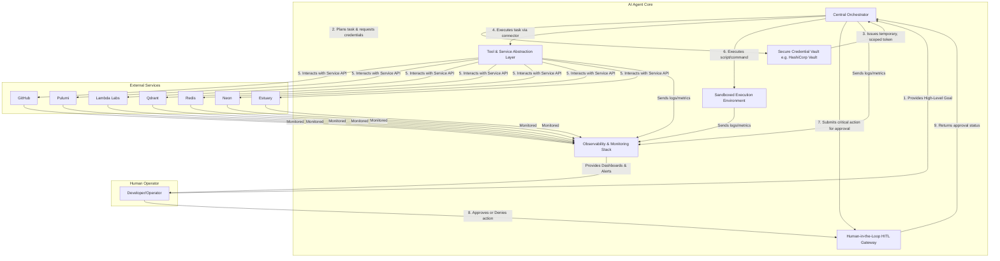

# AI Agent Architectural Overview

This document outlines the core components of the autonomous AI agent designed to manage development and operational workflows.

## 1. Core Components

### 1.1. Central Orchestrator
The "brain" of the agent. This component is responsible for:
- Receiving high-level goals (e.g., "deploy new feature," "diagnose production issue").
- Decomposing goals into a sequence of executable tasks.
- Maintaining the state of the overall workflow.
- Selecting the appropriate tool or service for each task.
- Interacting with other components to execute the plan.

### 1.2. Secure Credential Vault
A dedicated, highly secure service for storing, managing, and rotating all secrets (API keys, database connection strings, etc.).
- **Recommended Tool:** HashiCorp Vault or a similar cloud-native secrets manager (e.g., AWS Secrets Manager, Google Secret Manager).
- **Function:** The agent will request temporary, time-bound credentials from the vault for each specific task. This enforces the principle of least privilege and eliminates the need to store long-lived secrets in the agent's configuration.

### 1.3. Tool & Service Abstraction Layer
A collection of standardized interfaces (connectors) that the orchestrator uses to interact with external services.
- **Function:** Each service (GitHub, Pulumi, Lambda Labs, Qdrant, Redis, Neon, Estuary) will have its own dedicated connector. This decouples the agent's core logic from the specific implementation details of each service's API, making the system modular and extensible.

### 1.4. Sandboxed Execution Environment
A secure, isolated environment where the agent can execute shell commands, run scripts, and manage local files.
- **Function:** This provides a safe space for tasks like installing dependencies, running tests, and debugging code without affecting the host system. It will have its own ephemeral filesystem and a restricted network policy.

### 1.5. Human-in-the-Loop (HITL) Approval Gateway
A mandatory approval gate for critical, destructive, or production-impacting actions.
- **Function:** When the orchestrator plans a high-risk action (e.g., `pulumi destroy`, merging to the `main` branch), it must first submit the action to the HITL gateway. The action is paused until a human operator provides explicit approval through a secure interface (e.g., a chat-based prompt, a web UI).

### 1.6. Observability & Monitoring Stack
A centralized system for collecting logs, metrics, and traces from all agent components and the services it manages.
- **Function:** Provides a comprehensive, real-time view of system health and performance. This data is used by the agent for self-diagnosis and by human operators for auditing, debugging, and monitoring.

## 2. High-Level Architecture Diagram

