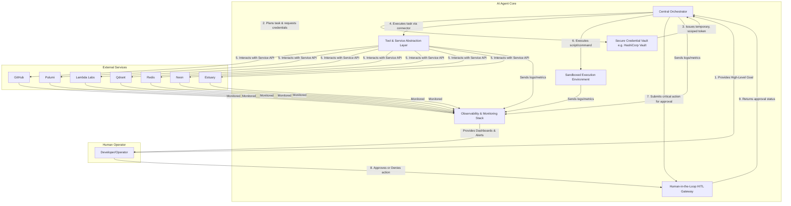

# Autonomous AI Agent: Final Architecture & Implementation Plan

This document provides the complete architectural design and implementation plan for the autonomous AI agent.

---

## 1. Architectural Overview

This section outlines the core components of the autonomous AI agent designed to manage development and operational workflows.

### 1.1. Core Components

#### 1.1.1. Central Orchestrator
The "brain" of the agent. This component is responsible for:
- Receiving high-level goals (e.g., "deploy new feature," "diagnose production issue").
- Decomposing goals into a sequence of executable tasks.
- Maintaining the state of the overall workflow.
- Selecting the appropriate tool or service for each task.
- Interacting with other components to execute the plan.

#### 1.1.2. Secure Credential Vault
A dedicated, highly secure service for storing, managing, and rotating all secrets (API keys, database connection strings, etc.).
- **Recommended Tool:** HashiCorp Vault or a similar cloud-native secrets manager (e.g., AWS Secrets Manager, Google Secret Manager).
- **Function:** The agent will request temporary, time-bound credentials from the vault for each specific task. This enforces the principle of least privilege and eliminates the need to store long-lived secrets in the agent's configuration.

#### 1.1.3. Tool & Service Abstraction Layer
A collection of standardized interfaces (connectors) that the orchestrator uses to interact with external services.
- **Function:** Each service (GitHub, Pulumi, Lambda Labs, Qdrant, Redis, Neon, Estuary) will have its own dedicated connector. This decouples the agent's core logic from the specific implementation details of each service's API, making the system modular and extensible.

#### 1.1.4. Sandboxed Execution Environment
A secure, isolated environment where the agent can execute shell commands, run scripts, and manage local files.
- **Function:** This provides a safe space for tasks like installing dependencies, running tests, and debugging code without affecting the host system. It will have its own ephemeral filesystem and a restricted network policy.

#### 1.1.5. Human-in-the-Loop (HITL) Approval Gateway
A mandatory approval gate for critical, destructive, or production-impacting actions.
- **Function:** When the orchestrator plans a high-risk action (e.g., `pulumi destroy`, merging to the `main` branch), it must first submit the action to the HITL gateway. The action is paused until a human operator provides explicit approval through a secure interface (e.g., a chat-based prompt, a web UI).

#### 1.1.6. Observability & Monitoring Stack
A centralized system for collecting logs, metrics, and traces from all agent components and the services it manages.
- **Function:** Provides a comprehensive, real-time view of system health and performance. This data is used by the agent for self-diagnosis and by human operators for auditing, debugging, and monitoring.

### 1.2. High-Level Architecture Diagram

---

## 2. Security Architecture

This section details the security mechanisms for the autonomous AI agent, focusing on credential management and the principle of least privilege.

### 2.1. Secure Credential Management with HashiCorp Vault

A dedicated, highly secure service is required to manage all secrets. We recommend **HashiCorp Vault** for this purpose.

#### 2.1.1. Vault's Role
Vault will serve as the single, centralized source of truth for all credentials required by the agent. Storing secrets in configuration files, environment variables, or code is strictly prohibited. The agent's Central Orchestrator will be the only component that communicates directly with Vault.

#### 2.1.2. Agent Authentication
The Central Orchestrator must securely authenticate with Vault to retrieve secrets. We recommend using Vault's **AppRole** authentication method:
- An **AppRole** will be created specifically for the agent.
- The `RoleID` will be configured in the agent's startup configuration.
- The `SecretID` will be injected into the agent's environment at runtime through a secure mechanism (e.g., a Kubernetes secret, an encrypted file).
- The agent will use the `RoleID` and `SecretID` to log in to Vault and obtain a time-to-live (TTL) limited Vault token. It will be responsible for renewing this token as needed.

#### 2.1.3. Dynamic Secrets
For services that support it, Vault will generate **dynamic, on-demand credentials**. This means the credentials are created for a specific task and automatically expire after use.
- **Neon (Postgres):** Vault's Database Secrets Engine will be configured to connect to Neon. When the agent needs to access the database, it will request credentials from Vault, which will create a new Postgres user with a short TTL.
- **Redis:** While Redis itself doesn't have a dedicated secrets engine, we can use a combination of the KV engine and custom rotation scripts to manage Redis passwords.
- **Lambda Labs:** API keys for Lambda Labs will be stored in Vault's KV secrets engine. We will implement a rotation policy for these keys.

#### 2.1.4. Secrets Engines by Service
- **GitHub:** A dedicated **GitHub App** will be created. The App's private key will be stored securely in Vault. The agent will use this key to generate short-lived installation access tokens for specific repositories. This is more secure and provides more granular permissions than a Personal Access Token (PAT).
- **Pulumi:** The `PULUMI_ACCESS_TOKEN` will be stored in Vault's KV secrets engine.
- **Qdrant:** The `QDRANT_URL` and any API keys will be stored in Vault's KV secrets engine.
- **Estuary:** API keys for Estuary will be stored in Vault's KV secrets engine.

### 2.2. IAM Roles and Policies (Principle of Least Privilege)

This section outlines the specific permissions the agent will be granted for each service, following the principle of least privilege.

#### 2.2.1. GitHub
A **GitHub App** will be used instead of a Personal Access Token (PAT). The App will be installed only on the target repository.
- **Repository Permissions:**
  - `Contents`: Read & write (for checking out code, committing changes)
  - `Pull requests`: Read & write (for creating and managing PRs)
  - `Issues`: Read & write (for creating and updating issues)
- **Organization Permissions:** None.

#### 2.2.2. Pulumi
The agent's `PULUMI_ACCESS_TOKEN` will grant it permissions to manage stacks within a dedicated Pulumi project.
- **Stack Permissions:** `create`, `read`, `update`, `delete`.

#### 2.2.3. Lambda Labs
The agent's API key will have the following permissions:
- `instance_launch`: To provision new instances.
- `instance_terminate`: To destroy instances.
- `instance_list`: To view existing instances.
- `ssh_key_manage`: To add and remove SSH keys for instance access.

#### 2.2.4. Managed Services (Qdrant, Redis, Neon, Estuary)
For these services, the agent will be granted administrative privileges on the service instance itself. Access will be controlled through network policies and dynamic, short-lived credentials from Vault.
- **Qdrant:** Full access to create/delete collections and manage points.
- **Redis:** Full access to read/write keys.
- **Neon:** The dynamic credentials will grant `CREATE`, `READ`, `WRITE`, `DELETE` on the target database.
- **Estuary:** Full access to manage data and collections.

### 2.3. Credential Rotation

A strict credential rotation policy is essential to limit the impact of a potential compromise.

#### 2.3.1. Automated Rotation
All static secrets (those not dynamically generated by Vault) must be automatically rotated. This includes:
- The GitHub App's private key.
- The `PULUMI_ACCESS_TOKEN`.
- API keys for Lambda Labs and Estuary.

#### 2.3.2. Rotation Schedule
- **Static Secrets:** All static secrets will be rotated every **90 days**.
- **Dynamic Secrets:** Credentials for Neon and Redis will be generated with a short TTL (e.g., 5-30 minutes), effectively rotating them on every use.
- **Vault Token:** The agent's own Vault token will have a TTL of 1 hour and will be renewed by the agent as needed.

#### 2.3.3. Emergency Rotation
A documented, automated procedure will be created to immediately revoke and rotate any secret in the event of a suspected compromise. This procedure will be triggered through a "break-glass" API call to the orchestration engine.

#### 2.3.4. Implementation
- **Vault:** Vault's built-in rotation capabilities will be used where possible.
- **Scheduled Jobs:** For services without native Vault integration, a scheduled job (e.g., a Kubernetes CronJob, a GitHub Action) will be created to call the service's API to revoke the old credential and then update the value in Vault.

---

## 3. Orchestration and Execution

This section details the design of the agent's Central Orchestrator and the task execution workflow.

### 3.1. Central Orchestrator Design

The Central Orchestrator is the "brain" of the agent. It is responsible for planning and executing the complex, multi-step tasks required to manage the development and operational workflow.

#### 3.1.1. Core Responsibilities
- **Planning & Decomposition:** Receiving a high-level goal (e.g., "deploy the new feature from PR #123") and breaking it down into a directed acyclic graph (DAG) of executable tasks.
- **State Management:** Durably tracking the state of each task (e.g., `pending`, `running`, `completed`, `failed`) and the overall workflow. The state must be resilient to failures and restarts.
- **Tool Selection:** For each task, selecting the appropriate tool from the Tool & Service Abstraction Layer (e.g., the GitHub connector, the Pulumi connector).
- **Execution:** Invoking the selected tool with the correct parameters.
- **Coordination:** Managing the flow of data and control between tasks, including handling dependencies and parallelism.
- **Error Handling & Retries:** Implementing robust error handling and configurable retry policies for transient failures.

#### 3.1.2. Recommended Technology: Temporal
We recommend building the Central Orchestrator using **Temporal**, a durable execution system.
- **Why Temporal?**
  - **Durability:** Temporal workflows are durable, meaning their state is preserved across process restarts and failures. This is critical for long-running operations like infrastructure provisioning.
  - **Reliability:** Temporal guarantees that a workflow will run to completion, even in the face of failures. It has built-in support for retries and error handling.
  - **Stateful Workflows:** Temporal is designed for stateful, long-running applications, which is a perfect fit for our agent's orchestration needs.
  - **Scalability:** Temporal is horizontally scalable to handle a large number of concurrent workflows.

#### 3.1.3. Task Definition
Tasks will be defined as activities within a Temporal workflow. Each activity will correspond to a specific action the agent can perform.
- **Example Task (Activity):** `commit_code`
  - **Input:** `repository`, `branch`, `commit_message`, `files`
  - **Action:** Uses the GitHub connector to commit the specified files to the repository.

### 3.2. Task Execution Workflow

A workflow is a Directed Acyclic Graph (DAG) of tasks that accomplishes a high-level goal. The orchestrator is responsible for executing this DAG, respecting dependencies and managing state.

#### 3.2.1. Task State Machine
Each task in the workflow will follow this state machine:
- **Pending:** The task is waiting for its dependencies to be met.
- **Running:** The task is currently being executed by an agent worker.
- **AwaitingApproval:** The task is a high-risk operation and is paused, waiting for human approval via the HITL gateway.
- **Succeeded:** The task completed successfully.
- **Failed:** The task failed. The workflow may be paused or terminated based on the failure mode.

#### 3.2.2. Example Workflow: "Deploy New Feature"
**Goal:** Deploy the feature in pull request `#123`.

**Workflow DAG:**
1.  **`fetch_pr_details(pr_number=123)`:** Get the source branch and other details from the GitHub PR.
2.  **`run_unit_tests(branch='feature-branch-xyz')`:** Execute the unit test suite in the sandboxed environment.
3.  **`run_lint_checks(branch='feature-branch-xyz')`:** Run the linter.
4.  **`pulumi_preview()` (depends on 2, 3):** Run `pulumi preview` to see the infrastructure changes.
5.  **`request_deployment_approval(plan_details)` (depends on 4):** Post the Pulumi plan to the HITL gateway and wait for approval.
6.  **`merge_pr(pr_number=123)` (depends on 5):** Merge the PR to the `main` branch.
7.  **`pulumi_up()` (depends on 6):** Apply the infrastructure changes.
8.  **`monitor_deployment()` (depends on 7):** Use the observability stack to monitor the health of the new deployment.
9.  **`notify_on_completion()` (depends on 8):** Notify the human operator that the deployment is complete and successful.

### 3.3. Sandboxed Execution Environment

The agent requires a secure, isolated environment to execute shell commands, run tests, and manage local files.

#### 3.3.1. Container-Based Sandbox
The execution environment will be a container-based sandbox, built using **Docker** or a similar OCI-compliant container runtime. This approach provides strong isolation and reproducibility.

#### 3.3.2. Ephemeral Filesystem
Each task or workflow that requires a local execution environment will be run in a new container with an ephemeral filesystem.
- **Isolation:** This ensures that tasks cannot interfere with each other's files.
- **Reproducibility:** Each task starts with a clean, consistent environment.
- **Workspace:** A dedicated workspace directory will be mounted into the container, allowing the agent to check out code and manage files for the duration of the task.

#### 3.3.3. Network Policy
A restrictive network policy will be applied to the sandbox container's network namespace.
- **Egress Control:** Only outbound connections to the specific services required by the architecture (Vault, GitHub API, Pulumi, etc.) will be permitted. All other outbound traffic will be blocked.
- **Ingress Control:** No inbound connections to the container will be allowed.

#### 3.3.4. Resource Limits
To prevent resource exhaustion, strict CPU and memory limits will be applied to each sandbox container. These limits will be configurable based on the requirements of the task.

---

## 4. Human-in-the-Loop (HITL) and Observability

This section details the design of the mandatory approval gate for critical operations and the observability stack for monitoring the agent and its managed services.

### 4.1. Human-in-the-Loop (HITL) Approval Gateway

A mandatory approval gate is required for all critical, destructive, or production-impacting actions.

#### 4.1.1. Approval Workflow
1.  The Central Orchestrator identifies a high-risk action (e.g., `pulumi destroy`, merging to `main`).
2.  The orchestrator pauses the workflow and enters the `AwaitingApproval` state.
3.  The orchestrator sends an approval request to the HITL Gateway.
4.  The HITL Gateway forwards this request to the human operator via the configured communication channel.
5.  The operator reviews the request and submits an `Approve` or `Deny` response.
6.  The HITL Gateway validates the response and sends it back to the orchestrator.
7.  The orchestrator resumes the workflow. If approved, it proceeds with the action. If denied, it terminates the workflow or executes a fallback plan.

#### 4.1.2. Communication Channel
We recommend using a chat-based platform like **Slack** or **Microsoft Teams** for HITL communication.
- **Why Chat?**
  - **Real-time:** Provides immediate notifications to operators.
  - **Interactive:** Supports interactive buttons and forms for easy `Approve`/`Deny` responses.
  - **Integration:** Easily integrated with the orchestration engine via webhooks.

#### 4.1.3. Approval Request Format
Each approval request will contain the following information:
- **Action:** The command to be executed (e.g., `pulumi destroy`).
- **Target:** The resource the action will affect (e.g., the `production` stack).
- **Requester:** The ID of the workflow requesting the action.
- **Plan Details:** For infrastructure changes, the output of the `pulumi preview`.
- **Timeout:** The time the operator has to respond before the request expires.

#### 4.1.4. Audit Trail
Every HITL request and response will be logged to a dedicated, immutable audit log. This log will capture:
- The full content of the approval request.
- The identity of the operator who responded.
- The timestamp of the response.
- The final decision (`Approved` or `Denied`).

### 4.2. Observability Stack

A comprehensive observability stack is required to monitor the health and performance of the agent and the services it manages. We recommend a stack based on the "three pillars of observability": logs, metrics, and traces.

#### 4.2.1. Recommended Tooling
- **Metrics:** **Prometheus** for collecting and storing time-series data.
- **Logs:** **Loki** for collecting and aggregating logs from all components.
- **Traces:** **Tempo** for distributed tracing to understand the flow of requests across services.
- **Visualization:** **Grafana** to create dashboards for logs, metrics, and traces.

#### 4.2.2. What to Monitor
- **Agent Metrics:**
  - Workflow execution status (success, failure, duration).
  - Task execution status.
  - Resource utilization of the sandbox environment.
- **Service Metrics:**
  - Health and latency of each external service (GitHub, Pulumi, etc.).
  - Resource utilization of managed services (Qdrant, Redis, etc.).
- **Logs:**
  - Structured logs (in JSON format) from all agent components.
  - Logs from the managed services.
- **Traces:**
  - Traces for each workflow, showing the full lifecycle of the operation.

### 4.3. Logging and Alerting Strategy

A proactive logging and alerting strategy is essential for maintaining system health and responding to incidents.

#### 4.3.1. Structured Logging
All agent components **must** produce structured logs in **JSON format**. Each log entry should include:
- `timestamp`: The time of the event.
- `level`: The log level (`INFO`, `WARN`, `ERROR`).
- `message`: The log message.
- `workflow_id`: The ID of the workflow the log belongs to.
- `task_id`: The ID of the task the log belongs to.

#### 4.3.2. Alerting Rules
Alerts will be configured in Prometheus's **Alertmanager**. Key alerting rules will include:
- **High Workflow Failure Rate:** An alert will be fired if the percentage of failed workflows exceeds a defined threshold.
- **Task Stuck in `Running` State:** An alert will be fired if a task remains in the `Running` state for longer than its expected timeout.
- **Service Unhealthy:** An alert will be fired if any of the external services (GitHub, Pulumi, etc.) become unhealthy.
- **Credential Vault Unreachable:** A high-priority alert will be fired if the agent cannot communicate with HashiCorp Vault.

#### 4.3.3. Alerting Channels
- **High Priority Alerts (e.g., Vault unreachable, high workflow failure rate):** PagerDuty and Slack.
- **Low Priority Alerts (e.g., task stuck):** Slack only.

---

## 5. Implementation and Rollout Plan

This section provides a step-by-step plan for implementing and rolling out the autonomous AI agent. The plan is divided into five sprints, following a "crawl, walk, run" methodology.

### 5.1. Sprint 1: Foundational Setup

**Goal:** Deploy and configure the core infrastructure and the first service connector.

1.  **Deploy HashiCorp Vault:** Provision a Vault server.
2.  **Configure Vault:**
    - Create the `AppRole` for the agent.
    - Configure the KV secrets engine.
    - Store the GitHub App's private key (to be created next).
3.  **Create GitHub App:** Create the GitHub App with the permissions defined in the security architecture.
4.  **Deploy Temporal:** Provision a Temporal cluster.
5.  **Develop Initial Orchestrator:** Create a "hello world" Temporal workflow to verify the Temporal deployment.
6.  **Develop GitHub Connector:** Implement the first service connector for GitHub, with an initial action to read a file from a repository.

### 5.2. Sprint 2: First End-to-End Read-Only Workflow

**Goal:** Implement a simple, non-destructive, end-to-end workflow to validate the integration of the core components.

1.  **Implement `read_file` Workflow:** Create a Temporal workflow that takes a repository and file path as input and returns the file's content.
2.  **Integrate Vault:** The workflow must securely fetch the GitHub App credentials from Vault.
3.  **Deploy Observability Stack:** Provision Prometheus, Grafana, Loki, and Tempo.
4.  **Instrument Workflow:** Add structured logging, metrics, and traces to the `read_file` workflow.
5.  **Develop Sandboxed Environment v1:** Create the basic Docker image and container runtime configuration for the sandboxed execution environment.

### 5.3. Sprint 3: Adding Destructive Actions & HITL

**Goal:** Implement a workflow with a destructive action, protected by the Human-in-the-Loop (HITL) approval gateway.

1.  **Develop Pulumi Connector:** Implement the connector for `pulumi preview` and `pulumi up`.
2.  **Store Pulumi Token in Vault:** Add the `PULUMI_ACCESS_TOKEN` to Vault's KV secrets engine.
3.  **Implement HITL Gateway:** Develop the service that integrates with Slack (or another chat platform) to send approval requests.
4.  **Implement `pulumi_preview_and_up` Workflow:** This workflow will:
    a. Run `pulumi preview` in the sandboxed environment.
    b. Send the plan to the HITL gateway for approval.
    c. If approved, run `pulumi up`.
5.  **Integrate HITL:** The workflow must successfully pause and wait for the HITL gateway's response.

### 5.4. Sprint 4: Expanding Capabilities

**Goal:** Add connectors for the remaining managed services.

1.  **Develop Lambda Labs Connector:** For provisioning and managing instances.
2.  **Develop Neon, Redis, Qdrant, Estuary Connectors:** For managing these services.
3.  **Configure Dynamic Secrets for Neon:** Configure Vault's Database Secrets Engine to generate dynamic credentials for Neon (Postgres).
4.  **Implement Test Workflows:** Create a simple workflow for each new connector to validate its functionality.

### 5.5. Sprint 5: Autonomous Operation & Phased Rollout

**Goal:** Implement a fully autonomous, complex workflow and begin a safe, phased rollout.

1.  **Implement "Deploy New Feature" Workflow:** Implement the full, multi-step workflow defined in the orchestration design document.
2.  **Begin Phased Rollout:**
    - **Phase 1 (Read-Only):** Enable the agent to run read-only tasks (e.g., running tests, previewing infrastructure changes) in a development environment.
    - **Phase 2 (Non-Critical Writes):** Allow the agent to perform non-critical write operations (e.g., creating PRs, updating issues) in the development environment.
    - **Phase 3 (Production Rollout):** After extensive testing and monitoring, gradually enable the agent to perform approved actions in the production environment.
3.  **Gather Feedback:** Continuously monitor the agent's performance and gather feedback from the development team to identify areas for improvement.

### 5.6. Testing Strategy

A comprehensive testing strategy is critical to ensure the agent's reliability and security.

#### 5.6.1. Unit Tests
- **Scope:** Individual functions and classes (e.g., a single Temporal activity, a function in a service connector).
- **Tools:** Standard unit testing frameworks (e.g., `pytest` for Python).
- **Goal:** Verify the correctness of individual components in isolation.

#### 5.6.2. Integration Tests
- **Scope:** The interaction between multiple components (e.g., a workflow that orchestrates several activities, the interaction between the orchestrator and Vault).
- **Tools:** Temporal's test framework for testing workflows, `Docker Compose` to spin up dependent services like a local Vault server.
- **Goal:** Verify that components work together as expected.

#### 5.6.3. End-to-End (E2E) Tests
- **Scope:** A complete workflow, from triggering the initial goal to verifying the final outcome.
- **Environment:** A dedicated, isolated E2E testing environment with real (or near-real) external services.
- **Goal:** Verify that the entire system functions correctly in a realistic environment.

#### 5.6.4. Security Tests
- **Scope:** Actively attempting to bypass security controls.
- **Examples:**
  - Attempting to access a secret from Vault without the correct AppRole.
  - Attempting to execute a destructive action without HITL approval.
  - Attempting to access the host filesystem from the sandboxed environment.
- **Goal:** Proactively identify and fix security vulnerabilities.