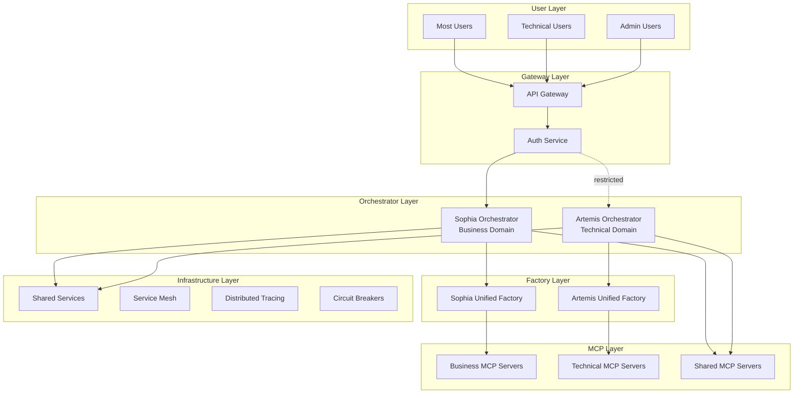
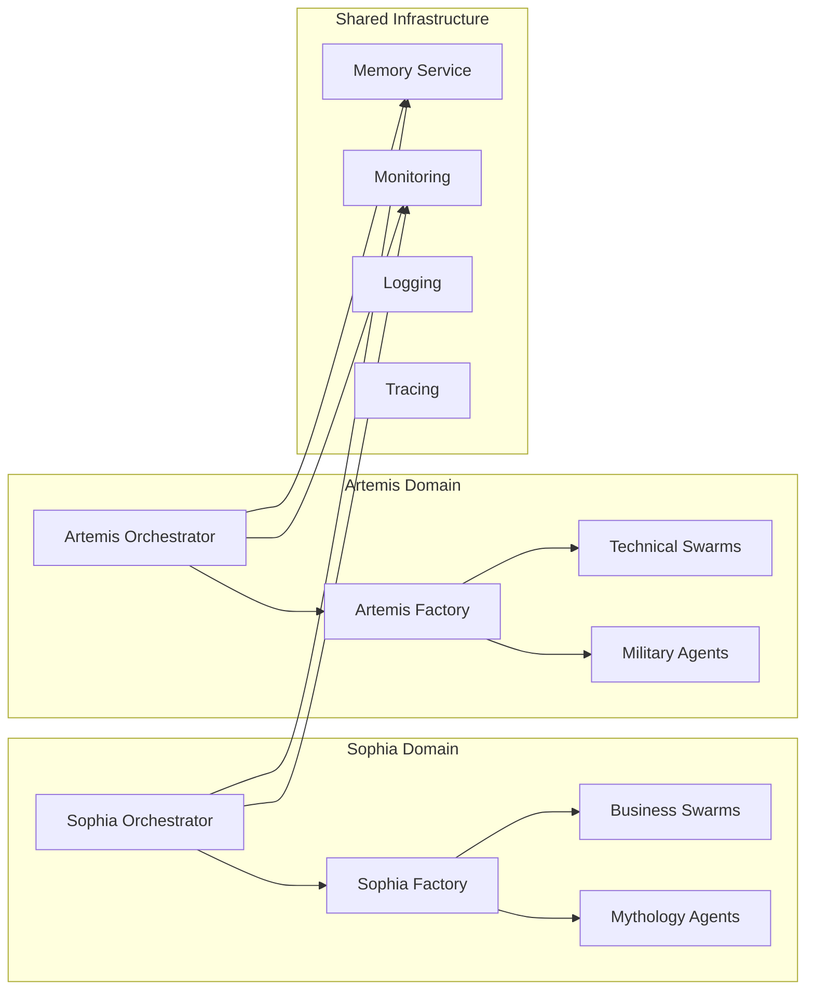
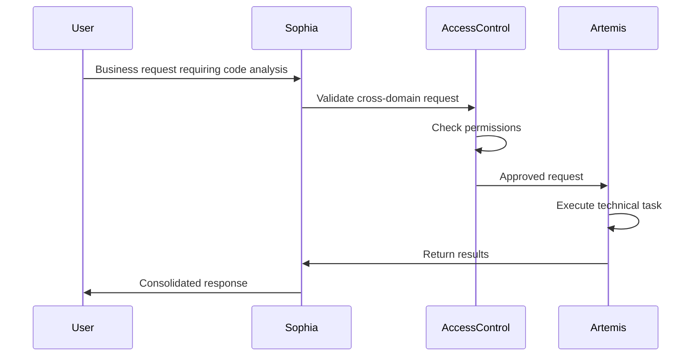
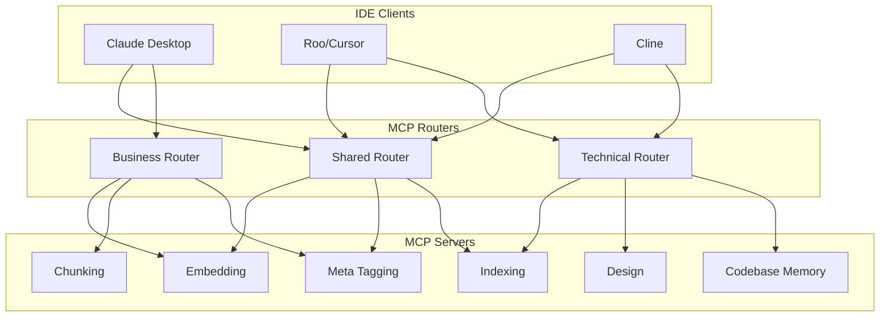

# Sophia-Artemis Dual Orchestrator Consolidation Architecture

## Executive Summary

This document presents a comprehensive architectural blueprint for consolidating the dual-orchestrator system, merging factory implementations, establishing clear domain boundaries, and optimizing MCP server connections for the Sophia Intel AI system.

## Table of Contents

1. [High-Level Architecture](#high-level-architecture)
2. [Factory Consolidation Design](#factory-consolidation-design)
3. [Domain Separation Architecture](#domain-separation-architecture)
4. [MCP Server Connection Strategy](#mcp-server-connection-strategy)
5. [Infrastructure Architecture](#infrastructure-architecture)
6. [Testing Framework Design](#testing-framework-design)
7. [Implementation Phases](#implementation-phases)

---

## 1. High-Level Architecture

### System Overview



### Component Relationships



---

## 2. Factory Consolidation Design

### 2.1 Artemis Factory Consolidation

#### Unified Structure
```python
# app/artemis/unified_factory.py

class ArtemisUnifiedFactory:
    """
    Consolidated factory combining agent creation and military swarm configuration
    """
    
    def __init__(self):
        # Core factory components
        self.agent_templates = {}      # From agent_factory
        self.military_units = {}        # From military_swarm_config
        self.specialized_swarms = {}    # Existing specialized swarms
        self.domain_teams = {}          # Domain-specific teams
        
        # Unified configuration
        self.config = UnifiedArtemisConfig(
            max_concurrent_tasks=8,  # Standardized limit
            domain=MemoryDomain.ARTEMIS,
            capabilities=[
                "code_generation",
                "code_review", 
                "refactoring",
                "security_scanning",
                "architecture_design"
            ]
        )
        
    # Merged capabilities
    def create_technical_agent() -> Agent
    def create_military_squad() -> Squad
    def create_specialized_swarm() -> Swarm
    def create_domain_team() -> Team
```

#### Migration Strategy
1. **Phase 1**: Create unified factory class inheriting from both implementations
2. **Phase 2**: Merge agent creation logic, preserving both template systems
3. **Phase 3**: Consolidate military configurations as specialized swarm types
4. **Phase 4**: Optimize and remove redundancies

### 2.2 Sophia Factory Consolidation

#### Unified Structure
```python
# app/sophia/unified_factory.py

class SophiaUnifiedFactory:
    """
    Consolidated factory combining business agents and mythology swarms
    """
    
    def __init__(self):
        # Core factory components
        self.business_templates = {}    # From agent_factory
        self.mythology_agents = {}      # From mythology_agents
        self.business_teams = {}        # Business-focused teams
        self.analytical_swarms = {}     # Analytical swarm configurations
        
        # Unified configuration
        self.config = UnifiedSophiaConfig(
            max_concurrent_tasks=8,  # Standardized limit
            domain=MemoryDomain.SOPHIA,
            capabilities=[
                "business_intelligence",
                "sales_analytics",
                "customer_insights",
                "market_research",
                "strategic_planning"
            ]
        )
        
    # Merged capabilities
    def create_business_agent() -> Agent
    def create_mythology_agent() -> Agent
    def create_business_team() -> Team
    def create_analytical_swarm() -> Swarm
```

#### Best Patterns Preservation
- **From Business Factory**: Personality injection, KPI tracking, performance metrics
- **From Mythology Swarms**: Archetypal reasoning, specialized prompts, domain expertise

---

## 3. Domain Separation Architecture

### 3.1 Domain Boundaries

#### Artemis Domain (Technical Operations)
```yaml
artemis_domain:
  scope: "ALL repository and code operations"
  responsibilities:
    - Code generation and refactoring
    - Code review and quality analysis
    - Test generation and validation
    - Security scanning and vulnerability assessment
    - Performance optimization
    - Architecture design and documentation
    - CI/CD pipeline operations
    - Infrastructure as Code
    - Database schema management
    - API design and implementation
  
  restricted_access:
    - Direct user interaction (except technical users)
    - Business data processing
    - Customer-facing operations
```

#### Sophia Domain (Business Operations)
```yaml
sophia_domain:
  scope: "ALL business domain activities"
  responsibilities:
    - Sales analytics and forecasting
    - Customer health scoring
    - Market research and competitive analysis
    - Business intelligence reporting
    - Strategic planning and recommendations
    - Revenue operations
    - Customer success management
    - Marketing analytics
    - Financial modeling
    - OKR tracking and reporting
  
  user_interaction:
    - Primary interface for most users
    - Business stakeholder communications
    - Executive reporting
```

### 3.2 Access Control Architecture

```python
# app/orchestrators/access_control.py

class DomainAccessControl:
    """
    Manages access control between domains
    """
    
    def __init__(self):
        self.access_matrix = {
            "sophia": {
                "allowed_users": ["business", "executive", "analyst", "admin"],
                "can_invoke": ["artemis"],  # Can request technical operations
                "data_access": ["business_data", "shared_data"],
                "mcp_servers": ["business_mcp", "shared_mcp"]
            },
            "artemis": {
                "allowed_users": ["developer", "devops", "admin"],
                "can_invoke": [],  # Cannot invoke Sophia
                "data_access": ["code_data", "shared_data"],
                "mcp_servers": ["technical_mcp", "shared_mcp"]
            }
        }
    
    def validate_access(self, user_role: str, target_domain: str) -> bool
    def create_cross_domain_request(self, from_domain: str, to_domain: str, task: Task)
```

### 3.3 Cross-Domain Communication



---

## 4. MCP Server Connection Strategy

### 4.1 MCP Server Allocation Matrix

| MCP Server Type | Connected To | Purpose | Priority |
|-----------------|--------------|---------|----------|
| **Codebase Memory** | Artemis Factory/Swarms | Code pattern storage, implementation history | High |
| **Indexing Server** | Both (Read: Both, Write: Domain-specific) | Universal search and retrieval | High |
| **Design Server** | Artemis Factory | Architecture patterns, design documents | Medium |
| **Meta Tagging** | Both Orchestrators | Semantic tagging and categorization | High |
| **Chunking Server** | Both (Different strategies) | Document/code segmentation | Medium |
| **Embedding Server** | Both Orchestrators | Vector generation for similarity search | High |
| **Business Memory** | Sophia Factory/Swarms | Business context, customer data | High |
| **Analytics Server** | Sophia Factory | Metrics processing, KPI calculation | High |

### 4.2 IDE Client Connections

#### Claude Desktop Configuration
```json
{
  "mcpServers": {
    "sophia-bridge": {
      "command": "python",
      "args": ["app/mcp/sophia_bridge.py"],
      "priority": "business_operations"
    },
    "artemis-bridge": {
      "command": "python",
      "args": ["app/mcp/artemis_bridge.py"],
      "priority": "code_operations"
    }
  }
}
```

#### Roo/Cursor Configuration
```json
{
  "mcp.servers": [
    {
      "name": "artemis-codebase",
      "endpoint": "ws://localhost:8001/mcp",
      "capabilities": ["code", "refactor", "analyze"]
    },
    {
      "name": "shared-indexing",
      "endpoint": "ws://localhost:8002/mcp",
      "capabilities": ["search", "retrieve"]
    }
  ]
}
```

### 4.3 Optimal Connection Patterns



---

## 5. Infrastructure Architecture

### 5.1 Shared Tools and Services

```python
# app/infrastructure/shared_services.py

class SharedServiceRegistry:
    """
    Central registry for shared services
    """
    
    services = {
        "memory": UnifiedMemoryService(),
        "monitoring": PrometheusMonitoring(),
        "logging": StructuredLogging(),
        "tracing": OpenTelemetryTracing(),
        "caching": RedisCache(),
        "queue": MessageQueue(),
        "scheduler": TaskScheduler(),
        "config": ConfigurationService()
    }
    
    @classmethod
    def get_service(cls, name: str) -> Service:
        return cls.services.get(name)
```

### 5.2 Service Mesh Architecture

```yaml
# infrastructure/service_mesh.yaml

service_mesh:
  type: istio
  
  services:
    - name: sophia-orchestrator
      port: 8080
      domain: sophia
      replicas: 3
      
    - name: artemis-orchestrator
      port: 8081
      domain: artemis
      replicas: 3
      
    - name: shared-memory
      port: 8082
      domain: shared
      replicas: 2
      
  traffic_policies:
    - source: sophia
      destination: artemis
      policy: restricted
      rate_limit: 100/min
      
    - source: "*"
      destination: shared-memory
      policy: allowed
      
  security:
    mtls: required
    authorization: rbac
```

### 5.3 Distributed Tracing Architecture

```python
# app/infrastructure/tracing.py

class DistributedTracingConfig:
    """
    OpenTelemetry-based distributed tracing
    """
    
    def __init__(self):
        self.tracer = trace.get_tracer(__name__)
        self.exporters = [
            JaegerExporter(endpoint="http://jaeger:14250"),
            PrometheusExporter(endpoint="http://prometheus:9090")
        ]
        
    def create_span_context(self, operation: str, domain: str):
        return self.tracer.start_as_current_span(
            name=operation,
            attributes={
                "domain": domain,
                "service.name": f"{domain}-orchestrator",
                "operation.type": operation
            }
        )
```

### 5.4 Circuit Breaker Patterns

```python
# app/infrastructure/resilience.py

class CircuitBreakerConfig:
    """
    Circuit breaker configuration for service resilience
    """
    
    patterns = {
        "orchestrator_communication": {
            "failure_threshold": 5,
            "timeout": 30,
            "reset_timeout": 60,
            "half_open_requests": 3
        },
        "mcp_server_connection": {
            "failure_threshold": 3,
            "timeout": 10,
            "reset_timeout": 30,
            "half_open_requests": 1
        },
        "external_service": {
            "failure_threshold": 10,
            "timeout": 60,
            "reset_timeout": 120,
            "half_open_requests": 5
        }
    }
    
    @staticmethod
    def get_breaker(pattern_name: str) -> CircuitBreaker:
        config = CircuitBreakerConfig.patterns[pattern_name]
        return CircuitBreaker(**config)
```

### 5.5 Error Handling and Resilience

```python
# app/infrastructure/error_handling.py

class UnifiedErrorHandler:
    """
    Comprehensive error handling across domains
    """
    
    def __init__(self):
        self.error_strategies = {
            "network_failure": RetryWithBackoff(max_retries=3),
            "service_unavailable": CircuitBreaker(),
            "rate_limit": ExponentialBackoff(),
            "data_corruption": Rollback(),
            "timeout": Timeout(seconds=30)
        }
        
    async def handle_error(self, error: Exception, context: Dict) -> Response:
        strategy = self.determine_strategy(error)
        return await strategy.handle(error, context)
```

---

## 6. Testing Framework Design

### 6.1 Unit Testing Strategy

```python
# tests/unit/test_framework.py

class UnifiedTestFramework:
    """
    Comprehensive testing framework for consolidated architecture
    """
    
    def __init__(self):
        self.test_suites = {
            "factory_tests": FactoryTestSuite(),
            "orchestrator_tests": OrchestratorTestSuite(),
            "domain_boundary_tests": DomainBoundaryTestSuite(),
            "mcp_integration_tests": MCPIntegrationTestSuite()
        }
```

### 6.2 Integration Testing

```yaml
# tests/integration/test_config.yaml

integration_tests:
  scenarios:
    - name: cross_domain_request
      description: "Test Sophia requesting Artemis code analysis"
      steps:
        - create_sophia_task
        - validate_access_control
        - execute_artemis_operation
        - verify_response_format
        
    - name: concurrent_execution_limit
      description: "Test 8 concurrent task limit"
      steps:
        - spawn_10_tasks
        - verify_8_executing
        - verify_2_queued
        - complete_task
        - verify_queue_processing
```

### 6.3 Swarm Behavior Testing

```python
# tests/swarm/behavior_tests.py

class SwarmBehaviorTests:
    """
    Test swarm coordination and behavior
    """
    
    async def test_military_swarm_coordination(self):
        """Test Artemis military swarm coordination"""
        swarm = ArtemisUnifiedFactory().create_military_squad("recon_battalion")
        result = await swarm.execute_mission("operation_clean_sweep")
        assert result.success
        assert len(result.phases) == 5
        
    async def test_mythology_swarm_consensus(self):
        """Test Sophia mythology swarm consensus"""
        swarm = SophiaUnifiedFactory().create_mythology_swarm("strategic_planning")
        result = await swarm.reach_consensus("market_analysis")
        assert result.consensus_level >= 0.85
```

---

## 7. Implementation Phases

### Phase 1: Foundation (Week 1-2)
- [ ] Create unified factory base classes
- [ ] Implement shared service registry
- [ ] Set up distributed tracing infrastructure
- [ ] Create domain access control system

### Phase 2: Factory Consolidation (Week 3-4)
- [ ] Merge Artemis agent_factory with military_swarm_config
- [ ] Merge Sophia agent_factory with mythology_agents
- [ ] Implement best patterns from each
- [ ] Create factory unit tests

### Phase 3: Domain Separation (Week 5-6)
- [ ] Implement strict domain boundaries
- [ ] Create cross-domain communication protocol
- [ ] Set up access control matrix
- [ ] Update both orchestrators to 8 concurrent task limit

### Phase 4: MCP Integration (Week 7-8)
- [ ] Configure MCP server connections per allocation matrix
- [ ] Implement MCP routers for each domain
- [ ] Set up IDE client configurations
- [ ] Test end-to-end MCP flows

### Phase 5: Infrastructure (Week 9-10)
- [ ] Deploy service mesh configuration
- [ ] Implement circuit breakers
- [ ] Set up comprehensive error handling
- [ ] Configure monitoring and alerting

### Phase 6: Testing & Validation (Week 11-12)
- [ ] Execute comprehensive test suites
- [ ] Perform load testing
- [ ] Validate domain boundaries
- [ ] Run security audit
- [ ] Documentation completion

---

## Implementation Priorities

### Critical Path Items
1. **Factory Consolidation** - Foundation for all other work
2. **Domain Access Control** - Security and separation critical
3. **Concurrent Task Limits** - Performance standardization
4. **MCP Server Routing** - Core functionality enablement

### Risk Mitigation
- **Backward Compatibility**: Maintain existing APIs during transition
- **Gradual Migration**: Use feature flags for phased rollout
- **Rollback Strategy**: Keep original implementations until validation complete
- **Performance Monitoring**: Track metrics throughout migration

### Success Metrics
- All factory consolidations complete with no functionality loss
- Domain boundaries enforced with 100% compliance
- 8 concurrent task execution verified for both orchestrators
- MCP servers optimally connected per allocation matrix
- Test coverage > 85% for all components
- Zero downtime during migration

---

## Conclusion

This architectural blueprint provides a comprehensive roadmap for consolidating the Sophia-Artemis dual-orchestrator system. The design ensures clear domain separation, optimal resource utilization, and improved system maintainability while preserving the unique capabilities of each domain.

The phased implementation approach minimizes risk while allowing for continuous validation and adjustment. The unified factories leverage the best patterns from each implementation, creating a more powerful and cohesive system.